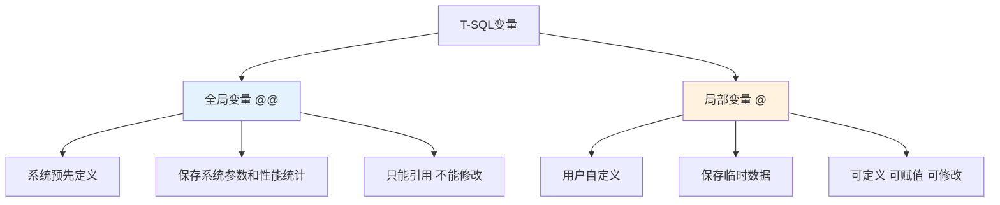

# 第5章-5.2-变量和常量

## 基本信息
- **课程**：数据库原理与应用
- **章节**：第5章 5.2节 Transact-SQL的变量和常量
- **日期**：2026-06-30
- **标签**：#变量 #常量 #局部变量 #全局变量 #DECLARE #SET #SELECT #赋值

---

## 重点内容

### ⭐⭐⭐ 核心概念
- **局部变量**：以 `@` 开头，由用户定义，使用范围局限于某个语句块或过程体内
- **全局变量**：以 `@@` 开头，由SQL Server预先定义和维护，用户只能引用不能修改
- **变量赋值**：使用 `SET` 或 `SELECT` 语句对局部变量赋初值

### ⭐⭐ 重要概念
- **SET赋值 vs SELECT赋值**：SET一次只能赋一个值，SELECT可同时赋多个值（但多值时取最后一个）
- **常量类型**：字符串、整型、日期时间、二进制、数值型、位、货币、唯一标识常量

### ⭐ 基础概念
- **变量初始值**：定义后自动赋予 `NULL`
- **全局变量只读性**：用户只能引用，不能赋值或定义

---

## 详细笔记

### 一、变量的定义和使用

> 📚 **课本出处**：第5章 5.2节"Transact-SQL的变量和常量"

T-SQL中有两种类型的变量：

| 变量类型 | 前缀 | 定义者 | 使用范围 | 能否修改 |
|:--------:|:----:|:------:|:--------:|:--------:|
| **全局变量** | `@@` | SQL Server系统 | 整个程序 | 只读，不能修改 |
| **局部变量** | `@` | 用户定义 | 某个语句块或过程体内 | 可以修改 |



---

#### 1. 全局变量

> 📚 **课本出处**：第5章 5.2.1节"全局变量"

全局变量以 `@@` 开头，由SQL Server预先定义并维护，主要用于保存系统的某些参数值和性能统计数据。

**查看全局变量的值**可以使用 `PRINT` 或 `SELECT` 语句：

```sql
PRINT @@VERSION;
```

执行后输出SQL Server的版本信息，如：
```
Microsoft SQL Server 2017 (RTM) - 14.0.1000.169 (X64)
```

**常用全局变量一览表**（表5.1）：

| 全局变量名 | 说明 |
|:----------:|:-----|
| `@@VERSION` | 存储有关版本的信息，如版本号、处理器类型等 |
| `@@ERROR` | 存储最近执行语句的**错误代码** |
| `@@ROWCOUNT` | 存储最近执行语句所影响的**行数** |
| `@@IDENTITY` | 存储最后插入行的**标识列**的列值 |
| `@@CONNECTIONS` | 存储自上次启动SQL Server以来连接或试图连接的次数 |
| `@@CPU_BUSY` | 存储最近一次启动以来CPU的工作时间（毫秒） |
| `@@CURSOR_ROWS` | 存储最后连接上并打开的游标中当前存在的合格行数量 |
| `@@DATEFIRST` | 存储DATEFIRST参数值（指定每周第一天是星期几） |
| `@@DBTS` | 存储当前数据库的时间戳值 |
| `@@FETCH_STATUS` | 存储上一次FETCH语句的状态值 |
| `@@IDLE` | 存储自SQL Server最近一次启动以来CPU空闲时间（毫秒） |
| `@@IO_BUSY` | 存储自SQL Server最近一次启动以来CPU用于I/O操作的时间（毫秒） |
| `@@LANGID` | 存储当前语言的ID值 |
| `@@LANGUAGE` | 存储当前语言名称，如"简体中文" |
| `@@LOCK_TIMEOUT` | 存储当前会话等待锁的时间（毫秒） |
| `@@MAX_CONNECTIONS` | 存储可以连接到SQL Server的最大连接数目 |
| `@@MAX_PRECISION` | 存储decimal和numeric数据类型的精确度 |
| `@@NESTLEVEL` | 保存存储过程或触发器的嵌套层 |
| `@@OPTIONS` | 存储当前SET选项的信息 |
| `@@PACK_RECEIVED` | 存储输入包的数目 |
| `@@PACK_SENT` | 存储输出包的数目 |
| `@@PACKET_ERRORS` | 存储错误包的数目 |
| `@@PROCID` | 保存存储过程的ID值 |
| `@@REMSERVER` | 存储远程SQL Server服务器名，NULL表示没有远程服务器 |
| `@@SERVERNAME` | 存储SQL Server本地服务器名和实例名 |
| `@@SERVICENAME` | 存储服务名 |
| `@@SPID` | 存储服务器ID值 |
| `@@TEXTSIZE` | 存储TEXTSIZE选项值 |
| `@@TIMETICKS` | 存储每一时钟的微秒数 |
| `@@TOTAL_ERRORS` | 存储磁盘的读写错误数 |
| `@@TOTAL_READ` | 存储磁盘读操作的数目 |
| `@@TOTAL_WRITE` | 存储磁盘写操作的数目 |
| `@@TRANCOUNT` | 存储处于激活状态的事务数目 |

> 📚 **课本出处**：第5章 表5.1 "SQL Server全局变量"

> 💡 **理解技巧**：全局变量中最常用的三个是 `@@VERSION`（版本信息）、`@@ERROR`（错误代码）和 `@@ROWCOUNT`（影响行数）。在编写T-SQL程序时，经常需要检查 `@@ERROR` 判断语句是否执行成功，通过 `@@ROWCOUNT` 确认操作影响了多少行。

---

#### 2. 局部变量

> 📚 **课本出处**：第5章 5.2.1节"局部变量"

局部变量是由用户根据需要定义的，使用范围只局限于某一个语句块或过程体内，主要用于保存**临时数据**或**由存储过程返回的结果**。

##### （1）定义局部变量

使用 `DECLARE` 语句定义局部变量：

```sql
DECLARE @variable1 data_type[, @variable2 data_type, ...]
```

- `@variable1`, `@variable2`, ...：局部变量名，必须以 `@` 开头
- `data_type`：数据类型，可以是系统数据类型，也可以是用户定义的数据类型

> 📚 **课本出处**：第5章 5.2.1节"定义局部变量"

**【例5.1】** 定义一个用于存储姓名的局部变量：

```sql
DECLARE @name_str varchar(8);
```

**【例5.2】** 同时定义3个局部变量：

```sql
DECLARE @no_str varchar(8), @birthday_str smalldatetime, @avgrade_num numeric(4,1);
```

> 💡 **理解技巧**：`DECLARE` 可以一次定义多个变量，用逗号分隔，这与 `SET` 赋值不同（SET一次只能赋一个值）。

##### （2）使用SET对局部变量赋初值

定义局部变量后，变量自动被赋予空值（NULL）。使用 `SET` 语句赋值：

```sql
SET @variable = value;
```

> 📚 **课本出处**：第5章 5.2.1节"使用SET对局部变量赋初值"

**【例5.3】** 对例5.2定义的3个变量分别赋初值：

```sql
SET @no_str = '20170112';
SET @birthday_str = '2000-2-5';
SET @avgrade_num = 89.8;
```

> ⚠️ **常见误区**：`SET` 语句**不能同时对多个变量赋值**，必须分开写。下面的写法是**错误**的：
> ```sql
> SET @no_str='20170112', @birthday_str='2000-2-5', @avgrade_num = 89.8; -- 错误！
> ```

##### （3）使用SELECT对局部变量赋初值

`SELECT` 是查询语句，可以将查询结果赋给局部变量。如果查询返回的结果包含多个值，则将**最后一个值**赋给局部变量。

```sql
SELECT @variable1 = value1[, @variable2 = value2, ...]
FROM table_name
WHERE ...
```

> 📚 **课本出处**：第5章 5.2.1节"使用SELECT对局部变量赋初值"

**【例5.4】** 查询表student，将姓名为"刘洋"的学生的学号、出生日期和平均成绩分别赋给局部变量：

```sql
SELECT @no_str = s_no, @birthday_str = s_birthday, @avgrade_num = s_avgrade
FROM student
WHERE s_name = '刘洋';
```

**SET与SELECT赋值对比**：

| 对比项 | SET赋值 | SELECT赋值 |
|:------:|:--------|:-----------|
| **同时赋值** | 一次只能赋一个值 | 可以同时赋多个值 |
| **多行结果** | 不涉及 | 取最后一个值 |
| **典型场景** | 单个变量赋初值 | 从查询结果中取值 |

##### （4）局部变量的使用示例

**【例5.5】** 定义变量、赋值、然后使用变量修改数据表：

```sql
USE MyDatabase
GO
-- 定义局部变量
DECLARE @s_no varchar(8), @s_avgrade numeric(4,1);
-- 对局部变量赋值
SET @s_no = '20170208';
SET @s_avgrade = 95.0;
-- 使用局部变量
UPDATE student SET s_avgrade = @s_avgrade WHERE s_no = @s_no;
```

> 📚 **课本出处**：第5章 5.2.1节"例5.5"

> 💡 **理解技巧**：局部变量的完整生命周期是"定义 -> 赋值 -> 使用"三步走。定义后必须赋值才能有效使用，否则值为NULL。

---

### 二、常量

> 📚 **课本出处**：第5章 5.2.2节"Transact-SQL的常量"

常量也称为**文字值**或**标量值**，是表示一个特定数据值的符号。常量的格式取决于它所表示的数据值的数据类型。

#### 1. 字符串常量

> 📚 **课本出处**：第5章 5.2.2节"字符串常量"

字符串常量是由两个**单引号**定义的字符序列。

```sql
'China'
'中华人民共和国'
```

**嵌入单引号的处理**：如果字符串中包含单引号，需要在该单引号前再加上一个单引号表示转义：

```sql
'AbC''Dd!'  -- 表示字符串 AbC'Dd!
```

**关于双引号**：默认情况下SQL Server不允许使用双引号定义字符串。如果将 `QUOTED_IDENTIFIER` 设置为 `OFF`，则同时支持双引号：

```sql
SET QUOTED_IDENTIFIER OFF;  -- 允许使用双引号
SET QUOTED_IDENTIFIER ON;   -- 恢复默认，只允许单引号
```

**Unicode字符串**：前面加 `N` 标识符（大写），如 `N'China'`。

> ⚠️ **常见误区**：SQL Server将空字符串 `''` 解释为单个空格，这与其他编程语言不同。

#### 2. 整型常量

> 📚 **课本出处**：第5章 5.2.2节"整型常量"

不用引号括起来且不包含小数点的数字字符串：

```sql
DECLARE @i integer
SET @i = 99;
```

#### 3. 日期时间常量

> 📚 **课本出处**：第5章 5.2.2节"日期时间常量"

用字符串常量表示（需能隐式转换为日期时间型），格式为 `"yyyy-mm-dd hh:mm:ss.nnn"` 或 `"yyyy/mm/dd hh:mm:ss.nnn"`。

```sql
DECLARE @dt datetime
SET @dt = '2017-01-03 21:55:56.890'  -- 2017年01月03日21时55分56.890秒
SET @dt = '2017/01/03'               -- 2017年01月03日0时0分0秒
SET @dt = '2017-01-03'               -- 2017年01月03日0时0分0秒
SET @dt = '21:55:56.890'             -- 1900年01月01日21时55分56.890秒
```

**缺省规则**：
- 缺省日期部分 -> 默认为1900年01月01日
- 缺省时间部分 -> 默认为00时00分00.000秒

#### 4. 二进制常量

> 📚 **课本出处**：第5章 5.2.2节"二进制常量"

用前缀 `0x` 的十六进制数字字符串表示，不需用单引号括起：

```sql
DECLARE @bi binary(50)
SET @bi = 0xAE
SET @bi = 0x12Ef
SET @bi = 0x69048AEFDD010E
SET @bi = 0x0
```

#### 5. 数值型常量

> 📚 **课本出处**：第5章 5.2.2节"数值型常量"

数值型常量包括3种：

| 类型 | 表示方式 | 示例 |
|:----:|:---------|:-----|
| **decimal型** | 包含小数点的数字（定点表示） | `3.14159`, `-1.0` |
| **float型** | 科学记数法（浮点表示） | `101.5E5`, `-0.5E-2` |
| **real型** | 科学记数法（浮点表示） | 同上格式 |

#### 6. 位常量

> 📚 **课本出处**：第5章 5.2.2节"位常量"

使用数字 `0` 或 `1` 表示，不用单引号。大于1的数字将转换为1：

```sql
DECLARE @b bit
SET @b = 0;
```

#### 7. 货币常量

> 📚 **课本出处**：第5章 5.2.2节"货币常量"

前缀为可选的小数点和可选的货币符号的数字字符串，不用单引号：

```sql
$20000.2    -- 正确
$200        -- 正确
$20,000.2   -- 错误！不允许使用逗号分隔
```

#### 8. 唯一标识常量

> 📚 **课本出处**：第5章 5.2.2节"唯一标识常量"

`uniqueidentifier` 类型的常量，使用字符或二进制字符串格式：

```sql
'6F9619FF-8B86-D011-B42D-00C04FC964FF'
0xff19966f868b11d0b42d00c04fc964ff
```

---

## 总结

### 变量类型对比总表

| 对比项 | 局部变量 `@` | 全局变量 `@@` |
|:------:|:------------|:-------------|
| **前缀** | `@` | `@@` |
| **定义者** | 用户 | SQL Server系统 |
| **定义方式** | `DECLARE @var type` | 无需定义，直接使用 |
| **赋值方式** | `SET` 或 `SELECT` | 不可赋值（只读） |
| **使用范围** | 当前语句块/过程体内 | 整个程序 |
| **典型用途** | 临时数据存储 | 系统状态查询 |
| **常用示例** | `@name`, `@age` | `@@VERSION`, `@@ERROR`, `@@ROWCOUNT` |

### 常量类型一览表

| 常量类型 | 格式要求 | 示例 |
|:--------:|:---------|:-----|
| **字符串** | 单引号括起 | `'China'`, `N'Unicode'` |
| **整型** | 无引号，无小数点 | `99`, `-14` |
| **日期时间** | 单引号括起 | `'2017-01-03 21:55:56'` |
| **二进制** | 前缀`0x`，无引号 | `0xAE`, `0x12Ef` |
| **decimal型** | 含小数点，无引号 | `3.14159`, `-1.0` |
| **float/real型** | 科学记数法，无引号 | `101.5E5`, `-0.5E-2` |
| **位** | 0或1，无引号 | `0`, `1` |
| **货币** | 可选货币符号，无引号 | `$200`, `$20000.2` |
| **唯一标识** | 字符串或二进制格式 | `'6F9619FF-...'` |

### 关键要点

1. **局部变量必须以 `@` 开头**，全局变量以 `@@` 开头，这是区分二者的关键标志
2. **定义后自动为NULL**：使用前必须赋值
3. **SET一次赋一个值**，SELECT可同时赋多个值
4. **SELECT多值时取最后一个**：需注意查询返回多行的情况
5. **字符串用单引号**，不是双引号（默认情况下）
6. **全局变量只读**：用户可以引用但不能修改或定义

---

## 疑问与思考

### ❓ 待解决问题
1. **SET和SELECT赋值的本质区别是什么？** SET是标准的赋值语句，SELECT更适用于从查询结果中取值。当查询返回多行时，SET会出错，而SELECT会取最后一个值。
2. **局部变量的作用域具体是怎样界定的？** 局部变量的作用域从声明它的DECLARE语句开始，到所在批处理（batch）或存储过程的末尾结束。
3. **全局变量有30多个，考试重点考察哪几个？** 最常用的是 `@@VERSION`、`@@ERROR`、`@@ROWCOUNT`、`@@IDENTITY`、`@@FETCH_STATUS`，这5个在后续的存储过程、触发器、游标中频繁使用。
4. **日期时间常量的格式中，分隔符 `-` 和 `/` 可以混用吗？** 从课本示例看是可以的，但实际开发中建议统一使用 `-`。
5. **为什么SET不能同时赋多个值而SELECT可以？** 这是语法设计上的差异。SET遵循标准SQL的赋值语法，每次只处理一个赋值操作；SELECT的赋值是其查询功能的扩展。

### 💡 个人理解/技巧
- **变量命名建议**：采用"前缀+含义"的命名方式，如 `@name_str`（字符串类型）、`@age_num`（数值类型）、`@birthday_dt`（日期类型），代码可读性更高
- **SET vs SELECT 的选择经验**：
  - 单个变量赋值 -> 优先用 `SET`（语义更清晰）
  - 从查询结果取值 -> 必须用 `SELECT`
  - 需要同时赋多个变量 -> 用 `SELECT` 更方便
- **全局变量记忆技巧**：`@@` 像两个"0"，代表"圆圆的、完整的"，暗示全局性；`@` 像一个"小a"，代表"局部的、个人的"
- **常量记忆口诀**：字符串加引号，数字不用加，日期当字符串（加引号），二进制0x头，货币加$号
- **调试技巧**：写T-SQL程序时，常用 `PRINT @@ERROR` 和 `PRINT @@ROWCOUNT` 来检查语句执行结果

---

## 相关链接

### 关联章节
- [第5章-Transact-SQL程序设计](./第5章-Transact-SQL程序设计.md)（章概述）
- [第5章-5.1-T-SQL概述](./第5章-5.1-T-SQL概述.md)（上一节）
- 第5章-5.3-运算符（待创建）
- 第5章-5.4-流程控制（待创建）（变量在流程控制中的应用）
- 第5章-5.5-函数（待创建）（变量在函数中的应用）
- 第8章-存储过程和触发器（待创建）（变量在存储过程中的典型应用）

---

## 检查清单

- [x] 已理解局部变量与全局变量的区别
- [x] 已掌握DECLARE定义变量的语法
- [x] 已掌握SET和SELECT两种赋值方式的异同
- [x] 已理解全局变量的只读性质
- [x] 已掌握8种常量类型的格式和写法
- [x] 已整理常用全局变量表格
- [x] 已记录重点标记
- [x] 已添加课本出处标注

---

*笔记创建时间：2026-06-30*
