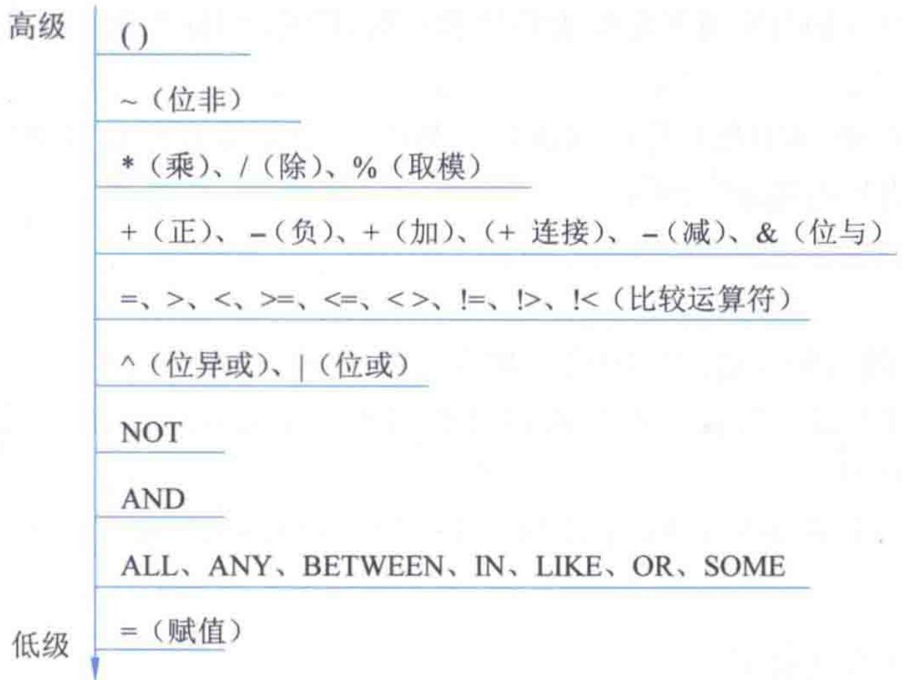

# 第5章-5.3-运算符

## 基本信息
- **课程**：数据库原理与应用
- **章节**：第5章 5.3节 Transact-SQL运算符
- **日期**：2026-06-30
- **标签**：#Transact-SQL #运算符 #算术运算符 #逻辑运算符 #比较运算符 #位运算符 #赋值运算符

---

## 重点内容

### ⭐⭐⭐ 核心概念
- **运算符分类**：算术、逻辑、赋值、字符串连接、位运算、比较共6类
- **运算符优先级**：从高到低依次为 `()` > `~` > `*/%` > `+-&` > `比较` > `^|` > `NOT` > `AND` > `ALL/ANY/BETWEEN/IN/LIKE/OR/SOME` > `=`（赋值）

### ⭐⭐ 关键区分
- `=` 既是比较运算符又是赋值运算符，需根据上下文区分
- `+` 既是算术加法又是字符串连接，取决于操作数类型
- 逻辑运算符返回 TRUE/FALSE，不是0/1

### ⭐ 运算符使用场景
- 算术运算符：数值计算、日期运算
- 比较运算符：WHERE条件、IF判断
- 逻辑运算符：复杂条件组合
- 位运算符：权限标志位操作

---

## 详细笔记

### 一、运算符概述

运算符是用来指定要在一个或多个表达式中执行操作的一种符号。在 SQL Server 2017 中，使用的运算符包括算术运算符、逻辑运算符、赋值运算符、字符串连接运算符、位运算符和比较运算符等。

> 📚 **课本出处**：第5章 5.3节"Transact-SQL运算符"

---

### 二、算术运算符

算术运算符包括加（`+`）、减（`-`）、乘（`*`）、除（`/`）和取模（`%`）等5种运算符。它们用于执行对两个表达式的运算，这两个表达式的返回值必须是数值数据类型，包括货币型。

> 📚 **课本出处**：第5章 5.3节"算术运算符"

| 运算符 | 含义 | 示例 |
|:------:|:----:|:-----|
| `+` | 加法 | `SELECT 3 + 5` → 8 |
| `-` | 减法 | `SELECT 10 - 3` → 7 |
| `*` | 乘法 | `SELECT 4 * 5` → 20 |
| `/` | 除法 | `SELECT 10 / 3` → 3（整数除法） |
| `%` | 取模（取余） | `SELECT 10 % 3` → 1 |

> 💡 **理解技巧**：加（`+`）和减（`-`）运算符还可以用于对日期时间类型值的算术运算。例如 `GETDATE() + 1` 表示明天的日期，`GETDATE() - 1` 表示昨天的日期。

> ⚠️ **常见误区**：整数除法会截断小数部分。例如 `SELECT 7 / 2` 的结果是 3 而不是 3.5。如需保留小数，至少一个操作数应为浮点类型。

---

### 三、逻辑运算符

逻辑运算符用于对某些条件进行测试，返回值为 TRUE 或 FALSE。逻辑运算符包括 ALL、AND、ANY、BETWEEN、EXISTS、IN、LIKE、NOT、OR、SOME 等。

> 📚 **课本出处**：第5章 5.3节"逻辑运算符"，表5.2

#### 表5.2 逻辑运算符及其含义

| 逻辑运算符 | 含义 |
|:----------:|:-----|
| ALL | 在一组比较中，只有所有比较都返回 TRUE，结果才为 TRUE |
| AND | 逻辑与：两个表达式均为 TRUE 时结果为 TRUE |
| ANY | 在一组比较中，只要有一个返回 TRUE，结果就为 TRUE |
| BETWEEN | 测试操作数是否在指定范围之内 |
| EXISTS | 测试查询结果是否包含某些行 |
| IN | 测试操作数是否在表达式列表中 |
| LIKE | 测试操作数是否与指定的模式相匹配 |
| NOT | 对表达式的逻辑值取反 |
| OR | 逻辑或：只要有一个表达式为 TRUE，结果就为 TRUE |
| SOME | 在一组比较中，只要有部分比较返回 TRUE，结果就为 TRUE |

> 💡 **理解技巧**：ANY 和 SOME 在 SQL Server 中功能完全相同，可以互换使用。ALL 表示"全部满足"，ANY/SOME 表示"至少一个满足"。

> ⚠️ **常见误区**：逻辑运算符不能用符号表示（如不能用 `&&` 表示 AND），必须写成关键字 `AND`、`OR`、`NOT`。

---

### 四、赋值运算符

赋值运算符就是等号 `=`，它是 Transact-SQL 中唯一的赋值运算符。

> 📚 **课本出处**：第5章 5.3节"赋值运算符"

赋值运算符的两种用途：

1. **变量赋值**：
```sql
DECLARE @name varchar(20)
SET @name = '张三'
```

2. **建立字段标题和字段值的关系**：
```sql
SELECT 中国 = 'China', 姓名 = s_name FROM student
```

执行结果：
| 中国 | 姓名 |
|:----:|:----:|
| China | 刘洋 |
| China | 王晓珂 |
| China | 王伟志 |
| China | 岳志强 |
| China | 贾簿 |
| China | 李思思 |
| China | 蒙恬 |
| China | 张宇 |

> 💡 **理解技巧**：赋值运算符的第二种用法实际上是一种列别名的写法。`列标题 = 表达式` 等价于 `表达式 AS 列标题`，但推荐使用 `AS` 关键字以提高可读性。

---

### 五、字符串连接运算符

在 SQL Server 中，字符串连接运算符为加号 `+`，表示将两个字符串连接起来形成一个新的字符串。可以操作的字符串类型包括 char、varchar、text 以及 nchar、nvarchar、ntext 等。

> 📚 **课本出处**：第5章 5.3节"字符串连接运算符"

```sql
-- 字符串连接示例
SELECT 'abc' + 'defg'           -- 结果为 'abcdefg'
SELECT 'abc' + '' + 'def'       -- 结果为 'abcdef'
SELECT 'Hello' + ' ' + 'World'  -- 结果为 'Hello World'
```

> ⚠️ **常见误区**：`+` 运算符在 SQL Server 中具有双重身份——当操作数为数值类型时是加法，为字符串类型时是连接。如果操作数类型不明确，可能导致意外结果。例如 `'123' + 456` 可能产生错误而非期望的算术结果。

> 💡 **理解技巧**：在 SQL Server 中，仅有字符串连接操作由运算符 `+` 来完成，所有其他字符串操作（如取子串、查找、替换等）都使用字符串函数来处理。

---

### 六、位运算符

位运算符用于在两个操作数之间执行按位运算，操作数必须为整型数据类型（如 bit、tinyint、smallint、int、bigint 等），还可以是二进制数据类型（image 除外）。

> 📚 **课本出处**：第5章 5.3节"位运算符"，表5.3

#### 表5.3 位运算符及其含义

| 位运算符 | 含义 | 示例（二进制） |
|:--------:|:-----|:--------------|
| `&` | 按位逻辑与 | `5 & 3` → `101 & 011` = `001` = 1 |
| `\|` | 按位逻辑或 | `5 \| 3` → `101 \| 011` = `111` = 7 |
| `^` | 按位逻辑异或 | `5 ^ 3` → `101 ^ 011` = `110` = 6 |
| `~` | 按位逻辑取非 | `~5` → 对每一位取反 |

> 💡 **理解技巧**：位运算符常用于权限管理等场景。例如用不同的位表示不同的权限，通过 `&` 判断是否拥有某个权限，通过 `|` 赋予权限，通过 `& ~` 取消权限。

---

### 七、比较运算符

比较运算符用于测试两个表达式的值之间的关系，几乎适用于所有表达式（text、ntext 或 image 数据类型除外）。

> 📚 **课本出处**：第5章 5.3节"比较运算符"，表5.4

#### 表5.4 比较运算符

| 运算符 | 含义 | 说明 |
|:------:|:----:|:-----|
| `=` | 等于 | 与赋值运算符符号相同 |
| `>` | 大于 | |
| `<` | 小于 | |
| `>=` | 大于或等于 | |
| `<=` | 小于或等于 | |
| `<>` | 不等于 | 标准写法 |
| `!=` | 不等于 | 非标准写法 |
| `!>` | 不大于 | 等价于 `<=` |
| `!<` | 不小于 | 等价于 `>=` |

> ⚠️ **常见误区**：`<>` 和 `!=` 功能相同，但 `<>` 是 ANSI SQL 标准写法，推荐使用。注意 `=` 在赋值上下文中是赋值运算符，在比较上下文中是比较运算符。

---

### 八、运算符优先级

运算符执行顺序的不同会导致不同的运算结果，所以正确理解运算符的优先级是必要的。从上到下优先级由高到低，同一级中按照在表达式中的顺序从左到右依次降低。

> 📚 **课本出处**：第5章 5.3节"运算符的优先级"，图5.1

#### 📷 图5.1 Transact-SQL运算符的优先级



> 📚 **课本出处**：图5.1 展示了 Transact-SQL 运算符从高到低的优先级排列

#### 运算符优先级表（从高到低）

| 优先级 | 运算符 | 类别 |
|:------:|:------:|:----:|
| 1（最高） | `()` | 括号 |
| 2 | `~`（位非） | 位运算 |
| 3 | `*`（乘）、`/`（除）、`%`（取模） | 算术运算 |
| 4 | `+`（正）、`-`（负）、`+`（加）、`+`（连接）、`-`（减）、`&`（位与） | 算术/连接/位运算 |
| 5 | `=`、`>`、`<`、`>=`、`<=`、`<>`、`!=`、`!>`、`!<` | 比较运算 |
| 6 | `^`（位异或）、`\|`（位或） | 位运算 |
| 7 | `NOT` | 逻辑运算 |
| 8 | `AND` | 逻辑运算 |
| 9 | `ALL`、`ANY`、`BETWEEN`、`IN`、`LIKE`、`OR`、`SOME` | 逻辑运算 |
| 10（最低） | `=`（赋值） | 赋值运算 |

> 💡 **理解技巧**：优先级可以简单记忆为"括号 > 位非 > 乘除取模 > 加减连接位与 > 比较 > 位异或或 > NOT > AND > OR等 > 赋值"。不确定优先级时，使用括号 `()` 显式指定顺序。

> ⚠️ **常见误区**：赋值运算符 `=` 是优先级最低的。当 `=` 出现在表达式中时，需要注意它是比较还是赋值，这取决于上下文。

---

## 总结

### 运算符分类与用途对照表

| 运算符类别 | 包含运算符 | 主要用途 | 返回类型 |
|:----------:|:----------:|:--------:|:--------:|
| 算术运算符 | `+` `-` `*` `/` `%` | 数值计算、日期运算 | 数值类型 |
| 比较运算符 | `=` `>` `<` `>=` `<=` `<>` `!=` `!>` `!<` | 条件判断 | TRUE/FALSE/UNKNOWN |
| 逻辑运算符 | ALL/AND/ANY/BETWEEN/EXISTS/IN/LIKE/NOT/OR/SOME | 复杂条件组合 | TRUE/FALSE |
| 赋值运算符 | `=` | 变量赋值、列别名 | 赋值结果 |
| 字符串连接 | `+` | 连接两个字符串 | 字符串类型 |
| 位运算符 | `&` `\|` `^` `~` | 按位操作整数/二进制 | 整数类型 |

### 关键要点

1. **`+` 的双重身份**：数值加法和字符串连接，取决于操作数类型
2. **`=` 的双重身份**：赋值和比较，取决于上下文
3. **优先级从高到低**：`()` > `~` > `*/%` > `+-&` > 比较 > `^|` > `NOT` > `AND` > `ALL/ANY/...` > `=`（赋值）
4. **逻辑运算符用关键字**：必须写 `AND`、`OR`、`NOT`，不能用 `&&`、`||`、`!`
5. **整数除法截断**：`7/2=3`，需要小数时应使用浮点类型

---

## 疑问与思考

### ❓ 待解决问题
1. 当 `+` 运算符的两个操作数一个是数值、一个是字符串时，SQL Server 如何处理？是报错还是隐式转换？
2. `ALL`、`ANY`、`SOME` 在子查询中的具体行为有什么区别？`ANY` 和 `SOME` 为什么功能完全相同还保留两个关键字？
3. `!=` 和 `<>` 在 SQL 标准中有什么区别？在 SQL Server 中行为是否完全一致？
4. 位运算符对 bit 类型数据运算时的行为是什么？bit 只有 0 和 1，位运算的实质效果是什么？

### 💡 个人理解/技巧
- 优先级记忆口诀："括号最优先，乘除在加减前，比较在逻辑前，NOT在AND前，AND在OR前，赋值放最后"
- 不确定优先级时直接加括号 `()`，既安全又提高可读性
- `+` 的歧义问题可以通过 `CONCAT()` 函数避免字符串连接时的类型转换风险
- 比较运算符推荐使用标准写法（`<>` 而非 `!=`），提高跨平台兼容性
- `BETWEEN...AND` 是闭区间，即包含边界值

---

## 相关链接

### 关联章节
- [第5章-5.2-变量和常量](./第5章-5.2-变量和常量.md)（运算符的操作对象）
- [第5章-5.4-流程控制](./第5章-5.4-流程控制.md)（运算符在IF/WHILE等流程控制中的应用）
- [第5章-5.5-函数](./第5章-5.5-函数.md)（运算符与函数的配合使用）
- [第4章-4.4-数据查询功能](../../第4章-数据库查询语言SQL/第4章-4.4-数据查询功能.md)（运算符在SQL查询中的应用）

---

## 检查清单

- [x] 已掌握6种运算符的分类和用途
- [x] 已理解运算符优先级表（图5.1）
- [x] 已理解 `=` 和 `+` 的双重含义
- [x] 已插入课本原图（图5.1运算符优先级）
- [x] 已记录重点标记
- [x] 已添加课本出处标注

---

*笔记创建时间：2026-06-30*
