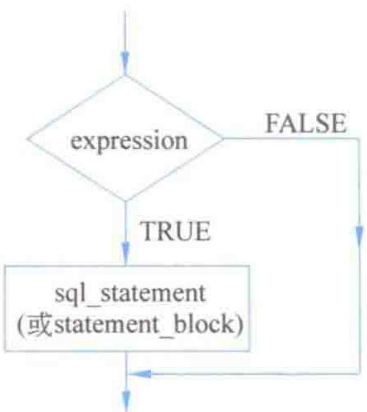
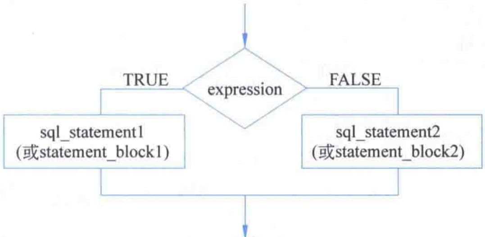
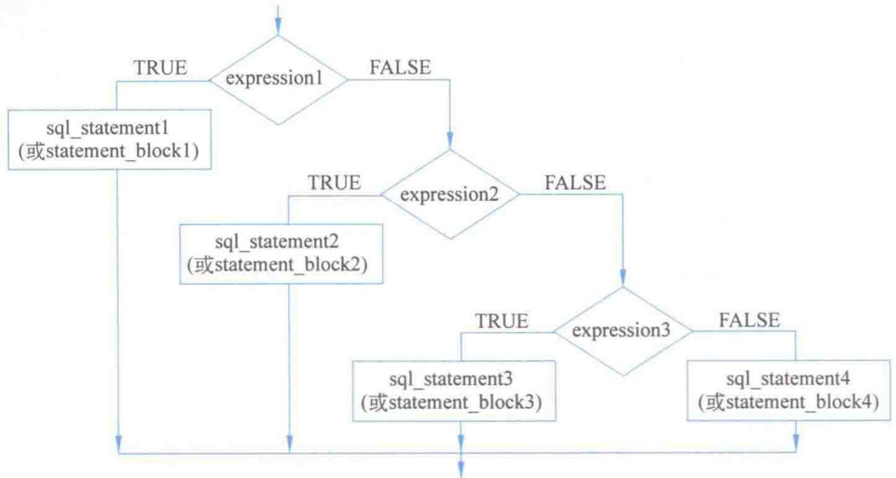
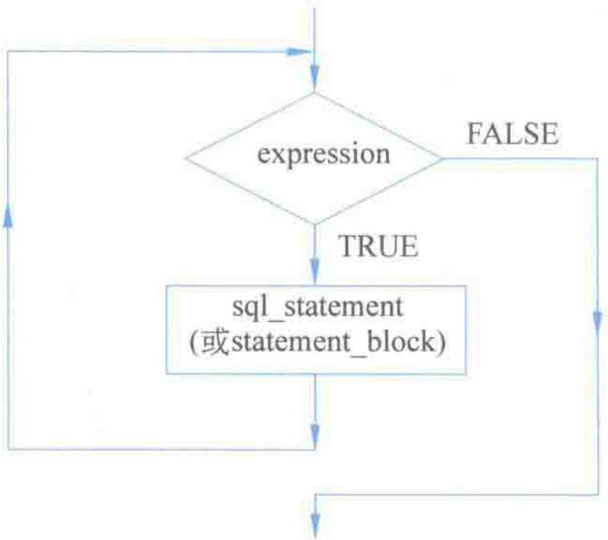

# 第5章-5.4-流程控制

## 基本信息
- **课程**：数据库原理与应用
- **章节**：第5章 5.4节 Transact-SQL流程控制
- **日期**：2026-06-30
- **标签**：#Transact-SQL #流程控制 #IF语句 #CASE语句 #WHILE语句 #TRY-CATCH #GOTO #RETURN #WAITFOR

---

## 重点内容

### ⭐⭐⭐ 核心流程控制语句
- **IF/ELSE**：最基本的条件判断，支持嵌套
- **CASE**：多分支选择，简单式和搜索式两种
- **WHILE**：循环控制，配合 BREAK/CONTINUE 使用
- **TRY...CATCH**：异常捕获和处理

### ⭐⭐ 辅助流程控制
- **BEGIN...END**：语句块界定，常与 IF/WHILE 配合使用
- **GOTO**：无条件跳转（不推荐使用）
- **RETURN**：无条件退出
- **WAITFOR**：延迟/定时执行

### ⭐ 关键区分
- CASE 是函数（有返回值），IF 是语句（控制流程）
- BREAK 退出整个循环，CONTINUE 跳过本次循环剩余部分
- TRY...CATCH 处理运行时错误，IF 不能捕获执行错误

---

## 详细笔记

### 一、注释和语句块（5.4.1）

> 📚 **课本出处**：第5章 5.4.1节"注释和语句块"

#### 1. 注释

注释是 Transact-SQL 程序代码中不被执行的文本部分，其作用是说明程序各模块的功能和设计思想，以方便程序的修改和维护。

注释有两种方法：

| 注释方式 | 符号 | 用途 | 说明 |
|:--------:|:----:|:----:|:-----|
| 单行注释 | `--` | 注释一行代码 | 从 `--` 开始到行末尾 |
| 多行注释 | `/* */` | 注释多行代码 | 内容在 `/*` 和 `*/` 之间 |

```sql
USE MyDatabase; --打开数据库MyDatabase
GO
/*
该程序用于查询成绩及格的学生信息，包括学生姓名、性别、平均成绩
程序编写者：xxx
程序编写时间：2017年12月31日
*/
SELECT s_name, s_sex, s_avgrade --姓名、性别、平均成绩
FROM student --在表中查询
GO
```

> 💡 **理解技巧**：注释不会被 SQL Server 执行，但会被包含在发送给服务器的文本中。善用注释可以提高代码的可维护性，尤其在存储过程中尤为重要。

#### 2. 语句块

语句块是程序中一个相对独立的执行单元，由关键字 `BEGIN...END` 括起来而形成的代码段。`BEGIN` 用于标识语句块的开始，`END` 标识语句块的结束。语句块可以嵌套定义。

```sql
BEGIN
    -- 语句块开始
    PRINT '第一行'
    PRINT '第二行'
    BEGIN
        -- 嵌套语句块
        PRINT '嵌套块'
    END
END
```

语句块通常与 IF、WHILE 等控制语句一起使用，以界定这些控制语句的作用范围。

> ⚠️ **常见误区**：IF 后面如果有多条语句，必须用 `BEGIN...END` 包裹，否则只有紧跟 IF 的第一条语句受 IF 控制。这是新手最常见的错误之一。

---

### 二、IF语句（5.4.2）

在 Transact-SQL 中，IF 语句是最基本、用得最多的判断控制语句。SQL Server 支持两种形式的 IF 语句：IF...句型和 IF...ELSE...句型。

> 📚 **课本出处**：第5章 5.4.2节"IF语句"

#### 1. IF...句型

语法格式：
```sql
IF expression
    {sql_statement | statement_block}
```

其中 expression 为布尔表达式，如果含有 SELECT 语句，必须用圆括号括起来。如果 expression 返回 TRUE，则执行 IF 后面的语句或语句块，否则什么都不执行。

#### 📷 图5.2 IF...句型结构流程图



> 📚 **课本出处**：图5.2 展示了IF...句型的流程：判断expression，TRUE则执行语句，FALSE则跳过

**【例5.6】** 查询学号为"20170202"的学生，如果成绩及格，则打印姓名和成绩。

```sql
USE MyDatabase
GO
DECLARE @no char(8), @name char(8), @avgrade numeric(4,1)
SET @no = '20170202'
SELECT @name = s_name, @avgrade = s_avgrade
FROM student
WHERE s_no = @no;
IF @avgrade >= 60.0
BEGIN
    PRINT @name
    PRINT @avgrade
END
GO
```

#### 2. IF...ELSE...句型

语法格式：
```sql
IF expression
    {sql_statement1 | statement_block1}
ELSE
    {sql_statement2 | statement_block2}
```

如果 expression 返回 TRUE 则执行 IF 分支，否则执行 ELSE 分支。

#### 📷 图5.3 IF...ELSE...句型的结构流程图



> 📚 **课本出处**：图5.3 展示了IF...ELSE的二分支流程

**【例5.7】** 对于给定学号的查询，如果平均成绩不及格则打印姓名和平均成绩，否则打印学号。

```sql
USE MyDatabase
GO
DECLARE @no char(8), @name char(8), @avgrade numeric(4,1)
SET @no = '20170202'
SELECT @name = s_name, @avgrade = s_avgrade
FROM student
WHERE s_no = @no;
IF @avgrade < 60.0
BEGIN
    PRINT @name
    PRINT @avgrade
END
ELSE
    PRINT @no
GO
```

#### 3. IF...ELSE IF...ELSE...句型（嵌套IF）

语法格式：
```sql
IF expression1
    {sql_statement1 | statement_block1}
ELSE IF expression2
    {sql_statement2 | statement_block2}
[ELSE IF expression3
    {sql_statement3 | statement_block3} ...]
[ELSE
    {sql_statement | statement_block}]
```

#### 📷 图5.4 IF...ELSE IF...ELSE...句型的结构流程图



> 📚 **课本出处**：图5.4 展示了多层嵌套IF的阶梯式判断流程

**【例5.8】** 运用多分支IF句型查询并分等级打印学生成绩。

```sql
USE MyDatabase
GO
DECLARE @no char(8), @name char(8), @avgrade numeric(4,1)
SET @no = '20170202'
SELECT @name = s_name, @avgrade = s_avgrade
FROM student
WHERE s_no = @no;
IF @avgrade >= 90.0
    PRINT '优秀'
ELSE IF @avgrade >= 80.0
    PRINT '良好'
ELSE IF @avgrade >= 70.0
    PRINT '中等'
ELSE IF @avgrade >= 60.0
    PRINT '及格'
ELSE
    PRINT '不及格'
GO
```

> 💡 **理解技巧**：嵌套 IF 从上到下依次判断，一旦某个条件为 TRUE 就执行对应分支并退出整个 IF 结构。因此条件的排列顺序很重要，应将范围最严格的条件放在前面。

> ⚠️ **常见误区**：嵌套 IF 过多会导致代码难以维护。当分支超过3个时，建议改用 CASE 语句替代。

---

### 三、CASE语句（5.4.3）

IF语句一般用于一个判断有少量出口（特别是两个出口）的情况。当一个判断有很多出口时，使用CASE语句可以使代码更加简练。

> 📚 **课本出处**：第5章 5.4.3节"CASE语句"

在 SQL Server 中，CASE 语句实际上是被当作一个函数来执行，执行后都有一个返回值。它有两种类型：简单式和搜索式。

#### 1. 简单式CASE函数

语法格式：
```sql
CASE input_expression
    WHEN when_expression THEN result_expression
    [...n]
    [
        ELSE else_result_expression
    ]
END
```

执行时，首先计算 `input_expression` 的值，然后将计算结果与每个 `WHEN` 子句中的 `when_expression` 进行比较，如果相等则计算并返回 `THEN` 后面的 `result_expression` 的值，同时退出 CASE 函数。如果与所有 WHEN 子句都不匹配，则计算并返回 ELSE 后面的值。

> 📚 **课本出处**：第5章 5.4.3节"简单式CASE函数"

> 💡 **理解技巧**：简单式 CASE 类似于其他语言中的 switch-case，但有一个重要区别：SQL 的 CASE 不需要 `break`，匹配到第一个就自动退出。

**【例5.9】** 使用CASE函数对学生的姓名和爱好进行简要说明。

```sql
SELECT
    学号 = s_no,
    姓名及爱好 = CASE s_no
        WHEN '20170201' THEN '刘洋，游泳'
        WHEN '20170202' THEN '王晓珂，登山'
        WHEN '20170203' THEN '王伟志，滑雪'
        WHEN '20170204' THEN '岳志强，支部书记'
        WHEN '20170205' THEN '贾簿，足球'
        WHEN '20170206' THEN '李思思，爱好不详'
        WHEN '20170207' THEN '蒙恬，长跑'
        WHEN '20170208' THEN '张宇，山地自行车'
        ELSE '没有这个人'
    END
FROM student
```

执行结果：
| 学号 | 姓名及爱好 |
|:----:|:----------:|
| 20170201 | 刘洋，游泳 |
| 20170202 | 王晓珂，登山 |
| 20170203 | 王伟志，滑雪 |
| 20170204 | 岳志强，支部书记 |
| 20170205 | 贾簿，足球 |
| 20170206 | 李思思，爱好不详 |
| 20170207 | 蒙恬，长跑 |
| 20170208 | 张宇，山地自行车 |

> ⚠️ **常见误区**：`input_expression` 和每个 `when_expression` 的数据类型必须相同或是可隐式转换的类型，否则会报错。

#### 2. 搜索式CASE函数

语法格式：
```sql
CASE
    WHEN expression THEN result_expression [...n]
    [ELSE else_result_expression]
END
```

搜索式 CASE 中，`CASE` 后面没有表达式，`WHEN` 后面的表达式是布尔表达式（返回 TRUE 或 FALSE）。依次从上到下计算每个 WHEN 子句的布尔值，第一个为 TRUE 的对应的 `result_expression` 就是返回值。所有 WHEN 均为 FALSE 时返回 ELSE 的值。

> 📚 **课本出处**：第5章 5.4.3节"搜索式CASE函数"

**【例5.10】** 使用搜索式CASE函数显示学生的成绩等级。

```sql
SELECT
    学号 = s_no,
    姓名 = s_name,
    成绩等级 = CASE
        WHEN s_avgrade >= 90.0 THEN '优秀'
        WHEN s_avgrade >= 80.0 THEN '良好'
        WHEN s_avgrade >= 70.0 THEN '中等'
        WHEN s_avgrade >= 60.0 THEN '及格'
        ELSE '不及格'
    END
FROM student
```

执行结果：
| 学号 | 姓名 | 成绩等级 |
|:----:|:----:|:--------:|
| 20170201 | 刘洋 | 优秀 |
| 20170202 | 王晓珂 | 良好 |
| 20170203 | 王伟志 | 良好 |
| 20170204 | 岳志强 | 中等 |
| 20170205 | 贾簿 | 不及格 |
| 20170206 | 李思 | 及格 |
| 20170207 | 蒙恬 | 中等 |
| 20170208 | 张宇 | 不及格 |

**【例5.11】** 利用搜索式CASE函数定义计算列——根据指导学生人数自动计算工作量。

```sql
CREATE TABLE supervisor(
    t_no int PRIMARY KEY,
    t_name varchar(8) NOT NULL,
    s_n int NOT NULL CHECK(s_n >= 0 AND s_n <= 20),
    c_hour AS CASE
        WHEN s_n <= 8 THEN 15 * s_n
        WHEN s_n <= 10 THEN 15 * 8 + 12 * (s_n - 8)
        ELSE 15 * 8 + 12 * 2 + 5
    END
);
```

> 💡 **理解技巧**：简单式 CASE 适用于将一个值与一组固定值做等值比较的场景；搜索式 CASE 适用于范围判断（如分数区间）的场景。在定义计算列时，CASE 函数特别有用，可以大大减少前台代码的工作量。

#### 简单式 vs 搜索式 CASE 对比

| 特征 | 简单式CASE | 搜索式CASE |
|:----:|:----------:|:----------:|
| CASE后表达式 | 有 `input_expression` | 无 |
| WHEN后表达式 | 等值表达式 | 布尔表达式 |
| 适用场景 | 等值匹配 | 范围判断、复杂条件 |
| 类比 | switch-case | if-else if |

---

### 四、WHILE语句（5.4.4）

WHILE 语句是典型的循环控制语句。

> 📚 **课本出处**：第5章 5.4.4节"WHILE语句"

语法格式：
```sql
WHILE expression
    {sql_statement | statement_block}
```

只要 expression 的值为 TRUE，就重复执行循环体中的语句。如果布尔表达式中含有 SELECT 语句，必须用括号将 SELECT 语句括起来。

#### BREAK 和 CONTINUE

WHILE 语句可以结合 BREAK 和 CONTINUE 语句一起使用：

| 关键字 | 作用 | 效果 |
|:------:|:-----|:-----|
| `BREAK` | 无条件退出当前循环体 | 执行 END 后面的语句，循环终止 |
| `CONTINUE` | 跳过本次循环剩余部分 | 回到 WHILE 重新判断条件，开始新一次循环 |

#### 📷 图5.5 WHILE语句的结构流程图



> 📚 **课本出处**：图5.5 展示了WHILE循环的流程，包括TRUE时执行循环体、FALSE时退出循环、以及BREAK和CONTINUE的控制路径

**【例5.12】** 如果学生成绩的平均值低于95分，则循环对每个学生的成绩增加0.5%。如果最高成绩超过99分则退出循环；当成绩平均值大于或等于75.5分时打印当前平均成绩。

```sql
USE MyDatabase;
GO
DECLARE @max numeric(4,1), @avg numeric(4,1);
SET @avg = (SELECT AVG(s_avgrade) FROM student)
SET @max = (SELECT MAX(s_avgrade) FROM student)
WHILE @avg < 95
BEGIN
    IF @max > 99 BREAK        --退出循环体
    UPDATE student SET s_avgrade = s_avgrade + s_avgrade * 0.005
    SET @avg = (SELECT AVG(s_avgrade) FROM student)
    SET @max = (SELECT MAX(s_avgrade) FROM student)
    IF @avg < 75.5 CONTINUE  --结束本次循环
    PRINT '当前平均成绩:' + STR(@avg, 5, 1);
END
```

> 💡 **理解技巧**：WHILE 循环中必须有改变循环条件的语句，否则会形成无限循环。本例中 `UPDATE` 语句不断修改成绩，使得 @avg 逐渐增大，最终退出循环。

> ⚠️ **常见误区**：BREAK 是退出整个循环，不是退出当前 IF。CONTINUE 是跳回 WHILE 条件判断处，不是跳到下一条语句。注意区分二者的控制流方向。

---

### 五、GOTO语句（5.4.5）

GOTO 语句是一种无条件转移语句，可以实现程序的执行流程从一个地方转移到另外的任意一个地方。与 IF 语句结合，GOTO 语句也可以实现 WHILE 语句的循环功能。

> 📚 **课本出处**：第5章 5.4.5节"GOTO语句"

语法格式：
```sql
Label:
    {sql_statement | statement_block}
[IF ...] GOTO Label;
```

其中 Label 为定义的标签，是 GOTO 语句转向的依据。标签必须符合标识符命名规则。无论是否使用 GOTO 语句，标签均可作为注释方法使用。

**【例5.13】** 使用GOTO语句实现1~100的累加。

```sql
DECLARE @s int, @sum int
SET @s = 0
SET @sum = 0
label1:
    SET @s = @s + 1
    SET @sum = @sum + @s
IF @s <> 100 GOTO label1
PRINT @sum
```

> ⚠️ **常见误区**：GOTO 语句会降低程序的可读性，使得程序逻辑变得混乱。在一般情况下不提倡在程序中使用 GOTO 语句，应优先使用 IF/WHILE 等结构化控制语句。

---

### 六、TRY...CATCH语句（5.4.6）

类似于其他高级语言，Transact-SQL 也有异常的捕获和处理语句——TRY...CATCH 语句。

> 📚 **课本出处**：第5章 5.4.6节"TRY...CATCH语句"

语法格式：
```sql
BEGIN TRY
    {sql_statement | statement_block}
END TRY
BEGIN CATCH
    {sql_statement | statement_block}
END CATCH[;]
```

执行规则：
- **TRY块内无错误**：执行完 TRY 块后，跳过 CATCH 块，继续执行 END CATCH 之后的语句
- **TRY块内有错误**：TRY 块中产生错误的语句之后的语句不会被执行，控制传递给 CATCH 块执行

> 📚 **课本出处**：第5章 5.4.6节"TRY...CATCH语句"

```sql
USE MyDatabase;
GO
DELETE FROM student
GO
BEGIN TRY
    INSERT student VALUES('20170201','刘洋','女','1997-02-03','计算机应用技术', 98.5,'计算机系');
    --下面语句中，时间常量'1997-09-201'格式错误
    INSERT student VALUES('20170202','王晓珂','女','1997-09-201', '计算机软件与理论', 88.1,'计算机系');
    INSERT student VALUES('20170203','王伟志','男','1996-12-12','智能科学与技术', 89.8,'智能技术系');
END TRY
BEGIN CATCH
    PRINT N'插入操作有错误。'
END CATCH;
```

在上述例子中，第二条 INSERT 语句的日期格式错误，执行到该语句时程序转到 CATCH 块。结果：第一条数据成功插入，第二条和第三条数据未能执行。

> 💡 **理解技巧**：TRY...CATCH 能捕获运行时错误（如除零、类型转换失败、违反约束等），但不能捕获语法错误（语法错误在编译阶段就会报错，不会进入运行时）。

---

### 七、RETURN语句（5.4.7）

RETURN 语句用于从过程、批处理或语句块中无条件退出，RETURN 之后的语句不被执行。

> 📚 **课本出处**：第5章 5.4.7节"RETURN语句"

语法：
```sql
RETURN [integer_expression]
```

RETURN 可以后跟整型表达式，执行到 RETURN 时先计算该表达式的值，然后返回该值。如果将 RETURN 语句嵌入存储过程，该语句不能返回空值——如果某个过程试图返回空值，将生成警告消息并返回 0 值。

```sql
-- RETURN 示例
CREATE PROCEDURE CheckStudent @no char(8)
AS
BEGIN
    IF NOT EXISTS (SELECT * FROM student WHERE s_no = @no)
        RETURN 1  -- 返回1表示学生不存在
    SELECT s_name, s_avgrade FROM student WHERE s_no = @no
    RETURN 0  -- 返回0表示成功
END
```

> 💡 **理解技巧**：RETURN 语句在存储过程中常用来返回执行状态码。约定 0 表示成功，非 0 表示各种错误类型。调用方可通过返回值判断执行结果。

> ⚠️ **常见误区**：RETURN 是退出整个批处理/过程/语句块，不是只退出当前 BEGIN...END。如果在嵌套的 BEGIN...END 中使用 RETURN，会退出最外层的过程。

---

### 八、WAITFOR语句（5.4.8）

WAITFOR 语句用于设置指定程序段的执行时间，包括指定程序段在某一时刻执行或者在某一段时间间隔之后自动执行。

> 📚 **课本出处**：第5章 5.4.8节"WAITFOR语句"

语法格式：
```sql
WAITFOR DELAY 'time_to_pass' | TIME 'time_to_execute'
```

| 子句 | 作用 | 参数格式 | 限制 |
|:----:|:----:|:--------:|:-----|
| DELAY | 等待指定时间长度后执行 | `HH:MM:SS` | 最长24小时 |
| TIME | 在指定时刻执行 | `HH:MM:SS` | 只能包含时间部分 |

**【例5.14a】** 设置在下午5:30（17:30）执行学生成绩查询。

```sql
USE MyDatabase;
GO
WAITFOR TIME '17:30';
SELECT 姓名 = s_name, 平均成绩 = s_avgrade
FROM student
```

**【例5.14b】** 如果要求查询在1小时20分钟后执行。

```sql
USE MyDatabase;
GO
WAITFOR DELAY '01:20';
SELECT 姓名 = s_name, 平均成绩 = s_avgrade
FROM student;
```

> 💡 **理解技巧**：WAITFOR 在实际应用中常用于定时任务调度。例如在凌晨低峰期执行报表统计。但注意 WAITFOR 会阻塞当前连接，在生产环境中使用时需注意对并发的影响。

> ⚠️ **常见误区**：WAITFOR DELAY 的时间最长只能是 24 小时。WAITFOR TIME 和 DELAY 都只能包含时间部分，不能包含日期部分。

---

## 总结

### 流程控制语句对比表

| 语句 | 类型 | 作用 | 关键特点 | 使用场景 |
|:----:|:----:|:----:|:---------|:--------:|
| BEGIN...END | 语句块 | 定义独立执行单元 | 可嵌套，界定作用范围 | 配合IF/WHILE使用 |
| IF/ELSE | 条件判断 | 二/多分支选择 | 最基本的控制语句 | 简单条件判断 |
| CASE | 多分支 | 函数式多分支选择 | 有返回值，可嵌入表达式 | 多条件等值/范围匹配 |
| WHILE | 循环 | 条件循环 | 配合BREAK/CONTINUE | 需重复执行的操作 |
| GOTO | 跳转 | 无条件跳转 | 降低可读性，不推荐 | 尽量避免使用 |
| TRY...CATCH | 异常处理 | 捕获运行时错误 | 不能捕获语法错误 | 错误处理和容错 |
| RETURN | 退出 | 无条件退出 | 可返回整型值 | 存储过程返回状态码 |
| WAITFOR | 延迟 | 延时/定时执行 | 阻塞连接，最长24h | 定时任务 |

### IF vs CASE 对比

| 特征 | IF语句 | CASE语句 |
|:----:|:------:|:--------:|
| 类型 | 语句 | 函数（有返回值） |
| 用途 | 控制程序流程 | 返回一个值 |
| 嵌入性 | 独立使用 | 可嵌入SELECT等表达式中 |
| 分支数 | 任意（但嵌套过深难维护） | 多分支，结构清晰 |
| 可读性 | 多分支时较差 | 多分支时较好 |

### BREAK vs CONTINUE 对比

| 特征 | BREAK | CONTINUE |
|:----:|:-----:|:--------:|
| 作用 | 退出整个当前循环 | 跳过本次循环剩余语句 |
| 控制流 | 转到 END 之后 | 转回 WHILE 条件判断 |
| 循环是否继续 | 不继续（除非在外层循环中） | 继续下一次循环 |

### TRY...CATCH vs IF ERROR 对比

| 特征 | TRY...CATCH | IF @@ERROR <> 0 |
|:----:|:-----------:|:---------------:|
| 异常范围 | 捕获任何运行时错误 | 仅检查上一条语句的错误码 |
| 错误信息 | 通过 ERROR_MESSAGE() 等获取详细信息 | 仅获取错误编号 |
| 代码结构 | 结构清晰，职责分离 | 每条语句后都要检查 |
| 推荐程度 | 推荐（SQL Server 2005+） | 旧式写法 |

### 关键要点

1. **BEGIN...END 是控制作用域的关键**：IF/WHILE 后面有多条语句时必须使用
2. **CASE 是函数不是语句**：可以返回值，可以嵌入 SELECT 中使用
3. **WHILE 必须有退出条件**：防止无限循环，用 BREAK 作为安全退出机制
4. **TRY...CATCH 不能捕获语法错误**：只能捕获运行时错误
5. **RETURN 在存储过程中最常用**：返回状态码，0为成功
6. **WAITFOR 会阻塞连接**：使用时注意并发影响
7. **GOTO 应尽量避免**：使用结构化控制语句替代

---

## 疑问与思考

### ❓ 待解决问题
1. **IF vs CASE**：IF 语句可以执行 SQL 语句（如 UPDATE/DELETE），CASE 作为函数只能返回值。那是否可以在 CASE 的 THEN 后面执行 UPDATE 操作？为什么？
2. **WHILE 中 BREAK vs CONTINUE**：在嵌套的 WHILE 循环中，BREAK 只退出最内层循环还是退出所有嵌套循环？在嵌套循环中 CONTINUE 的作用范围是什么？
3. **TRY...CATCH vs IF ERROR**：TRY...CATCH 是 SQL Server 2005 才引入的，之前的版本如何处理错误？TRY...CATCH 能捕获所有的运行时错误吗？有没有例外？
4. **GOTO 的合法用途**：既然 GOTO 通常不推荐使用，那么在什么场景下 GOTO 反而是最佳选择？（例如多层嵌套中快速跳转到错误处理标签）
5. **WAITFOR 的实际应用**：WAITFOR 会阻塞当前连接，在生产环境中如果需要定时执行任务，是否有更好的替代方案？（如 SQL Server Agent 作业调度）
6. **RETURN 的返回值**：在存储过程中 RETURN 只能返回整数值，如果需要返回复杂数据，应该用什么方式？

### 💡 个人理解/技巧
- **IF 做判断，CASE 做选择**：IF 用于控制流程（执行哪段代码），CASE 用于产生值（返回哪个结果）
- **CASE 的妙用**：不仅可以用于 SELECT 中，还可以在 CREATE TABLE 的计算列、ORDER BY 中使用，非常灵活
- **WHILE + 游标**：WHILE 循环配合游标可以逐行处理结果集，虽然性能不佳但逻辑清晰
- **TRY...CATCH 中的错误信息**：在 CATCH 块中可以使用 `ERROR_MESSAGE()`、`ERROR_NUMBER()`、`ERROR_SEVERITY()` 等函数获取错误详情
- **BEGIN TRY 前清空@@ERROR**：`SET NOCOUNT ON` 和检查 `@@ERROR` 是 TRY...CATCH 出现前的标准做法，现在推荐统一使用 TRY...CATCH
- **流程控制口诀**：简单二选一用 IF，多选一用 CASE，重复操作用 WHILE，出错处理用 TRY-CATCH，延时执行用 WAITFOR

---

## 相关链接

### 课本流程图
- [图5.2 IF...句型结构流程图](../../../images/d4324831af8db8fa20277af74b63c7122469c02be98de99fdbe45b24433b4a20.jpg)
- [图5.3 IF...ELSE...句型结构流程图](../../../images/d0b5d77a13a720d9aafe1a2898ff993f617e994253598b377710a821bd415189.jpg)
- [图5.4 IF...ELSE IF...ELSE...句型结构流程图](../../../images/e5fbebbf7063403cd47958e2ef1c5c9f392916fba723ebed88408d5db38df2a8.jpg)
- [图5.5 WHILE语句结构流程图](../../../images/f7263a9d388f72ffe18045deb57e35f96a54bbc94dda650c1f0a9fb1cc07d414.jpg)

### 关联章节
- [第5章-5.3-运算符](./第5章-5.3-运算符.md)（流程控制中的条件表达式使用运算符）
- [第5章-5.2-变量和常量](./第5章-5.2-变量和常量.md)（流程控制中的变量操作）
- [第5章-5.5-函数](./第5章-5.5-函数.md)（CASE函数的深入理解）
- [第5章-Transact-SQL程序设计](./第5章-Transact-SQL程序设计.md)（本章总览）
- [第8章-存储过程和触发器](../../第8章-存储过程和触发器/)（流程控制在存储过程中的综合应用）

---

## 检查清单

- [x] 已掌握注释的两种方式（-- 和 /* */）
- [x] 已理解 BEGIN...END 语句块的作用
- [x] 已掌握 IF、IF...ELSE、IF...ELSE IF...ELSE 三种句型
- [x] 已掌握简单式CASE和搜索式CASE的语法和区别
- [x] 已掌握 WHILE 循环及 BREAK/CONTINUE 的用法
- [x] 已了解 GOTO 语句（不推荐使用）
- [x] 已掌握 TRY...CATCH 异常处理
- [x] 已掌握 RETURN 和 WAITFOR 语句
- [x] 已插入课本原图（图5.2~图5.5）
- [x] 已记录重点标记
- [x] 已添加课本出处标注

---

*笔记创建时间：2026-06-30*
