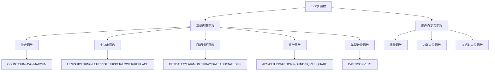
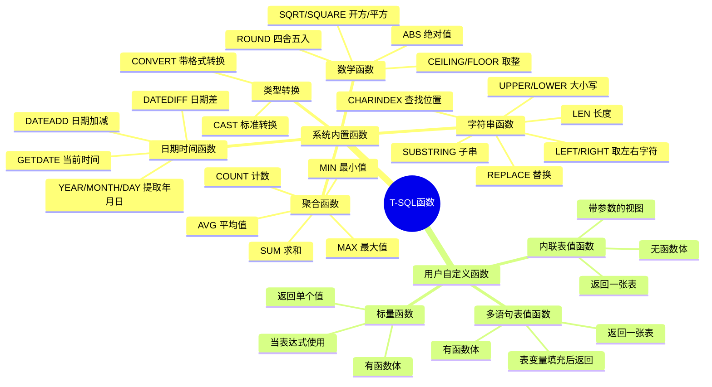

# 第5章-5.5-T-SQL函数

## 基本信息
- **课程**：数据库原理与应用
- **章节**：第5章 5.5节 Transact-SQL函数
- **日期**：2026-06-30
- **标签**：#T-SQL #函数 #内置函数 #自定义函数 #SQL

---

## 重点内容

### ⭐⭐⭐ 核心概念
- **系统内置函数**：SQL Server提供的预定义函数，包括聚合函数、数学函数、字符串函数、日期时间函数和数据类型转换函数
- **用户自定义函数**：用户通过CREATE FUNCTION创建的函数，分为标量函数、内联表值函数和多语句表值函数三种
- **函数调用方式**：两类函数都可以在程序中像一个数值表达式那样引用

### ⭐⭐ 关键函数分类
- **聚合函数**：COUNT/SUM/AVG/MAX/MIN，用于对一组值进行计算并返回单个值
- **字符串函数**：LEN/SUBSTRING/LEFT/RIGHT/UPPER/LOWER等，用于处理字符型数据
- **日期时间函数**：GETDATE/YEAR/MONTH/DAY/DATEADD/DATEDIFF等，用于处理日期时间数据
- **数学函数**：ABS/CEILING/FLOOR/ROUND/SQUARE/SQRT等，用于数学运算
- **类型转换函数**：CAST/CONVERT，用于不同数据类型之间的显式转换

### ⭐ 重要区别
- CAST和CONVERT功能相似但语法不同，CONVERT多一个style参数可控制格式
- 标量函数返回单个值，表值函数返回一张表
- 内联表值函数无函数体，多语句表值函数有函数体

---

## 详细笔记

### 一、系统内置函数概述

Transact-SQL系统内置函数可以分为5种类型：字符串处理函数、聚合函数、日期时间函数、数学函数和数据类型转换函数。这两类函数都可以在程序中像一个数值表达式那样引用。

> 📚 **课本出处**：第5章 5.5.1节"系统内置函数"

---

### 二、聚合函数 ⭐⭐⭐

聚合函数对一组值进行计算并返回单个值，常用于SELECT语句的表达式列表和GROUP BY子句中。

> 📚 **课本出处**：第5章 5.5.1节"聚合函数"

#### 1. COUNT函数

返回组中的项数，有3种调用形式：

```sql
COUNT({[ALL | DISTINCT] expression] | *})
```

| 调用形式 | 功能说明 |
|:--------:|:---------|
| `COUNT(*)` | 返回组中的行数，**包括**NULL值和重复行 |
| `COUNT(ALL expression)` | 对每行计算expression，返回**非NULL值**的个数（ALL可省略） |
| `COUNT(DISTINCT expression)` | 对每行计算expression，返回**唯一非空值**的个数 |

> 💡 **理解技巧**：COUNT(*)统计所有行（含NULL），COUNT(column)只统计该列非NULL的行，COUNT(DISTINCT column)还去重。这是考试常考点。

```sql
-- 统计学生总人数
SELECT COUNT(*) FROM student

-- 统计有成绩记录的学生人数（排除c_grade为NULL的行）
SELECT COUNT(c_grade) FROM sc

-- 统计有多少个不同的选课学生
SELECT COUNT(DISTINCT s_no) FROM sc
```

#### 2. AVG函数

返回组中各值的平均值，NULL值被忽略。

```sql
AVG([ALL | DISTINCT] expression)
```

```sql
-- 求女学生的平均成绩
SELECT AVG(s_avgrade) FROM student WHERE s_sex = '女'

-- 求不重复成绩的平均值
SELECT AVG(DISTINCT c_grade) FROM sc
```

#### 3. MAX和MIN函数

分别返回表达式的最大值和最小值。

```sql
MAX([ALL | DISTINCT] expression)
MIN([ALL | DISTINCT] expression)
```

```sql
-- 求最高成绩和最低成绩
SELECT MAX(c_grade) AS 最高分, MIN(c_grade) AS 最低分 FROM sc
```

#### 4. SUM函数

返回表达式中所有值的和，NULL值被忽略。

```sql
SUM([ALL | DISTINCT] expression)
```

- ALL（默认）：返回所有值的和
- DISTINCT：仅返回非重复值的和

```sql
-- 求所有学生的平均成绩总和
SELECT SUM(s_avgrade) FROM student
```

> ⚠️ **常见误区**：聚合函数遇到NULL值时，除了COUNT(*)外都会忽略NULL值。例如AVG([10, NULL, 20])返回15而非10。

---

### 三、字符串处理函数 ⭐⭐

字符串处理函数用于对字符型数据进行各种处理操作。

> 📚 **课本出处**：第5章 5.5.1节"字符串处理函数"

#### 1. 常用字符串函数速查表

| 函数语法 | 功能描述 | 举例 |
|:---------|:---------|:-----|
| `ASCII(character_expression)` | 返回字符串第一个字符的ASCII值(int型) | `ASCII('abcdef')` 返回 97 |
| `CHAR(integer_expression)` | 将ASCII值转换为相应字符 | `CHAR(65)` 返回 'A' |
| `CHARINDEX(expr1, expr2[, start])` | 返回指定表达式在字符串中的起始位置 | `CHARINDEX('be','aabecdef')` 返回 3 |
| `LEFT(char_expr, int_expr)` | 返回从左边开始的int_expr个字符 | `LEFT('abcdef',3)` 返回 'abc' |
| `LEN(string_expression)` | 返回字符串字符个数，不含尾随空格 | `LEN('a bcdefg')` 返回 8 |
| `LOWER(char_expr)` | 转换为小写 | `LOWER('AbCdEfG')` 返回 'abcdefg' |
| `UPPER(char_expr)` | 转换为大写 | `UPPER('AbCdEfG')` 返回 'ABCDEFG' |
| `LTRIM(char_expr)` | 删除起始空格 | `LTRIM('  abcdef')` 返回 'abcdef' |
| `RTRIM(char_expr)` | 删除尾随空格 | `RTRIM('abcdef  ')` 返回 'abcdef' |
| `REPLACE(str1, str2, str3)` | 用str3替换str1中所有str2 | `REPLACE('abcde','cd','XX')` 返回 'abXXe' |
| `REVERSE(char_expr)` | 字符串反转 | `REVERSE('abc')` 返回 'cba' |
| `RIGHT(char_expr, int_expr)` | 返回从右边开始的int_expr个字符 | `RIGHT('abcdef',3)` 返回 'def' |
| `SPACE(integer_expression)` | 返回由n个空格组成的字符串 | `'a'+SPACE(4)+'b'` 返回 'a    b' |
| `STR(float_expr[, len[, decimal]])` | 数值转字符串 | `STR(123.4588, 10, 4)` 返回 '   123.4588' |
| `STUFF(str, start, len, str)` | 从start位置删除len个字符并插入新字符串 | `STUFF('abcdefgh',2,3,'xyz')` 返回 'axyzefgh' |
| `SUBSTRING(expr, start, len)` | 返回从start位置开始、长度为len的子串 | `SUBSTRING('abcdef',2,4)` 返回 'bcde' |
| `PATINDEX('%pattern%', expr)` | 返回模式第一次出现的起始位置 | `PATINDEX('%defg%','abcdefghi')` 返回 4 |

> 📚 **课本出处**：第5章 表5.5 字符串处理函数

#### 2. 常用字符串函数示例

```sql
-- 提取学生姓氏（LEFT）
SELECT LEFT(s_name, 1) AS 姓氏 FROM student

-- 查找子串位置（CHARINDEX）
SELECT CHARINDEX('cd', 'abcdefg')  -- 返回 3

-- 替换字符串（REPLACE）
SELECT REPLACE('abcdefghicde', 'cd', 'China')
-- 返回 'abChinaefghiChinae'

-- 获取字符串长度（LEN）
SELECT LEN('Hello World')  -- 返回 11

-- 大小写转换（UPPER/LOWER）
SELECT UPPER('hello')  -- 返回 'HELLO'
SELECT LOWER('WORLD')  -- 返回 'world'

-- 去除首尾空格（LTRIM/RTRIM）
SELECT LTRIM('  hello')  -- 返回 'hello'
SELECT RTRIM('hello  ')  -- 返回 'hello'
```

> 💡 **理解技巧**：LEN返回字符数不是字节数，且不包含尾随空格。如果需要去除两端空格，可以嵌套使用`RTRIM(LTRIM(expression))`。

---

### 四、日期时间函数 ⭐⭐

日期时间函数用于处理日期和时间类型的数据。

> 📚 **课本出处**：第5章 5.5.1节"日期时间函数"

#### 常用日期时间函数速查表

| 函数语法 | 功能描述 | 举例 |
|:---------|:---------|:-----|
| `GETDATE()` | 返回当前系统日期和时间 | `GETDATE()` 返回当前时间 |
| `GETUTCDATE()` | 返回当前UTC时间 | 比GETDATE()晚8小时（北京时间） |
| `YEAR(date)` | 返回年份 | `YEAR('07/18/2017')` 返回 2017 |
| `MONTH(date)` | 返回月份 | `MONTH('07/18/2017')` 返回 7 |
| `DAY(date)` | 返回天 | `DAY('07/18/2017')` 返回 18 |
| `DATEADD(datepart, num, date)` | 给日期加上时间间隔 | `DATEADD(year, 18, '2017-07-18')` 返回 2035-07-18 |
| `DATEDIFF(datepart, start, end)` | 返回两个日期之间的间隔数 | `DATEDIFF(year, '2017-07-18', '2020-07-18')` 返回 3 |
| `DATENAME(datepart, date)` | 返回日期指定部分的字符串 | `DATENAME(month, '2017-07-18')` 返回 '07' |
| `DATEPART(datepart, date)` | 返回日期指定部分的整数 | `DATEPART(day, '2017-07-18')` 返回 18 |

> 📚 **课本出处**：第5章 表5.6 日期时间函数

#### 常用datepart参数值

| datepart | 缩写 | 含义 |
|:--------:|:----:|:-----|
| year | yy, yyyy | 年 |
| month | mm, m | 月 |
| day | dd, d | 日 |
| hour | hh | 时 |
| minute | mi, n | 分 |
| second | ss, s | 秒 |
| week | wk, ww | 周 |
| quarter | qq, q | 季度 |

#### 常用示例

```sql
-- 获取当前日期
SELECT GETDATE()

-- 提取年月日
SELECT YEAR(GETDATE()) AS 年,
       MONTH(GETDATE()) AS 月,
       DAY(GETDATE()) AS 日

-- 计算日期差
-- 求学生年龄（假设s_birth为出生日期）
SELECT s_name, DATEDIFF(YEAR, s_birth, GETDATE()) AS 年龄 FROM student

-- 日期加减运算
-- 30天后的日期
SELECT DATEADD(day, 30, GETDATE())

-- 本月初
SELECT DATEADD(month, DATEDIFF(month, 0, GETDATE()), 0)
```

> 💡 **理解技巧**：DATENAME返回字符串（如'07'），DATEPART返回整数（如7）。YEAR/MONTH/DAY是DATEPART的简写形式，只取年/月/日部分。

---

### 五、数学函数 ⭐

数学函数用于对数值型字段和表达式进行数学运算处理。

> 📚 **课本出处**：第5章 5.5.1节"数学函数"

#### 常用数学函数速查表

| 函数语法 | 功能描述 | 举例 |
|:---------|:---------|:-----|
| `ABS(x)` | 返回x的绝对值 | `ABS(-1.23)` 返回 1.23 |
| `CEILING(x)` | 返回大于或等于x的最小整数 | `CEILING(3.9)` 返回 4 |
| `FLOOR(x)` | 返回小于或等于x的最大整数 | `FLOOR(3.9)` 返回 3 |
| `ROUND(x, length)` | 按指定精度四舍五入 | `ROUND(748.58678, 4)` 返回 748.58680 |
| `SQUARE(x)` | 返回x的平方 | `SQUARE(3)` 返回 9 |
| `SQRT(x)` | 返回x的平方根 | `SQRT(9)` 返回 3 |
| `POWER(x, y)` | 返回x的y次幂 | `POWER(2, 3)` 返回 8 |
| `EXP(x)` | 返回e的x次幂 | `EXP(1.0)` 返回 2.71828 |
| `LOG(x)` | 返回x的自然对数 | `LOG(10.0)` 返回 2.30259 |
| `LOG10(x)` | 返回x的以10为底的对数 | `LOG10(10.0)` 返回 1.0 |
| `PI()` | 返回圆周率 | `PI()` 返回 3.14159265358979 |
| `RAND([seed])` | 返回0到1之间的随机值 | `RAND()` 返回随机浮点数 |
| `SIGN(x)` | 返回x的符号(+1/0/-1) | `SIGN(100)` 返回 1 |
| `SIN(x)` | 返回x的正弦值（弧度） | `SIN(PI()/2)` 返回 1.0 |
| `COS(x)` | 返回x的余弦值（弧度） | `COS(PI())` 返回 -1.0 |
| `TAN(x)` | 返回x的正切值（弧度） | `TAN(0)` 返回 0.0 |
| `DEGREES(x)` | 弧度转角度 | `DEGREES(PI())` 返回 180 |
| `RADIANS(x)` | 角度转弧度 | `RADIANS(180)` 返回 3.14... |

> 📚 **课本出处**：第5章 表5.7 数学函数

> 💡 **理解技巧**：CEILING向上取整，FLOOR向下取整。ROUND的length参数可以为负数，如ROUND(748.58678, -2)返回700，即四舍五入到百位。

```sql
-- CEILING和FLOOR对比
SELECT CEILING(3.1)  -- 返回 4
SELECT FLOOR(3.9)    -- 返回 3

-- ROUND精确控制
SELECT ROUND(748.58678, 4)  -- 返回 748.58680
SELECT ROUND(748.58678, -2) -- 返回 700.00000

-- 随机数生成（0到100之间的随机整数）
SELECT FLOOR(RAND() * 101)
```

---

### 六、数据类型转换函数 ⭐⭐⭐

数据类型转换函数用于将一种数据类型显式转换为另一种数据类型，使用频率很高。

> 📚 **课本出处**：第5章 5.5.1节"数据类型转换函数"

#### 1. CAST函数

```sql
CAST(expression AS data_type[(length)])
```

即将expression的值转换为data_type类型的数据并返回。

> 📚 **课本出处**：第5章 5.5.1节"数据类型转换函数"

```sql
-- 数值型与字符串型互换
CAST(10.6496 AS int)           -- 结果：10
CAST('abc' AS varchar(5))      -- 结果：'abc'
CAST('100' AS int)             -- 结果：100
CAST(100 AS varchar(5))        -- 结果：'100'

-- 字符串型与日期时间型互换
CAST('2017/12/12' AS datetime) -- 结果：2017-12-12 00:00:00.000
CAST(GETDATE() AS varchar(20)) -- 将当前时间转为字符串
```

#### 2. CONVERT函数

```sql
CONVERT(data_type[(length)], expression[, style])
```

与CAST功能相似，但功能更强，多一个style参数可控制格式转换的样式。

```sql
-- 与CAST功能等价的写法
CONVERT(varchar(10), s_avgrade)

-- 查询成绩为70~80分（不含80分）的学生
SELECT * FROM student
WHERE CONVERT(varchar(10), s_avgrade) LIKE '7%'
```

#### 3. CAST与CONVERT的区别

| 对比项 | CAST | CONVERT |
|:------:|:-----|:--------|
| 语法 | `CAST(expr AS type)` | `CONVERT(type, expr[, style])` |
| 参数位置 | 表达式在AS前 | 表达式在类型之后 |
| style参数 | 无 | 有，可控制日期/时间格式 |
| 通用性 | ANSI SQL标准 | SQL Server特有 |
| 推荐使用 | 一般转换 | 需要格式控制时 |

```sql
-- CONVERT的style参数示例（日期格式化）
-- style=101: 美国格式 mm/dd/yyyy
SELECT CONVERT(varchar, GETDATE(), 101)  -- 返回 '06/30/2026'
-- style=111: 日本格式 yyyy/mm/dd
SELECT CONVERT(varchar, GETDATE(), 111)  -- 返回 '2026/06/30'
-- style=120: ODBC格式 yyyy-mm-dd hh:mi:ss
SELECT CONVERT(varchar, GETDATE(), 120)  -- 返回 '2026-06-30 ...'
```

> ⭐ **核心重点**：CAST是ANSI SQL标准，CONVERT是SQL Server特有的。如果没有格式化需求，推荐使用更通用的CAST。

---

### 七、用户自定义函数 ⭐⭐⭐

用户自定义函数由CREATE FUNCTION语句定义，分为标量函数、内联表值函数和多语句表值函数三种类型。

> 📚 **课本出处**：第5章 5.5.2节"用户自定义函数"

#### 1. 标量函数

标量函数返回一个标量值（单个值），有完整的函数体（BEGIN...END）。

> 📚 **课本出处**：第5章 5.5.2节"标量函数的定义和引用"

**语法格式**：

```sql
CREATE FUNCTION [schema_name.] function_name
(
    @parameter_name AS [type_schema_name.] parameter_data_type [= default]
    [, ...n]
)
RETURNS return_data_type
[WITH <function_option> [,...n]]
AS
BEGIN
    function_body
    RETURN scalar_expression
END
```

其中`<function_option>`可选值：
- **ENCRYPTION**：对函数定义文本加密
- **SCHEMABINDING**：将函数绑定到其引用的数据库对象

> 📚 **课本出处**：第5章 5.5.2节"标量函数的定义和引用"

**【例5.15】** 构造函数，根据学号从表SC中计算学生已选课程的平均成绩：

```sql
USE MyDatabase;
GO
IF OBJECT_ID(N'dbo.get_avgrade', N'FN') IS NOT NULL
    DROP FUNCTION dbo.get_avgrade;
GO
CREATE FUNCTION dbo.get_avgrade(@s_no varchar(8))
RETURNS float
AS
BEGIN
    DECLARE @value float
    SELECT @value = AVG(c_grade) FROM sc WHERE s_no = @s_no
    RETURN @value
END
```

**标量函数的调用方式**：

```sql
-- 方式1：在SELECT语句中调用
DECLARE @SS varchar(8)
SET @SS = '20170202'
SELECT dbo.get_avgrade(@SS)

-- 方式2：直接传参
SELECT dbo.get_avgrade('20170202')

-- 方式3：用SET赋值给变量
DECLARE @V float
SET @V = dbo.get_avgrade('20170202')
```

> 💡 **理解技巧**：标量函数的调用方式与变量的引用方式一样，可以在SELECT、PRINT、SET等语句中使用。注意函数名前必须加架构名（如`dbo.`）。

---

#### 2. 内联表值函数

内联表值函数返回结果是一张数据表，没有函数体（无BEGIN...END），由单个SELECT语句定义。

> 📚 **课本出处**：第5章 5.5.2节"内联表值函数"

**语法格式**：

```sql
CREATE FUNCTION [schema_name.] function_name
(
    @parameter_name AS [type_schema_name.] parameter_data_type [= default]
    [, ...n]
)
RETURNS TABLE
[WITH <function_option> [, ...n]]
AS
RETURN [( ) selectstmt[]]
```

> 📚 **课本出处**：第5章 5.5.2节"内联表值函数"

**示例**：按学号查询学生的学号、姓名和系别：

```sql
USE MyDatabase;
GO
IF OBJECT_ID(N'dbo.get_SND', N'IF') IS NOT NULL
    DROP FUNCTION dbo.get_SND;
GO
CREATE FUNCTION dbo.get_SND(@s_no varchar(8))
RETURNS TABLE
AS
RETURN
(
    SELECT s_no, s_name, s_dept
    FROM student
    WHERE s_no = @s_no
)
```

**调用方式**（按表查询方式调用）：

```sql
SELECT * FROM dbo.get_SND('20170203')
```

> 💡 **理解技巧**：内联表值函数可以理解为"**带参数的视图**"。它和视图一样返回一张表，但优势在于可以带参数，而视图不能带参数。不过它不具备视图的全部功能。

---

#### 3. 多语句表值函数

多语句表值函数返回结果也是一张表，但与内联表值函数不同的是：它通过定义一个表变量，在函数体中向该表变量插入数据，最后将表变量作为结果返回。

> 📚 **课本出处**：第5章 5.5.2节"多语句表值函数"

**语法格式**：

```sql
CREATE FUNCTION [schema_name.] function_name
(
    @parameter_name AS [type_schema_name.] parameter_data_type [= default]
    [, ...n]
)
RETURNS @return_variable TABLE <table_type_definition>
[WITH <function_option> [, ...n]]
AS
BEGIN
    function_body
    RETURN
END
```

**【例5.16】** 按学号查询学生基本信息（含计算列平均成绩）：

```sql
USE MyDatabase;
GO
IF OBJECT_ID(N'dbo.get_stu_info', N'TF') IS NOT NULL
    DROP FUNCTION dbo.get_stu_info;
GO
CREATE FUNCTION dbo.get_stu_info(@no char(8))
RETURNS @stu_info TABLE  -- 定义表变量
(
    s_no char(8),
    s_name char(8),
    s_speciality varchar(50),
    s_dept varchar(50),
    s_avgrade numeric(4,1)
)
AS
BEGIN
    INSERT @stu_info
    SELECT s_no, s_name, s_speciality, s_dept, s_avgrade = (
        SELECT AVG(c_grade)
        FROM SC
        WHERE SC.s_no = student.s_no
    )
    FROM student
    WHERE s_no = @no
    RETURN
END
```

**调用方式**：

```sql
SELECT * FROM dbo.get_stu_info('20170201')
```

---

#### 4. 三种自定义函数对比 ⭐⭐⭐

| 对比项 | 标量函数 | 内联表值函数 | 多语句表值函数 |
|:------:|:---------|:-------------|:---------------|
| **返回值** | 单个标量值 | 一张表 | 一张表 |
| **函数体** | 有BEGIN...END | 无函数体 | 有BEGIN...END |
| ** RETURNS** | 具体数据类型 | TABLE | TABLE + 表变量定义 |
| **调用方式** | 当作表达式使用 | 当作表使用(FROM) | 当作表使用(FROM) |
| **类型标识** | N'FN' | N'IF' | N'TF' |
| **类比** | 类似变量 | 类似带参数的视图 | 类似带参数的存储过程(返回表) |

---

#### 5. 用户自定义函数的删除

```sql
DROP FUNCTION dbo.get_stu_info;
```

---

### 八、函数分类总览



---

## 总结

### 函数分类对比表

| 函数类别 | 代表函数 | 主要用途 | 返回类型 |
|:--------:|:---------|:---------|:---------|
| **聚合函数** | COUNT/SUM/AVG/MAX/MIN | 对一组值计算汇总结果 | 单个值（标量） |
| **字符串函数** | LEN/SUBSTRING/UPPER/LOWER/REPLACE | 字符串处理和变换 | 字符串/整数 |
| **日期时间函数** | GETDATE/YEAR/DATEADD/DATEDIFF | 日期时间的获取和计算 | 日期/整数/字符串 |
| **数学函数** | ABS/CEILING/FLOOR/ROUND/SQRT | 数值计算和数学运算 | 数值 |
| **类型转换函数** | CAST/CONVERT | 不同数据类型之间的转换 | 目标类型 |

### 自定义函数三种类型对比

| 特征 | 标量函数 | 内联表值函数 | 多语句表值函数 |
|:----:|:---------|:-------------|:---------------|
| 返回值类型 | 标量值 | 表(TABLE) | 表(TABLE) |
| 是否有函数体 | 是(BEGIN...END) | 否 | 是(BEGIN...END) |
| 类比理解 | 函数/变量 | 带参数的视图 | 带参数的过程(返回表) |
| 调用方式 | 表达式方式 | FROM子句中 | FROM子句中 |

### 知识点脑图



### 关键要点

1. **聚合函数忽略NULL值**：除COUNT(*)外，聚合函数遇到NULL值会自动忽略
2. **CAST vs CONVERT**：CAST是ANSI标准更通用，CONVERT多style参数可控制格式
3. **三种自定义函数的核心区别**：标量函数返回单值有函数体，内联表值函数返回表无函数体，多语句表值函数返回表有函数体
4. **内联表值函数 = 带参数的视图**：这是理解其本质的关键
5. **函数调用加架构名**：用户自定义函数调用时需要加`dbo.`前缀
6. **ROUND的length可为负**：用于四舍五入到小数点左边的位数

---

## 疑问与思考

### ❓ 待解决问题
1. CAST和CONVERT在实际项目中应该如何选择？什么情况下必须使用CONVERT？
2. 内联表值函数和视图既然功能相似，在什么场景下应该用内联表值函数代替视图？
3. 用户自定义函数中的ENCRYPTION和SCHEMABINDING在实际应用中有什么用？什么场景需要加密函数定义？
4. 多语句表值函数中的表变量和临时表有什么区别？为什么选择表变量而不是临时表？
5. COUNT(列名)与COUNT(*)在含NULL数据的表中结果差异如何理解？如果某列全部为NULL会返回什么？

### 💡 个人理解/技巧
- **聚合函数的记忆口诀**：COUNT数行SUM求和，AVG平均MAX最大，MIN最小记心头，NULL处理要当心
- **CEILING vs FLOOR**：想象天花板(Ceiling)永远在上方，地板(Floor)永远在下方，所以CEILING向上取整，FLOOR向下取整
- **三种自定义函数的区分**：看RETURNS后面跟什么——跟具体类型是标量函数，跟TABLE且无BEGIN...END是内联表值函数，跟TABLE且有BEGIN...END是多语句表值函数
- **CONVERT的style参数**：101系列是美国格式(mm/dd/yyyy)，111系列是日本格式(yyyy/mm/dd)，120系列是ODBC格式(yyyy-mm-dd)，记住这三个就够用了
- **函数与存储过程的区别**：函数必须有返回值且可以直接在表达式中使用，存储过程通过OUTPUT参数或返回值来传递结果

---

## 相关链接

### 关联章节
- [第5章-Transact-SQL程序设计](./第5章-Transact-SQL程序设计.md)（章节总览）
- 第5章-5.1-T-SQL概述（待创建）
- 第5章-5.2-变量和常量（待创建）
- 第5章-5.3-运算符（待创建）
- 第5章-5.4-流程控制（待创建）

### 课本引用
- 第5章 5.5.1节 系统内置函数（表5.5 字符串函数、表5.6 日期时间函数、表5.7 数学函数）
- 第5章 5.5.2节 用户自定义函数（例5.15 标量函数、例5.16 多语句表值函数）

### 相关外部资源
- [SQL Server T-SQL函数官方文档](https://learn.microsoft.com/zh-cn/sql/t-sql/functions/functions)
- [CREATE FUNCTION官方文档](https://learn.microsoft.com/zh-cn/sql/t-sql/statements/create-function-transact-sql)

---

## 检查清单

- [x] 已理解5类系统内置函数的用途和代表函数
- [x] 已掌握聚合函数COUNT/SUM/AVG/MAX/MIN的用法
- [x] 已掌握常用字符串函数的语法和用途
- [x] 已掌握日期时间函数的datepart参数
- [x] 已掌握数学函数CEILING/FLOOR/ROUND的区别
- [x] 已理解CAST与CONVERT的区别和用法
- [x] 已理解三种用户自定义函数的定义、语法和调用方式
- [x] 已包含课本例题代码（例5.15、例5.16）
- [x] 已添加课本出处标注
- [x] 已完成总结对比表和脑图

---

*笔记创建时间：2026-06-30*
