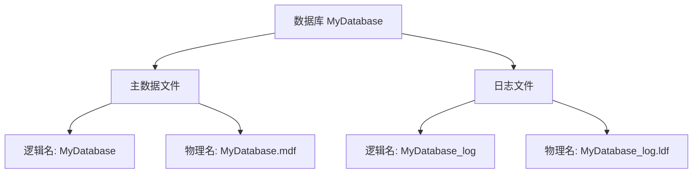

# 第6章-6.1-数据库和数据库文件

## 基本信息
- **课程**：数据库原理与应用
- **章节**：第6章 6.1节 数据库和数据库文件
- **日期**：2026-06-30
- **标签**：#数据库文件 #数据文件 #日志文件 #文件组 #MDF #LDF

---

## 重点内容

### ⭐⭐⭐ 核心概念
- **数据库的物理存储**：数据库以文件形式保存在磁盘上，分为数据文件和日志文件
- **三种文件名**：数据库名、逻辑文件名（面向应用程序）、物理文件名（面向操作系统）
- **主数据文件**：每个数据库有且仅有一个，扩展名.mdf，是数据库的起点
- **文件组**：数据文件的逻辑划分，包括主文件组和用户定义文件组

### ⭐⭐ 重要概念
- **前像与后像**：操作执行前/后的数据副本，记录在日志文件中
- **数据库对象**：数据表、索引、视图等统称为数据库对象
- **默认文件组**：创建数据库时主文件组自动成为默认文件组

### ⭐ 基础概念
- **次要数据文件**：可选，扩展名.ndf
- **文件系统选择**：从安全性角度一般使用NTFS文件系统

---

## 详细笔记

### 一、数据库的组成（6.1.1）

从操作系统的角度看，数据库最终是以**文件**的形式保存在磁盘上。

> 📚 **课本出处**：第6章 6.1.1节"数据库的组成"

#### 1. 数据文件

数据文件是数据库用于存储数据的文件，保存了数据库中的**全部数据**。

| 类型 | 说明 | 默认扩展名 | 数量要求 |
|:----:|:-----|:----------:|:--------:|
| 主数据文件 | 数据库的起点，指向数据库的其他文件 | .mdf | 有且仅有1个 |
| 次要数据文件 | 用于扩展存储空间 | .ndf | 可选，可以有多个或没有 |

> 💡 **理解技巧**：类比理解：主数据文件相当于一本书的目录页，指向各章节（次要数据文件）；次要数据文件相当于书的各章节内容。

#### 2. 日志文件

日志文件记录了针对数据库的**所有修改操作**，每条日志记录可能是：
- 所执行的逻辑操作
- 已修改数据的**前像**和**后像**

| 概念 | 说明 |
|:----:|:-----|
| 前像 | 操作执行**前**的数据副本 |
| 后像 | 操作执行**后**的数据副本 |

- 默认扩展名为 **.ldf**
- 每个数据库**至少有一个**日志文件，也可以有多个
- 日志文件包含用于**恢复数据库**的所有日志信息

> ⚠️ **常见误区**：数据库文件（.mdf/.ndf/.ldf）保存在FAT或NTFS文件系统中，但从安全性角度考虑，**一般使用NTFS文件系统**。

#### 3. 三种文件名

每个数据文件和日志文件都有两套名称：

| 名称类型 | 面向对象 | 说明 |
|:--------:|:--------:|:-----|
| 数据库名 | 应用程序 | 数据库的逻辑名称，创建时由用户输入的合法字符串 |
| 逻辑文件名 | 应用程序 | 通过逻辑文件名，SQL语句可以有限度地访问和操作数据文件与日志文件 |
| 物理文件名 | 操作系统 | 数据文件和日志文件对应的磁盘文件（.mdf、.ndf、.ldf） |

> 📌 **考试重点**：数据库名面向应用程序，数据库文件名面向操作系统。这个区分在考试中经常出现。

#### 默认文件名规则（SQL Server 2017）

创建数据库时会自动生成一个主数据文件和一个日志文件，默认命名规则：

| 文件类型 | 逻辑文件名 | 物理文件名 |
|:--------:|:----------:|:----------:|
| 主数据文件 | 数据库名 | 数据库名.mdf |
| 日志文件 | 数据库名_log | 数据库名_log.ldf |

**示例**：创建名为 MyDatabase 的数据库时：

| 数据库名 | 逻辑文件名(面向应用程序) | 物理文件名(面向操作系统) |
|:--------:|:------------------------:|:------------------------:|
| MyDatabase | MyDatabase | MyDatabase.mdf |
| MyDatabase | MyDatabase_log | MyDatabase_log.ldf |

> 📚 **课本出处**：第6章 6.1.1节 表6.1 数据库名、逻辑文件名和物理文件名的关系

---

### 二、文件组（6.1.2）

文件组是数据文件的一种**逻辑划分**，即将若干个数据文件放在一起而形成的文件集。

> 📚 **课本出处**：第6章 6.1.2节"文件组"

#### 文件组类型

| 文件组类型 | 说明 |
|:----------:|:-----|
| **主文件组(PRIMARY)** | 包含主数据文件和任何没有明确指定文件组的其他数据文件；创建时自动被设置为默认文件组 |
| **用户定义文件组** | 用户利用T-SQL语句或SSMS可视化操作创建的文件组 |

#### 文件组的核心规则

| 规则 | 说明 |
|:----:|:-----|
| 一个文件组包含多个数据文件 | 文件组是数据文件的集合 |
| 一个数据文件只能属于一个文件组 | 数据文件和文件组是多对一的关系 |
| 一个数据库至少有一个文件组 | 即主文件组 |
| 最多32767个文件组 | 数据库文件组的上限 |
| 有且仅有一个默认文件组 | 不显式指定文件组时，新对象在默认文件组上创建 |

> 💡 **理解技巧**：文件组类似于操作系统的"文件夹"概念，只不过它管理的是数据文件而非普通文件。默认文件组相当于"默认下载目录"，不指定路径时就存到这里。

---

## 总结

### 数据库文件体系

| 层级 | 概念 | 说明 |
|:----:|:-----|:-----|
| 逻辑层 | 数据库名 | 面向应用程序的名称 |
| 逻辑层 | 逻辑文件名 | SQL语句访问数据文件和日志文件的名称 |
| 物理层 | 物理文件名 | 操作系统中的磁盘文件名（.mdf/.ndf/.ldf） |
| 组织层 | 文件组 | 数据文件的逻辑划分（PRIMARY/用户定义） |

### 关键要点

1. 数据库以文件形式存储：数据文件(.mdf/.ndf) + 日志文件(.ldf)
2. 每个数据库有且仅有一个主数据文件，次要数据文件可选
3. 每个数据库至少有一个日志文件
4. 三种名称体系：数据库名、逻辑文件名（面向应用程序）、物理文件名（面向操作系统）
5. 文件组是数据文件的逻辑划分，主文件组(PRIMARY)是默认文件组
6. 建议使用NTFS文件系统保存数据库文件

---

## 疑问与思考

### ❓ 待解决问题
1. 前像和后像在日志文件中具体以什么格式存储？日志恢复时如何利用前像和后像？
2. 什么场景下需要创建多个日志文件？日志文件的初始大小如何确定？
3. 用户定义文件组在实际应用中有什么优势？什么时候需要使用用户定义文件组？
4. 为什么说"数据库文件名面向操作系统，数据库名面向应用程序"？这种设计有什么好处？

### 💡 个人理解/技巧
- 记忆口诀：**mdf** = **m**ain **d**ata **f**ile，**ndf** = **n**ew **d**ata **f**ile，**ldf** = **l**og **d**ata **f**ile
- 逻辑文件名和物理文件名的关系就像变量名和内存地址的关系：逻辑名是给人看的，物理名是给系统用的
- 文件组的默认设置能简化日常操作，但在需要数据分离（如将不同表放在不同磁盘）时，用户定义文件组就很有价值
- NTFS文件系统比FAT多了权限控制和日志功能，对数据库文件的安全性更有保障

---

## 相关链接

### 关联章节
- [第6章-数据库的创建和管理](./第6章-数据库的创建和管理.md)
- [第6章-6.2-数据库的创建](./第6章-6.2-数据库的创建.md)

---

## 检查清单

- [x] 已理解数据库文件的组成（数据文件+日志文件）
- [x] 已掌握三种文件名的区别（数据库名/逻辑文件名/物理文件名）
- [x] 已理解文件组的概念和类型
- [x] 已记录重点标记
- [x] 已添加课本出处标注

---

*笔记创建时间：2026-06-30*
