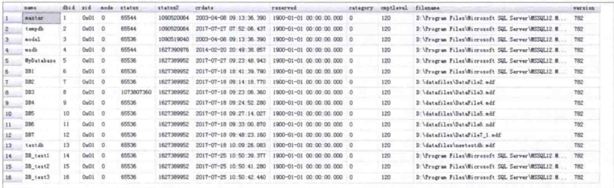
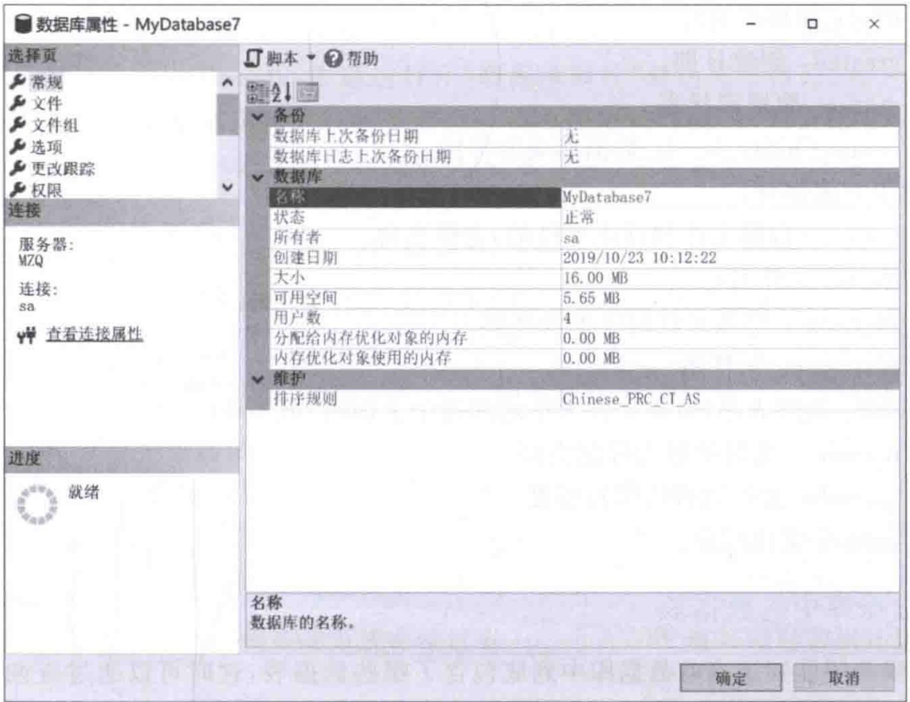
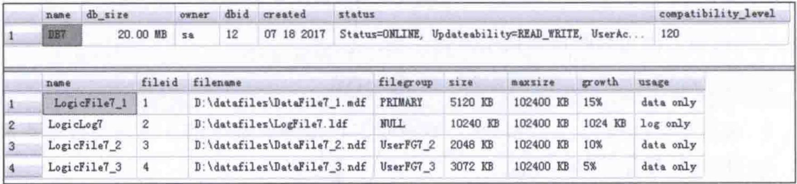
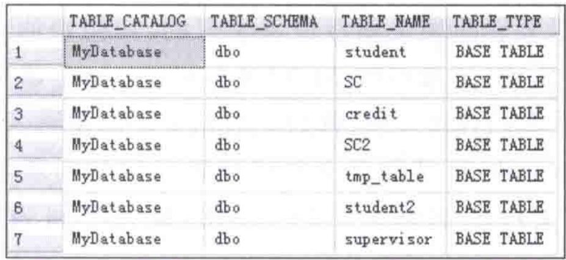

# 第6章-6.3-查看数据库

## 基本信息
- **课程**：数据库原理与应用
- **章节**：第6章 6.3节 查看数据库
- **日期**：2026-06-30
- **标签**：#数据库 #查看 #sp_helpdb #sysdatabases #information_schema

---

## 重点内容

### ⭐⭐⭐ 核心方法
- **查看服务器上所有数据库**：查询 `sysdatabases` 系统视图
- **判断数据库是否存在**：使用 `EXISTS` 函数或 `db_id()` 函数
- **查看数据库基本信息**：使用系统存储过程 `sp_helpdb`
- **查看数据库中的数据表**：查询 `information_schema_tables` 视图

### ⭐⭐ 关键存储过程/视图
- `sysdatabases`：保存服务器上所有数据库信息的系统目录视图
- `sp_helpdb`：查看指定数据库或所有数据库的基本信息
- `information_schema_tables`：包含当前数据库中所有数据表的基本信息

### ⭐ 两种判断数据库是否存在的方法
- `IF EXISTS (SELECT * FROM sysdatabases WHERE name='...')`
- `IF db_id('...') IS NOT NULL`

---

## 详细笔记

### 一、服务器上的数据库（6.3.1）

> 📚 **课本出处**：第6章 6.3.1节"服务器上的数据库"

#### 1. 查看所有数据库

`master` 数据库中的目录视图 `sysdatabases` 保存了服务器上**所有数据库**的信息，通过查询该视图可以获取所有数据库信息：

```sql
SELECT * FROM sysdatabases;
```

#### 📷 图6.1 服务器上所有数据库信息



> 📚 **课本出处**：图6.1 展示了查询 `sysdatabases` 后返回的服务器上所有数据库信息

#### 2. 判断数据库是否存在

**方法一：使用 EXISTS 函数**

```sql
IF EXISTS (SELECT * FROM sysdatabases WHERE name='MyDatabase')
    PRINT '存在'
```

**方法二：使用 db_id() 函数**

```sql
IF db_id('MyDatabase') IS NOT NULL
    PRINT '存在'
```

> 💡 **理解技巧**：`db_id()` 函数返回数据库的ID编号，如果数据库不存在则返回 `NULL`。两种方法本质上都是查询系统视图，但 `db_id()` 写法更简洁。

---

### 二、数据库基本信息（6.3.2）

> 📚 **课本出处**：第6章 6.3.2节"数据库的基本信息"

#### 1. 通过SSMS查看

在 SQL Server Management Studio 的对象资源管理器中**右击要查看的数据库** -> 选择"属性"项 -> 打开"数据库属性"对话框。

#### 📷 图6.2 数据库MyDatabase7的基本信息



> 📚 **课本出处**：图6.2 展示了通过"数据库属性"对话框查看数据库MyDatabase7的基本信息

#### 2. 使用 sp_helpdb 存储过程

语法格式：

```txt
sp_helpdb database_name
```

**【例6.8】查看数据库DB7的信息**

```sql
sp_helpdb DB7;
```

#### 📷 图6.3 使用sp_helpdb查看数据库DB7的信息



> 📚 **课本出处**：图6.3 展示了使用 `sp_helpdb` 查看数据库DB7的详细信息

#### 3. sp_helpdb 返回结果各列含义

**上面部分（数据库概要）**：

| 列名 | 含义 |
|:----:|:-----|
| name | 数据库名 |
| db_size | 数据库总的大小 |
| owner | 数据库拥有者 |
| dbid | 数据库ID |
| created | 创建日期 |
| status | 数据库状态 |
| compatibility_level | 数据库兼容等级 |

**下面部分（文件详情）**：

| 列名 | 含义 |
|:----:|:-----|
| name | 数据文件和日志文件的逻辑名称 |
| fileid | 文件ID |
| filename | 物理文件的位置及名称 |
| filegroup | 文件组 |
| size | 文件大小（所有文件大小之和 = db_size） |
| maxsize | 文件的最大存储空间 |
| growth | 文件的自动增长幅度 |
| usage | 文件用途 |

> ⚠️ **常见误区**：`sp_helpdb` 结果分为两部分——上面是数据库概要信息，下面是各文件的详细信息。不要只看上面部分而忽略下面的文件详情。

---

### 三、数据库中的数据表（6.3.3）

> 📚 **课本出处**：第6章 6.3.3节"数据库中的数据表"

查询当前数据库中包含的所有数据表，可以通过查询信息架构视图 `information_schema_tables` 来获得：

```sql
USE MyDatabase;  -- 打开数据库MyDatabase
SELECT *
FROM information_schema_tables;
```

#### 📷 图6.4 数据库MyDatabase中所有的数据表



> 📚 **课本出处**：图6.4 展示了数据库MyDatabase中所有数据表的基本信息

> 💡 **理解技巧**：`information_schema_tables` 是一个标准的信息架构视图，每个数据库都有。使用前必须先 `USE` 切换到目标数据库，否则查看的是当前数据库的表。

---

## 总结

### 查看数据库常用方法汇总

| 目的 | 方法 | 示例 |
|:-----|:-----|:-----|
| 查看服务器所有数据库 | 查询 `sysdatabases` | `SELECT * FROM sysdatabases` |
| 判断数据库是否存在 | `EXISTS` / `db_id()` | `IF EXISTS (SELECT * FROM sysdatabases WHERE name='...')` |
| 查看数据库基本信息 | `sp_helpdb` | `sp_helpdb DB7` |
| 查看数据库中的表 | `information_schema_tables` | `SELECT * FROM information_schema_tables` |

### 关键要点

1. `sysdatabases` 是 `master` 数据库中的系统视图，保存所有数据库信息
2. `sp_helpdb` 是最常用的查看数据库信息的存储过程
3. `sp_helpdb` 返回两部分信息：数据库概要 + 文件详情
4. 查看数据表前必须先用 `USE` 切换到目标数据库
5. `db_id()` 函数比 `EXISTS` 写法更简洁，推荐使用

---

## 疑问与思考

### ❓ 待解决问题
1. `sysdatabases` 和 `sp_helpdb` 的信息有什么重叠和区别？哪些场景下应该选择哪个？
2. `information_schema_tables` 视图返回的字段有哪些？能否进一步筛选特定类型的表（如系统表vs用户表）？
3. 除了 `sp_helpdb`，还有哪些系统存储过程可以查看数据库相关信息？

### 💡 个人理解/技巧
- 判断数据库是否存在的两种方法中，`db_id()` 更简洁且不需要子查询，实际编码中推荐使用
- `sp_helpdb` 不传参数时可以查看所有数据库的信息，等价于 `sp_helpdb`
- 如果只想看数据库文件信息而不看概要，可以用 `SELECT * FROM master.dbo.sysfiles WHERE dbid = db_id('数据库名')`
- SSMS 的"属性"对话框是最直观的查看方式，但编写脚本时还是需要用存储过程

---

## 相关链接

### 本节相关图片
- [图6.1 服务器上所有数据库信息](../../../images/1708cc72bd4f1fbbb8c7132573264c0d791793c5607e8fa617bcee6420da6667.jpg)
- [图6.2 数据库MyDatabase7的基本信息](../../../images/84b8ce21a08ed0321e75c73d10cf74503f6f049fea30e0fbfbb3d22b86711d79.jpg)
- [图6.3 使用sp_helpdb查看数据库DB7的信息](../../../images/a7e588bfcede7cb484f62ad5bf4b911e487b9c24972243e3880c329efc17e1bf.jpg)
- [图6.4 数据库MyDatabase中所有的数据表](../../../images/acff26a81a6a36ac44482d7f89fba8327429577507072d8eef8f684bab1d8d8c.jpg)

### 关联章节
- [第6章-6.4-修改数据库](./第6章-6.4-修改数据库.md)
- [第6章-6.5-数据库的分离和附加](./第6章-6.5-数据库的分离和附加.md)
- [第6章-6.6-删除数据库](./第6章-6.6-删除数据库.md)

---

## 检查清单

- [x] 已掌握通过 `sysdatabases` 查看服务器上的数据库
- [x] 已掌握判断数据库是否存在的两种方法
- [x] 已掌握 `sp_helpdb` 的用法及返回结果含义
- [x] 已掌握通过 `information_schema_tables` 查看数据表
- [x] 已插入课本原图（图6.1、图6.2、图6.3、图6.4）
- [x] 已添加课本出处标注

---

*笔记创建时间：2026-06-30*
