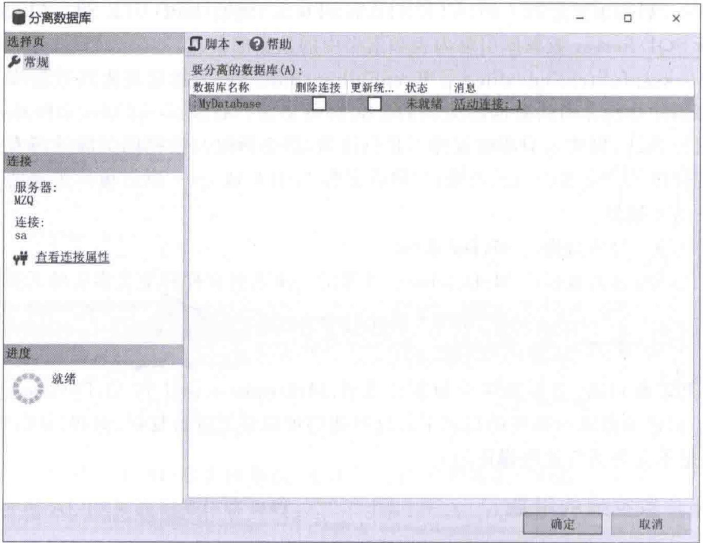
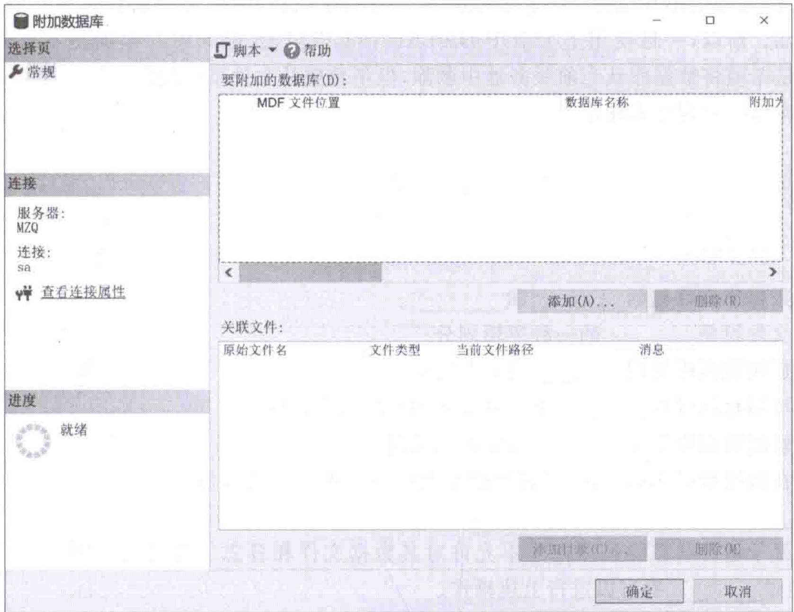

# 第6章-6.5-数据库的分离和附加

## 基本信息
- **课程**：数据库原理与应用
- **章节**：第6章 6.5节 数据库的分离和附加
- **日期**：2026-06-30
- **标签**：#数据库 #分离 #附加 #sp_detach_db #sp_attach_db #数据库迁移

---

## 重点内容

### ⭐⭐⭐ 核心概念
- **数据库分离**：将数据库从服务器实例中分离，得到静态的数据库文件（.mdf + .ldf）
- **数据库附加**：利用已有的数据库文件将分离的数据库加入到服务器中
- **本质用途**：实现数据库在不同服务器之间的迁移、备份

### ⭐⭐ 关键区别
- **分离 vs 删除**：分离保留数据文件，删除则同时删除磁盘上的文件，数据不可恢复
- **附加 vs 创建**：附加是利用已有文件创建数据库，参数由文件本身决定而非继承 model 数据库

### ⭐ 关键语法
- 分离：`sp_detach_db`
- 附加：`CREATE DATABASE ... FOR ATTACH`（或 `sp_attach_db`）

---

## 详细笔记

### 一、概述

> 📚 **课本出处**：第6章 6.5节"数据库的分离和附加"

**数据库分离**：将数据库从服务器实例中分离出来，结果是数据库文件（包括数据文件和日志文件）脱离数据库服务器，得到**静态的数据库文件**，可以像其他操作系统文件那样进行复制、剪切、粘贴等操作。

**数据库附加**：利用数据库文件将分离的数据库加入到数据库服务器中，形成服务器实例。

**核心用途**：通过分离与附加，可以把一个数据库从一台服务器移到另外一台服务器上，为数据库的**备份、移动**提供了有效途径。

> 💡 **理解技巧**：分离和附加是一对互逆操作。分离 = "拆下来"，附加 = "装上去"。可以理解为把U盘从电脑上拔出（分离）和插入（附加）。

---

### 二、用户数据库的分离（6.5.1）

> 📚 **课本出处**：第6章 6.5.1节"用户数据库的分离"

#### 1. 分离与删除的本质区别

| 对比项 | 分离（sp_detach_db） | 删除（DROP DATABASE） |
|:------:|:-------------------:|:---------------------:|
| 数据库文件 | **保留在磁盘上** | 从磁盘上**删除** |
| 数据恢复 | 文件仍在，可重新附加 | **不可恢复** |
| 结果 | 得到静态的 .mdf 和 .ldf 文件 | 一切消失 |

> ⭐ **核心重点**：分离的结果是形成静态的数据文件和日志文件，这些文件保存了数据库中的全部信息。数据库删除操作则不但将数据库从服务器中分离出来，而且相应的文件都从磁盘上被删除，数据不可恢复。

#### 2. sp_detach_db 语法

```txt
sp_detach_db [ @dbname = ] 'database_name'
    [ , [ @skipchecks = ] 'skipchecks' ]
    [ , [ @keepfulltextindexfile = ] 'KeepFulltextIndexFile' ]
```

**参数说明**：

| 参数 | 说明 |
|:-----|:-----|
| `@dbname` | 要分离的数据库名称，默认值为 NULL |
| `@skipchecks` | 是否运行 UPDATE STATISTICS。设为 `true` 则跳过；`false` 则运行。默认为 NULL |
| `@keepfulltextindexfile` | 是否保留全文索引文件。设为 `false` 会删除全文索引文件和元数据；设为 `NULL` 或 `true`（默认）则保留 |

> 💡 **理解技巧**：`UPDATE STATISTICS` 会更新数据库引擎内表和索引中的统计信息。分离时跳过（设为 true）可以加快分离速度，但可能影响后续附加后的查询性能。

#### 3. 示例

**【例6.12】分离数据库MyDatabase**

分离数据库 MyDatabase，并保留全文索引文件和全文索引的元数据：

```sql
USE master;  -- 为了关闭要分离的数据库MyDatabase
EXEC sp_detach_db 'MyDatabase', NULL, 'true';
```

执行后，将得到两个数据库文件：
- `MyDatabase.mdf`（数据文件）
- `MyDatabase_log.LDF`（日志文件）

这些文件位于创建数据库时指定的目录下，此时可以对它们进行复制、剪切、粘贴等操作（分离之前是不允许的）。

#### 4. 通过SSMS分离

在SSMS的对象资源管理器中**右击要分离的数据库** -> 选择"任务" -> "分离..." -> 在"分离数据库"对话框中单击【确定】按钮。

#### 📷 图6.5 "分离数据库"对话框



> 📚 **课本出处**：图6.5 展示了SSMS中"分离数据库"对话框

---

### 三、用户数据库的附加（6.5.2）

> 📚 **课本出处**：第6章 6.5.2节"用户数据库的附加"

#### 1. FOR ATTACH 语法

```sql
CREATE DATABASE database_name
ON <filespec> [,...n]
FOR { ATTACH [ WITH <service_broker_option>] | ATTACH_REBUILD_LOG }
[;]
```

**关键点**：
- `FOR ATTACH` 表示用指定的操作系统文件来创建数据库
- 数据库的参数由这些操作系统文件指定的数值来设置
- **不再继承**系统数据库 `model` 的参数设置

#### 2. 示例

**【例6.13】附加数据库MyDatabase**

利用例6.12中分离得到的 `MyDatabase.mdf` 和 `MyDatabase_log.LDF` 来附加数据库。假设文件位于 `D:\datafiles\` 目录下：

```sql
CREATE DATABASE MyDatabase
ON (FILENAME = 'D:\datafiles\MyDatabase.mdf')  -- 只利用了数据文件
FOR ATTACH
```

> ⚠️ **重要注意**：虽然代码中只显式使用了数据文件 `MyDatabase.mdf`，但日志文件 `MyDatabase_log.LDF` **最好与数据文件位于同一目录下**，否则会产生一些警告。

#### 3. 通过SSMS附加

在SSMS的对象资源管理器中**右击"数据库"节点** -> 选择"附加" -> 在"附加数据库"对话框中单击【添加】按钮 -> 选择相应的 `.mdf` 文件。

#### 📷 图6.6 "附加数据库"对话框



> 📚 **课本出处**：图6.6 展示了SSMS中"附加数据库"对话框

---

## 总结

### 分离与附加操作流程

```
分离前：数据库在服务器中运行
    ↓ sp_detach_db
分离后：得到静态的 .mdf 和 .ldf 文件
    ↓ 可以复制、移动到其他服务器
附加前：将文件放置到目标服务器指定目录
    ↓ CREATE DATABASE ... FOR ATTACH
附加后：数据库在新服务器中运行
```

### 语法汇总

| 操作 | 语法 |
|:-----|:-----|
| 分离数据库 | `EXEC sp_detach_db '数据库名', NULL, 'true';` |
| 附加数据库 | `CREATE DATABASE db_name ON (FILENAME='文件路径.mdf') FOR ATTACH;` |

### 关键要点

1. 分离和附加是一对互逆操作，用于数据库的迁移和备份
2. **分离保留文件，删除删除文件**——这是两者最本质的区别
3. 分离后得到静态的 .mdf 和 .ldf 文件，可以自由复制移动
4. 附加时只需指定数据文件路径，日志文件会自动关联（但建议放在同一目录）
5. `FOR ATTACH` 创建的数据库参数由文件本身决定，不继承 `model` 数据库设置
6. SQL语句和SSMS图形界面两种方式都可以完成分离和附加

---

## 疑问与思考

### ❓ 待解决问题
1. 如果分离后 .ldf 日志文件丢失了，还能附加成功吗？（提示：`ATTACH_REBUILD_LOG` 选项）
2. 分离数据库后，原来的数据库用户和权限信息是否还保留？
3. 能否将一个服务器上的数据库附加到另一个版本的SQL Server上？版本兼容性如何处理？

### 💡 个人理解/技巧
- 分离数据库前必须先 `USE master`，因为需要关闭要分离的数据库
- `sp_detach_db` 的三个参数中，第一个必须指定，后两个可选
- 附加时如果日志文件丢失，可以使用 `ATTACH_REBUILD_LOG` 选项重新生成日志
- 实际工作中，分离-附加常用于数据库的备份和迁移场景，比完整备份-恢复更快捷
- 分离和附加操作需要相应的权限（通常是 sysadmin 或 db_owner 角色）

---

## 相关链接

### 本节相关图片
- [图6.5 "分离数据库"对话框](../../../images/5100f6b51737d63dfba921a2aaa14b524bb1faa26e5baccbd56e87839c5a2e5b.jpg)
- [图6.6 "附加数据库"对话框](../../../images/139516cd3e401aad63d46317e87e04277ceeed9eb833c07beac1b7a12ae3cc5d.jpg)

### 关联章节
- [第6章-6.3-查看数据库](./第6章-6.3-查看数据库.md)
- [第6章-6.4-修改数据库](./第6章-6.4-修改数据库.md)
- [第6章-6.6-删除数据库](./第6章-6.6-删除数据库.md)

---

## 检查清单

- [x] 已理解数据库分离和附加的概念与用途
- [x] 已掌握分离与删除的本质区别
- [x] 已掌握 `sp_detach_db` 的语法和参数
- [x] 已掌握 `CREATE DATABASE ... FOR ATTACH` 的语法
- [x] 已记录例6.12和例6.13的完整代码
- [x] 已插入课本原图（图6.5、图6.6）
- [x] 已添加课本出处标注

---

*笔记创建时间：2026-06-30*
