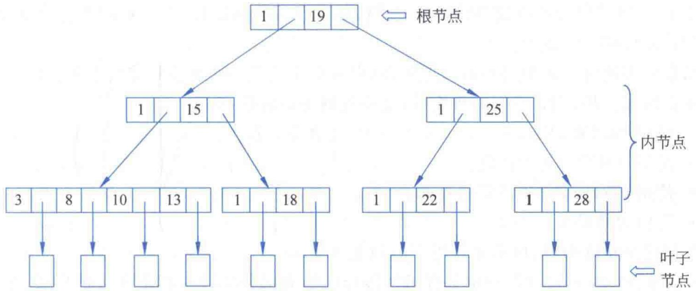
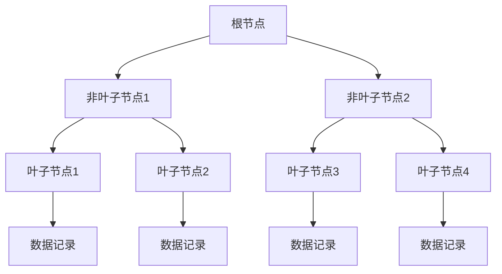

# 第7章-7.1-索引概述

## 基本信息
- **课程**：数据库原理与应用
- **章节**：第7章 7.1节 索引概述
- **日期**：2026-06-30
- **标签**：#索引 #B树 #数据库对象 #查询优化 #I/O

---

## 重点内容

### ⭐⭐⭐ 核心概念
- **索引定义**：依赖于数据表或视图的数据库对象，保存键值或指针
- **索引类比**：类似书的目录，先定位章节再查找内容
- **索引数据结构**：SQL Server中使用B-树构造索引

### ⭐⭐ 索引使用原则
- 索引不是创建得越多越好
- 过多索引会增加B-树维护开销，降低数据修改操作效率
- 索引的创建由用户完成，使用由查询优化器自动决定

### ⭐ B-树性质
- m阶平衡树，每个节点最多m棵子树
- 所有叶子节点在同一层次
- 通过从根到叶的路径定位数据，比顺序访问高效得多

---

## 详细笔记

### 一、什么是索引

> 📚 **课本出处**：第7章 7.1.1节"什么是索引"

#### 1. 索引的定义

**索引（Index）** 是依赖于数据表或视图的一种数据库对象，它保存了针对指定数据表或视图的键值或指针。

- 索引有自己的**文件名**（索引文件名）
- 索引需要占用**磁盘空间**
- 创建索引的目的：**提高对数据表或视图的搜索效率**

#### 2. 目录类比

索引的作用类似于**一本书的目录**：

| 查找过程 | 书的目录 | 数据库索引 |
|:--------:|:--------:|:----------:|
| 第1步 | 查看目录定位章节 | 查看索引定位数据页 |
| 第2步 | 在该章节中寻找感兴趣的内容 | 从索引指向的位置读取数据 |
| 效率提升 | 避免逐页翻阅 | 避免全表扫描 |

> 💡 **理解技巧**：没有索引的查询相当于没有目录的书——必须从头到尾逐页翻阅，才能找到想要的内容。有了索引，就能快速定位到目标位置。

#### 3. 索引的本质

对于数据表来说，索引可以理解为**对一个或多个字段值进行排序的结构**，本质上是**指向存储在表中指定列的数据值的指针**。

- SQL Server中索引用**B-树**来构造
- 通过索引访问数据 = 寻找一条从**根节点到叶子节点**的路径
- 这个过程通常比直接顺序访问数据表**高效得多**

原因分析：

| 访问方式 | I/O操作 | 时间开销 |
|:--------:|:-------:|:--------:|
| 通过索引 | 少数几次 | 较短 |
| 顺序访问 | 逐行比较 | 较长 |

> 📚 **课本出处**：第7章 7.1.1节指出，通过索引只需少数几个I/O操作可以在较短的时间内定位到表中相应的行，而顺序访问则需要从头到尾逐行比较。

#### 4. 索引的代价

索引虽然提高了查询效率，但也存在代价：

- 搜索庞大的B-树**需要时间**
- SQL Server对B-树进行**维护也需要代价**（B-树作为数据结构存放在数据表以外的地方，需要额外系统资源）
- 执行UPDATE、DELETE、INSERT时需要更改B-树，**付出大量时间代价**

> ⚠️ **常见误区**：索引并不是创建得越多越好。过多的索引反而可能使查询效率下降，因为维护B-树的开销会超过索引带来的查询收益。

---

### 二、何种情况下创建索引

> 📚 **课本出处**：第7章 7.1.2节"何种情况下创建索引"

#### 1. 创建索引的一般原则

- 数据表**很大**时，对**查询操作比较频繁**的字段应创建索引
- 对其他字段则应**少创建**索引

#### 2. 索引对不同操作的影响

| 操作类型 | 索引的影响 |
|:--------:|:----------:|
| SELECT | 减少磁盘I/O，提高执行效率 |
| UPDATE | 需要维护索引，可能降低执行效率 |
| DELETE | 需要维护索引，可能降低执行效率 |
| INSERT | 需要维护索引，可能降低执行效率 |

#### 3. 索引的创建与使用

- **索引的创建**：由用户来完成
- **索引的使用**：由SQL Server的查询优化器**自动实现**
- 并不是所有已创建的索引都会在查询操作中被使用
- 一个索引是否被使用，由查询优化器**决定**

> 💡 **理解技巧**：创建索引相当于"告诉"数据库"这个字段可能被频繁查询"，但最终用不用这个索引，是查询优化器根据具体情况判断的。

---

### 三、索引的原理——B-树

> 📚 **课本出处**：第7章 7.1.3节"索引的原理——B-树"

#### 1. B-树的定义

B-树即**平衡树（Balanced Tree）**。一棵m阶的平衡树满足以下性质（不考虑空树）：

| 性质编号 | 内容 |
|:--------:|:-----|
| (1) | 树中每个节点**最多**有m棵子树 |
| (2) | 根节点除外，所有非叶子节点**至少**包含 m/2 棵子树 |
| (3) | 若根节点不是叶子节点，则根节点**至少**两棵子树 |
| (4) | 包含 k+1 棵子树的非叶节点恰好包含 k 个关键字 |
| (5) | 所有叶子节点出现在**同一层次**上，且不包含任何关键字信息 |

#### 2. B-树节点结构

一个包含 k+1 棵子树的非叶节点结构如下：

| A0 | K1 | A1 | K2 | A2 | ... | Kk | Ak |
|:--:|:--:|:--:|:--:|:--:|:---:|:--:|:--:|

其中：
- k：关键字的个数
- Ki (i = 1,2,...,k)：关键字，且 Ki < Ki+1
- Ai (i = 0,1,...,k)：指向相应子树根节点的指针

**指针的大小关系**：
- Ai-1 所指子树中所有节点的关键字均**小于** Ki
- Ai+1 所指子树中所有节点的关键字均**大于** Ki

> 📚 **课本出处**：第7章 7.1.3节描述了B-树节点的结构和指针的大小关系规则。

#### 📷 图7.1 一棵四阶的B-树

> 📚 **课本出处**：图7.1 展示了一棵四阶B-树的结构，叶子节点出现在同一层次上，体现了B-树的平衡特性。

#### 3. B-树用于索引的优势

B-树非常适合用于数据检索：
- SQL Server使用B-树作为索引的**数据存储结构**
- 构建**索引页**和**数据页**
- **叶子节点**可以用于保存数据记录的指针，从而快速定位要检索的数据记录

> 💡 **理解技巧**：B-树的查找过程就像二分查找的树形版本——每次比较都可以排除一半的数据，所以只需要很少的I/O操作就能定位到目标数据。

---

## 总结

### 索引概述要点

| 要点 | 内容 |
|:----:|:-----|
| **定义** | 依赖于数据表/视图的数据库对象，保存键值或指针 |
| **目的** | 提高查询效率 |
| **类比** | 类似书的目录 |
| **数据结构** | B-树（平衡树） |
| **创建者** | 用户 |
| **使用者** | SQL Server查询优化器（自动） |
| **代价** | 占用磁盘空间，增加数据修改操作的维护开销 |

### 关键原则

1. 索引不是越多越好，过多索引反而降低效率
2. 大表的频繁查询字段应创建索引
3. 索引创建由用户决定，是否被使用由优化器决定
4. B-树的平衡特性保证了高效的查找性能

---

## 疑问与思考

❓ **疑问**：索引为什么能提高查询速度？

💡 **解答**：
- 没有索引时，数据库需要**全表扫描**（逐行检查每一行）
- 有了索引（B-树结构），可以像查字典一样**快速定位**，只需 O(log n) 次比较
- 代价是：每次 INSERT/UPDATE/DELETE 时需要**同步更新索引**，写操作变慢

❓ **疑问**：什么情况下不应该创建索引？

💡 **解答**：
- 数据量**很小**的表（全表扫描反而更快）
- **频繁更新**的列（索引维护开销大）
- **选择性低**的列（如性别只有男/女，索引无法有效过滤）
- 很少用于 **WHERE/JOIN/ORDER BY** 的列

❓ **疑问**：B-树和 B+ 树有什么区别？

💡 **解答**：
- **B-树**：非叶子节点也存储数据
- **B+ 树**：数据**只存在叶子节点**，非叶子节点只存索引键值，叶子节点用链表连接
- SQL Server 实际使用的是 **B+ 树**变体，更适合范围查询

### 💡 个人理解/技巧
- 索引的"目录类比"非常贴切：目录让读者快速找到章节，索引让数据库快速找到数据行
- B-树的平衡性质是核心——保证每次查找的路径长度差不多，避免了"退化成链表"的情况
- 创建索引的本质是在"查询速度"和"修改速度"之间做权衡：查询快了，但每次修改数据时要同步更新索引
- 可以把B-树想象成一棵"决策树"：每一层都在做比较判断，逐步缩小范围

---

## 相关链接

### 本节相关图片
- [图7.1 一棵四阶的B-树](../../../images/22c52bbe2a9d5a5794b2fb0bc177897457c088c6fa7bd9aeddf1213b57767406.jpg)

### 关联章节
- [第7章-索引与视图](./第7章-索引与视图.md)
- [第7章-7.2-索引的类型](./第7章-7.2-索引的类型.md)

---

*笔记创建时间：2026-06-30*
