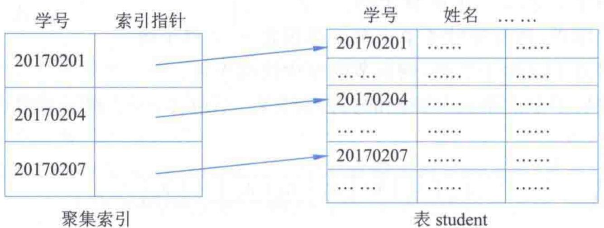
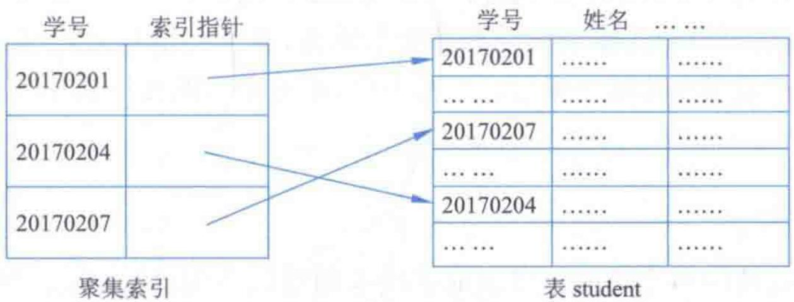
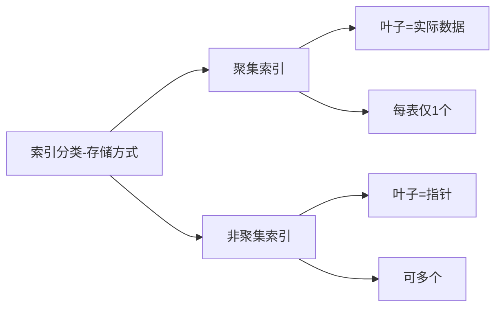
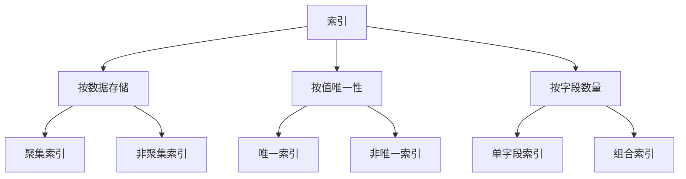

# 第7章-7.2-索引的类型

## 基本信息
- **课程**：数据库原理与应用
- **章节**：第7章 7.2节 索引的类型
- **日期**：2026-06-30
- **标签**：#索引类型 #聚集索引 #非聚集索引 #唯一索引 #组合索引

---

## 重点内容

### ⭐⭐⭐ 核心区别
- **聚集索引 vs 非聚集索引**：叶子节点存储内容不同（实际数据 vs 指针）
- **每表只能有一个聚集索引**，但可有多个非聚集索引
- **唯一索引 vs 非唯一索引**：索引值是否允许重复

### ⭐⭐ 索引分类维度
- 按**数据存储方式**：聚集索引、非聚集索引
- 按**值的唯一性**：唯一索引、非唯一索引
- 按**字段数量**：单字段索引、组合索引

### ⭐ 选择原则
- 聚集索引适合频繁查询的字段、唯一性查询、范围查询
- 非聚集索引适合更新少的查询表
- 组合索引用于单字段无法创建唯一索引时

---

## 详细笔记

### 一、聚集索引和非聚集索引

> 📚 **课本出处**：第7章 7.2.1节"聚集索引和非聚集索引"

聚集索引和非聚集索引是SQL Server中两类主要的索引，都是基于B-树构建的。

---

#### 1. 聚集索引（Clustered Index）

**核心特点**：索引顺序与数据表中记录的**物理顺序相同**，每张数据表只允许拥有**一个**聚集索引。

- 聚集索引与数据是"**一体**"的
- 其存在以表中的记录顺序来体现
- B-树的**叶子节点存储的是实际的数据**

> 📚 **课本出处**：第7章 7.2.1节指出，聚集索引的索引指针是"不相交"的，因为索引顺序与数据记录的物理顺序一致。

#### 📷 图7.2 聚集索引的结构示意图

> 📚 **课本出处**：图7.2 展示了对student表中s_no字段创建的聚集索引，索引指针不相交，叶子节点存储实际数据。

**聚集索引的自动创建**：

- 当对表定义**主键**时，聚集索引将**自动、隐式**地被创建
- 一般在字段值**唯一**的字段上创建（特别是主键）
- 若在字段值非唯一的字段上创建，SQL Server会添加**4字节标识符**来唯一标识重复记录

**聚集索引适用的查询类型**：

| 查询类型 | 示例 |
|:--------:|:-----|
| 范围查询 | 使用 BETWEEN、>=、>、<=、< |
| 连接查询 | 使用 JOIN 子句 |
| 分组查询 | 使用 GROUP BY 子句 |
| 大结果集 | 返回大量记录的查询 |

**适合创建聚集索引的字段**：

| 适合的字段 | 说明 |
|:----------:|:-----|
| 字段值唯一的字段 | 特别是标识字段，或90%以上字段值不重复 |
| 按顺序访问的字段 | 查询时经常按此字段排序 |
| 经常被查询的字段 | 结果集中频繁出现的字段 |

**不适合创建聚集索引的字段**：

| 不适合的字段 | 原因 |
|:------------:|:-----|
| 频繁更新的字段 | 更新时需移动表中记录以保持一致性，对大数据量表耗时 |
| 宽度比较长的字段 | 非聚集索引键值都包含聚集索引键，会导致所有非聚集索引"膨胀" |

> ⚠️ **常见误区**：聚集索引并非只能创建在主键上。主键只是默认创建聚集索引的方式，也可以在其他满足条件的字段上创建聚集索引。

---

#### 2. 非聚集索引（Non-Clustered Index）

**核心特点**：索引顺序与数据表中记录的物理顺序**不相同**，不改变表中记录的物理顺序。

- 保存着**指向相应记录的指针**
- 一个数据表可以同时拥有**一个或多个**非聚集索引
- B-树的**叶子节点包含索引键和指向记录的指针**，不包含数据页

> 📚 **课本出处**：第7章 7.2.1节指出，非聚集索引的索引指针是允许"相交"的，因为索引顺序与数据记录的物理顺序不需要保持一致。

#### 📷 图7.3 非聚集索引的结构示意图

> 📚 **课本出处**：图7.3 展示了对student表中s_no字段创建的非聚集索引，索引指针允许相交，叶子节点存储指向记录的指针。

**创建非聚集索引的注意事项**：

| 场景 | 建议 |
|:----:|:-----|
| 数据量大、更新少的表 | 宜创建（特别是只读查询表） |
| 更新操作频繁的表 | 不宜创建（降低系统性能） |
| OLTP应用程序的表 | 尽量少创建（更新操作频繁） |
| 涉及多字段的索引 | 尽量避免，字段越少越好 |

**选择非聚集索引字段的考虑**：

| 字段特征 | 建议 |
|:--------:|:-----|
| 包含大量非重复值 | 适合创建（如只有0和1则不适合） |
| 查询不返回大结果集 | 适合创建 |
| WHERE精确匹配字段 | 适合创建 |
| 覆盖查询的字段 | 适合创建（消除对聚集索引的访问） |

> 💡 **理解技巧**：可以把非聚集索引理解为"书后面的索引页"——索引页本身有排序，但指向书的不同位置。而聚集索引则是"目录本身按正文顺序排列"。

---

#### 3. 聚集索引与非聚集索引对比

| 对比项 | 聚集索引 | 非聚集索引 |
|:------:|:--------:|:----------:|
| **每表数量** | 最多1个 | 可以有多个 |
| **物理顺序** | 索引顺序=物理顺序 | 索引顺序与物理顺序无关 |
| **叶子节点内容** | 实际数据 | 索引键+指向记录的指针 |
| **索引指针** | 不相交 | 允许相交 |
| **与数据关系** | 一体 | 分开 |
| **主键默认** | 定义主键时自动创建 | 不自动创建 |
| **查询类型** | 范围查询、JOIN、GROUP BY | 精确匹配、覆盖查询 |
| **更新影响** | 更新时可能移动记录 | 更新不影响数据位置 |

---

### 二、唯一索引与非唯一索引

> 📚 **课本出处**：第7章 7.2.2节"唯一索引与非唯一索引"

#### 1. 定义

| 索引类型 | 定义 |
|:--------:|:-----|
| **唯一索引**（Unique Index） | 索引值唯一，没有重复索引值 |
| **非唯一索引** | 索引值不唯一，允许重复 |

#### 2. 唯一索引的规则

- 对某一字段创建唯一索引后，**不能**对该字段输入有重复的字段值
- 创建表时如果设置了主键，SQL Server会**自动建立一个唯一索引**
- 也可以在表创建以后再对字段创建唯一索引
- SQL Server在每次更新操作时都会**自动检查**是否有重复索引值
- 如果有重复，插入操作将被**回滚**，并显示错误消息

#### 3. 唯一索引与聚集/非聚集索引的关系

> 📚 **课本出处**：第7章 7.2.2节明确指出，唯一索引与聚集/非聚集索引**没有必然联系**，只是从不同角度分类。

| 分类维度 | 分类结果 |
|:--------:|:--------:|
| 按数据存储方式 | 聚集索引、非聚集索引 |
| 按值的唯一性 | 唯一索引、非唯一索引 |

因此：
- 唯一索引**可以是**聚集索引
- 唯一索引**也可以是**非聚集索引

> 💡 **理解技巧**：这就像把人分为"男人和女人"（按性别）和"老人和年轻人"（按年龄）——两种分类维度是独立的。唯一/非唯一和聚集/非聚集也是两个独立的分类维度。

---

### 三、组合索引

> 📚 **课本出处**：第7章 7.2.3节"组合索引"

#### 1. 定义

**组合索引**是指使用**两个或两个以上**的字段来创建的索引。

- 组合索引与聚集/非聚集索引**没有必然联系**，只是分类依据不同

#### 2. 为什么需要组合索引

虽然创建索引时"涉及的字段越少越好"，但在某些情况下需要组合索引：

- 用单字段**不能创建唯一索引**时，可以通过增加字段实现唯一索引
- 例如：表SC中没有哪一字段可以创建唯一索引，但把 s_no 和 c_name 组合起来就可以

> 📚 **课本出处**：第7章 7.2.3节以SC表为例，说明了组合索引在实际中的应用场景——同一学生不会选修两门以上相同课程，组合s_no和c_name可保证唯一性。

---

## 总结

### 索引类型对比总表

| 索引类型 | 分类维度 | 特点 | 每表限制 |
|:--------:|:--------:|:-----|:--------:|
| **聚集索引** | 数据存储方式 | 叶子节点存实际数据，索引顺序=物理顺序 | 最多1个 |
| **非聚集索引** | 数据存储方式 | 叶子节点存指针，索引顺序与物理顺序无关 | 可多个 |
| **唯一索引** | 值的唯一性 | 索引值不重复 | 无限制 |
| **非唯一索引** | 值的唯一性 | 索引值可重复 | 无限制 |
| **组合索引** | 字段数量 | 两个或以上字段创建 | 无限制 |

### 分类维度关系

### 关键要点

1. **聚集索引的核心**：索引顺序与物理顺序一致，叶子节点存实际数据，每表仅一个
2. **非聚集索引的核心**：叶子节点存指针，允许索引指针"相交"，可创建多个
3. **唯一索引的独立性**：唯一/非唯一与聚集/非聚集是两个独立的分类维度
4. **组合索引的价值**：单字段无法保证唯一性时，组合多字段实现唯一索引
5. **主键与聚集索引**：定义主键时自动创建聚集索引，但聚集索引不等于主键

---

## 疑问与思考

### ❓ 待解决问题
1. 聚集索引只能有一个的限制在实际中会带来什么问题？如何选择最佳字段作为聚集索引？
2. 唯一索引和主键约束有什么区别？主键一定是唯一索引，但唯一索引一定是主键吗？
3. 组合索引中字段的顺序对查询效率有影响吗？应该把哪个字段放在前面？
4. 如果一个表的主键是自增整数，但它并不是最频繁的查询字段，是否还应该让它作为聚集索引？

### 💡 个人理解/技巧
- 聚集索引就像把电话簿按姓名字母顺序排列——数据本身就是按索引排好的，所以查找很快
- 非聚集索引就像书后面的索引页——索引页记录了关键词和页码，需要先查索引再翻到对应页
- 聚集索引的"每表一个"限制是因为：数据只能按一种物理顺序排列
- 唯一索引和主键的区别：主键不能为NULL且每表只能一个；唯一索引允许NULL（取决于具体DBMS）且可以有多个
- 组合索引的字段顺序很重要：一般把查询条件中最常用的字段放在前面（最左前缀原则）

---

## 相关链接

### 本节相关图片
- [图7.2 聚集索引的结构示意图](../../../images/cf1a6c323a87f6d5595b1d1944398809765fef97ac0ce370b0ce7fe630dfe73e.jpg)
- [图7.3 非聚集索引的结构示意图](../../../images/cf440f60e3ce229027d33c6f8b36f74457f29b0445f8bd172f0de71ff66cc889.jpg)

### 关联章节
- [第7章-索引与视图](./第7章-索引与视图.md)
- [第7章-7.1-索引概述](./第7章-7.1-索引概述.md)

---

*笔记创建时间：2026-06-30*
