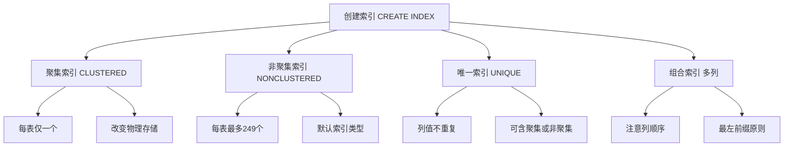

# 第7章-7.3-创建索引

## 基本信息
- **课程**：数据库原理与应用
- **章节**：第7章 7.3-7.4节 创建索引、查看和删除索引
- **日期**：2026-06-30
- **标签**：#索引 #聚集索引 #非聚集索引 #唯一索引 #组合索引 #CREATE INDEX #DROP INDEX

---

## 重点内容

### ⭐⭐⭐ 创建索引语法
- **聚集索引**：`CREATE CLUSTERED INDEX` — 每表只能有一个，改变数据物理存储顺序
- **非聚集索引**：`CREATE [NONCLUSTERED] INDEX` — 默认类型，每表最多249个
- **唯一索引**：`CREATE UNIQUE INDEX` — 索引列不允许重复值
- **组合索引**：多列联合建索引，需注意列顺序

### ⭐⭐ 索引管理
- **查看索引**：`sp_helpindex` 存储过程、查询 `sysindexes` 系统视图
- **删除索引**：`DROP INDEX` 语句（普通索引）、`ALTER TABLE DROP CONSTRAINT`（约束自动生成的索引）

### ⭐ 关键区别
- 聚集索引改变物理存储顺序，非聚集索引不改变
- 聚集索引每表只能有一个，非聚集索引可有多个
- UNIQUE约束和PRIMARY KEY约束会自动生成索引

---

## 详细笔记

### 一、聚集索引（7.3.1）

> 📚 **课本出处**：第7章 7.3.1节"聚集索引"

#### 1. 聚集索引的特点

聚集索引的最大优点是：当对含有聚集索引的字段进行查询时，会得到很高的查询效率。因为索引值相近的字段值在物理磁盘上也相互靠近，可以大大减少磁盘转动所需的读盘时间。

> ⭐ **核心限制**：对一个表或视图只能创建一个聚集索引。

> ⚠️ **常见误区**：创建聚集索引后，每次插入数据，系统都会对数据重新排序（需要时间）。因此，对经常插入或更新索引字段值的数据表，尽量不要创建聚集索引。

#### 2. 语法格式

```sql
CREATE CLUSTERED INDEX index_name
ON table_name(col_list [DESC | ASC]);
```

- `index_name`：索引名
- `table_name`：表名
- `col_list`：字段列表
- `DESC`：降序索引；`ASC`：升序索引（默认）

#### 3. 【例7.1】创建聚集索引

首先创建一个空表 student2（没有主键）：

```sql
CREATE TABLE student2(
    s_no char(8),
    s_name char(8) NOT NULL,
    s_sex char(2) CHECK(s_sex = '男' OR s_sex = '女'),
    s_birthday smalldatetime CHECK(s_birthday >= '1970-1-1' AND s_birthday <= '2000-1-1'),
    s_speciality varchar(50) DEFAULT '计算机软件与理论',
    s_avgrade numeric(4,1) CHECK(s_avgrade >= 0 AND s_avgrade <= 100),
    s_dept varchar(50) DEFAULT '计算机科学系'
);
```

插入数据（数据插入顺序与最终排列顺序不同）：

```sql
INSERT student2 VALUES('20170205','贾簿','男','1994-09-03','计算机软件与理论',43.0,'计算机系');
INSERT student2 VALUES('20170206','李思思','女','1996-05-05','计算机应用技术',67.3,'计算机系');
INSERT student2 VALUES('20170207','蒙恬','男','1995-12-02','大数据技术',78.8,'大数据技术系');
INSERT student2 VALUES('20170208','张宇','女','1997-03-08','大数据技术',59.3,'大数据技术系');
INSERT student2 VALUES('20170201','刘洋','女','1997-02-03','计算机应用技术',98.5,'计算机系');
INSERT student2 VALUES('20170202','王晓珂','女','1997-09-20','计算机软件与理论',88.1,'计算机系');
INSERT student2 VALUES('20170203','王伟志','男','1996-12-12','智能科学与技术',89.8,'智能技术系');
INSERT student2 VALUES('20170204','岳志强','男','1998-06-01','智能科学与技术',75.8,'智能技术系');
```

查看创建索引前的数据（按插入顺序排列）：

```sql
SELECT * FROM student2;
```

对 s_no 字段创建降序聚集索引：

```sql
CREATE CLUSTERED INDEX myIndex1 ON student2(s_no DESC);
```

> 💡 **理解技巧**：创建聚集索引后，表中记录会按索引字段重新排列，物理存储顺序也随之改变。图7.4为创建前的数据，图7.5为创建后的数据，可以明显看到记录按 s_no 降序排列。

---

### 二、非聚集索引（7.3.2）

> 📚 **课本出处**：第7章 7.3.2节"非聚集索引"

#### 1. 非聚集索引的特点

与聚集索引不同，对一个数据表可以创建多个非聚集索引。理论上可以对任何一列或若干列的组合创建非聚集索引，总数不超过249个。

> ⚠️ **注意**：对于索引视图，只能为已定义唯一聚集索引的视图创建非聚集索引。

#### 2. 语法格式

```sql
CREATE [NONCLUSTERED] INDEX index_name
ON table_name(col_list [DESC | ASC]);
```

> 💡 **理解技巧**：`NONCLUSTERED` 关键字可以省略，因为默认情况下 `CREATE INDEX` 语句创建的就是非聚集索引。

#### 3. 【例7.2】创建非聚集索引

对表 student 的 s_name 列创建非聚集索引：

```sql
CREATE NONCLUSTERED INDEX myIndex2 ON student(s_name);
```

#### 4. 【例7.3】强制引用指定的非聚集索引

默认情况下，索引是否被运用由查询优化器决定。可以通过 `WITH` 子句强制引用指定索引：

```sql
SELECT * FROM student WITH (INDEX (myIndex2))
WHERE s_name='刘洋';
```

> 📌 **考试重点**：`WITH (INDEX (index_name))` 子句可以强制查询优化器使用指定的索引。

---

### 三、唯一索引（7.3.3）

> 📚 **课本出处**：第7章 7.3.3节"唯一索引"

#### 1. 语法格式

```sql
CREATE UNIQUE INDEX index_name
ON table_name(col_list [DESC | ASC]);
```

#### 2. 【例7.4】创建唯一非聚集索引

对表 student 的 s_avgrade 列创建唯一非聚集索引（降序）：

```sql
CREATE UNIQUE INDEX myIndex3 ON student(s_avgrade DESC);
```

> ⚠️ **注意要点**：
> - 最理想的情况是对**空表**创建唯一索引
> - 如果表非空且待创建索引的列存在重复列值，则**不能创建**此唯一索引
> - 创建唯一索引后，插入新数据时不允许在此列上出现重复值，否则操作失败

---

### 四、组合索引（7.3.4）

> 📚 **课本出处**：第7章 7.3.4节"组合索引"

#### 1. 组合索引的概念

当基于单个字段的索引难以满足实际需要时，可以基于多个字段的组合来创建索引，这就是组合索引。

#### 2. 【例7.5】创建唯一组合索引

表 SC 包含 s_no、c_name 和 c_grade 三个字段，其中任意一个字段都不能唯一标识记录，但 s_no 和 c_name 的组合可以唯一标识每条记录：

```sql
CREATE UNIQUE INDEX myIndex5 ON SC(s_no DESC, c_name ASC);
```

> 💡 **理解技巧**：该唯一组合索引是非聚集索引（NONCLUSTERED 是默认选项）。如需创建聚集索引的组合索引，在 `CREATE INDEX` 语句中使用 `CLUSTERED` 选项即可。

> ⚠️ **常见误区 — 最左前缀原则**：组合索引 (A, B, C) 可以被查询条件中包含 A、(A,B)、(A,B,C) 的查询使用，但不能被仅包含 B 或 C 的查询使用。列的顺序非常重要，应将查询中最常用的列放在前面。

---

### 五、查看索引（7.4.1）

> 📚 **课本出处**：第7章 7.4.1节"查看索引"

#### 1. 使用 sp_helpindex 存储过程

```sql
sp_helpindex [ @objname = ] 'name';
```

结果集包含3个列：

| 列名 | 说明 |
|:----:|:-----|
| index_name | 索引名 |
| index_description | 索引说明（是否聚集、唯一等，含所在文件组） |
| index_keys | 生成索引的列 |

#### 2. 【例7.6】查看数据表上的所有索引

```sql
sp_helpindex 'student';
```

#### 📷 图7.6 表student上的所有索引


> 📚 **课本出处**：图7.6 展示了执行 sp_helpindex 'student' 后的查询结果，被降序索引的列在结果集中用减号(-)标识

> 💡 **理解技巧**：如果一个列名后缀减号（-），表示该列被降序索引；只有列名则表示升序索引（默认情况）。

#### 3. 【例7.7】通过系统视图查看所有索引

当前数据库中的所有索引都保存在目录视图 sys.indexes 中：

```sql
USE MyDatabase;
GO
SELECT * FROM sysindexes;
```

---

### 六、删除索引（7.4.2）

> 📚 **课本出处**：第7章 7.4.2节"删除索引"

#### 1. DROP INDEX 语法

方式一：

```sql
DROP INDEX index_name ON table_name;
```

方式二（表名前缀）：

```sql
DROP INDEX table_name.index_name;
```

#### 2. 【例7.8】删除索引

```sql
-- 方式一
DROP INDEX myIndex2 ON student;

-- 方式二
DROP INDEX student.myIndex2;
```

#### 3. 删除约束自动生成的索引

> ⚠️ **重要区别**：创建表时设置 PRIMARY KEY 或 UNIQUE 约束会自动生成同名索引，这种索引**不能用 DROP INDEX 删除**，必须使用 `ALTER TABLE DROP CONSTRAINT`。

```sql
ALTER TABLE student
DROP CONSTRAINT PK__student__2F36BC5B91406173;
```

---

## 总结

### CREATE INDEX 语法对比

| 索引类型 | 语法 | 每表数量限制 | 改变物理顺序 |
|:--------:|:-----|:----------:|:----------:|
| **聚集索引** | `CREATE CLUSTERED INDEX idx ON table(col)` | 1个 | 是 |
| **非聚集索引** | `CREATE [NONCLUSTERED] INDEX idx ON table(col)` | 最多249个 | 否 |
| **唯一索引** | `CREATE UNIQUE INDEX idx ON table(col)` | 视类型而定 | 视选项而定 |
| **组合索引** | `CREATE INDEX idx ON table(col1, col2, ...)` | 视类型而定 | 视选项而定 |

### 索引管理操作速查

| 操作 | 语法 | 适用场景 |
|:----:|:-----|:---------|
| 查看表索引 | `sp_helpindex 'table_name'` | 查看指定表的所有索引 |
| 查看所有索引 | `SELECT * FROM sysindexes` | 查看数据库级所有索引 |
| 强制引用索引 | `SELECT * FROM table WITH (INDEX(idx))` | 指定查询使用的索引 |
| 删除普通索引 | `DROP INDEX idx ON table` | 删除用户创建的索引 |
| 删除约束索引 | `ALTER TABLE table DROP CONSTRAINT idx` | 删除 PRIMARY KEY/UNIQUE 约束生成的索引 |

### 知识点脑图



### 关键要点

1. **聚集索引决定物理存储顺序**：每表只能有一个，查询效率高但插入/更新开销大
2. **非聚集索引是默认类型**：不改变物理存储，可创建多个，使用 INCLUDE 子句可覆盖更多列
3. **唯一索引保证列值唯一性**：空表创建最佳，非空表需确保无重复值
4. **组合索引注意列顺序**：遵循最左前缀原则，将高选择性的常用查询列放前面
5. **索引管理**：用 sp_helpindex 查看，DROP INDEX 删除普通索引，ALTER TABLE DROP CONSTRAINT 删除约束索引

---

## 疑问与思考

### ❓ 待解决问题
1. 聚集索引应该选择哪些列？选择主键列还是其他列更合适？实际场景中如何权衡查询效率和写入性能？
2. INCLUDE 子句在非聚集索引中的具体作用是什么？它如何实现"覆盖索引"以避免回表查询？
3. 组合索引的"最左前缀原则"在实际查询优化中如何应用？如果查询条件不匹配索引最左列，是否完全无法使用该索引？
4. 当表已有聚集索引时，创建非聚集索引的叶子节点存储的是什么？（是完整行数据还是聚集索引键？）
5. 什么时候应该重建索引？索引碎片化对查询性能有多大影响？

### 💡 个人理解/技巧
- 聚集索引类比"字典的正文排列"——按某种顺序重排所有内容，查一个范围非常快；非聚集索引类比"字典的目录索引"——另建一套指针，指向正文位置
- 选择聚集索引列的原则：选择经常用于范围查询（BETWEEN、>、<）的列，而非频繁更新的列
- INCLUDE 子句的作用：将非索引列"附加"到非聚集索引的叶子节点，使查询可以直接从索引获取数据，无需回表（覆盖索引）
- 组合索引最左前缀：索引 (A, B, C) 相当于同时创建了 (A)、(A,B)、(A,B,C) 三个索引，但不能替代 (B) 或 (C) 的索引
- 删除约束索引容易忘记：DROP INDEX 无法删除 PRIMARY KEY 和 UNIQUE 约束自动生成的索引，必须用 ALTER TABLE DROP CONSTRAINT

---

## 相关链接

### 本节相关图片
- [图7.6 表student上的所有索引](../../../images/d53996f06845efc2b1304b9c5219245f23b33f283fd4c1c9a1fd18ff5d0ff1e1.jpg)

### 关联章节
- [第7章-索引与视图](../第7章-索引与视图.md)
- 第7章-7.1-索引概述（待创建）
- 第7章-7.2-索引的类型（待创建）
- 第7章-7.5-视图概述（待创建）
- 第7章-7.6-视图的创建与删除（待创建）

---

## 检查清单

- [x] 已掌握聚集索引的创建语法和特点
- [x] 已掌握非聚集索引的创建语法和强制引用方法
- [x] 已掌握唯一索引的创建和限制条件
- [x] 已理解组合索引的列顺序和最左前缀原则
- [x] 已掌握查看索引的方法（sp_helpindex、系统视图）
- [x] 已掌握删除索引的方法（DROP INDEX、ALTER TABLE）
- [x] 已插入课本原图（图7.6）
- [x] 已添加课本出处标注

---

*笔记创建时间：2026-06-30*
