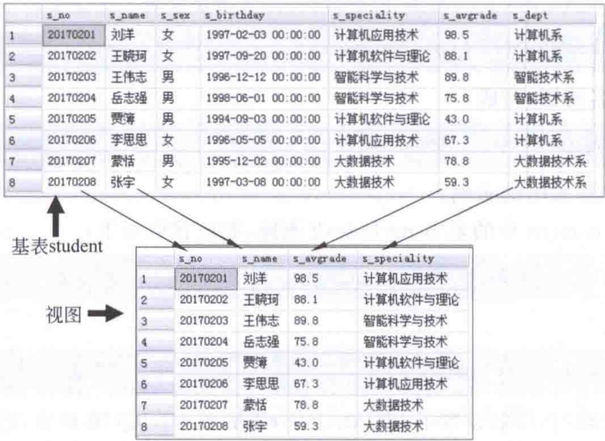
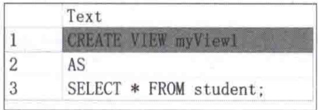
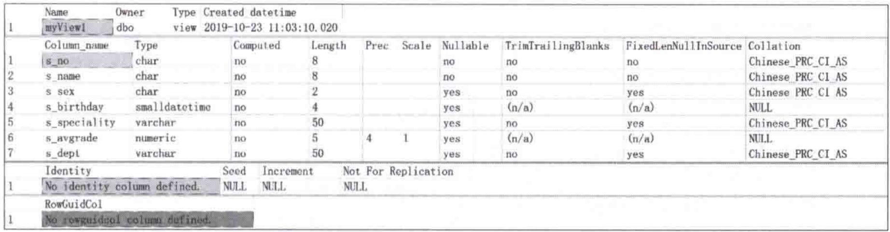
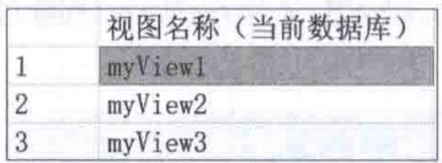
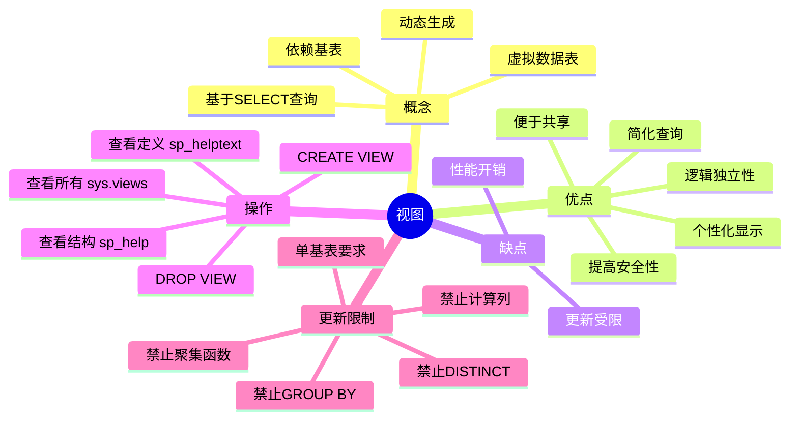

# 第7章-7.5-7.7-视图

## 基本信息
- **课程**：数据库原理与应用
- **章节**：第7章 7.5-7.7节 视图
- **日期**：2026-06-30
- **标签**：#视图 #数据库对象 #数据安全 #逻辑独立性 #SQL

---

## 重点内容

### ⭐⭐⭐ 核心概念
- **视图（View）**：虚拟数据表（虚表），本质是存储在数据库中的SELECT查询定义
- **基表（Base Table）**：视图所依赖的数据源表，视图数据实际存储在基表中
- **视图与基表的关系**：视图是基表的"数据窗口"，基表数据变化实时反映到视图

### ⭐⭐ 视图的优点
- 提供个性化的数据显示功能
- 简化复杂查询操作
- 提高数据安全性（用户只能看到视图定义的数据）
- 便于数据共享，支持逻辑数据独立性

### ⭐⭐ 视图的更新限制
- 基表必须是单表（更新操作不能同时涉及两个或以上基表）
- SELECT语句不能包含 GROUP BY、HAVING、聚集函数、计算列、DISTINCT
- 违反限制的视图为只读视图

### ⭐ 关键语法
- `CREATE VIEW ... AS SELECT ...`
- `DROP VIEW ...`
- 系统存储过程：`sp_helptext`、`sp_help`
- 系统目录视图：`sys.views`、`sys.all_views`

---

## 详细笔记

### 一、视图的概念（7.5.1）

> 📚 **课本出处**：第7章 7.5.1节"视图的概念"

**定义**：视图在视觉上是一张由行和列构成的"数据表"，但它不是真正的数据表，而是一张**虚拟的数据表（虚表）**。

**本质**：视图在本质上是一个**命令集**（即一条SELECT查询语句），当"打开"它时将由这些命令从一张或多张数据表中抽取数据，这些数据便在视觉上构成了一张"数据表"。这些被从中抽取数据的数据表通常称为视图的**基本表**或**基础表**（简称基表）。

**关键特征**：
- 视图是基表的数据窗口，**动态生成**
- 视图离不开基表，离开基表的视图没有意义
- 基表中数据的变化将**实时反映**到视图中
- 针对视图的操作实际上是对基表进行操作

#### 📷 图7.7 视图形成的示意图



> 📚 **课本出处**：图7.7 展示了由一张基表通过筛选条件形成视图的过程，视图是基表数据的一个子集窗口

---

### 二、视图的优缺点（7.5.2）

> 📚 **课本出处**：第7章 7.5.2节"视图的优缺点"

#### ⭐⭐ 视图的优点

| 序号 | 优点 | 说明 |
|:----:|:-----|:-----|
| 1 | **提供个性化的数据显示** | 用户只看到感兴趣的特定数据，通过视图窗口观察 |
| 2 | **简化数据操作** | 将复杂查询（连接、投影、联合等）定义为视图，避免重复编写复杂SQL |
| 3 | **自组织数据** | 允许用户以不同方式查看相同数据 |
| 4 | **组合分区数据** | 多表查询结果定义为分区视图，用户操作一张"表"而非多张表 |
| 5 | **便于数据共享** | 一个基表可定义多个用户视图，不同用户通过各自视图操作 |
| 6 | **提高安全性** | 用户只能看到视图定义的数据，无法访问基表的其他数据 |

> 💡 **理解技巧**：视图优点可以归纳为"三个简化"——简化查询、简化权限管理、简化数据组织，以及"两个增强"——增强安全性、增强独立性。

#### ⭐ 视图的缺点

| 序号 | 缺点 | 说明 |
|:----:|:-----|:-----|
| 1 | **相对低效** | 执行查询时需要同时执行视图定义的命令和用户输入的SQL，降低了查询效率 |
| 2 | **有限的更新操作** | 视图主要用于查询，更新操作受到诸多限制（见下文详细说明） |

---

### 三、创建视图（7.6.1）

> 📚 **课本出处**：第7章 7.6.1节"创建视图"

#### 1. 基本语法

```sql
CREATE VIEW view_name [(column[,...n])]
AS
select_statement;
```

| 参数 | 说明 |
|:----:|:-----|
| `view_name` | 要创建的视图名称 |
| `column[,...n]` | 视图中字段的名称，可省略（省略时与SELECT查询中的字段名相同） |
| `select_statement` | SELECT查询语句（定义视图内容） |

#### 2. 课本示例

**【例7.10】创建与基表完全相同的视图**

```sql
CREATE VIEW myView1
AS
SELECT * FROM student;
```

```sql
-- 查询该视图
SELECT * FROM myView1
```

> 💡 这种视图虽无实际意义，但是认识视图的起点。视图 myView1 中的数据与表 student 中的数据完全一样。

**【例7.11】创建包含部分数据的视图，并设定中文字段名**

```sql
CREATE VIEW myView2(学号, 姓名, 专业, 平均成绩, 系别)
AS
SELECT s_no, s_name, s_speciality, s_avgrade, s_dept
FROM student
WHERE s_avgrade >= 60
```

```sql
-- 查询该视图
SELECT * FROM myView2
```

> ⚠️ **常见误区**：一旦在CREATE VIEW中指定了中文字段名，原始字段名（s_no等）在视图中就不再可用。以下查询是**错误的**：
> ```sql
> SELECT s_no, s_name, s_speciality FROM myView2  -- 错误！
> ```
> 必须使用视图中定义的字段名：
> ```sql
> SELECT 学号, 姓名, 专业 FROM myView2  -- 正确
> ```

**【例7.12】创建带有两个基表的视图（连接查询）**

```sql
CREATE VIEW myView3
AS
SELECT student.s_no 学号, s_name 姓名, s_sex 性别,
       s_speciality 专业, s_dept 系别,
       c_name 课程名称, c_grade 课程成绩
FROM student, SC
WHERE student.s_no = SC.s_no
```

> ⚠️ 注意：涉及多基表的视图，其更新操作会受到限制（见7.6.2节）。

**【例7.13】用视图更新数据表**

```sql
-- 创建包含聚合函数的视图（用于计算平均成绩）
CREATE VIEW tmp_view
AS
SELECT s_no, AVG(c_grade) as s_avgrade
FROM SC
GROUP BY s_no
```

```sql
-- 用视图更新基表
UPDATE student
SET s_avgrade = b.s_avgrade
FROM student as a
JOIN tmp_view as b
ON a.s_no = b.s_no
```

> 💡 **理解技巧**：视图可以替代临时表来实现数据初始化等功能，减少存储空间消耗。

**【例7.14】创建带参数的"视图"（使用函数模拟）**

视图本身**不能带参数**，但可以用表值函数实现类似功能：

```sql
-- 创建带参数的表值函数
CREATE FUNCTION myFunView(@a float, @b float)
RETURNS TABLE AS
RETURN
(SELECT * FROM student WHERE s_avgrade >= @a and s_avgrade <= @b);
```

```sql
-- 像视图一样查询（但需要带参数）
SELECT * FROM myFunView(60, 90)
```

```sql
-- 也可以像视图一样更新
UPDATE myFunView(60, 90) SET s_dept = '智能技术系'
```

> 📌 **考试重点**：带参数的"视图"实际上是一种**函数**，不是视图，但它具有视图的大部分特性。

---

### 四、更新视图（7.6.2）

> 📚 **课本出处**：第7章 7.6.2节"更新视图"

**更新视图**是指通过视图更新其基表中的数据，只需将视图名当作数据表名即可。

**【例7.15】通过视图更新数据**

```sql
-- 将视图myView2中平均成绩全部设置为80
UPDATE myView2
SET 平均成绩 = 80;
```

> 💡 实际上是修改基表 student 中字段 s_avgrade 的值。

#### ⭐⭐⭐ 视图更新的限制条件

| 限制条件 | 说明 | 示例 |
|:--------:|:-----|:-----|
| **不能同时影响多个基表** | 一次更新操作不能同时涉及两个或以上的基表 | myView3的UPDATE同时修改student和SC => 错误 |
| **不能包含GROUP BY** | SELECT语句中有GROUP BY的视图不可更新 | - |
| **不能包含HAVING** | SELECT语句中有HAVING的视图不可更新 | - |
| **不能包含聚集函数** | 含AVG、SUM、COUNT等的视图不可更新 | - |
| **不能包含计算列** | 视图中包含表达式计算的列不可更新 | - |
| **不能包含DISTINCT** | SELECT语句中有DISTINCT的视图不可更新 | - |

**课本示例 -- 多基表限制**：

```sql
-- 错误：同时影响到student表和SC表
UPDATE myView3
SET 性别 = '女', 课程成绩 = 99  -- 错误！

-- 正确：只影响到一个基表
UPDATE myView3 SET 性别 = '女'      -- 正确（只影响student表）
UPDATE myView3 SET 课程成绩 = 99    -- 正确（只影响SC表）
```

> ⚠️ **常见误区**：INSERT和DELETE操作同样不能违反表的完整性约束，且一个操作不能影响到两个或两个以上的基表。

---

### 五、删除视图（7.6.3）

> 📚 **课本出处**：第7章 7.6.3节"删除视图"

#### 语法

```sql
DROP VIEW [ schema_name . ] view_name [ ..., n ] [ ; ]
```

| 参数 | 说明 |
|:----:|:-----|
| `view_name` | 要删除的视图的名称 |
| `schema_name` | 视图所属架构的名称（可省略） |
| 可一次删除多个视图 | 用逗号分隔 |

**【例7.16】删除视图**

```sql
DROP VIEW myView1, myView2;
```

> 📌 **注意**：使用 DROP VIEW 删除视图时，**并不会删除基表中的数据**，只删除视图的定义代码及其与其他对象的关系。所以删除视图时不必担心会丢失数据。

---

### 六、查看视图（7.7）

> 📚 **课本出处**：第7章 7.7节"查看视图"

#### 1. 查看视图的定义代码（7.7.1）

使用系统存储过程 `sp_helptext` 查看视图的定义代码（前提是视图定义**未被加密**）：

**【例7.17】查看视图定义代码**

```sql
sp_helptext myView1;
```

#### 📷 图7.10 视图myView1的定义代码



> 📚 **课本出处**：图7.10 展示了sp_helptext输出的视图myView1的CREATE VIEW定义代码

#### 2. 查看视图的结构信息（7.7.2）

使用系统存储过程 `sp_help` 查看视图的详细结构信息：

**【例7.18】查看视图结构信息**

```sql
sp_help myView1;
```

#### 📷 图7.11 视图myView2的结构信息



> 📚 **课本出处**：图7.11 展示了sp_help输出的视图详细特征信息，包括结构信息、所属架构、创建时间等

#### 3. 查看数据库中的视图（7.7.3）

通过系统目录视图 `sys.views` 查询当前数据库中所有用户定义的视图：

**【例7.19】查看当前数据库中所有视图**

```sql
-- 查看当前数据库中的所有视图
USE MyDatabase;
GO
SELECT name '视图名称(当前数据库)' FROM sys.views;
GO
```

#### 📷 图7.12 当前数据库中的所有视图



> 📚 **课本出处**：图7.12 展示了通过sys.views查询到的当前数据库中所有用户定义视图的名称列表

**查看所有数据库中的视图**：

```sql
SELECT name '视图名称(所有数据库)' FROM sys.all_views;
```

> 💡 **理解技巧**：`sys.views` 只返回当前数据库的视图，`sys.all_views` 返回所有数据库的视图。

---

## 总结

### 视图与表的对比

| 对比项 | 数据表（Table） | 视图（View） |
|:------:|:--------------:|:------------:|
| **数据存储** | 真正存储数据 | 不存储数据，存储SELECT查询定义 |
| **数据来源** | 直接存储在数据库中 | 动态从基表中提取 |
| **占用空间** | 占用存储空间 | 几乎不占用存储空间（只存定义代码） |
| **数据更新** | 可自由更新 | 受限更新（有条件限制） |
| **独立性** | 物理独立 | 逻辑独立（基表结构变化可通过修改视图保持兼容） |
| **安全性** | 需通过权限控制 | 天然的数据窗口隔离 |
| **使用方式** | 直接操作 | 可像表一样使用（SELECT/有限UPDATE） |

### 视图更新规则速查表

| 视图类型 | INSERT | UPDATE | DELETE |
|:--------:|:------:|:------:|:------:|
| 单基表、无聚集函数、无GROUP BY等 | 可以 | 可以 | 可以 |
| 含聚集函数/GROUP BY/HAVING/DISTINCT | 不可以 | 不可以 | 不可以 |
| 涉及多个基表的连接视图 | 不可以 | 不可以 | 不可以 |
| 含计算列 | 不可以 | 不可以 | 不可以 |

### 知识点脑图



### 关键要点

1. **视图是虚表**：不存储数据，只存储查询定义；数据来自基表，动态生成
2. **基表是根基**：视图离不开基表，基表变化实时反映到视图
3. **更新有限制**：单基表 + 无聚集函数/GROUP BY/HAVING/DISTINCT/计算列
4. **删除安全**：DROP VIEW 只删除定义，不删除基表数据
5. **带参数的"视图"其实是函数**：视图本身不支持参数，用表值函数模拟

---

## 疑问与思考

❓ **疑问**：视图和表有什么区别？

💡 **解答**：
- **表**：真实存储数据，占用磁盘空间
- **视图**：虚表，不存储数据，只是保存了一条 SELECT 语句
- 查询视图时，数据库会**动态执行**底层的 SELECT 语句，从基表中获取数据
- 修改基表数据后，视图查询结果会**自动变化**

❓ **疑问**：WITH CHECK OPTION 是什么作用？

💡 **解答**：
- 加了这个子句后，通过视图执行的 INSERT/UPDATE 必须**满足视图的 WHERE 条件**
- 例如视图只显示成绩>60的学生，加了 WITH CHECK OPTION 后，就不能通过视图插入成绩=50的记录
- 防止数据"穿过"视图后变得不可见

❓ **疑问**：什么视图不可更新？

💡 **解答**：
- 含**聚合函数**（COUNT/SUM/AVG等）
- 含 **GROUP BY / HAVING / DISTINCT**
- 含**计算列**（如 SELECT age+1）
- 涉及**多表连接**的视图
- 口诀："**单表、无聚、无分组、无去重、无计算**"的视图才可更新

### 💡 个人理解/技巧
- 视图可以类比为"照片"：基表是"真人"，视图是从某个角度拍摄的照片，照片不存储人本身，只呈现人的一部分
- 判断视图能否更新的口诀："单表、无聚、无分组、无去重、无计算" -- 满足这5个条件的视图才可更新
- 创建视图的技巧：先写好SELECT语句验证结果正确，再在外面包一层CREATE VIEW即可
- `sys.views` 查当前库，`sys.all_views` 查所有库，`sp_helptext` 查定义，`sp_help` 查结构 -- 四个工具各有用途
- 带参数的"视图"用函数实现是T-SQL的特色技巧，在需要动态筛选条件时很有用

---

## 相关链接

### 本节相关图片
- [图7.7 视图形成的示意图](../../../images/7991a9a2322b5cc9ec36a45bc56a379222b8b1dc88818594ead898e3e830ec71.jpg)
- [图7.10 视图myView1的定义代码](../../../images/d2f3c4a7ec40e19ecbd1371fcd817023e93fce0f0c0b9cf9666113020b7a455b.jpg)
- [图7.11 视图myView2的结构信息](../../../images/9a13d8ef02ae540927a34a38aade1e1df4493dfa44b66c01dac201aedfffcf5a.jpg)
- [图7.12 当前数据库中的所有视图](../../../images/00ce3ecc705c5f4fc25f8781ab2105785602f004f0bbf11f1d3e56c5122a652e.jpg)

### 关联章节
- [第1章-1.1-数据管理技术](../第1章-数据库概述/第1章-1.1-数据管理技术.md)
- [第2章-2.1-关系模型](../第2章-关系数据库理论基础/第2章-2.1-关系模型.md)
- [第4章-4.4-SQL数据查询功能](../第4章-数据库查询语言SQL/第4章-4.4-SQL数据查询功能.md)
- [第4章-4.5-SQL数据操纵功能](../第4章-数据库查询语言SQL/第4章-4.5-SQL数据操纵功能.md)
- 第7章-7.1-索引概述（待创建）
- 第7章-7.2-索引的类型（待创建）
- 第7章-7.3-创建索引（待创建）
- 第7章-7.4-查看和删除索引（待创建）

---

## 检查清单

- [x] 已理解视图的概念（虚表、基表、数据窗口）
- [x] 已掌握视图的优缺点（6个优点 + 2个缺点）
- [x] 已掌握CREATE VIEW语法及课本示例（例7.10-例7.14）
- [x] 已掌握视图更新的限制条件（单基表、无聚集函数等）
- [x] 已掌握DROP VIEW语法（删除视图不影响基表数据）
- [x] 已掌握查看视图的三种方法（sp_helptext、sp_help、sys.views）
- [x] 已插入课本原图（图7.7、图7.10、图7.11、图7.12）
- [x] 已添加课本出处标注
- [x] 已记录重点标记和常见误区
- [x] 已添加疑问与思考

---

*笔记创建时间：2026-06-30*
