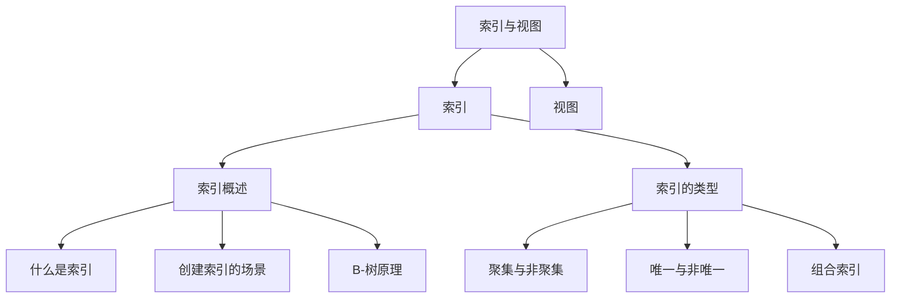

# 第7章-索引与视图

## 基本信息
- **课程**：数据库原理与应用
- **章节**：第7章 索引与视图
- **日期**：2026-06-30
- **标签**：#索引 #视图 #B树 #数据库对象 #查询优化

---

## 章节概览

本章主要介绍索引和视图的概念、原理以及创建和使用方法。

- **索引**：依赖于数据表或视图的数据库对象，用于提高查询效率
- **视图**：为数据的查看提供多种不同的视角

### 学习目标

1. 了解索引和视图的基本原理
2. 掌握索引和视图的创建、修改和删除方法
3. 掌握索引和视图的使用方法

---

## 章节目录

| 小节 | 主题 | 核心内容 |
|:----:|:-----|:---------|
| 7.1 | 索引概述 | 索引定义、适用场景、B-树原理 |
| 7.2 | 索引的类型 | 聚集/非聚集索引、唯一索引、组合索引 |

---

## 知识结构图

### 关键要点

1. **索引是独立对象**：索引独立于数据表，有自己的文件名，占用磁盘空间
2. **索引提升查询效率**：通过B-树结构，少数几个I/O操作即可定位数据
3. **索引并非越多越好**：过多索引会增加维护开销，降低UPDATE/DELETE/INSERT效率
4. **两种分类维度**：按数据存储方式（聚集/非聚集）和按值唯一性（唯一/非唯一）

---

## 相关链接

### 关联章节
- [第1章-数据库概述](../第1章-数据库概述/第1章-数据库概述.md)
- [第2章-关系数据库理论基础](../第2章-关系数据库理论基础/第2章-2.1-关系模型.md)
- 第7章-7.1-索引概述（本章小节）
- 第7章-7.2-索引的类型（本章小节）

---

*笔记创建时间：2026-06-30*
