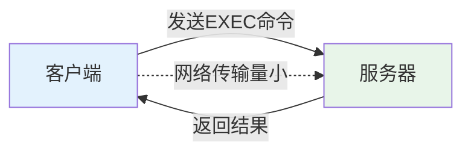

# 第8章-8.1-存储过程

## 基本信息
- **课程**：数据库原理与应用
- **章节**：第8章 8.1节 存储过程
- **日期**：2026-06-30
- **标签**：#存储过程 #CREATE_PROCEDURE #EXEC #OUTPUT参数 #模块化编程

---

## 重点内容

### ⭐⭐⭐ 核心知识点
- **存储过程定义**：封装可重用代码的、存储在服务器上的程序模块或例程，编译成可执行代码后保存在服务器上，可多次调用
- **存储过程优点**：减少网络通信流量、预编译提高效率、模块化设计、安全性管理
- **存储过程类型**：系统存储过程（sp_）、用户存储过程、扩展存储过程（xp_）
- **创建与调用**：CREATE PROCEDURE 语句定义，EXEC/EXECUTE 语句调用

### ⭐⭐ 重要知识点
- **参数机制**：输入参数（@参数名）、输出参数（@参数名 OUTPUT）、默认值
- **WITH选项**：ENCRYPTION（加密）、RECOMPILE（重新编译）
- **修改与删除**：ALTER PROCEDURE、DROP PROCEDURE

### ⭐ 基础知识点
- **临时存储过程**：#开头为局部临时，##开头为全局临时
- **游标参数**：游标类型参数必须指定 OUTPUT 和 VARYING
- **SSMS操作**：在对象资源管理器中右击"存储过程"节点进行创建、修改、删除

---

## 详细笔记

### 一、存储过程的概念

存储过程（Stored Procedure）是指封装了可重用代码的、存储在服务器上的程序模块或例程。它是数据库对象之一，类似于其他高级编程语言中的过程或子程序，编译成可执行代码后保存在服务器上，可多次调用。

> 📚 **课本出处**：第8章 8.1.1节"存储过程的概念"

#### 存储过程的特点

| 特点 | 说明 |
|:----:|:-----|
| 接收参数 | 可以接收多个输入参数，能够以多输出参数的格式返回多个值 |
| 服务器端运行 | 使用 EXECUTE（简写为 EXEC）语句来执行 |
| 可嵌套调用 | 可以调用其他存储过程，也可以被其他语句或存储过程调用 |
| 不可用于表达式 | 不能直接在表达式中使用 |
| 返回状态值 | 具有返回状态值，表明调用成功还是失败；但不返回取代其名称的值（与函数的区别） |
| 服务器注册 | 存储过程已在服务器注册 |

> ⚠️ **常见误区**：存储过程具有返回状态值，但它不返回取代其名称的值，这是它与函数（Function）的关键区别。函数可以在表达式中使用并返回值，而存储过程只能通过 OUTPUT 参数或结果集返回数据。

#### 存储过程的优点

| 优点 | 说明 |
|:----:|:-----|
| 减少网络通信流量 | 存储过程在服务器端执行，用户只需发出执行命令，不必发送全部代码 |
| 提高执行效率 | 首次执行后执行规划驻留高速缓冲存储器，后续直接调用已编译好的二进制代码 |
| 较高的安全性 | 用户可被授予权限来执行存储过程，而不必对其中引用的对象拥有直接访问权限 |
| 模块化设计 | 存储过程一旦创建，可在所有程序中多次调用，提高代码可重用性 |



> 💡 **理解技巧**：可以这样理解——用户只需要说"请执行XX操作"，而不必把整个操作步骤都传过去，这样网络上传的数据就少了。类似餐厅点菜：你只需说"来一份宫保鸡丁"，而不必把菜谱读给厨师听。

---

### 二、存储过程的类型

> 📚 **课本出处**：第8章 8.1.2节"存储过程的类型"

在 SQL Server 2008 及以后的版本中，存储过程分为两种技术类型：

- **SQL存储过程**：由 SQL 语言编写而成，是 SQL 语句的集合（本书重点）
- **CLR存储过程**：引用 Microsoft .NET Framework 公共语言运行时 CLR 方法的存储过程

根据来源和应用目的的不同，存储过程进一步分为三类：

#### 1. 系统存储过程

系统存储过程是 SQL Server 本身定义的、当作命令来执行的一类存储过程。主要用于管理 SQL Server 数据库和显示有关数据库及用户的信息。

- 通常前缀为 **"sp_"**
- 从逻辑结构看，出现在每个系统定义数据库和用户定义数据库的 sys 架构中
- 例如：`sp_addrolemember` 用于为数据库角色添加成员

> 📌 **考试重点**：系统存储过程以 "sp_" 为前缀，这是识别系统存储过程的标志。

#### 2. 用户存储过程

用户存储过程是指由用户通过利用 SQL 语言编写的、具有特定功能的一类存储过程。

- 建议前缀为 **"up_"**（u 为 user 的首字母）
- 不要使用 "sp_" 或 "xp_" 作为前缀，避免与系统存储过程和扩展存储过程冲突
- 本章主要介绍用户存储过程的定义、修改和删除等基本管理操作

#### 3. 扩展存储过程

扩展存储过程是指 SQL Server 的实例可以动态加载和运行的动态链接库（DLL）。

- 可使用其他编程语言（如 C 语言）创建外部程序
- 直接在 SQL Server 的实例地址空间中运行
- 后续 SQL Server 版本将不支持扩展存储过程，新项目中应尽量少用或不用
- 前缀为 **"xp_"**

---

### 三、存储过程的创建和调用

> 📚 **课本出处**：第8章 8.1.3节"存储过程的创建和调用"

#### 1. CREATE PROCEDURE 语法

```sql
CREATE {PROC | PROCEDURE} [schema_name.]procedure_name [;number]
    [@parameter [type_schema_name.] data_type]
    [VARYING] [=default] [OUT[PUT]] [,...n]
    [WITH <procedure_option> [,...n]]
    [FOR REPLICATION]
    AS {<sql_statement>[;][...n] | <method_specifier>}

<procedure_option> ::=
    [ENCRYPTION]
    [RECOMPILE]
    [EXECUTE_AS_Cause]

<sql_statement> ::= { [BEGIN] statements [END]}

<method_specifier> ::= EXTERNAL NAME assembly_name.class_name.method_name
```

#### 关键参数说明

| 参数 | 说明 |
|:----:|:-----|
| schema_name | 存储过程所属架构的名称 |
| procedure_name | 存储过程名称，合法标识符，在架构中唯一 |
| @parameter | 参数名，最多 2100 个参数 |
| data_type | 参数数据类型 |
| default | 参数默认值，必须是常量或 NULL |
| OUTPUT/OUT | 表示输出参数，用于返回结果给调用者 |
| VARYING | 指定输出参数支持的结果集，仅适用于游标类型 |
| RECOMPILE | 每次执行时重新编译，不保存执行规划 |
| ENCRYPTION | 对存储过程定义文本加密 |
| EXECUTE AS | 指定执行存储过程的安全上下文 |
| FOR REPLICATION | 仅在复制过程中执行 |

> ⚠️ **常见误区**：以 "#" 开头表示局部临时过程（长度不超过 116 字符），以 "##" 开头表示全局临时过程（长度不超过 128 字符）。

#### 2. 简单存储过程示例（例8.1）

【例8.1】创建一个存储过程，输出学生的学号、姓名、平均成绩以及所在系别。

```sql
USE MyDatabase;  -- 设置当前数据库
GO
IF OBJECT_ID('myPro1','P') IS NOT NULL  -- 判断是否已存在
    DROP PROCEDURE myPro1;  -- 如果存在则删除
GO
CREATE PROCEDURE myPro1  -- 定义存储过程myPro1
AS
    SELECT s_no, s_name, s_avgrade, s_dept
    FROM student;
GO
```

> 💡 **理解技巧**：`IF OBJECT_ID('myPro1','P') IS NOT NULL` 这段代码是防御性编程，先判断是否已存在同名存储过程，避免创建时报错。虽然不是必备代码，但在实际开发中推荐使用。

#### 3. 存储过程的调用方式

存储过程用 EXECUTE（或 EXEC）语句调用，也可直接用过程名执行。以下 3 种方式等价：

```sql
myPro1;          -- 必须位于批处理中的第一条语句
EXEC myPro1;     -- 通常用于嵌入到其他语言中
EXECUTE myPro1;  -- 通常用于嵌入到其他语言中
```

#### 4. 带参数的存储过程（例8.2）

【例8.2】按照成绩字段来查询学生的相关信息。

```sql
USE MyDatabase;
GO
CREATE PROCEDURE myPro2
    @mingrade numeric(4,1) = 60,    -- 默认值为60
    @maxgrade numeric(4,1)          -- 无默认值，必须指定
AS
    SELECT s_no, s_name, s_avgrade, s_dept
    FROM student
    WHERE s_avgrade >= @mingrade AND s_avgrade <= @maxgrade;
GO
```

**调用示例**（以下均等价，查询60~90分的学生）：

```sql
EXEC myPro2 60, 90;
EXEC myPro2 @mingrade = 60, @maxgrade = 90;
EXEC myPro2 @maxgrade = 90, @mingrade = 60;
EXEC myPro2 @maxgrade = 90;  -- @mingrade使用默认值60
```

**错误调用示例**：

```sql
EXEC myPro2 90;          -- 错误：少了一个参数
EXEC myPro2 90, 60;      -- 能成功但与题意相背（查60分以下）
```

> 💡 **理解技巧**：有默认值的参数可以省略，但必须按顺序传值；如果想跳过前面的参数只传后面的，必须使用"参数名 = 值"的格式。类似于函数调用中的"关键字参数"。

#### 5. 带通配符参数的存储过程（例8.3）

【例8.3】按姓名模糊查询学生信息；如果不带参数则列出所有学生。

```sql
USE MyDatabase;
GO
CREATE PROCEDURE myPro3
    @s_name varchar(8) = '%'
AS
    SELECT s_no, s_name, s_avgrade, s_dept
    FROM student
    WHERE s_name LIKE @s_name;
GO
```

**调用示例**：

```sql
EXEC myPro3 '王%';   -- 查询姓"王"的学生
EXEC myPro3;          -- 不带参数，列出所有学生
```

#### 6. 带 OUTPUT 参数的存储过程（例8.4）

【例8.4】求学生成绩的总和以及女学生成绩的总和。

OUTPUT 参数可以从存储过程中"带回"返回值，使存储过程具有返回值功能。

```sql
USE MyDatabase;
GO
CREATE PROCEDURE myPro4
    @s_total real OUTPUT,          -- 声明OUTPUT参数
    @s_total_female real OUTPUT    -- 声明OUTPUT参数
AS
    SELECT @s_total = SUM(s_avgrade)    -- 求所有学生成绩总和
    FROM student;
    SELECT @s_total_female = SUM(s_avgrade)  -- 求女学生成绩总和
    FROM student WHERE s_sex = '女';
GO
```

**调用方法**（注意：必须先声明变量，调用时要带 OUTPUT 关键字）：

```sql
DECLARE @total real, @total_female real;
EXEC myPro4 @total OUTPUT, @total_female OUTPUT;  -- 调用时要带OUTPUT
PRINT @total;
PRINT @total_female;
```

> 📌 **考试重点**：调用含 OUTPUT 参数的存储过程时，必须先声明对应的变量，然后在 EXEC 语句中也要加上 OUTPUT 关键字，否则返回结果不会被保存。

#### 7. 加密存储过程（例8.5）

【例8.5】创建一个加密的存储过程。

```sql
USE MyDatabase;
GO
CREATE PROCEDURE myPro5
    WITH ENCRYPTION
AS
    SELECT s_no, s_name, s_avgrade, s_dept
    FROM student;
GO
```

**验证加密**：使用 `sp_helptext` 查看存储过程定义文本，加密后会显示对象已加密的信息：

```sql
EXEC sp_helptext myPro5;  -- 显示"对象已加密"
```

> ⚠️ **常见误区**：加密后的存储过程无法在 SSMS 中通过右键"修改"来查看或编辑其定义代码，也无法用 sp_helptext 查看。加密是一次性的，请妥善保存源代码。

---

### 四、存储过程的修改和删除

> 📚 **课本出处**：第8章 8.1.4节"存储过程的修改和删除"

#### 1. 修改存储过程（ALTER PROCEDURE）

修改存储过程推荐使用 ALTER PROCEDURE，而非先删除再重新创建。因为重新创建需要重新设置操作权限，工作量大且容易出错。

**语法**：

```sql
ALTER {PROC | PROCEDURE} [schema_name.]procedure_name [;number]
    [@parameter [type_schema_name.] data_type]
    [VARYING] [=default] [OUT[PUT]] [,...n]
    [WITH <procedure_option> [,...n]]
    [FOR REPLICATION]
    AS {<sql_statement>[;][...n] | <method_specifier>}

<procedure_option> ::=
    [ENCRYPTION]
    [RECOMPILE]
    [EXECUTE_AS_Clause]
```

各参数含义与 CREATE PROCEDURE 相同。

> 💡 **理解技巧**：使用 ALTER PROCEDURE 修改后，原过程的权限和属性保持不变，无需重新授权。

**注意事项**：
- 如果原过程使用了 WITH ENCRYPTION 或 WITH RECOMPILE，修改时也必须选择这些选项才有效
- 对加密存储过程，无法通过 SSMS 的"修改"命令来修改

【例8.6】修改存储过程 myPro3，使之能按姓名或系别查询。

```sql
ALTER PROCEDURE myPro3
    @s_name varchar(8) = '%',
    @s_dept varchar(50) = '%'
AS
    SELECT s_no, s_name, s_avgrade, s_dept
    FROM student
    WHERE s_name LIKE @s_name OR s_dept LIKE @s_dept;
GO
```

#### 2. 删除存储过程（DROP PROCEDURE）

当存储过程不再使用时，应该将其从数据库中删除。

**语法**：

```sql
DROP {PROC | PROCEDURE} {[schema_name.]procedure} [,...n]
```

一条 DROP PROCEDURE 语句可以同时删除一个或多个存储过程：

```sql
DROP PROCEDURE myPro1, myPro2, myPro3;
```

---

## 总结

### 存储过程类型对比

| 对比项 | 系统存储过程 | 用户存储过程 | 扩展存储过程 |
|:------:|:----------:|:----------:|:----------:|
| **前缀** | sp_ | 建议 up_ | xp_ |
| **定义者** | SQL Server 本身 | 用户 | 第三方语言 |
| **用途** | 管理数据库、显示信息 | 特定业务功能 | 跨语言扩展 |
| **存储位置** | sys 架构 | 用户数据库 | 动态链接库 |
| **是否推荐新开发** | 已内置 | 推荐使用 | 尽量不用 |

### 存储过程核心操作总结

| 操作 | 语法 | 说明 |
|:----:|:-----|:-----|
| 创建 | CREATE PROCEDURE | 定义新存储过程 |
| 调用 | EXEC/EXECUTE 过程名 | 执行已创建的存储过程 |
| 修改 | ALTER PROCEDURE | 修改存储过程，保留权限 |
| 删除 | DROP PROCEDURE | 删除存储过程 |
| 查看定义 | sp_helptext 过程名 | 查看文本（加密则不可） |

### 关键要点

1. **存储过程 vs 函数**：存储过程不返回取代名称的值，不能在表达式中使用；函数可以
2. **OUTPUT 参数**：是存储过程返回多个值的机制，调用时必须声明变量并加上 OUTPUT 关键字
3. **默认值机制**：有默认值的参数可省略，但需用"参数名=值"格式跳过前面的参数
4. **加密保护**：WITH ENCRYPTION 防止源码泄露，但请务必保存原始代码
5. **ALTER vs DROP+CREATE**：修改存储过程应使用 ALTER，避免权限丢失

---

## 疑问与思考

### ❓ 待解决问题
1. 存储过程的执行规划驻留在高速缓冲存储器中，如果服务器重启后缓存被清空，第一次调用是否需要重新编译？
2. WITH RECOMPILE 和 WITH ENCRYPTION 可以同时使用吗？两者会不会有冲突？
3. 如果一个存储过程调用了另一个存储过程，当内层过程修改后，外层过程是否需要重新编译？
4. 临时存储过程（# 或 ## 开头）与普通存储过程在持久化和权限方面有什么具体差异？

### 💡 个人理解/技巧
- **存储过程 vs 直接SQL**：存储过程好比"封装好的快捷方式"，执行一次后缓存编译结果，以后直接运行编译后的代码，避免每次都解析SQL文本。适合需要反复执行的复杂操作
- **OUTPUT参数用途**：当存储过程需要返回多个结果时（不能用 RETURN，因为 RETURN 只能返回一个整数），OUTPUT 参数就是最好的选择。它本质上是一个"引用传递"的参数
- **WITH RECOMPILE适用场景**：当存储过程的执行计划因数据量变化而变得不准确时（例如表中数据从100行增长到100万行），使用 RECOMPILE 可以确保每次生成最优执行计划
- **参数传值顺序**：记住两种调用方式——按位置传值（`EXEC myPro2 60, 90`）和按名称传值（`EXEC myPro2 @maxgrade=90, @mingrade=60`），后者更灵活
- **防御性编程**：创建存储过程前先用 `IF OBJECT_ID(...) IS NOT NULL DROP ...` 判断是否存在，可以避免重复创建错误，是良好的编程习惯

---

## 相关链接

### 关联章节
- [第8章-存储过程和触发器](./第8章-存储过程和触发器.md)
- 第8章-8.2-触发器（待创建）
- [第5章-Transact-SQL程序设计](../第5章-Transact-SQL程序设计/)

### 参考资源
- SQL Server 官方文档：存储过程（Stored Procedures）
- [第1章-数据库概述/第1章-1.1-数据管理技术](../../第1章-数据库概述/第1章-1.1-数据管理技术.md)

---

## 检查清单

- [x] 已理解存储过程的概念和特点
- [x] 已掌握存储过程的三种类型及前缀命名规则
- [x] 已掌握 CREATE PROCEDURE 语法及参数含义
- [x] 已理解 OUTPUT 参数的声明和调用方式
- [x] 已掌握 WITH ENCRYPTION 和 WITH RECOMPILE 的用途
- [x] 已掌握 ALTER PROCEDURE 和 DROP PROCEDURE 的用法
- [x] 已记录所有课本例题代码（例8.1~例8.6）
- [x] 已添加课本出处标注
- [x] 已添加疑问与思考

---

*笔记创建时间：2026-06-30*
