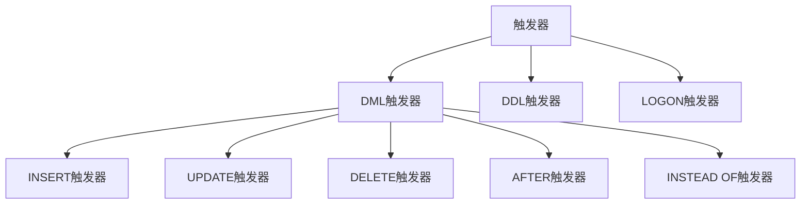
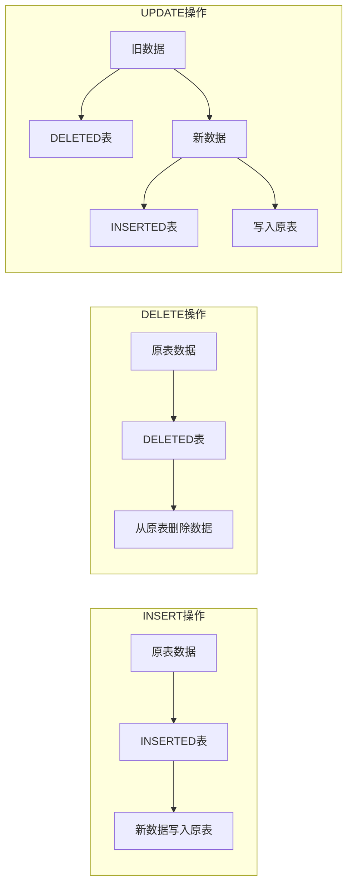
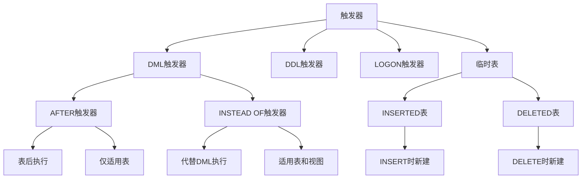

# 第8章-8.2-触发器

## 基本信息
- **课程**：数据库原理与应用
- **章节**：第8章 8.2节 触发器
- **日期**：2026-06-30
- **标签**：#触发器 #DML触发器 #DDL触发器 #AFTER触发器 #INSTEAD_OF触发器 #临时表

---

## 重点内容

### ⭐⭐⭐ 核心概念
- **触发器**：数据库服务器中发生事件时自动执行的特殊存储过程
- **AFTER触发器**：在DML触发事件发生**后**执行，只适用于数据表
- **INSTEAD OF触发器**：在DML触发事件发生**前**执行，代替DML语句执行，适用于表和视图

### ⭐⭐ 临时表
- **INSERTED表**：保存插入或更新后的数据记录副本
- **DELETED表**：保存删除或更新前的数据记录副本
- 执行DELETE触发器时创建DELETED表，执行UPDATE触发器时同时创建INSERTED和DELETED表

### ⭐ 触发器分类
- **DML触发器**：由INSERT、UPDATE、DELETE语句触发
- **DDL触发器**：由CREATE、ALTER、DROP等DDL语句触发
- **LOGON触发器**：由用户登录事件触发（SQL Server 2005+）

---

## 详细笔记

### 一、触发器的概念

#### 1. 什么是触发器

触发器是数据库服务器中发生事件时自动执行的一种特殊的存储过程。与一般存储过程不同的是：

| 对比项 | 存储过程 | 触发器 |
|:------:|:--------:|:------:|
| 执行方式 | 被调用执行（EXEC） | 事件发生时自动激发执行 |
| 参数传递 | 可以传递参数和接收参数 | 不能传递参数和接收参数 |
| 与表关系 | 独立存在 | 与数据表关系密切 |
| 主要用途 | 封装业务逻辑 | 实现数据完整性规则、监控操作 |

> 📚 **课本出处**：第8章 8.2.1节"关于触发器"

#### 2. 触发器的分类

触发器按触发事件类型可以分为三类：



##### (1) DML触发器

数据库操纵语言（DML）主要包含INSERT、UPDATE、DELETE等语句。这些语句作用于数据表或视图时，将产生DML事件，引发DML触发器的执行。

根据触发器的执行与触发事件发生的先后关系，又可以将DML触发器分为：

- **AFTER触发器**：在DML触发事件发生**后**才激发执行，即先执行INSERT、UPDATE、DELETE语句，然后才执行AFTER触发器。**只适用于数据表，不适用于视图**。一般用于检查数据的变动情况，以便采取相应措施。
- **INSTEAD OF触发器**：在DML触发事件发生**之前**（即数据被更新之前）执行，这种执行将**代替**DML语句的执行。也就是说，触发器定义的操作取代相应的DML语句（此后不再执行该DML语句）。**既适用于数据表，也适用于视图**。但**对同一个操作只能定义一个INSTEAD OF触发器**。

> ⚠️ **常见误区**：AFTER触发器不是"在触发器之后"，而是"在触发事件（DML语句）之后"。INSTEAD OF触发器不是"在触发事件之前"那么简单，而是**取代**了原DML语句的执行。

##### (2) DDL触发器

DDL触发器是一种由执行DDL语句（CREATE、ALTER、DROP、GRANT、DENY、REVOKE等）产生触发事件而触发执行的触发器。与DML触发器不同的是：

- DDL触发器的触发事件是执行DDL语句引起的事件
- DDL触发器**只能在触发事件发生后执行**（没有INSTEAD OF类型）
- DDL触发器的作用域不是架构，不能使用OBJECT_ID查询元数据

> 📚 **课本出处**：第8章 8.2.1节"DDL触发器"

**DDL触发器的常用触发事件**：

| 触发事件 | 描述 | 触发事件 | 描述 |
|:--------:|:-----|:--------:|:-----|
| CREATE Login | 创建登录事件 | DROP_DATABASE | 删除数据库事件 |
| ALTER Login | 修改登录事件 | CREATE_TABLE | 创建表事件 |
| DROP Login | 删除登录事件 | ALTER_TABLE | 修改表事件 |
| CREATE DATABASE | 创建数据库事件 | DROP_TABLE | 删除表事件 |
| ALTER DATABASE | 修改数据库事件 | | |

> 📚 **课本出处**：第8章 8.2.1节，表8.1 DDL触发器的常用触发事件

##### (3) LOGON触发器（登录触发器）

登录触发器是SQL Server 2005开始新增的一类为响应LOGON事件（登录）而激发执行的触发器。只要有用户登录，登录触发器即可激发执行。可以用来：
- 跟踪用户的活动
- 限制特定用户只能在特定时间段登录

---

### 二、INSERTED和DELETED临时表

这是DML触发器中**非常重要的概念**。对于DML触发器，有两种临时表与它们密切相关：**DELETED表**和**INSERTED表**。

| 触发器类型 | 创建的临时表 | 临时表内容 |
|:----------:|:----------:|:-----------|
| INSERT触发器 | INSERTED | 新插入的数据记录 |
| DELETE触发器 | DELETED | 被删除的数据记录 |
| UPDATE触发器 | INSERTED + DELETED | INSERTED保存更新后的记录，DELETED保存更新前的记录 |

> 📚 **课本出处**：第8章 8.2.2节"创建DML触发器"

**临时表的特点**：

- 在触发器执行时被创建，执行完毕后被删除
- 由SQL Server自动维护，用户**不能**对这两个表进行直接操作
- 表INSERTED是触发器表被插入或被建立更新后的一个子集
- 表DELETED和表INSERTED是**不相交**的（不含有相同的记录）

> 💡 **理解技巧**：可以把INSERTED想象为"即将生效的新数据"，DELETED想象为"即将被替换掉的旧数据"。在UPDATE操作中，INSERTED是修改后的行，DELETED是修改前的行。



---

### 三、创建触发器

#### 1. 创建DML触发器

创建DML触发器的SQL语法：

```sql
CREATE TRIGGER [schema_name.] trigger_name
ON { table | view }
[ WITH <dml_trigger_option> [,...n] ]
{ FOR | AFTER | INSTEAD OF }
{ [ INSERT ] [, ] [ UPDATE ] [, ] [ DELETE ] }
[ WITH APPEND ]
[ NOT FOR REPLICATION ]
AS { sql_statement [;] [...n] | EXTERNAL NAME <method specifier [;] > }
<dml_trigger_option> ::= [ ENCRYPTION ] [ EXECUTE AS Clause ]
<method_specifier> ::= assembly_name.class_name.method_name
```

> 📚 **课本出处**：第8章 8.2.2节"创建DML触发器"

**参数说明**：

| 参数 | 说明 |
|:----:|:-----|
| trigger_name | 触发器名称，不能以#或#开头 |
| schema_name | 触发器所属架构名称 |
| table \| view | 执行触发器的表或视图（触发器表/触发器视图） |
| WITH ENCRYPTION | 对触发器文本进行加密 |
| EXECUTE AS | 指定执行该触发器的安全上下文 |
| AFTER | 定义AFTER触发器，仅指定FOR则默认为AFTER |
| INSTEAD OF | 定义INSTEAD OF触发器 |
| DELETE, INSERT, UPDATE | 指定触发事件 |
| NOT FOR REPLICATION | 复制代理修改触发器表时不执行触发器 |

> 📚 **课本出处**：第8章 8.2.2节，参数说明

---

##### 【例8.7】INSTEAD OF触发器 - 拒绝UPDATE操作

创建一个触发器，使之拒绝执行UPDATE操作，并输出"对不起，您无权修改数据！"。

```sql
USE MyDatabase
GO
CREATE TRIGGER myTrigger1
ON student
INSTEAD OF UPDATE
AS
BEGIN
    PRINT '对不起，您无权修改数据！'
END
GO
```

> 📚 **课本出处**：第8章 8.2.2节，例8.7

**分析**：该触发器的作用是，执行对表student的UPDATE操作转为执行触发器myTrigger1（输出提示信息），而不再执行此UPDATE操作，因此表student中的数据并未受到影响。

---

##### 【例8.8】AFTER INSERT触发器 - 实现表间约束

假设表student记录学生注册登记信息，表SC记录选课信息。需要杜绝未注册学生直接选课。

```sql
USE MyDatabase
GO
CREATE TRIGGER myTrigger2 ON SC
AFTER INSERT
AS
BEGIN
    DECLARE @s_no char(8), @n int;
    SELECT @s_no = P.s_no
    FROM SC AS P INNER JOIN INSERTED AS I
    ON P.s_no = I.s_no;
    SELECT @n = COUNT(*)
    FROM student
    WHERE s_no = @s_no;
    IF @n <> 1
    BEGIN
        RAISERROR('该学生没有注册，选课无效。', 16, 1);
        ROLLBACK TRANSACTION;
    END
    ELSE PRINT '成功插入数据';
END
GO
```

> 📚 **课本出处**：第8章 8.2.2节，例8.8

**分析**：
- 使用临时表INSERTED获取当前插入记录的s_no字段值
- 在student表中查找是否存在该学号的学生
- 若不存在（COUNT为0），则回滚事务并报错
- 若存在（COUNT为1），则允许插入

> 💡 **理解技巧**：这个例子展示了触发器实现**跨表参照完整性**的经典模式——利用INSERTED临时表获取新插入的数据，然后在其他表中做校验。

---

##### 【例8.9】AFTER DELETE触发器 - 保持级联删除完整性

当从student表中删除记录时，自动删除SC表中对应学生的选课信息。

```sql
USE MyDatabase
GO
CREATE TRIGGER myTrigger3 ON student
AFTER DELETE
AS
BEGIN
    DECLARE @s_no char(8);
    SELECT @s_no = I.s_no FROM DELETED AS I;
    DELETE FROM SC WHERE s_no = @s_no;
END
GO
```

> 📚 **课本出处**：第8章 8.2.2节，例8.9

**分析**：该触发器的作用是，当在表student中删除某一记录时，表SC中与该记录对应的记录（字段s_no值相同的记录）将自动被删除，以保持两个表中数据的参照完整性。

> ⚠️ **注意事项**：在创建该触发器之前，应该先把创建关系SC时定义的参照完整性短语"FOREIGN KEY(s_no) REFERENCES Student(s_no)"去掉，重新创建SC。

---

##### 【例8.14】INSTEAD OF UPDATE触发器（另一个示例）

不允许对表student进行更新操作：

```sql
USE MyDatabase
GO
CREATE TRIGGER myTrigger6
ON student
INSTEAD OF UPDATE
AS
BEGIN
    RAISERROR('对表 student 进行更新!', 16, 10)
    ROLLBACK;
END
GO
```

> 📚 **课本出处**：第8章 8.2.4节，例8.14

---

#### 2. 创建DDL触发器

创建DDL触发器的语法：

```txt
CREATE TRIGGER trigger_name
ON { ALL_SERVER | DATABASE }
[ WITH <ddl_trigger_option> [,...n] ]
{ FOR | AFTER } { event_type | event_group } [,...n ]
AS { sql_statement [; ] [...n ] | EXTERNAL NAME < method specifier > [; ]] }
<ddl_trigger_option> ::= [ENCRYPTION ] [EXECUTE AS Clause ]
<method_specifier> ::= assembly_name.class_name.method_name
```

> 📚 **课本出处**：第8章 8.2.2节"创建DDL触发器"

**特有参数说明**：

| 参数 | 说明 |
|:----:|:-----|
| DATABASE | 作用域为当前数据库 |
| ALLSERVER | 作用域为当前服务器 |
| event_type | SQL语言事件的名称 |
| event_group | 事件分组的名称 |

---

##### 【例8.10】DDL触发器 - 禁止删除或修改数据表

```sql
USE MyDatabase
IF EXISTS (SELECT * FROM sys.triggers WHERE parent_class = 0 AND name = 'myTrigger4')
    DROP TRIGGER myTrigger4 ON DATABASE
GO
CREATE TRIGGER myTrigger4
ON DATABASE
FOR DROP_TABLE, ALTER_TABLE
AS
    PRINT '禁止删除或修改数据库中的任何数据表!';
    ROLLBACK;
GO
```

> 📚 **课本出处**：第8章 8.2.2节，例8.10

**分析**：由于DDL触发器不能使用OBJECT_ID来查询元数据，只能通过查询系统数据表sys.triggers来判断触发器是否存在。该触发器创建以后，执行任何删除或修改数据表的命令都将被禁止。

---

##### 【例8.11】DDL触发器 - 禁止创建服务器登录

```sql
IF EXISTS (SELECT * FROM sys.server_triggers
    WHERE name = 'myTrigger5')
    DROP TRIGGER myTrigger5
    ON ALL SERVER
GO
CREATE TRIGGER myTrigger5
ON ALL SERVER
FOR CREATE Login
AS
    PRINT '禁止创建服务器登录。'
    ROLLBACK;
GO
```

> 📚 **课本出处**：第8章 8.2.2节，例8.11

---

### 四、修改触发器

触发器的修改由ALTER TRIGGER语句完成，修改不同类型的触发器语法不同。

#### 1. 修改DML触发器

```sql
ALTER TRIGGER schema_name.trigger_name
ON (table | view)
[ WITH <dml_trigger_option> [,...n] ]
{ FOR | AFTER | INSTEAD OF }
{ [ DELETE ] [, ] [ INSERT ] [, ] [ UPDATE ] }
[ NOT FOR REPLICATION ]
AS { sql_statement [;] [...n] | EXTERNAL NAME <method specifier> [;] }
```

> 📚 **课本出处**：第8章 8.2.3节"修改触发器"

#### 2. 修改DDL触发器

```txt
ALTER TRIGGER trigger_name
ON { DATABASE | ALL SERVER }
[ WITH <ddl_trigger_option> [,...n] ]
{ FOR | AFTER } { event_type [,...n] | event_group }
AS { sql_statement [;] | EXTERNAL NAME <method specifier> [;] }
```

> ⚠️ **注意**：不能为DDL触发器指定架构schema_name。

**修改触发器的优点**：
- 用户对它的操作权限不会因为修改而发生改变
- 如果原来触发器定义时使用了WITH ENCRYPTION或WITH RECOMPILE选项，则只有在ALTER TRIGGER中也包含这些选项时才有效

---

##### 【例8.12】修改DDL触发器

将例8.11中的myTrigger5由"禁止创建服务器登录"改为"禁止在服务器上创建数据库"：

```txt
ALTER TRIGGER myTrigger5
ON ALL SERVER
FOR CREATE_database
AS
    PRINT '禁止在服务器上创建数据库。'
    ROLLBACK;
GO
```

> 📚 **课本出处**：第8章 8.2.3节，例8.12

---

### 五、禁用和删除触发器

#### 1. 禁用和启用触发器

在调试阶段不希望频繁触发执行触发器时，可以先禁用它们。

禁用和启用触发器的SQL语法：

```sql
DISABLE TRIGGER { [schema.] trigger_name [...n] | ALL }
ON { object_name | DATABASE | ALL SERVER }

ENABLE TRIGGER { [schema_name.] trigger_name [...n] | ALL }
ON { object_name | DATABASE | ALL SERVER }
```

> 📚 **课本出处**：第8章 8.2.4节"禁用和启用触发器"

**参数说明**：

| 参数 | 说明 |
|:----:|:-----|
| trigger_name | 要禁用/启用的触发器名称 |
| ALL | 禁用/启用ON子句作用域中的所有触发器 |
| object_name | 触发器表或视图的名称 |
| DATABASE | 作用域为整个数据库 |
| ALLSERVER | 作用域为整个服务器 |

---

##### 【例8.13】禁用和启用DDL触发器

禁用服务器上的触发器myTrigger5：

```sql
DISABLE TRIGGER myTrigger5 ON ALL SERVER;
```

> 💡 如果将"myTrigger5"改为"ALL"，则表示禁用所有定义在服务器作用域中的触发器。

启用触发器myTrigger5：

```sql
ENABLE TRIGGER myTrigger5 ON ALL SERVER;
```

启用所有服务器作用域的触发器：

```sql
ENABLE TRIGGER ALL ON ALL SERVER;
```

> 📚 **课本出处**：第8章 8.2.4节，例8.13

---

禁用DML触发器myTrigger6：

```sql
DISABLE TRIGGER myTrigger6 ON student;
```

启用DML触发器myTrigger6：

```sql
ENABLE TRIGGER myTrigger6 ON student;
```

> 💡 如果将"myTrigger6"改为"ALL"，则表示启用所有作用在表student上的触发器。

---

#### 2. 删除触发器

当确信一个触发器不再使用时，应当将之删除。DML触发器和DDL触发器的删除方法有所不同：

**删除DML触发器**：

```txt
DROP TRIGGER schema_name.trigger_name [,...n] [;]
```

**删除DDL触发器**：

```txt
DROP TRIGGER trigger_name [,...n] ON { DATABASE | ALL SERVER } [;]
```

> 📚 **课本出处**：第8章 8.2.4节"删除触发器"

> ⚠️ **区别**：删除DDL触发器时需要指定触发器名称和作用域（DATABASE或ALLSERVER），而删除DML触发器时则只需指定其名称。

---

## 总结

### DML触发器三种操作对应的临时表

| 操作类型 | INSERTED表 | DELETED表 | 说明 |
|:--------:|:----------:|:---------:|:-----|
| INSERT | 有（新插入的行） | 无 | INSERTED保存插入的记录 |
| DELETE | 无 | 有（被删除的行） | DELETED保存被删除的记录 |
| UPDATE | 有（更新后的行） | 有（更新前的行） | INSERTED和DELETED不相交 |

### AFTER触发器与INSTEAD OF触发器对比

| 对比项 | AFTER触发器 | INSTEAD OF触发器 |
|:------:|:----------:|:----------------:|
| 执行时机 | 触发事件（DML语句）执行**后** | 触发事件执行**前**，**代替**DML语句 |
| 适用对象 | 仅适用于**数据表** | 适用于**数据表和视图** |
| 同一操作触发器数 | 可以定义多个 | 只能定义**一个** |
| 主要用途 | 检查数据变动、回滚错误操作 | 自定义操作替代原有DML操作 |
| DML语句是否执行 | 执行 | **不执行**（被取代） |

### DML触发器与DDL触发器对比

| 对比项 | DML触发器 | DDL触发器 |
|:------:|:---------:|:---------:|
| 触发事件 | INSERT、UPDATE、DELETE | CREATE、ALTER、DROP等 |
| 执行时机 | AFTER或INSTEAD OF | 仅AFTER（发生后执行） |
| 作用对象 | 数据表或视图 | DATABASE或ALL SERVER |
| 查询元数据 | 可用OBJECT_ID | 需查sys.triggers |
| 主要用途 | 数据完整性、业务规则 | 审核、规范数据库操作 |

### 知识点脑图



### 关键要点

1. **触发器是自动执行的特殊存储过程**，不能传递参数，与数据表关系密切
2. **AFTER触发器在DML语句之后执行**，用于检查和回滚；**INSTEAD OF触发器取代DML语句执行**
3. **INSERTED和DELETED临时表**是DML触发器的核心，分别保存新数据和旧数据
4. **DDL触发器**用于数据库级管理任务，只能AFTER执行，作用域为DATABASE或ALL SERVER
5. **修改触发器**使用ALTER TRIGGER，权限不会因修改而改变
6. **禁用触发器**用DISABLE，**删除触发器**用DROP，DDL触发器删除时需指定作用域

---

## 疑问与思考

### ❓ 待解决问题
1. AFTER触发器和INSTEAD OF触发器能否在同一个表的同一个操作上同时定义？它们的执行顺序是什么？
2. INSERTED和DELETED临时表的结构是否与触发器表完全一致？如果触发器表结构被修改，临时表会受影响吗？
3. 触发器与约束（如FOREIGN KEY、CHECK约束）的区别是什么？什么时候应该用触发器代替约束？
4. DML触发器的嵌套执行有什么限制？当触发器中修改了触发器表的数据时会发生什么？
5. INSTEAD OF触发器取代了原DML语句，那事务的原子性如何保证？
6. LOGON触发器和DDL触发器的作用域有什么不同？它们的执行时机分别在什么阶段？

### 💡 个人理解/技巧
- **AFTER vs INSTEAD OF**：可以理解为AFTER是"先斩后奏"（先执行DML，之后触发器检查是否需要回滚），INSTEAD OF是"先奏后斩"（触发器完全取代DML，只有触发器逻辑生效）
- **INSERTED/DELETED表的类比**：INSERTED就像"影子"——INSERT时是新插入行的影子，UPDATE时是更新后行的影子；DELETED则是"回忆"——DELETE时记住了被删行，UPDATE时记住了更新前行
- **触发器vs约束**：简单完整性规则用约束（更快、更直接），复杂跨表逻辑或需要业务判断时用触发器
- **触发器嵌套限制**：SQL Server最多支持32层触发器嵌套，防止无限递归。如果触发器中的修改再次触发了自身，要注意递归控制
- **调试触发器的技巧**：调试阶段可以先DISABLE TRIGGER禁用，测试通过后再ENABLE

---

## 相关链接

### 关联章节
- [第8章-存储过程和触发器](./第8章-存储过程和触发器.md)
- 第8章-8.1-存储过程（待创建）
- [第11章-数据的完整性管理](../../../数据库原理/notes/章节笔记/)（参照完整性相关）

### 参考资料
- SQL Server触发器官方文档
- 课本第8章 8.2节 全部内容

---

## 检查清单

- [x] 已理解触发器的概念和与存储过程的区别
- [x] 已掌握AFTER触发器和INSTEAD OF触发器的区别
- [x] 已理解INSERTED和DELETED临时表的创建时机和内容
- [x] 已记录所有SQL代码示例（例8.7-例8.14）
- [x] 已包含创建DML触发器和DDL触发器的完整语法
- [x] 已记录修改、禁用、启用和删除触发器的方法
- [x] 已添加课本出处标注
- [x] 已完成总结对比表格

---

*笔记创建时间：2026-06-30*
