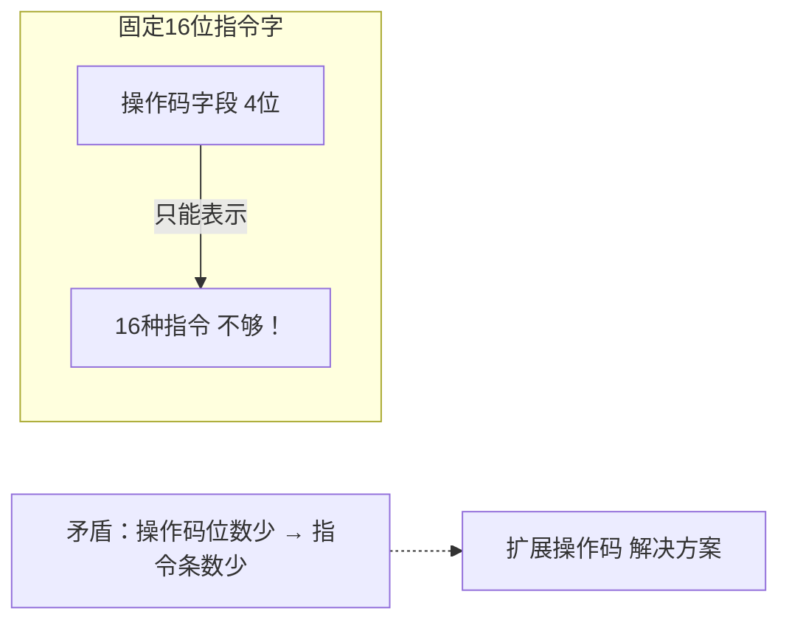
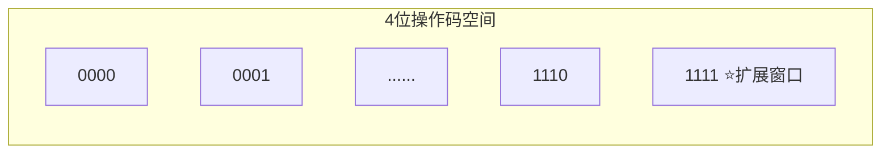
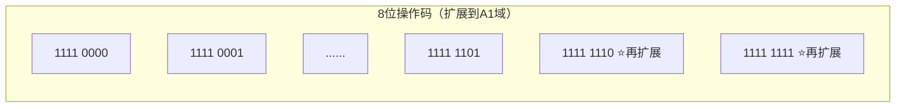

# 专题：扩展操作码技术

## 基本信息
- **课程**：计算机组成原理
- **专题**：扩展操作码（Expanding Opcode）
- **日期**：2026-04-18
- **标签**：#指令格式 #操作码 #RISC #CISC #扩展编码

---

## 重点内容

### ⭐⭐⭐ 核心概念
1. **扩展操作码定义**：操作码长度不固定，向地址码字段扩展
2. **核心思想**：高频指令用短操作码，低频指令用长操作码
3. **前缀规则**：短操作码不能是长操作码的前缀
4. **译码方式**：从高位到低位逐位判断

---

## 详细笔记

### 一、为什么需要扩展操作码

#### 问题背景
在固定长度指令字中，操作码位数有限 → 指令条数受限



#### 解决思路
**操作码长度不固定**：
- 高频指令（三地址）→ 短操作码
- 低频指令（零地址）→ 长操作码

---

### 二、课本例题详解 ⭐⭐⭐

#### 【例4.1】题目条件
- **指令字长度**：16位（固定）
- **基本结构**：4位操作码 + 三个4位地址码

```
┌─────┬─────┬─────┬─────┐
│ OP  │ A1  │ A2  │ A3  │
│ 4位 │ 4位 │ 4位 │ 4位 │
└─────┴─────┴─────┴─────┘
```

#### 扩展过程

##### 1️⃣ 三地址指令（15条）

| 操作码 | 说明 |
|--------|------|
| `0000` ~ `1110` | 三地址指令（15条） |
| `1111` | **扩展标志**（保留） |



**关键**：保留 `1111` 作为扩展窗口

---

##### 2️⃣ 二地址指令（14条）

| 操作码 | 说明 |
|--------|------|
| `1111 0000` ~ `1111 1101` | 二地址指令（14条） |
| `1111 1110` 和 `1111 1111` | **再扩展标志**（保留2个） |



**为什么只有14条？** 因为要留2个编码继续扩展！

---

##### 3️⃣ 一地址指令（31条）

| 操作码 | 说明 |
|--------|------|
| `1111 1110 0000` ~ `1111 1111 1110` | 一地址指令（31条） |
| `1111 1111 1111` | **最后扩展标志**（保留1个） |

**计算**：
- `1111 1110` 开头：16个编码
- `1111 1111 0000`~`1110`：15个编码
- 总计：16 + 15 = **31条**

---

##### 4️⃣ 零地址指令（16条）

| 操作码 | 说明 |
|--------|------|
| `1111 1111 1111 0000` ~ `1111 1111 1111 1111` | 零地址指令（16条） |

**不需要再扩展了**，所以全部16个编码都可以用！

---

### 三、总结表

| 指令类型 | 操作码长度 | 操作码范围 | 数量 | 扩展标志 | 地址码个数 |
|---------|-----------|-----------|------|---------|-----------|
| 三地址 | 4位 | `0000`~`1110` | 15 | `1111` | 3个 |
| 二地址 | 8位 | `1111 0000`~`1111 1101` | 14 | `1111 1110` `1111 1111` | 2个 |
| 一地址 | 12位 | `1111 1110 0000`~`1111 1111 1110` | 31 | `1111 1111 1111` | 1个 |
| 零地址 | 16位 | `1111 1111 1111 0000`~`1111 1111 1111 1111` | 16 | 无 | 0个 |

**总计**：15 + 14 + 31 + 16 = **76条指令**

---

### 四、关键理解点

#### 1. 四种操作码同时存在 ✅

它们不是"选择其一"，而是**共存**在一个指令系统中：


#### 2. CPU如何译码？

**从高位到低位逐位判断**：

```
收到指令字：1111 0001 0010 0011

Step 1: 看前4位
        1111 → 不是三地址，需要扩展

Step 2: 看前8位  
        1111 0001 → 是二地址指令！
        
解码结果：二地址指令
         操作码=1111 0001
         两个地址分别是 0010 和 0011
```

#### 3. 为什么要留编码扩展？

| 问题 | 答案 |
|------|------|
| 为什么二地址只留2个？ | 因为下一步要扩展到12位，需要2个入口 |
| 为什么一地址只留1个？ | 因为下一步只扩展到16位，1个入口就够了 |
| 为什么零地址不留？ | 已经到16位了，不能再扩展了 |

#### 4. 前缀规则

```
✅ 正确：
  0000 ~ 1110      (三地址)
  1111 xxxx        (二地址扩展)
  
❌ 错误：
  0000 ~ 1111      (用了1111，无法扩展)
  1111 xxxx        (冲突！)
```

**短操作码不能是长操作码的前缀**

---

### 五、形象比喻

就像**门牌号系统**：

```
1~15号        → 三地址指令（短门牌，大房子，3个院子）
1116~1129号   → 二地址指令（长门牌，中房子，2个院子）  
11130~11160号 → 一地址指令（更长门牌，小房子，1个院子）
11161~11176号 → 零地址指令（最长门牌，没院子）

都是同一个小区（指令系统）的房子！
```

---

### 六、扩展编码 vs 固定编码

| 特性 | 固定长度操作码 | 扩展编码 |
|------|--------------|---------|
| **译码复杂度** | 简单 | 较复杂（需判断长度） |
| **指令条数** | 受限（2^n） | 更多 |
| **代码密度** | 较低 | 较高（高频指令短） |
| **执行速度** | 快 | 稍慢（需译码判断） |
| **灵活性** | 低 | 高 |
| **典型应用** | RISC（如MIPS） | CISC（如x86） |

---

## 疑问与思考

1. ❓ 如果三地址指令只需要10条，可以怎么优化扩展方案？
2. ❓ 为什么RISC处理器通常不用扩展操作码？
3. ❓ 扩展操作码的译码电路怎么设计？
4. ❓ 如果指令字长度是32位，扩展方案会有什么不同？

---

## 相关链接

- 📚 出处：第 4 章 4.2.3 节"指令字长度的扩展" - 【例4.1】
- 📖 前置知识：指令格式、操作码、地址码
- 📖 后续章节：RISC vs CISC 指令系统设计

---

## 考试重点

| 知识点 | 重要程度 | 常见题型 |
|--------|----------|---------|
| 扩展操作码原理 | ⭐⭐⭐ | 简答题、计算题 |
| 课本例4.1计算 | ⭐⭐⭐ | 必考计算题 |
| 译码过程 | ⭐⭐ | 分析题 |
| 前缀规则 | ⭐⭐ | 判断题 |
| 与固定编码对比 | ⭐ | 选择题 |
