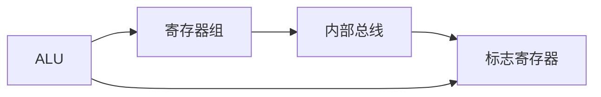

# 总结-第2章-运算方法和运算器

## 基本信息

- **课程**：计算机组成原理
- **章节**：第2章 运算方法和运算器
- **日期**：2026-06-16
- **标签**：#运算方法 #运算器 #定点数 #浮点数 #补码 #原码 #ALU

***

## 核心考点

### ⭐⭐⭐ 必须掌握

1. 定点数的原码、补码、反码、移码表示及转换
2. 补码加减法运算及溢出检测
3. 浮点数的表示和运算步骤（对阶、尾数运算、规格化、舍入）
4. ALU的功能和结构

### ⭐⭐ 重要概念

1. 定点乘法和除法运算原理
2. 加法器的进位方式（串行进位、并行进位）
3. 运算器的组成和数据通路

### ⭐ 了解内容

1. 字符编码（ASCII、Unicode）
2. 汉字编码（国标码、区位码、机内码）
3. 校验码（奇偶校验、海明码、CRC）

***

## 各节知识点总结

### 2.1 数据与文字的表示方法

#### 定点数表示

| 类型 | 小数点位置 | 范围（n位） |
|:-----|:-----------|:------------|
| **定点纯小数** | 符号位后 | $0 \leqslant |x| \leqslant 1 - 2^{-n}$ |
| **定点纯整数** | 最低位后 | $0 \leqslant |x| \leqslant 2^n - 1$ |

#### 浮点数表示

$$
N = 2^e \cdot M
$$

- $e$：阶码（指数）
- $M$：尾数（有效数字）

**IEEE 754标准**：单精度（32位）、双精度（64位）

#### 机器码表示 ⭐⭐⭐

| 机器码 | 正数 | 负数 | 特点 |
|:-------|:-----|:-----|:-----|
| **原码** | 符号位0 + 绝对值 | 符号位1 + 绝对值 | 0有两种表示 |
| **补码** | 同原码 | 原码除符号位外取反+1 | 0唯一，减法变加法 |
| **反码** | 同原码 | 原码除符号位外取反 | 0有两种表示 |
| **移码** | 补码符号位取反 | 补码符号位取反 | 便于比较大小 |

**关键公式**：

$$
[x]_{补} = \begin{cases} x, & 2^n > x \geqslant 0 \\ 2^{n+1} + x, & 0 > x \geqslant -2^n \end{cases} \pmod{2^{n+1}}
$$

$$
[x - y]_{补} = [x]_{补} + [-y]_{补} \pmod{2^{n+1}}
$$

> 💡 **求[-y]补的方法**：对[y]补连同符号位一起取反，末位加1

#### 校验码

| 校验码 | 原理 | 检错/纠错能力 |
|:-------|:-----|:--------------|
| **奇偶校验** | 在数据后加1位校验位 | 检1位错，不能纠错 |
| **海明码** | 多个校验位分组校验 | 检2位错，纠1位错 |
| **CRC** | 模2除法生成余数 | 检多位错 |

### 2.2 定点加法、减法运算 ⭐⭐⭐

#### 补码加法

$$
[x + y]_{补} = [x]_{补} + [y]_{补} \pmod{2^{n+1}}
$$

#### 补码减法

$$
[x - y]_{补} = [x]_{补} + [-y]_{补} \pmod{2^{n+1}}
$$

#### 溢出检测 ⭐⭐⭐

**溢出条件**：运算结果超出表示范围

| 检测方法 | 公式/规则 |
|:---------|:----------|
| **单符号位法** | 正+正=负 或 负+负=正 |
| **双符号位法** | 结果符号位为01（正溢）或10（负溢）|
| **进位判断法** | 符号位进位 $C_s$ ⊕ 最高数值位进位 $C_1$ = 1 |

> 💡 双符号位法中，00=正，11=负，01=正溢，10=负溢

#### 加法器结构

| 类型 | 特点 | 速度 |
|:-----|:-----|:-----|
| **串行进位（行波进位）** | 低位进位串行传递到高位 | 慢 |
| **并行进位（先行进位）** | 各级进位同时产生 | 快 |
| **单级分组先行进位** | n位分若干组，组内并行进位，组间串行 | 中等 |
| **多级分组先行进位** | 组内并行进位，组间也并行进位 | 最快 |

### 2.3 定点乘法运算

#### 原码乘法

- **符号位**：单独处理，异或运算
- **数值位**：绝对值相乘，逐位移位相加

#### 补码乘法（Booth算法）⭐⭐

- 符号位参与运算
- 根据相邻两位判断操作：
  - 00或11：不加不减，右移
  - 01：加被乘数，右移
  - 10：减被乘数，右移

### 2.4 定点除法运算

#### 原码除法

| 方法 | 过程 |
|:-----|:-----|
| **恢复余数法** | 余数为负则恢复，再左移、减除数 |
| **加减交替法** | 余数为负不恢复，左移后加除数 |

> 💡 加减交替法是恢复余数法的改进，效率更高

### 2.5 定点运算器的组成 ⭐⭐⭐

#### 运算器基本组成

| 部件 | 功能 |
|:-----|:-----|
| **ALU** | 执行算术和逻辑运算 |
| **寄存器组** | 暂存操作数、中间结果和最终结果 |
| **内部总线** | 数据传输通道 |
| **标志寄存器** | 保存运算状态（ZF/SF/CF/OF等）|

#### 常见标志位

| 标志 | 名称 | 含义 |
|:-----|:-----|:-----|
| **ZF** | 零标志 | 结果为0时置1 |
| **SF** | 符号标志 | 结果最高位 |
| **CF** | 进位标志 | 最高位产生进位 |
| **OF** | 溢出标志 | 运算溢出 |

### 2.6 浮点运算方法和浮点运算器 ⭐⭐⭐

#### 浮点数格式

$$
N = (-1)^S \times 1.F \times 2^{E-偏置值}
$$

#### 浮点加减法步骤

| 步骤 | 操作 |
|:-----|:-----|
| **1. 对阶** | 小阶向大阶看齐，尾数右移 |
| **2. 尾数运算** | 补码加减 |
| **3. 规格化** | 尾数最高位为1（原码）或符号位与最高位不同（补码）|
| **4. 舍入** | 0舍1入或恒置1 |
| **5. 溢出判断** | 阶码溢出为真溢出 |

> 💡 **对阶原则**：小阶向大阶看齐，避免高位丢失

#### 规格化判断

| 码制 | 规格化形式 |
|:-----|:-----------|
| **原码** | 符号位任意，最高数值位为1 |
| **补码** | 符号位与最高数值位不同 |

#### 溢出判断

- **尾数溢出**：右规处理，不是真正的溢出
- **阶码溢出**：才是真正的溢出
  - 阶码上溢：结果太大，置溢出标志
  - 阶码下溢：结果太小，置为机器零

***

## 重要公式汇总

| 公式 | 说明 |
|:-----|:-----|
| $[x + y]_{补} = [x]_{补} + [y]_{补}$ | 补码加法 |
| $[x - y]_{补} = [x]_{补} + [-y]_{补}$ | 补码减法 |
| $[-y]_{补}$ = [y]补连同符号位取反+1 | 求负数的补码 |
| $N = 2^e \cdot M$ | 浮点数一般形式 |
| $C_s \oplus C_1 = 1$ | 溢出判断（进位法）|

***

## 易混淆点对比

| 概念A | 概念B | 区别 |
|:------|:------|:-----|
| 原码 | 补码 | 0的表示：两种 vs 一种；减法：直接减 vs 变加法 |
| 反码 | 补码 | 负数：取反 vs 取反+1 |
| 移码 | 补码 | 符号位相反，便于比较 |
| 恢复余数法 | 加减交替法 | 负余数时恢复 vs 不恢复直接加除数 |
| 阶码溢出 | 尾数溢出 | 真溢出 vs 可通过右规解决 |
| 对阶 | 规格化 | 调整阶码使相等 vs 调整尾数使最高位有效 |

***

## 考试重点

1. **原码、补码、反码、移码的转换**（必考）
2. **补码加减法运算及溢出判断**（必考计算题）
3. **浮点数表示范围**（选择题）
4. **浮点加减法运算步骤**（简答题/计算题）
5. **ALU的功能和标志位**（填空/选择）
6. **进位方式比较**（选择/简答）
7. **规格化判断**（选择/填空）

***

## 相关链接

- [第2章-运算方法和运算器](../章节笔记/第2章-运算方法和运算器/第2章-运算方法和运算器.md)
- [第2章-2.1-数据与文字的表示方法](../章节笔记/第2章-运算方法和运算器/第2章-2.1-数据与文字的表示方法.md)
- [第2章-2.2-定点加法减法运算](../章节笔记/第2章-运算方法和运算器/第2章-2.2-定点加法减法运算.md)
- [第2章-2.3-定点乘法运算](../章节笔记/第2章-运算方法和运算器/第2章-2.3-定点乘法运算.md)
- [第2章-2.4-定点除法运算](../章节笔记/第2章-运算方法和运算器/第2章-2.4-定点除法运算.md)
- [第2章-2.5-定点运算器的组成](../章节笔记/第2章-运算方法和运算器/第2章-2.5-定点运算器的组成.md)
- [第2章-2.6-浮点运算方法和浮点运算器](../章节笔记/第2章-运算方法和运算器/第2章-2.6-浮点运算方法和浮点运算器.md)

***

*总结创建时间：2026-06-16*
