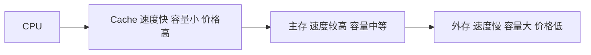

# 总结-第3章-存储系统

## 基本信息

- **课程**：计算机组成原理
- **章节**：第3章 存储系统
- **日期**：2026-06-16
- **标签**：#存储系统 #SRAM #DRAM #Cache #虚拟存储器 #地址映射

---

## 核心考点

### ⭐⭐⭐ 必须掌握

1. 程序的局部性原理（时间局部性、空间局部性）
2. SRAM与DRAM的工作原理及对比
3. DRAM刷新操作（集中式、分散式）
4. 存储器容量扩充（位扩展、字扩展、字位扩展）
5. 多模块交叉存储器时间计算（交叉方式、顺序方式、数据传输率）
6. Cache命中率、平均访问时间、访问效率计算
7. 三种地址映射方式（全相联、直接映射、组相联）
8. Cache替换策略（LRU）和写操作策略（写回法、全写法、写一次法）
9. 虚拟存储器基本概念及页式地址映射
10. TLB的作用和工作原理

### ⭐⭐ 重要概念

1. 存储系统的层次结构（cache、主存、外存）
2. 大端模式与小端模式
3. 存储器的技术指标（容量、存取时间、存储周期、带宽）
4. ROM的分类及各类特点
5. NOR闪存与NAND闪存的对比
6. 双端口存储器的冲突处理（BUSY标志）
7. 段式和段页式虚拟存储器
8. Cache与虚存的异同

### ⭐ 了解内容

1. 鲲鹏920处理器存储系统层次结构
2. SDRAM、突发传输模式
3. 虚存的替换算法

---

## 各节知识点总结

### 3.1 存储系统概述

#### 程序的局部性原理

| 类型 | 说明 |
|:-----|:-----|
| **时间局部性** | 最近被访问的信息很可能还要被访问 |
| **空间局部性** | 最近被访问的信息邻近地址的信息也可能被访问 |

#### 多级存储系统

#### 端模式

| 模式 | 存放方式 |
|:-----|:---------|
| **大端模式** | 高有效字节放在低地址端 |
| **小端模式** | 低有效字节放在低地址端 |

#### 存储器技术指标

| 指标 | 说明 |
|:-----|:-----|
| **存储容量** | 可存储的信息比特数 |
| **存取时间** | 从接收命令到读写完成的时间 |
| **存储周期** | 连续两次访问的最小间隔时间 |
| **存储器带宽** | 单位时间存取的信息量 |

---

### 3.2 静态随机存取存储器(SRAM)

#### SRAM存储元

- 用**锁存器（触发器）**作为存储元
- 只要不断电，就无限期保持
- 电源断电则数据丢失（易失性）

#### 双译码方式

- 将地址分成 $x$ 向、$y$ 向两部分
- 第一级：行译码、列译码独立进行
- 第二级：在存储阵列中交叉译码

#### 控制信号

| 信号 | 功能 |
|:-----|:-----|
| $\overline{CS}$ | 片选信号，低电平有效 |
| $\overline{OE}$ | 读出使能，低电平有效 |
| $\overline{WE}$ | 写命令，=1读、=0写 |

> ⚠️ $G_1$ 和 $G_2$ 互锁，保证读时不写、写时不读

#### 存储器容量扩充

| 扩展方式 | 条件 | 方法 |
|:---------|:-----|:-----|
| **位扩展** | 字数符合，位数不足 | 地址线、控制线共用，数据线分开 |
| **字扩展** | 字数不足 | 地址、数据、控制线共用，高位译码产生片选 |
| **字位扩展** | 字数和位数均不足 | 先位扩展，再字扩展 |

---

### 3.3 动态随机存取存储器(DRAM)

#### DRAM存储元

- **单管MOS + 电容器**
- 电容充满电荷 = 1，放电 = 0
- **破坏性读出**：读出后必须刷新

#### DRAM vs SRAM

| 特性 | SRAM | DRAM |
|:-----|:-----|:-----|
| 存储元 | 触发器 | 单管MOS+电容 |
| 速度 | 快 | 较慢 |
| 密度 | 低 | 高 |
| 刷新 | 不需要 | 需要 |
| 成本 | 高 | 低 |
| 应用 | Cache | 主存 |

#### DRAM地址分时传送

- $\overline{RAS}$：行选通信号，打入行地址
- $\overline{CAS}$：列选通信号，打入列地址

#### DRAM刷新

| 策略 | 说明 | 特点 |
|:-----|:-----|:-----|
| **集中式刷新** | 集中一段时间刷新所有行 | 存在"死时间" |
| **分散式刷新** | 均匀分配刷新操作 | 无死时间 |

- 主流DRAM刷新周期：**64ms**

---

### 3.4 只读存储器(ROM)

#### ROM分类

| 类型 | 可编程 | 可擦除 | 擦除方式 | 擦除单位 |
|:-----|:-------|:-------|:---------|:---------|
| 掩模ROM | 否 | 否 | - | - |
| OTP ROM | 一次 | 否 | - | - |
| UV-EPROM | 是 | 是 | 紫外线 | 整片 |
| EEPROM | 是 | 是 | 电擦除 | 字节 |
| Flash | 是 | 是 | 电擦除 | 块/扇区 |

#### NOR闪存 vs NAND闪存

| 特性 | NOR闪存 | NAND闪存 |
|:-----|:--------|:---------|
| 访问方式 | 随机访问 | 以页为单位 |
| 代码执行 | 可直接执行 | 不能直接执行 |
| 存储密度 | 较低 | 较高 |
| 成本 | 较高 | 较低 |
| 擦除次数 | 1万-10万次 | 10倍于NOR |
| 典型应用 | 代码存储 | 大容量存储设备 |

---

### 3.5 并行存储器

#### 双端口存储器

- **空间并行技术**，两个独立端口同时访问
- 冲突条件：两个端口同时访问**同一地址**且**至少一个写操作**
- 解决方法：**BUSY标志**仲裁

#### 多模块交叉存储器

**基本参数**：
- $T$：存储周期
- $\tau$：总线传送周期
- $m$：交叉模块数

**流水线条件**：
$$
T \leqslant m\tau
$$

**交叉存取度**：
$$
m_{\min} = \frac{T}{\tau}
$$

**连续读取 $m$ 个字的时间**：

| 方式 | 公式 |
|:-----|:-----|
| **交叉方式** | $t_1 = T + (m-1)\tau$ |
| **顺序方式** | $t_2 = mT$ |

**数据传输率**：
$$
W = \frac{q}{t}
$$

---

### 3.6 高速缓冲存储器(Cache)

#### Cache命中率计算

| 公式 | 表达式 |
|:-----|:-------|
| **命中率** | $h = \frac{N_c}{N_c + N_m}$ |
| **平均访问时间** | $t_a = h \cdot t_c + (1-h) \cdot t_m$ |
| **访问效率** | $e = \frac{t_c}{t_a} = \frac{1}{r+(1-r)h}$ |

其中：$r = t_m/t_c$ 为速度比

#### 三种地址映射方式

| 映射方式 | 映射规则 | 优点 | 缺点 |
|:---------|:---------|:-----|:-----|
| **全相联** | 主存块可放到Cache任意行 | 灵活，命中率高 | 比较器复杂，适合小容量 |
| **直接映射** | $i = j \mod m$ | 硬件简单，速度快 | 易冲突 |
| **组相联** | 固定组，组内任意行 | 折中方案，普遍采用 | 复杂度中等 |

#### 替换策略

| 策略 | 原理 | 特点 |
|:-----|:-----|:-----|
| **LFU** | 替换访问次数最少的行 | 计数器定期清零 |
| **LRU** | 替换最久未被访问的行 | **最常用**，保护新数据 |
| **随机** | 随机选择 | 硬件简单，性能稍逊 |

#### 写操作策略

| 策略 | 写命中 | 写未命中 | 特点 |
|:-----|:-------|:---------|:-----|
| **写回法** | 只改Cache，替换时写回 | 调入后修改 | 写主存次数少，需修改位 |
| **全写法** | Cache与主存同时修改 | 直接写主存 | 一致性好，无需修改位 |
| **写一次法** | 第一次同时写主存，之后写回 | 同写回法 | 维护多Cache一致性 |

#### 多级Cache性能

$$
总CPI = 基本CPI + 一级停顿 + 二级停顿
$$

---

### 3.7 虚拟存储器

#### 基本概念

| 概念 | 说明 |
|:-----|:-----|
| **虚地址/逻辑地址** | 编程时使用的地址 |
| **实地址/物理地址** | 物理内存的实际地址 |
| **再定位** | 虚地址到实地址的转换过程 |

#### Cache与虚存的异同

| 对比项 | Cache-主存 | 主存-辅存 |
|:-------|:-----------|:----------|
| 侧重点 | 解决速度差异 | 解决存储容量 |
| 数据通路 | CPU可直接访问主存 | CPU不能直接访问辅存 |
| 透明性 | 对系统/应用均透明 | 对系统程序员不透明 |
| 未命中损失 | 较小 | 很大 |

#### 页式虚拟存储器

- 虚地址 = 逻辑页号 + 页内偏移
- 实地址 = 物理页号 + 页内偏移
- **页表**：逻辑页号 → 物理页号 + 有效位
- **TLB（快表）**：页表的缓存，由相联存储器实现

#### 段式与段页式

| 方式 | 地址结构 | 特点 |
|:-----|:---------|:-----|
| **段式** | 段号 + 段内偏移 | 逻辑独立，段长可变，有外碎片 |
| **段页式** | 段号 + 页号 + 页内偏移 | 结合两者优点，实现复杂 |

---

### 3.8 鲲鹏920处理器的存储系统

#### 存储层次

| 层次 | 容量 | 归属 |
|:-----|:-----|:-----|
| L1 I-Cache | 64KB | 每内核私有 |
| L1 D-Cache | 64KB | 每内核私有 |
| L2 Cache | 512KB | 每内核私有 |
| L3 Cache | 系统级 | 超级内核集群共享 |

#### L3 Cache特点

- 组相联结构
- 写回(write-back)策略
- 支持随机替换、DRRIP、PLRU
- Cache行大小：128字节

#### 主存系统

- HHA（Hydra根代理）
- DDRC（DDR SDRAM控制器）
- DDR SDRAM（8通道，72位位宽）

---

## 重要公式汇总

| 公式 | 说明 |
|:-----|:-----|
| $h = \frac{N_c}{N_c+N_m}$ | Cache命中率 |
| $t_a = h \cdot t_c + (1-h) \cdot t_m$ | 平均访问时间 |
| $e = \frac{1}{r+(1-r)h}$ | 访问效率 |
| $i = j \mod m$ | 直接映射行号计算 |
| $q = j \mod u$ | 组相联组号计算 |
| $T \leqslant m\tau$ | 交叉存储流水线条件 |
| $m_{\min} = T/\tau$ | 交叉存取度 |
| $t_1 = T+(m-1)\tau$ | 交叉方式读取m个字时间 |
| $t_2 = mT$ | 顺序方式读取m个字时间 |
| $W = q/t$ | 数据传输率 |
| $d = \frac{设计容量}{芯片容量}$ | 所需芯片数 |

---

## 易混淆点对比

| 概念A | 概念B | 区别 |
|:------|:------|:-----|
| SRAM | DRAM | 触发器存储 vs 电容存储；需刷新 vs 不需刷新；快 vs 慢；贵 vs 便宜 |
| 集中式刷新 | 分散式刷新 | 集中一段时间刷新 vs 均匀分配；有死时间 vs 无死时间 |
| 大端模式 | 小端模式 | 高字节在低地址 vs 低字节在低地址 |
| 位扩展 | 字扩展 | 增加位数 vs 增加字数；数据线分开 vs 片选分开 |
| 全相联映射 | 直接映射 | 任意行 vs 固定行；灵活 vs 易冲突；复杂 vs 简单 |
| 写回法 | 全写法 | 替换时才写主存 vs 每次都写主存；需修改位 vs 不需 |
| Cache | 虚存 | 硬件管理 vs 软硬件共同管理；解决速度 vs 解决容量 |
| 页式 | 段式 | 固定大小页 vs 可变长段；无内碎片 vs 有外碎片 |
| TLB | Cache | 缓存页表项 vs 缓存主存数据；虚地址转换 vs 数据存取 |

---

## 考试重点

1. **程序的局部性原理**（选择/填空）
2. **SRAM与DRAM的对比**（简答/选择）
3. **DRAM刷新方式**（选择/简答）
4. **存储器容量扩充计算**（计算题）
5. **交叉存储器时间计算**（必考计算题）
6. **Cache命中率、平均访问时间、访问效率**（必考计算题）
7. **三种地址映射方式**（选择/简答/计算）
8. **LRU替换策略**（选择/简答）
9. **写操作策略对比**（选择/简答）
10. **页式虚拟存储器地址映射**（简答/计算）
11. **TLB的作用**（选择/简答）
12. **Cache与虚存的异同**（简答）

---

## 相关链接

- [第3章-存储系统](../章节笔记/第3章-存储系统/第3章-存储系统.md)
- [第3章-3.1-存储系统概述](../章节笔记/第3章-存储系统/第3章-3.1-存储系统概述.md)
- [第3章-3.2-静态随机存取存储器](../章节笔记/第3章-存储系统/第3章-3.2-静态随机存取存储器.md)
- [第3章-3.3-动态随机存取存储器](../章节笔记/第3章-存储系统/第3章-3.3-动态随机存取存储器.md)
- [第3章-3.4-只读存储器](../章节笔记/第3章-存储系统/第3章-3.4-只读存储器.md)
- [第3章-3.5-并行存储器](../章节笔记/第3章-存储系统/第3章-3.5-并行存储器.md)
- [第3章-3.6-高速缓冲存储器](../章节笔记/第3章-存储系统/第3章-3.6-高速缓冲存储器.md)
- [第3章-3.7-虚拟存储器](../章节笔记/第3章-存储系统/第3章-3.7-虚拟存储器.md)
- [第3章-3.8-鲲鹏920处理器的存储系统](../章节笔记/第3章-存储系统/第3章-3.8-鲲鹏920处理器的存储系统.md)

---

*总结创建时间：2026-06-16*
