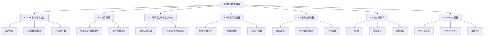

# 总结-第5章-中央处理器

## 基本信息
- **课程**：计算机组成原理
- **章节**：第5章 中央处理器
- **日期**：2026-06-16
- **标签**：#CPU #总结 #复习

## 一、知识框架

## 二、核心知识点

### 1. CPU的功能和组成

**四大功能**：
- 指令控制：程序顺序控制
- 操作控制：产生操作控制信号
- 时间控制：操作的时间定时
- 数据加工：算术和逻辑运算

**基本组成**：

| 部件 | 组成 | 功能 |
|:-----|:-----|:-----|
| 控制器 | PC、IR、ID、时序产生器、操作控制器 | 取指令、译码、指挥数据流动 |
| 运算器 | ALU、通用寄存器、DR、PSWR | 执行算术/逻辑运算 |

**六类寄存器**：

| 寄存器 | 功能 |
|:-------|:-----|
| DR | 数据缓冲，补偿速度差别 |
| IR | 保存当前执行指令 |
| PC | 存放下一条指令地址 |
| AR | 保存访问数据存储器的地址 |
| R0~R3 | 为ALU提供工作区 |
| PSWR | 保存条件代码和状态信息 |

### 2. 指令周期

**三个时间概念**：

| 概念 | 定义 |
|:-----|:-----|
| 指令周期 | 取出并执行一条指令的时间 |
| CPU周期（机器周期） | 通常用读取一个指令字的最短时间规定 |
| 时钟周期（T周期） | 处理操作的最基本单位 |

**关系**：一个指令周期 = 若干个CPU周期；一个CPU周期 = 若干个时钟周期

**五种典型指令周期**：

| 指令 | 类型 | CPU周期数 | 取指 | 执行 |
|:----:|:-----|:---------:|:----:|:----:|
| NOT | RR型 | 2 | 1 | 1 |
| LAD | RS型 | 3 | 1 | 2 |
| ADD | RR型 | 2 | 1 | 1 |
| STO | RS型 | 3 | 1 | 2 |
| JMP | 转移型 | 2 | 1 | 1 |

### 3. 时序发生器和控制方式

**时序体制**：

| 控制器类型 | 时序体制 |
|:-----------|:---------|
| 硬布线控制器 | 三级：主状态周期 - 节拍电位 - 节拍脉冲 |
| 微程序控制器 | 二级：节拍电位 - 节拍脉冲 |

**三种控制方式**：

| 方式 | 特点 |
|:-----|:-----|
| 同步控制 | 固定机器周期数和时钟周期数 |
| 异步控制 | 按需占用时间，以"回答"信号结束 |
| 联合控制 | 两者结合，大部分固定+少数异步 |

### 4. 微程序控制器

**核心概念**：
- **微命令**：控制部件发出的控制命令
- **微操作**：执行部件接受微命令后的操作
- **微指令**：一个CPU周期中一组微命令的组合
- **微程序**：一条机器指令对应的微指令序列

**微指令格式**（以23位为例）：

| 字段 | 位数 | 功能 |
|:-----|:-----|:-----|
| 操作控制字段 | 17位 | 每一位代表一个微命令 |
| 判别测试字段 | 2位 | P1、P2测试标志 |
| 下地址字段 | 4位 | 直接给出下一条微指令地址 |

**微程序控制器组成**：

| 部件 | 功能 |
|:-----|:-----|
| 控制存储器 | 存放全部微程序，只读 |
| 微指令寄存器 | 微地址寄存器 + 微命令寄存器 |
| 地址转移逻辑 | 修改微地址，实现条件转移 |

**微命令编码方法**：

| 方法 | 特点 |
|:-----|:-----|
| 直接表示法 | 每位一个微命令，简单直观，字长长 |
| 编码表示法 | 字段译码，字长短，速度稍慢 |
| 混合表示法 | 两者结合 |

**微地址形成方法**：

| 方法 | 特点 |
|:-----|:-----|
| 计数器方式 | 顺序控制字段短，机构简单，转移功能弱 |
| 多路转移方式 | 实现多路并行转移，灵活性好，速度快 |

### 5. 硬布线控制器

**基本原理**：微操作控制信号是指令译码输出 $I_m$、时序信号 $(M_i, T_k)$ 和状态条件 $B_j$ 的逻辑函数：

$$C = f(I_m, M_i, T_k, B_j)$$

**与微程序控制器对比**：

| 比较项 | 硬布线 | 微程序 |
|:-------|:-------|:-------|
| 速度 | 快 | 较慢 |
| 设计复杂度 | 高 | 低 |
| 规整性 | 差 | 好 |
| 调试维护 | 困难 | 方便 |
| 适用 | RISC | CISC |

### 6. 流水线技术

**三种并行处理**：时间并行、空间并行、时间+空间并行

**性能指标**：

| 指标 | 公式 |
|:-----|:-----|
| 加速比 | $C_k = \frac{n \cdot k}{k + (n - 1)}$ |
| 最大加速比 | $k$（当 $n \gg k$） |
| 吞吐率 | $T_p = \frac{n}{(k-1+n)\Delta t}$ |
| 最大吞吐率 | $T_{p\max} = \frac{1}{\Delta t}$ |

**流水线三种相关/冒险**：

| 类型 | 名称 | 说明 | 解决方法 |
|:-----|:-----|:-----|:---------|
| 资源相关 | 结构相关 | 争用同一功能部件 | 暂停周期、资源重复 |
| 数据相关 | RAW/WAR/WAW | 指令间数据依赖 | 后推法、旁路技术、动态调度 |
| 控制相关 | 分支相关 | 转移指令引起 | 延迟转移、转移预测 |

### 7. RISC处理器

**RISC三要素**：
1. 有限的简单的指令系统
2. CPU配备大量通用寄存器
3. 强调指令流水线优化

**RISC vs CISC关键差异**：

| 项目 | RISC | CISC |
|:-----|:-----|:-----|
| 指令字长 | 等长 | 不固定 |
| 指令数目 | <100 | >200 |
| 访存指令 | 只有LOAD/STORE | 不加限制 |
| 控制器 | 硬布线为主 | 微程序为主 |
| 执行时间 | 多数一个周期 | 相差很大 |

**鲲鹏920**：
- 八级指令流水线：取指、译码、分配/重命名、分发、发射、运算、写回、提交
- 支持超标量、乱序执行、动态分支预测
- 最多64个TaiShan V110内核

## 三、考试重点

1. CPU四大功能和六类寄存器的作用
2. 指令周期、CPU周期、时钟周期的关系
3. 微程序控制器原理：微指令格式、控制存储器、微地址形成
4. 硬布线控制器：微操作控制信号的逻辑表达式
5. 流水线性能计算（加速比、吞吐率）
6. 流水线三种相关及解决方法
7. RISC特点及与CISC的对比

## 四、相关链接

- [第5章-中央处理器](../章节笔记/第5章-中央处理器/第5章-中央处理器.md)
