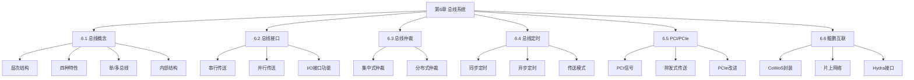

# 总结-第6章-总线系统

## 基本信息
- **课程**：计算机组成原理
- **章节**：第6章 总线系统
- **日期**：2026-06-16
- **标签**：#总线 #总结 #复习

## 一、知识框架

## 二、核心知识点

### 1. 总线的基本概念

**定义**：总线是构成计算机系统的互联机构，是模块与模块之间传送信息的一组公用信号线。

**总线层次结构**：

| 层次 | 名称 | 连接对象 |
|:----:|:-----|:---------|
| 1 | 片内总线 | 处理器内部寄存器及运算部件 |
| 2 | 系统总线 | 处理器与存储器、通道 |
| 3 | I/O总线 | 主机与I/O设备 |
| 4 | 局部总线 | CPU私有存储器、高速外设 |

**总线四特性**：物理特性、功能特性、电气特性、时间特性

**总线带宽公式**：

$$D_r = D \times f$$

### 2. 总线连接方式

| 方式 | 优点 | 缺点 |
|:-----|:-----|:-----|
| 单总线 | 简单、易扩展 | 高低速设备共用，效率受限 |
| 多总线 | 效率高、吞吐量大 | 结构复杂 |

**当代总线四部分**：数据传送总线、仲裁总线、中断和同步总线、公用线

### 3. 信息传送方式

| 方式 | 传输线数 | 速度 | 成本 | 适用场景 |
|:-----|:--------:|:----:|:----:|:---------|
| 串行 | 1条 | 慢 | 低 | 长距离通信 |
| 并行 | n条 | 快 | 高 | 系统总线 |

**I/O接口四大功能**：控制、缓冲、状态、转换

### 4. 总线仲裁

**三种集中式仲裁方式对比**：

| 比较项 | 链式查询 | 计数器查询 | 独立请求 |
|:-------|:---------|:-----------|:---------|
| 控制线数 | 2 | $\lceil \log_2 n \rceil + 2$ | $2n$ |
| 响应速度 | 慢 | 中等 | 快 |
| 优先级灵活性 | 固定 | 较灵活 | 最灵活 |
| 故障敏感性 | 敏感 | 不敏感 | 不敏感 |
| 应用 | 简单系统 | 中等系统 | 当代总线标准 |

**分布式仲裁**：各主设备有自己的仲裁号和仲裁器，基于优先级策略。

### 5. 总线定时

| 比较项 | 同步定时 | 异步定时 |
|:-------|:---------|:---------|
| 时钟信号 | 需要统一时钟 | 不需要公共时钟 |
| 总线周期 | 固定 | 可变 |
| 时序方式 | 时钟边沿触发 | 应答/互锁机制 |
| 适用场景 | 总线短、模块速度相近 | 模块速度差异大 |

**数据传送模式**：读/写、块传送（猝发式）、写后读/读修改写（原子操作）、广播/广集

### 6. PCI总线

**特点**：
- 高带宽、与处理器无关的标准总线
- 同步定时协议、集中式仲裁策略
- 自动配置能力
- 基本传输机制：猝发式传送

**隐藏式仲裁**：在当前总线占用期间裁决下一次主方，不需要单独仲裁周期。

**PCIe改进**：

| 改进点 | PCI | PCIe |
|:-------|:----|:-----|
| 信号传输 | 单端对地 | 高速差分传输 |
| 传输方式 | 并行 | 串行 |
| 连接方式 | 共享总线 | 全双工端到端 |
| 通道数 | 固定 | x1~x32 |
| 时钟 | 单独传输 | 嵌入时钟 |

### 7. 鲲鹏处理器总线与互联

**CoWoS封装**：多晶片合封，"乐高架构"组合灵活。

**片上网络组成**：

| 部件 | 功能 |
|:-----|:-----|
| 环总线 | 片上系统内部连接各设备 |
| SLLC | 连接多个超级集群的环总线 |
| 调度器 | I/O请求调度与汇聚 |
| 分发器 | 请求分发至正确设备 |
| Hydra接口 | 多芯片片间互联，支持cache一致性 |

**多芯片系统**：4个片上系统组成标准4P服务器，片间通信带宽240Gbit/s。

## 三、考试重点

1. 总线带宽计算：$D_r = D \times f$
2. 单总线与多总线结构的特点
3. 三种集中式仲裁方式的对比
4. 同步定时与异步定时的区别
5. PCI总线的猝发式传送机制
6. PCIe相比PCI的主要改进

## 四、相关链接

- [第6章-总线系统](../章节笔记/第6章-总线系统/第6章-总线系统.md)
