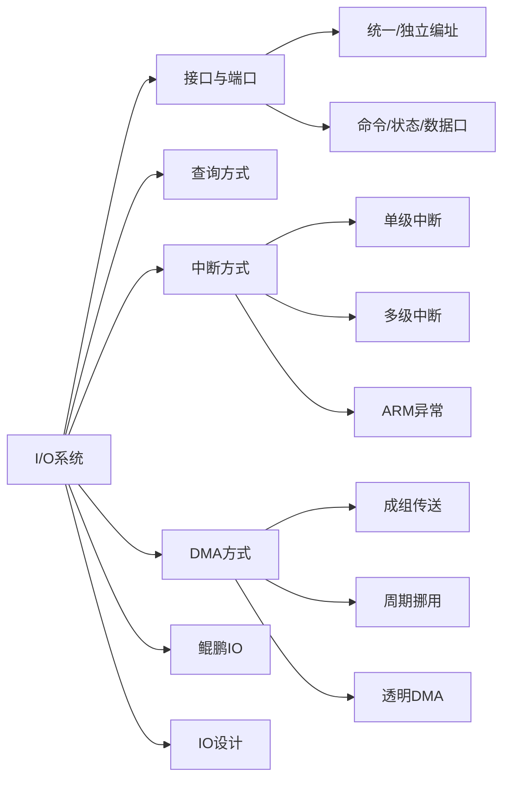

# 总结-第8章-输入输出系统

## 一、知识框架

## 二、核心知识点

### 1. I/O接口与端口

| 概念 | 说明 |
|:-----|:-----|
| **I/O接口** | 半导体逻辑电路，转换器，保证外设按系统要求收发数据 |
| **端口** | 接口内可被CPU直接访问的寄存器 |
| **统一编址** | I/O端口与内存联合编址，用访存指令访问 |
| **独立编址** | I/O地址与内存地址分开，需专门I/O指令 |

### 2. 五种I/O控制方式

| 方式 | 控制者 | 特点 | 适用 |
|:-----|:------|:-----|:-----|
| 无条件传送 | 硬件 | 假设外设始终就绪 | 简单设备 |
| 程序查询 | CPU程序 | 主动轮询，结构简单，浪费CPU时间 | 低速设备 |
| 程序中断 | CPU+硬件 | 外设主动通知，CPU效率高 | 随机请求 |
| DMA | DMA控制器 | 硬件控制，不经过CPU，速度快 | 高速批量数据 |
| 通道/IOP | 专用处理器 | CPU只负责数据处理 | 复杂I/O管理 |

### 3. 程序查询方式

- 接口组成：设备选择电路、数据缓冲寄存器、设备状态标志
- 查询步骤：发命令 → 读状态 → 检查Ready → 传送数据
- 改进：周期性轮询，按数据传输率从高到低排序

### 4. 程序中断方式

**四个标志触发器**：
- **RD**：准备就绪，设备动作完毕置1
- **EI**：允许中断，程序控制是否允许发中断请求
- **IR**：中断请求，暂存设备中断请求信号
- **IM**：中断屏蔽，0受理中断，1不受理

**中断处理四问题**：
1. 指令执行完毕才受理
2. 保存现场（PC、寄存器、状态）
3. 中断屏蔽（关中断/开中断）
4. 硬件与软件结合（隐操作 + 服务程序）

**向量中断 vs 查询中断**：

| 特性 | 向量中断 | 查询中断 |
|:-----|:--------|:--------|
| 入口地址 | 硬件自动产生 | 软件查询确定 |
| 响应速度 | 快 | 较慢 |
| 优先级调整 | 较固定 | 灵活可调 |

**单级中断**：所有中断源同一级，不允许嵌套，用串行排队链法识别中断源。

**多级中断**：分多个优先级，高优先级可打断低优先级，用中断屏蔽字IM控制。

**ARMv8-A异常**：
- 同步异常：由执行指令引起（终止、复位、系统调用）
- 异步异常：IRQ、FIQ、SError
- 异常等级EL0~EL3，进入可提升，返回可降低

### 5. DMA方式

**DMA控制器组成**：
- 内存地址计数器
- 字计数器
- 数据缓冲寄存器
- DMA请求标志
- 控制/状态逻辑

**三种传送方式**：

| 方式 | 机制 | 优点 | 缺点 |
|:-----|:-----|:-----|:-----|
| 成组连续传送 | DMA批量控制总线 | 控制简单 | 内存有闲置周期 |
| 周期挪用 | 逐周期挪用 | 效率较高 | 每次需申请总线 |
| 透明DMA | 固定分时C1/C2 | CPU完全并行 | CPU工作周期长 |

### 6. 鲲鹏920 I/O子系统

**三类片上设备**：固件设备、平台设备、片上附加设备

**虚拟PCIe总线（VPB）**：
- 片上设备映射为PCIe端点
- 支持INTx仿真和MSI/MSI-X中断
- MSI通过ITS翻译为LPI中断

**网络子系统**：NIC + RoCEE
- NIC引擎：常规以太网通信
- RoCEE：硬件实现RDMA，卸载CPU负荷

**外存储子系统**：
- SAS控制器：支持SAS3.0/SATA3.0，8个PHY
- SATA主机控制器：2个SATA端口，AHCI规范

### 7. I/O系统设计

**时延约束**：确保I/O操作延迟在限定范围内。无负载时直接累加，有负载时用排队理论或模拟。

**带宽约束设计步骤**：
1. 找出I/O路径中的瓶颈部件
2. 配置瓶颈部件保持所需带宽
3. 配置其他部件支持该带宽

## 三、考试重点

📌 **必考内容**：
1. 五种I/O控制方式的特点和适用场景
2. 中断处理过程、四个核心问题、四个标志触发器
3. 向量中断与查询中断的区别
4. 单级中断与多级中断的结构和原理
5. DMA三种传送方式的特点和比较
6. DMA控制器的组成和工作原理

📌 **计算题**：
1. 例8.1类型：CPU速度提升后I/O占比变化
2. 例8.3类型：中断饱和时间和极限频率
3. 例8.5类型：I/O系统最大速度、磁盘数、控制器数

📌 **常见题型**：
- 中断屏蔽字的设置（改变中断处理次序）
- 单级/多级中断的响应过程分析
- DMA传送方式的选择和比较
