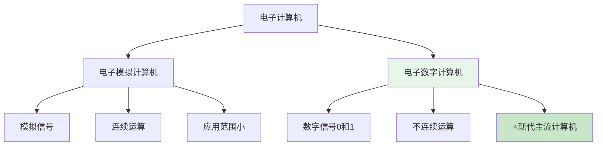
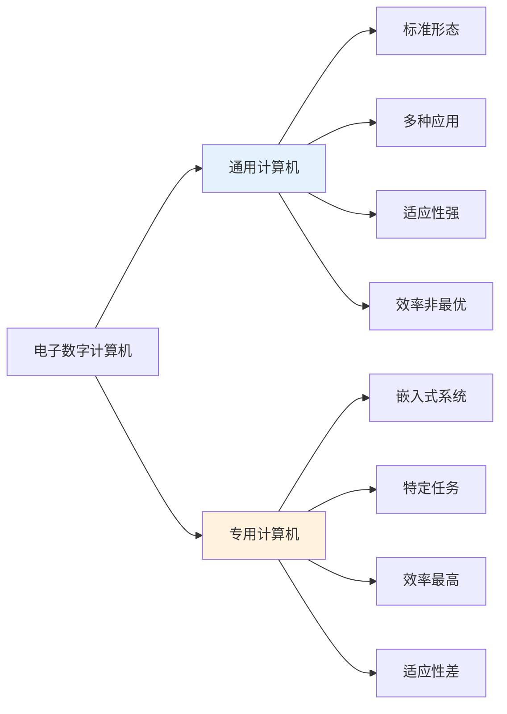

# 第1章-1.1 计算机的分类

## 基本信息

- **课程**：计算机组成原理
- **章节**：第1章 1.1节 计算机的分类
- **日期**：2026-04-20
- **标签**：#计算机分类 #电子数字计算机 #电子模拟计算机 #通用计算机 #专用计算机

***

## 重点内容

### ⭐⭐⭐ 核心重点

1. **电子数字计算机 vs 电子模拟计算机**的区别（数据表示、精度、存储量、逻辑判断）
2. **通用计算机 vs 专用计算机**的特点和适用场景

### ⭐⭐ 重要概念

1. 为什么现代计算机采用二进制
2. 以应用为中心的分类方法

### ⭐ 了解内容

1. 历史分类方法及其局限性

***

## 详细笔记

### 一、电子计算机的两大类型

电子计算机按照**输入输出信号的形式**划分：

#### 1. 电子模拟计算机

- 采用**模拟信号**输入输出
- 通过**模拟电压信号**进行计算
- 数值由**连续的模拟量**表示
- 运算过程是**连续的**

#### 2. 电子数字计算机

- 用**数字信号**表示数值的大小
- 按\*\*二进制位(bit)\*\*运算
- **不连续地跳动计算**

### 🔥 核心对比表

| 比较内容       | 电子数字计算机 | 电子模拟计算机  |
| ---------- | ------- | -------- |
| **数据表示方式** | 数字0和1   | 电压       |
| **计算方式**   | 数字计数    | 电压组合和测量值 |
| **控制方式**   | 程序控制    | 盘上连线     |
| **精度**     | ⭐ 高     | 低        |
| **数据存储量**  | ⭐ 大     | 小        |
| **逻辑判断能力** | ⭐ 强     | 无        |

### 💡 关键理解

> **为什么叫"电脑"？**
> 电子数字计算机以近似于人类的"思维过程"来进行工作，所以称为**电脑**。它的发明和发展是20世纪人类最伟大的科学技术成就之一。

> **为什么现代计算机采用二进制？**
> 1和0可以用电压的高低、脉冲的有无来表示，这种表示方法在电子器件中很容易实现，而且设备最省。

***

### 二、现代计算机的分类方法

#### 📌 历史分类（已过时）

早期按**体系结构、运算速度、结构规模、适用领域**等分类：

- 超级计算机 → 大型机 → 服务器 → PC机 → 单片机

⚠️ **这种分类方式已经没有意义了！**

- 当前手持计算机终端设备的处理能力已经远远超过了当年大中型计算机
- 靠运算速度、结构规模等对计算机分类无法适应计算机技术的发展变化

#### 🔥 现代分类：以应用为中心

##### 1. 通用计算机

- **特点**：具有计算机的标准形态，通过装配不同的应用软件，以类同面目出现并应用在社会的各个方面
- **优点**：不专门针对某种应用，可用于多种应用，**适应性很强**
- **缺点**：牺牲了**效率、速度和经济性**，对特定应用而言未必是最优的
- **例子**：PC、工作站、服务器

##### 2. 专用计算机

- **特点**：针对某一类**特定任务**设计的计算机
- **形态**：主要以**嵌入式(embedded)计算机**的形式出现
- **应用**：被安装、固定、嵌入到交通工具、仪器仪表、控制系统、通信设备、家用电器等部件中
- **优点**：对特定的应用场景而言，是**最有效、最经济和最快速**的计算机
- **缺点**：**适应性很差**，一般不能应用于设计目标以外的应用场景
- **例子**：手机芯片、汽车ECU、家电控制器

### 对比总结表

| 特性       | 通用计算机      | 专用计算机            |
| -------- | ---------- | ---------------- |
| **形态**   | 标准形态       | 嵌入式形式            |
| **应用范围** | 多种应用       | 特定任务             |
| **适应性**  | ⭐ 强        | 差                |
| **效率**   | 一般         | ⭐ 最高             |
| **经济性**  | 一般         | ⭐ 最优             |
| **例子**   | PC、工作站、服务器 | 手机芯片、汽车ECU、家电控制器 |

***

## 疑问与思考

### ❓ 待解决问题

1.  
2.  

### 💡 个人理解/技巧

- 电子数字计算机成为主流的根本原因在于：**精度高、存储量大、具有逻辑判断能力**
- 通用计算机和专用计算机的权衡本质是：**适应性 vs 效率**的权衡
- 现代智能手机虽然功能多样，但其核心处理器仍然是针对移动场景优化的专用计算机（嵌入式系统）

***

## 相关链接

- **课本出处**：第1章 1.1节"计算机的分类"
- **上一节**：无（本章第一节）
- **下一节**：[第1章-1.2-计算机的发展简史](./第1章-1.2-计算机的发展简史.md)
- **章节总结**：[第1章-计算机系统概述](./第1章-计算机系统概述.md)

***

## 📌 本节重点总结

| 重点内容             | 掌握程度     |
| ---------------- | -------- |
| 电子数字vs模拟计算机的6大区别 | ⭐⭐⭐ 必须掌握 |
| 为什么现代计算机采用二进制    | ⭐⭐⭐ 必须掌握 |
| 通用vs专用计算机的特点对比   | ⭐⭐ 重要    |
| 历史分类方法的局限性       | ⭐ 了解     |

***

## 习题练习

### 思考题

1. 为什么电子数字计算机成为主流，而电子模拟计算机应用范围较小？
2. 通用计算机和专用计算机各有什么优缺点？选择时需要考虑哪些因素？
3. 你的手机属于通用计算机还是专用计算机？为什么？

### 判断题

1. 电子模拟计算机的精度比电子数字计算机高。（ ）
2. 专用计算机的适应性比通用计算机强。（ ）
3. 现代计算机分类应该以应用为中心，而不是以性能指标为中心。（ ）

### 选择题

1. 下列关于电子数字计算机和电子模拟计算机的比较，错误的是（ ）
   - A. 电子数字计算机采用二进制表示数据
   - B. 电子模拟计算机的运算过程是连续的
   - C. 电子模拟计算机的逻辑判断能力更强
   - D. 电子数字计算机的数据存储量更大
2. 下列设备中，属于专用计算机的是（ ）
   - A. 个人电脑
   - B. 服务器
   - C. 汽车ECU
   - D. 工作站

***

*笔记创建时间：2026-04-20*
