# 第1章-1.3 计算机的硬件

## 基本信息
- **课程**：计算机组成原理
- **章节**：第1章 1.3节 计算机的硬件
- **日期**：2026-04-20
- **标签**：#计算机硬件 #五大部件 #冯诺依曼结构 #运算器 #控制器 #存储器

---

## 重点内容

### ⭐⭐⭐ 核心重点
1. **计算机五大部件**：运算器、控制器、存储器、输入设备、输出设备
2. **冯·诺依曼结构的核心思想**：存储程序、程序控制
3. **指令的组成**：操作码 + 地址码
4. **指令流和数据流**的区别

### ⭐⭐ 重要概念
1. 存储器的工作原理（地址、存储单元、存储容量）
2. 控制器的基本任务（取指周期、执行周期）
3. 适配器的作用

### ⭐ 了解内容
1. 存储器的层次结构（内存、外存、Cache）
2. 总线的作用

---

## 详细笔记

### 一、硬件组成要素 ⭐⭐⭐

#### 1.3.1 从打算盘理解计算机组成

课本通过**打算盘**的例子来解释计算机的五大组成：

| 打算盘要素 | 对应计算机部件 | 功能 |
|-----------|---------------|------|
| **算盘** | **运算器** | 进行算术运算 |
| **带横格的纸** | **存储器** | 存储原始数据和解题步骤 |
| **笔** | **输入/输出设备** | 记录数据和输出结果 |
| **人的大脑** | **控制器** | 控制整个计算过程 |

**计算 y = ax + b - c 的过程**：

```
步骤1: 取数 a → 算盘
步骤2: 乘法 x → 算盘 (完成 a·x)
步骤3: 加法 b → 算盘 (完成 ax+b)
步骤4: 减法 c → 算盘 (完成 y=ax+b-c)
步骤5: 存数 y → 纸
步骤6: 输出 (写出结果)
步骤7: 停止
```

#### 2. 计算机五大部件

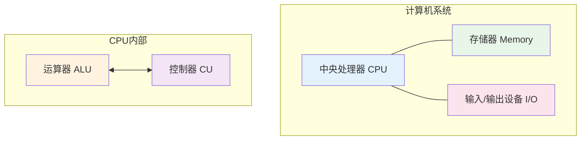

| 部件 | 英文 | 功能 | 类比 |
|-----|------|------|------|
| **运算器** | ALU | 进行算术运算和逻辑运算 | 算盘 |
| **控制器** | CU | 控制整个计算过程，取指令、分析指令、执行指令 | 人的大脑 |
| **存储器** | Memory | 存储程序和数据 | 带横格的纸 |
| **输入设备** | Input | 将信息送入计算机 | 笔（写入） |
| **输出设备** | Output | 将结果展示出来 | 笔（写出） |

> 💡 **CPU = 运算器 + 控制器**

#### 📷 图1.2 数字计算机的主要组成结构

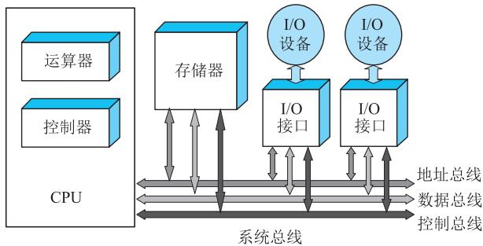

> 📚 **课本出处**：图1.2 展示了计算机五大部件（运算器、控制器、存储器、输入设备、输出设备）之间的连接关系

---

### 二、1.3.2 运算器 ⭐⭐⭐

#### 功能
- 进行**加、减、乘、除**等**算术运算**
- 进行**逻辑运算**
- 因此通常称为 **ALU（算术逻辑运算部件）**

#### 为什么采用二进制？

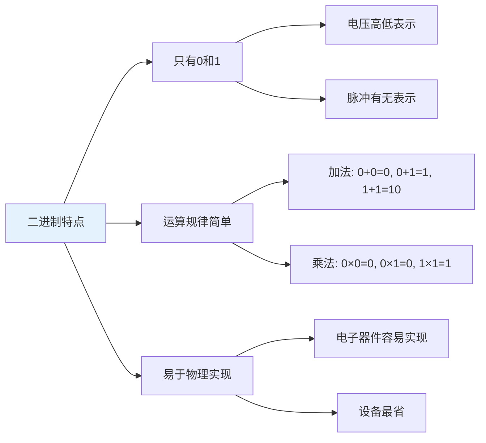

**二进制运算规律**：
- **加法**：
  - 0 + 0 = 0
  - 0 + 1 = 1
  - 1 + 0 = 1
  - 1 + 1 = 10（进位）
- **乘法**：
  - 0 × 0 = 0
  - 0 × 1 = 0
  - 1 × 0 = 0
  - 1 × 1 = 1

#### 📷 图1.3 运算器结构示意图

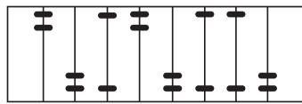

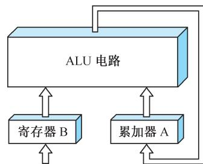

> 📚 **课本出处**：图1.3 展示了运算器（ALU）的内部结构，包括算术运算和逻辑运算功能

#### 运算器长度
- 8位、16位、32位、64位
- 位数越多，计算精度越高
- 但位数越多，所需电子器件也越多

---

### 三、1.3.3 存储器 ⭐⭐⭐

#### 功能
- 保存或"记忆"解题的**原始数据**和**解题步骤**

#### 存储器的基本概念

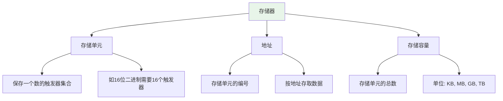

| 概念 | 说明 |
|-----|------|
| **存储单元** | 保存一个数的触发器集合（如16位=16个触发器） |
| **地址** | 存储单元的编号，按地址寻找存储单元 |
| **存储容量** | 存储单元的总数，如64KB、128MB |

#### 📷 图1.4 存储器结构示意图

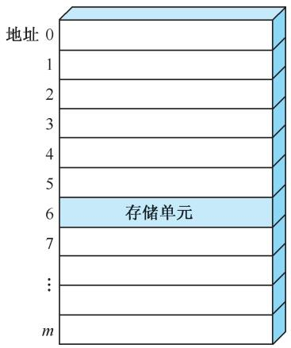

> 📚 **课本出处**：图1.4 展示了存储器的结构，包括存储单元、地址、以及按地址存取数据的方式

#### 存储器的层次结构

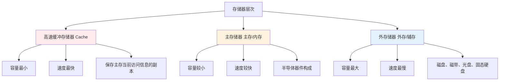

| 层次 | 名称 | 特点 | 介质 |
|-----|------|------|------|
| 最高层 | Cache | 容量最小，速度最快 | 半导体 |
| 中间层 | 主存/内存 | 容量较小，速度较快 | 半导体 |
| 最底层 | 外存/辅存 | 容量最大，速度最慢 | 磁盘、光盘、固态 |

> 💡 **狭义的存储器仅指内存储器（内存）**

---

### 四、1.3.4 控制器 ⭐⭐⭐

#### 功能
- 计算机中**发号施令**的部件
- 控制计算机各部件**有条不紊**地进行工作
- **基本任务**：从内存中取出解题步骤加以分析，然后执行某种操作

#### 1. 计算程序

**指令**：每一个基本操作称为一条指令
**程序**：解算某一问题的一串指令序列

**示例：计算 y = ax + b - c 的程序**

| 指令地址 | 操作码 | 地址码 | 操作内容 | 说明 |
|---------|--------|--------|---------|------|
| 1 | 取数 | 9 | (9)→A | 存储器9号地址的数a放入运算器A |
| 2 | 乘法 | 12 | (A)×(12)→A | 完成a·x，结果保留在运算器A |
| 3 | 加法 | 10 | (A)+(10)→A | 完成ax+b，结果保留在运算器A |
| 4 | 减法 | 11 | (A)-(11)→A | 完成y=ax+b-c，结果保留在运算器A |
| 5 | 存数 | 13 | A→13 | 运算器A中的结果y送入存储器13号地址 |
| 6 | 打印 | - | A→Print | 将A中的结果打印出来 |
| 7 | 停止 | - | Stop | 机器停止工作 |

#### 2. 指令的形式 ⭐⭐⭐

```
┌─────────┬─────────┐
│  操作码  │  地址码  │
│  (操作性质) │ (操作数地址)│
└─────────┴─────────┘
```

| 部分 | 作用 | 示例 |
|-----|------|------|
| **操作码** | 指出指令所进行的操作种类 | 加、减、乘、除、取数、存数 |
| **地址码** | 表示参加运算的数据应从哪个单元取来 | 存储器地址9、10、11、12 |

**指令的二进制表示**：

| 指令 | 操作码（3位二进制） |
|------|-------------------|
| 加法 | 001 |
| 减法 | 010 |
| 乘法 | 011 |
| 除法 | 100 |
| 取数 | 101 |
| 存数 | 110 |
| 打印 | 111 |
| 停机 | 000 |

#### 📷 图1.5 指令和数据在存储器中用二进制码存储

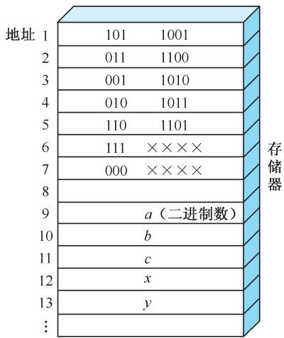

> 📚 **课本出处**：图1.5 展示了指令和数据都以二进制形式存放在存储器中，控制器通过取指周期和执行周期来区分指令流和数据流

#### 3. 🔥 冯·诺依曼型计算机的设计思想 ⭐⭐⭐

> **存储程序**：将解题的程序（指令序列）存放到存储器中
> **程序控制**：控制器依据存储的程序来控制全机协调工作
> **核心**：存储程序并按地址顺序执行

**指令和数据的关系**：
- 指令和数据**统统放在内存中**
- 从形式上看，都是**二进制数码**
- 指令通常**按顺序执行**，顺次存放在存储器中

#### 4. 控制器的基本任务 ⭐⭐⭐

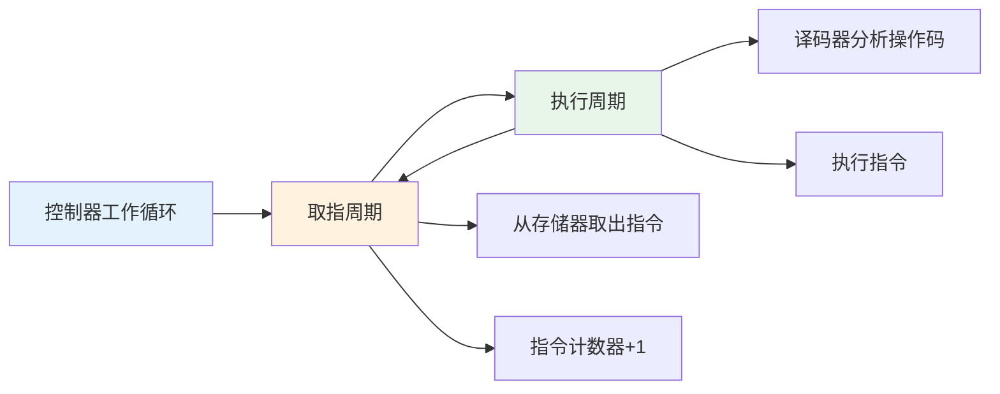

| 周期 | 任务 | 说明 |
|-----|------|------|
| **取指周期** | 从存储器取出一条指令 | 指令计数器(PC)自动+1，为取下一条指令做准备 |
| **执行周期** | 执行这条指令 | 译码器分析操作码，然后执行 |

> 💡 **控制器反复交替地处在取指周期与执行周期之中**

#### 📷 图1.6 控制器功能示意

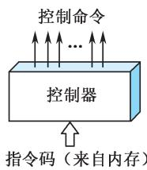

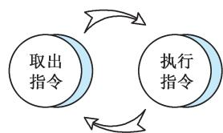

> 📚 **课本出处**：图1.6 展示了控制器的工作流程，包括取指周期和执行周期的交替执行

#### 5. 指令流和数据流 ⭐⭐⭐

| 概念 | 定义 | 流向 | 示例 |
|-----|------|------|------|
| **指令流** | 取指周期中从内存读出的信息流 | 内存 → 控制器 | 地址1~7号单元读出的信息流 |
| **数据流** | 执行周期中从内存读出的信息流 | 内存 → 运算器 | 地址9~12号单元读出的信息流 |

**区分方法**：
- 控制器能够区分指令字和数据字
- 取指周期读出的是**指令流**
- 执行周期读出的是**数据流**

---

### 五、1.3.5 适配器与输入/输出设备

#### 输入设备
- 把人们熟悉的信息形式变换为机器能接收的**二进制信息**
- 例如：键盘、鼠标、麦克风、扫描仪、OCR、语音识别

#### 输出设备
- 把计算机处理的结果变换为人能识别的信息形式
- 例如：打印机、显示器、投影仪、音箱

#### 适配器（接口）

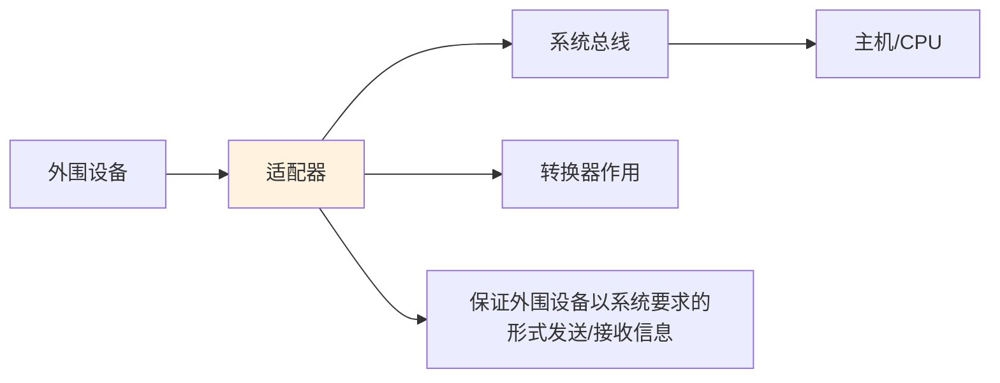

| 作用 | 说明 |
|-----|------|
| **转换器** | 外围设备速度各异，不直接与主机相连 |
| **协调工作** | 使主机和外围设备**并行协调**地工作 |

#### 总线（Bus）
- **系统总线**：构成计算机系统的骨架
- **功能**：多个系统部件之间进行数据传送的**公共通道**
- **传输内容**：地址、数据、控制信息

---

## 疑问与思考

### ❓ 待解决问题
1. 
2. 

### 💡 个人理解/技巧
- **冯·诺依曼结构的核心**是"存储程序"，这使得计算机成为可编程机器
- **取指周期和执行周期**的交替是计算机自动工作的关键
- **指令流和数据流**的区分体现了控制器对程序执行的控制
- 存储器的**层次结构**解决了容量、速度、成本之间的矛盾

---

## 相关链接

- **课本出处**：第1章 1.3节"计算机的硬件"
- **上一节**：[第1章-1.2-计算机的发展简史](./第1章-1.2-计算机的发展简史.md)
- **下一节**：[第1章-1.4-计算机的软件](./第1章-1.4-计算机的软件.md)
- **章节总结**：[第1章-计算机系统概述](./第1章-计算机系统概述.md)
- **重点图示**：
  - 图1.2 数字计算机的主要组成结构
  - 图1.3 运算器结构示意图
  - 图1.4 存储器结构示意图
  - 图1.5 指令和数据在存储器中用二进制码存储
  - 图1.6 控制器功能示意

---

## 📌 本节重点总结

| 重点内容 | 掌握程度 |
|---------|---------|
| 计算机五大部件及其功能 | ⭐⭐⭐ 必须掌握 |
| 冯·诺依曼结构的核心思想（存储程序、程序控制） | ⭐⭐⭐ 必须掌握 |
| 指令的组成（操作码+地址码） | ⭐⭐⭐ 必须掌握 |
| 控制器的基本任务（取指周期、执行周期） | ⭐⭐⭐ 必须掌握 |
| 指令流和数据流的区别 | ⭐⭐⭐ 必须掌握 |
| 存储器的层次结构 | ⭐⭐ 重要 |
| 适配器的作用 | ⭐ 了解 |

---

## 习题练习

### 思考题
1. 冯·诺依曼型计算机的设计思想是什么？为什么称为"存储程序"？
2. 指令流和数据流有什么区别？控制器如何区分它们？
3. 为什么计算机采用二进制而不是十进制？
4. 存储器为什么要分层次？各层次有什么特点？

### 判断题
1. 运算器只能进行算术运算，不能进行逻辑运算。（ ）
2. 指令由操作码和地址码两部分组成。（ ）
3. 取指周期和执行周期是控制器工作的两个基本阶段。（ ）
4. 指令流和数据流都是从内存流向运算器。（ ）
5. 适配器的作用是使外围设备与主机并行协调工作。（ ）

### 选择题
1. 下列不属于计算机五大部件的是（ ）
   - A. 运算器
   - B. 控制器
   - C. 适配器
   - D. 存储器

2. 指令的地址码部分表示（ ）
   - A. 操作的性质
   - B. 操作数的地址
   - C. 指令的地址
   - D. 程序的起始地址

3. 在取指周期中，从内存读出的信息流称为（ ）
   - A. 数据流
   - B. 指令流
   - C. 控制流
   - D. 地址流

4. 下列关于存储器层次结构的描述，正确的是（ ）
   - A. Cache容量最大，速度最慢
   - B. 主存容量最小，速度最快
   - C. 外存容量最大，速度最慢
   - D. 三者容量和速度都相同

### 简答题
1. 简述计算机五大部件的功能，并说明它们之间的关系。
2. 什么是存储程序概念？它有什么重要意义？
3. 画出控制器的工作流程图，说明取指周期和执行周期的任务。

---

*笔记创建时间：2026-04-20*
