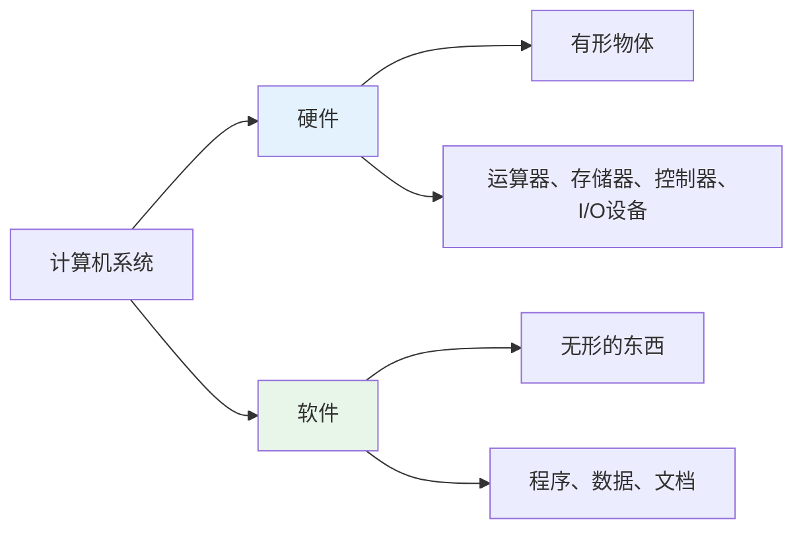
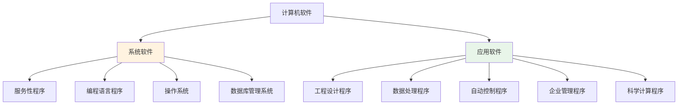
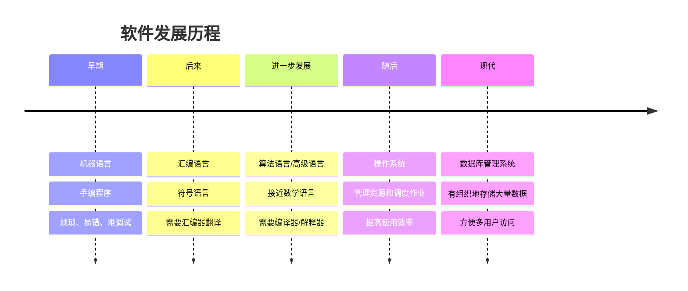
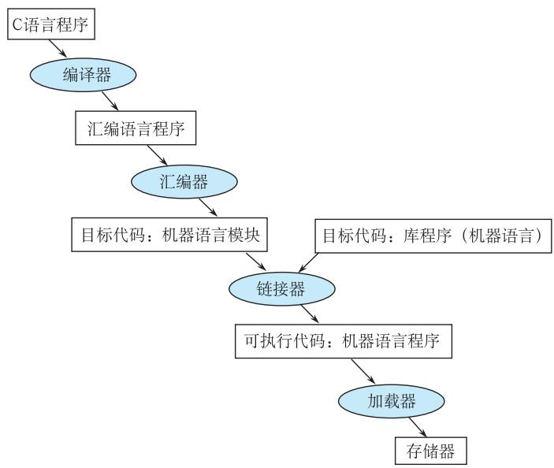

# 第1章-1.4 计算机的软件

## 基本信息
- **课程**：计算机组成原理
- **章节**：第1章 1.4节 计算机的软件
- **日期**：2026-04-20
- **标签**：#计算机软件 #系统软件 #应用软件 #软件发展 #编程语言

---

## 重点内容

### ⭐⭐⭐ 核心重点
1. **软件的分类**：系统软件 vs 应用软件
2. **系统软件的组成**：服务性程序、编程语言程序、操作系统、数据库管理系统
3. **软件的发展阶段**：机器语言 → 汇编语言 → 算法语言（高级语言）→ 操作系统 → 数据库管理系统

### ⭐⭐ 重要概念
1. 汇编器、编译器、解释器的作用
2. 源程序与目的程序的区别
3. 操作系统的作用

### ⭐ 了解内容
1. 软件发展的趋势
2. 数据库管理系统的概念

---

## 详细笔记

### 一、软件的基本概念

#### 硬件 vs 软件



| 对比项 | 硬件 | 软件 |
|-------|------|------|
| **形态** | 有形物体（元器件构成） | 无形（程序、数据） |
| **组成** | 运算器、存储器、控制器、适配器、总线、I/O设备 | 各种程序 |
| **作用** | 提供计算能力 | 让计算机"活"起来，自动完成运算 |

> 💡 **类比**：算盘是硬件，运算法则和解题步骤是软件

#### 软件的定义
凡是用于一台计算机的各种程序，统称为这台计算机的**程序**或**软件系统**。

---

### 二、1.4.1 软件的组成与分类 ⭐⭐⭐



#### 1. 系统软件

**作用**：简化程序设计，简化使用方法，提高计算机使用效率，发挥和扩大计算机功能

| 类型 | 说明 | 例子 |
|-----|------|------|
| **① 服务性程序** | 辅助性工具程序 | 诊断程序、排错程序、练习程序 |
| **② 编程语言程序** | 将高级语言/汇编语言翻译为机器语言 | 汇编程序、编译程序、解释程序 |
| **③ 操作系统** | 管理计算机资源，调度用户作业 | Windows、Linux、Unix |
| **④ 数据库管理系统** | 管理大量数据，方便多用户访问 | MySQL、Oracle、SQL Server |

#### 2. 应用软件

**定义**：用户利用计算机解决某些问题而编制的软件

| 应用领域 | 例子 |
|---------|------|
| 工程设计 | CAD软件 |
| 数据处理 | Excel、数据分析软件 |
| 自动控制 | 工业控制程序 |
| 企业管理 | ERP系统 |
| 情报检索 | 搜索引擎 |
| 科学计算 | MATLAB、Mathematica |

---

### 三、1.4.2 软件的发展演变 ⭐⭐⭐



#### 阶段1：机器语言（早期）

| 特点 | 说明 |
|-----|------|
| **形式** | 直接用机器指令代码（二进制）编写程序 |
| **名称** | 手编程序 / 目的程序 |
| **优点** | 计算机可以直接识别和执行 |
| **缺点** | 烦琐、耗费大量人力和时间、容易出错、难调试 |

#### 阶段2：汇编语言

| 特点 | 说明 |
|-----|------|
| **形式** | 用约定的文字、符号、数字按规定格式表示指令 |
| **优点** | 简单直观、便于记忆，比机器语言方便 |
| **缺点** | 还是初级语言，面向具体机器，不同计算机指令系统不同 |
| **翻译工具** | **汇编器**（Assembler） |

**汇编器的作用**：
```
汇编语言程序 --[汇编器]--> 机器语言程序（目的程序）
（符号语言）              （二进制代码）
   ↓                          ↓
人容易理解               计算机能执行
```

#### 阶段3：算法语言（高级语言）

| 特点 | 说明 |
|-----|------|
| **形式** | 接近于数学语言，按规则用基本符号构成程序 |
| **优点** | 直观通用、与具体机器无关，稍加学习就能掌握 |
| **代表语言** | BASIC、FORTRAN、C、C++、Java、Python |
| **翻译工具** | **编译器**（Compiler）或**解释器**（Interpreter） |

**编译器 vs 解释器**：

| 对比项 | 编译器 | 解释器 |
|-------|--------|--------|
| **工作方式** | 一次性将整个源程序翻译成目的程序 | 逐行翻译并执行 |
| **执行效率** | 高（翻译一次，多次执行） | 低（每次都要翻译） |
| **调试方便性** | 需要全部编译后才能发现错误 | 逐行执行，错误即时发现 |
| **代表语言** | C、C++、Java | Python、JavaScript |

**C语言的转换过程**：


#### 📷 图1.7 C语言的转换层次



> 📚 **课本出处**：图1.7 展示了C语言程序被转换成可执行机器语言的四个步骤：编译→汇编→链接→加载

#### 阶段4：操作系统

**产生背景**：
- 用户直接使用大型机器并独占机器，效率低
- 用户觉得机器"太硬"，很多情况都得依附它
- 计算机觉得用户及外部设备"太笨"，常常处于无事可做的状态
- 人的思维速度跟不上计算机的计算速度

**操作系统的作用**：
1. **管理计算机资源**：处理器、内存、外部设备
2. **管理各种编译、应用程序**
3. **自动调度用户的作业程序**
4. **使多个用户能有效地共用一套计算机系统**

**效果**：计算机使用效率成倍提高，方便用户使用

**操作系统分类**：
- **批处理操作系统**
- **分时操作系统**
- **实时操作系统**

#### 阶段5：数据库管理系统

**产生背景**：
- 计算机在信息处理、情报检索、管理系统中应用发展
- 需要大量处理某些数据，建立和检索大量表格

**数据库定义**：
> 实现有组织地、动态地存储大量相关数据，方便多用户访问的计算机软、硬件资源组成的系统

**数据库管理系统（DBMS）**：
- 数据库 + 数据库管理软件
- 使数据和表格按一定规律组织
- 处理更方便，检索更迅速

---

### 四、软件发展的趋势

| 方向 | 说明 |
|-----|------|
| **标准化** | 统一标准，便于互操作 |
| **积木化** | 模块化设计，便于复用 |
| **产品化** | 商业化、市场化 |
| **自然语言** | 最终向自然语言发展，能够自动生成程序 |

---

## 疑问与思考

### ❓ 待解决问题
1. 
2. 

### 💡 个人理解/技巧
- **软件让硬件"活"起来**：没有软件的硬件只是一堆电子元件，软件赋予计算机智能
- **语言的发展是抽象层次的提升**：机器语言（二进制）→ 汇编语言（符号）→ 高级语言（数学语言）→ 自然语言
- **翻译工具的重要性**：汇编器、编译器、解释器是人与计算机沟通的桥梁
- **操作系统是资源管理者**：让多个用户高效共享计算机资源
- **数据库是信息时代的基石**：有组织地管理海量数据

---

## 相关链接

- **课本出处**：第1章 1.4节"计算机的软件"
- **上一节**：[第1章-1.3-计算机的硬件](./第1章-1.3-计算机的硬件.md)
- **下一节**：[第1章-1.5-计算机系统性能评价](./第1章-1.5-计算机系统性能评价.md)
- **章节总结**：[第1章-计算机系统概述](./第1章-计算机系统概述.md)
- **重点图示**：
  - 图1.7 C语言的转换层次

---

## 📌 本节重点总结

| 重点内容 | 掌握程度 |
|---------|---------|
| 软件的分类（系统软件 vs 应用软件） | ⭐⭐⭐ 必须掌握 |
| 系统软件的四大组成部分 | ⭐⭐⭐ 必须掌握 |
| 软件发展的五个阶段 | ⭐⭐⭐ 必须掌握 |
| 汇编器、编译器、解释器的作用 | ⭐⭐ 重要 |
| 操作系统的作用 | ⭐⭐ 重要 |
| 源程序与目的程序的区别 | ⭐⭐ 重要 |

---

## 习题练习

### 思考题
1. 什么是系统软件？什么是应用软件？它们有什么区别？
2. 软件的发展经历了哪几个阶段？每个阶段有什么特点？
3. 编译器和解释器有什么区别？各有什么优缺点？
4. 操作系统的主要功能是什么？为什么要引入操作系统？
5. 为什么说"软件让硬件活起来"？

### 判断题
1. 系统软件和应用软件的主要区别在于是否直接为用户解决问题。（ ）
2. 汇编语言程序可以直接被计算机执行。（ ）
3. 高级语言与具体机器无关，具有通用性。（ ）
4. 编译器是将高级语言程序逐行翻译并执行的程序。（ ）
5. 操作系统的主要功能是管理计算机资源和调度用户作业。（ ）

### 选择题
1. 下列属于系统软件的是（ ）
   - A. 文字处理软件
   - B. 编译程序
   - C. 游戏软件
   - D. 财务管理软件

2. 将汇编语言程序翻译成机器语言程序的程序称为（ ）
   - A. 编译器
   - B. 解释器
   - C. 汇编器
   - D. 链接器

3. 下列关于高级语言的描述，错误的是（ ）
   - A. 接近数学语言，直观通用
   - B. 与具体机器无关
   - C. 可以直接被计算机执行
   - D. 需要编译器或解释器翻译

4. 操作系统的主要作用不包括（ ）
   - A. 管理计算机资源
   - B. 直接进行科学计算
   - C. 调度用户作业程序
   - D. 提高计算机使用效率

5. C语言程序转换为可执行程序的正确顺序是（ ）
   - A. 源程序 → 汇编器 → 编译器 → 链接器 → 可执行程序
   - B. 源程序 → 编译器 → 汇编器 → 链接器 → 可执行程序
   - C. 源程序 → 链接器 → 编译器 → 汇编器 → 可执行程序
   - D. 源程序 → 解释器 → 汇编器 → 链接器 → 可执行程序

### 简答题
1. 简述系统软件的四大组成部分及其功能。
2. 比较机器语言、汇编语言、高级语言的优缺点。
3. 什么是数据库管理系统？它有什么作用？

---

*笔记创建时间：2026-04-20*
