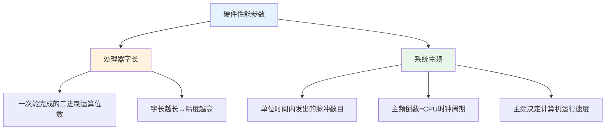

# 第1章-1.5 计算机系统性能评价

## 基本信息
- **课程**：计算机组成原理
- **章节**：第1章 1.5节 计算机系统性能评价
- **日期**：2026-04-20
- **标签**：#性能评价 #吞吐量 #响应时间 #CPI #MIPS #FLOPS #基准测试

---

## 重点内容

### ⭐⭐⭐ 核心重点
1. **性能指标**：吞吐量、响应时间、利用率
2. **关键参数**：CPI（每条指令时钟周期数）、MIPS（百万指令每秒）、FLOPS（浮点运算每秒）
3. **性能计算公式**：CPU执行时间、CPI、MIPS的计算

### ⭐⭐ 重要概念
1. 处理器字长和系统主频对性能的影响
2. 基准测试程序（Benchmark）的作用
3. SPEC测试基准体系

### ⭐ 了解内容
1. 各类测试基准的特点（TPC、Linpack、STREAM等）
2. 国产处理器的性能评测案例

---

## 详细笔记

### 一、1.5.1 计算机的性能指标 ⭐⭐⭐

#### 1. 系统处理能力指标

| 指标 | 定义 | 说明 |
|-----|------|------|
| **吞吐量** | 某一时间间隔内能够处理的信息量 | 表征系统处理能力 |
| **响应时间** | 从输入有效到系统产生响应之间的时间 | 表征系统响应速度 |
| **利用率** | 给定时间间隔内，系统被实际使用的时间所占的比率 | 利用率高→吞吐量越大 |

#### 2. 硬件性能参数



#### 3. 🔥 核心计算公式 ⭐⭐⭐

**公式1：CPU执行时间**
$$
CPU\text{执行时间} = CPU\text{时钟周期数} \times CPU\text{时钟周期长}
$$

**公式2：CPI（Cycles Per Instruction）**
$$
CPI = \frac{CPU\text{时钟周期数}}{指令条数} = \frac{N_C}{I_N}
$$

**公式3：MIPS（Million Instructions Per Second）**
$$
MIPS = \frac{指令条数}{CPU\text{执行时间} \times 10^6} = \frac{f}{CPI \times 10^6}
$$

> 💡 **记忆技巧**：MIPS = 主频 / (CPI × 10⁶)

#### 4. 运算速度单位

| 单位 | 全称 | 含义 | 适用场景 |
|-----|------|------|---------|
| **MIPS** | Million Instructions Per Second | 每秒百万条指令 | 定点运算 |
| **MFLOPS** | Million Floating-point Operations Per Second | 每秒10⁶次浮点运算 | 浮点运算 |
| **GFLOPS** | Giga FLOPS | 每秒10⁹次浮点运算 | 高性能计算 |
| **TFLOPS** | Tera FLOPS | 每秒10¹²次浮点运算 | 超级计算机 |
| **PFLOPS** | Peta FLOPS | 每秒10¹⁵次浮点运算 | 顶级超算 |

#### 5. 综合性能评估

> ⚠️ **重要**：一台计算机的性能是由**多项技术指标综合确定**的，不能片面强调某一项指标！

其他性能指标：
- 系统可靠性
- 可维护性
- 功耗
- 成本

---

### 二、🔥 例题解析 ⭐⭐⭐

#### 【例1.1】性能参数表达式推导

**已知条件**：
- $I_N$：执行程序中的指令总数
- $t_{CPU}$：执行该程序所需的CPU时间
- $T$：时钟周期
- $f$：时钟频率（$T$的倒数）
- $N_C$：CPU时钟周期数
- CPI：每条指令的平均时钟周期数
- MIPS：每秒钟执行的百万条指令数

**求解**：

**(1) CPU执行时间 $t_{CPU}$**
$$
t_{CPU} = N_C \times T = \frac{N_C}{f} = I_N \times CPI \times T = \left(\sum_{i=1}^{n} CPI_i \times I_i\right) \times T
$$

**(2) CPI**
$$
CPI = \frac{N_C}{I_N} = \sum_{i=1}^{n}\left(CPI_i \times \frac{I_i}{I_N}\right)
$$
> 其中 $\frac{I_i}{I_N}$ 表示 $i$ 指令在程序中所占比例

**(3) MIPS**
$$
MIPS = \frac{I_N}{t_{CPU} \times 10^6} = \frac{f}{CPI \times 10^6}
$$

**(4) CPU时钟周期数 $N_C$**
$$
N_C = \sum_{i=1}^{n} (CPI_i \times I_i)
$$
> 其中 $I_i$ 表示 $i$ 指令执行的次数，$CPI_i$ 表示 $i$ 指令所需的平均时钟周期数

---

#### 【例1.2】综合计算题

**题目**：用一台 **50 MHz** 处理器执行标准测试程序，混合指令数和平均时钟周期数如下表：

| 指令类型 | 指令数目 | 平均时钟周期数 |
|---------|---------|--------------|
| 整数运算 | 45,000 | 1 |
| 数据传送 | 32,000 | 2 |
| 浮点运算 | 15,000 | 2 |
| 控制传送 | 8,000 | 2 |

**求**：有效CPI、MIPS速率、程序执行时间 $t_{CPU}$

**解答**：

**Step 1：计算总指令数**
$$
I_N = 45000 + 32000 + 15000 + 8000 = 100000
$$

**Step 2：计算CPU时钟周期数 $N_C$**
$$
N_C = 45000 \times 1 + 32000 \times 2 + 15000 \times 2 + 8000 \times 2 = 155000
$$

**Step 3：计算CPI**
$$
CPI = \frac{N_C}{I_N} = \frac{155000}{100000} = 1.55 \text{（周期/指令）}
$$

**Step 4：计算MIPS**
$$
MIPS = \frac{f}{CPI \times 10^6} = \frac{50 \times 10^6}{1.55 \times 10^6} \approx 32.26 \text{（百万条指令/秒）}
$$

**Step 5：计算CPU执行时间**
$$
t_{CPU} = \frac{N_C}{f} = \frac{155000}{50 \times 10^6} = 3.1 \times 10^{-3} \text{s} = 3.1 \text{ms}
$$

---

### 三、1.5.2 计算机系统的测试基准 ⭐⭐

#### 1. 基准测试程序（Benchmark）

**作用**：
- 集成某一类用户的典型负载
- 评估系统性能的有力工具
- 比单个程序更能代表用户的负载状况

**度量方式**：
- 程序运行时间长度
- 单位时间内完成的操作数量

#### 2. 常见测试基准体系

| 测试基准 | 侧重点 | 应用场景 |
|---------|--------|---------|
| **TPC** | 在线处理能力和数据库查询能力 | 数据库服务器 |
| **Linpack** | 系统浮点峰值运算能力 | TOP500超级计算机排名 |
| **STREAM** | 系统的数据访问能力 | 内存带宽测试 |
| **SPEC CPU** | 单CPU性能及作业吞吐能力 | 处理器性能评估 |
| **SPEC Web** | Web服务器性能 | Web应用服务器 |

#### 3. SPEC测试基准详解

**SPEC**（Standard Performance Evaluation Corporation）：
- 标准性能评估机构
- 全球性的非营利性第三方应用性能基准测试组织
- 超过60家世界知名计算机厂商支持

**SPEC CPU测试基准版本演进**：
```
SPEC CPU 92 → SPEC CPU 95 → SPEC CPU 2000 → SPEC CPU 2006 → SPEC CPU 2017
```

**SPEC CPU 2006组成**：
- **SPECint**：12个定点数测试项（C/C++语言）
- **SPECfp**：19个浮点数测试项（FORTRAN/C语言）

#### 4. 国产处理器性能案例

**华为鲲鹏920-6426处理器**（2.6GHz，64核）：
- SPECint_rate_base2006得分：**> 930**
- 比同档次业界主流CPU性能高 **25%**

**华为鲲鹏920-4826处理器**（48核）：
- 单位功耗SPECint性能测评分：**5.03**
- 优势：多任务处理能力和系统能效

---

## 疑问与思考

### ❓ 待解决问题
1. 
2. 

### 💡 个人理解/技巧
- **CPI是桥梁**：连接硬件（时钟频率）和软件（指令数量）的关键参数
- **MIPS的局限性**：不同指令集的计算机，MIPS不能直接比较
- **基准测试的重要性**：真实应用场景比理论指标更能反映性能
- **性能优化的方向**：降低CPI（优化指令集）、提高主频、并行处理

---

## 相关链接

- **课本出处**：第1章 1.5节"计算机系统性能评价"
- **上一节**：[第1章-1.4-计算机的软件](./第1章-1.4-计算机的软件.md)
- **下一节**：[第1章-1.6-计算机系统的层次结构](./第1章-1.6-计算机系统的层次结构.md)
- **章节总结**：[第1章-计算机系统概述](./第1章-计算机系统概述.md)
- **重点图示**：本节无专门图示

---

## 📌 本节重点总结

| 重点内容 | 掌握程度 |
|---------|---------|
| 吞吐量、响应时间、利用率的定义 | ⭐⭐⭐ 必须掌握 |
| CPU执行时间计算公式 | ⭐⭐⭐ 必须掌握 |
| CPI的计算和意义 | ⭐⭐⭐ 必须掌握 |
| MIPS的计算和意义 | ⭐⭐⭐ 必须掌握 |
| 例题1.1的四个公式推导 | ⭐⭐⭐ 必须掌握 |
| 例题1.2的综合计算 | ⭐⭐⭐ 必须掌握 |
| 各类测试基准的特点 | ⭐⭐ 重要 |
| SPEC测试基准体系 | ⭐⭐ 重要 |

---

## 习题练习

### 思考题
1. 为什么计算机性能不能只看主频？还需要考虑哪些因素？
2. CPI和MIPS之间有什么关系？如何相互计算？
3. 基准测试程序相比单个程序有什么优势？
4. 为什么不同指令集的计算机，MIPS不能直接比较？

### 判断题
1. 主频越高，计算机性能一定越好。（ ）
2. CPI表示每条指令的平均时钟周期数。（ ）
3. MIPS是衡量浮点运算能力的指标。（ ）
4. 基准测试程序比单个程序更能代表用户的负载状况。（ ）
5. Linpack基准主要用于测试系统的整数运算能力。（ ）

### 选择题
1. 下列关于CPU执行时间的计算公式，正确的是（ ）
   - A. CPU执行时间 = 指令条数 × CPI
   - B. CPU执行时间 = CPU时钟周期数 × CPU时钟周期长
   - C. CPU执行时间 = 主频 × CPI
   - D. CPU执行时间 = MIPS × 指令条数

2. 某计算机主频为2GHz，CPI为2，则其MIPS为（ ）
   - A. 1000
   - B. 2000
   - C. 500
   - D. 4000

3. 下列测试基准中，主要用于超级计算机排名的是（ ）
   - A. TPC
   - B. SPEC CPU
   - C. Linpack
   - D. STREAM

4. 关于计算机性能评价，下列说法错误的是（ ）
   - A. 吞吐量表征系统处理能力
   - B. 响应时间表征系统响应速度
   - C. 利用率越高，吞吐量一定越大
   - D. 性能评价需要综合考虑多项指标

### 计算题
1. 某程序在计算机上运行，共执行了10⁶条指令，其中：
   - 整数运算指令：60万条，CPI=1
   - 数据传送指令：30万条，CPI=2
   - 浮点运算指令：10万条，CPI=4
   
   已知计算机主频为2GHz，求：
   - (1) 平均CPI
   - (2) MIPS
   - (3) 程序执行时间

2. 两台计算机A和B执行同一程序：
   - 计算机A：主频1GHz，CPI=2
   - 计算机B：主频1.5GHz，CPI=3
   
   问哪台计算机执行该程序更快？快多少？

---

*笔记创建时间：2026-04-20*
