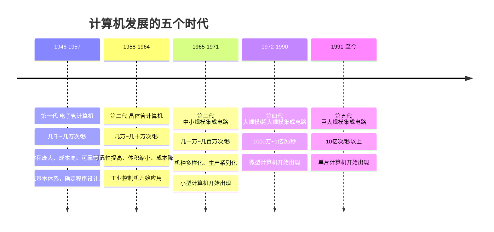
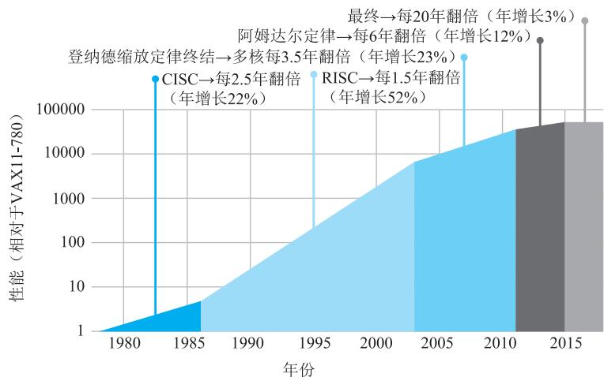
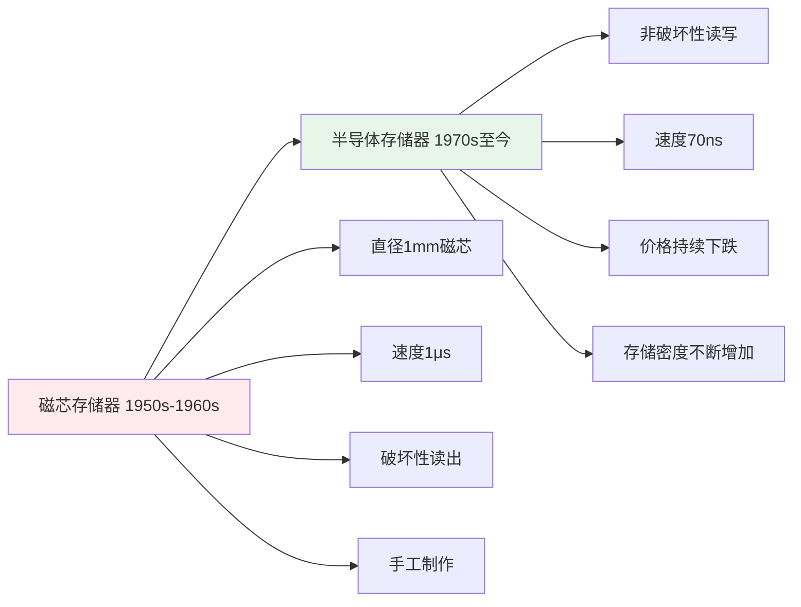
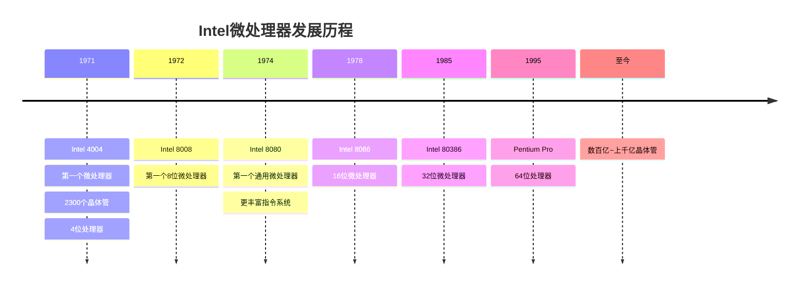
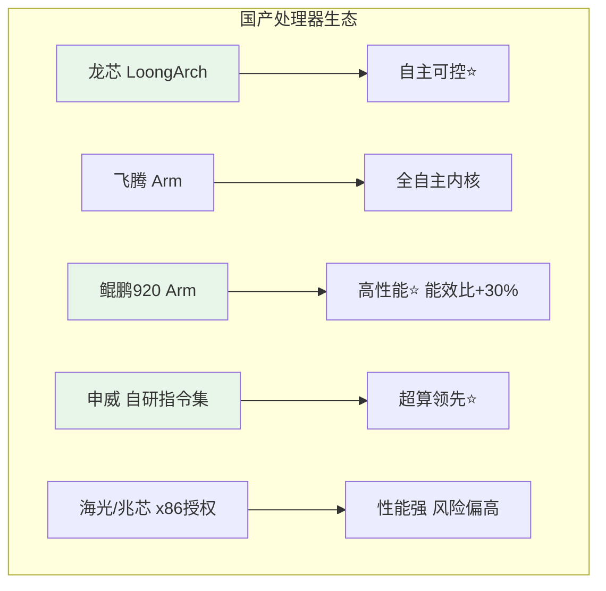

# 第1章-1.2 计算机的发展简史

## 基本信息
- **课程**：计算机组成原理
- **章节**：第1章 1.2节 计算机的发展简史
- **日期**：2026-04-20
- **标签**：#计算机发展史 #摩尔定律 #国产处理器 #微处理器 #半导体存储器

---

## 重点内容

### ⭐⭐⭐ 核心重点
1. **计算机的五代变化**：时间、器件、速度、特点
2. **摩尔定律**：定义、现状、终结原因
3. **国产处理器技术**：龙芯、飞腾、鲲鹏、申威的特点

### ⭐⭐ 重要概念
1. 半导体存储器的发展历程
2. 微处理器的发展趋势
3. 国产处理器面临的挑战

### ⭐ 了解内容
1. 磁芯存储器的历史
2. Intel微处理器的演进

---

## 详细笔记

### 一、计算机的五代变化

世界上第一台电子数字计算机是**1946年**在美国宾夕法尼亚大学制成的（ENIAC）。用了18000多个电子管，占地170m²，重量达30吨，运算速度只有每秒5000次。

### 各代计算机对比表

| 代次 | 时间 | 主要器件 | 运算速度 | 特点 |
|-----|------|---------|---------|------|
| 第一代 | 1946-1957 | 电子管 | 几千~几万次/秒 | 体积庞大、成本高、可靠性低 |
| 第二代 | 1958-1964 | 晶体管 | 几万~几十万次/秒 | 可靠性提高、体积缩小 |
| 第三代 | 1965-1971 | 中小规模集成电路 | 几十万~几百万次/秒 | 机种多样化、小型机出现 |
| 第四代 | 1972-1990 | 大规模/超大规模集成电路 | 1000万~1亿次/秒 | 微型计算机出现 |
| 第五代 | 1991至今 | 巨大规模集成电路 | 10亿次/秒以上 | 单片计算机出现 |

---

### 二、🔥 摩尔定律（考试重点）

#### 定义
> **摩尔定律**：芯片上的晶体管数量大约每**18个月**翻一番

- **1965年**：英特尔创始人戈登·摩尔观察到晶体管数量大约**每年翻一番**
- **1970年**：减慢为每**18个月翻一番**

#### 📷 图1.1 摩尔定律的演进

> 📚 **课本出处**：图1.1 展示了从1965年开始，芯片上晶体管数量随时间的增长趋势，体现了摩尔定律的演进过程

#### 集成电路规模

| 类型 | 每芯片元件数 |
|-----|------------|
| 大规模集成电路(LSI) | 1000个 |
| 超大规模集成电路(VLSI) | 1万个 |
| 巨大规模集成电路(ULSI) | 超过100万个 |

#### ⚠️ 摩尔定律正在走向终结

| 时期 | 单核性能年提升率 |
|-----|----------------|
| 20世纪80年代 | 22% |
| 2015年起 | 3% |

**原因**：晶体管尺寸的缩减已越来越接近**物理极限**

**未来方向**：量子计算、光子计算、碳基电子等新型技术

---

### 三、1.2.2 半导体存储器的发展

#### 存储器技术演进

#### 关键时间节点

| 时间 | 事件 | 意义 |
|-----|------|------|
| 1950s-1960s | 磁芯存储器时代 | 速度1μs，但价格昂贵、体积大、工艺复杂 |
| 1970年 | 仙童公司首个半导体存储器 | 256位，非破坏性读写，速度70ns |
| 1974年 | 半导体存储器价格低于磁芯 | 存储器技术革命开始 |
| 至今 | 容量从几KB提升至TB级 | $1K=2^{10}, 1M=2^{20}, 1G=2^{30}, 1T=2^{40}$ |

---

### 四、1.2.3 微处理器的发展

#### Intel微处理器演进

#### 微处理器发展趋势

| 指标 | 变化 |
|-----|------|
| 集成度 | 从2300个晶体管 → 数百亿甚至上千亿个 |
| 字长 | 从4位 → 8位 → 16位 → 32位 → 64位 |
| 功能 | 从简单运算 → 复杂通用计算 |

---

### 五、1.2.4 国产处理器技术（⭐考试热点）

#### 国产处理器概览

| 厂商 | 架构 | 特点 | 应用场景 |
|-----|------|------|---------|
| **龙芯** | 自主LoongArch架构（原MIPS） | 完全自主研发 | 高端嵌入式、PC、服务器、高性能计算 |
| **飞腾** | Arm指令集 | 国防科大研发，全自主内核 | 桌面、服务器、嵌入式 |
| **鲲鹏920** | 兼容ARMv8-A | 华为设计，64核，能效比超主流30% | 高性能服务器 |
| **申威** | 自研指令集（原Alpha） | 超算领域性能强大 | 高性能计算 |
| **海光/兆芯** | x86架构授权 | 性能强、生态好，但依赖海外授权 | 通用计算 |

#### 国产处理器发展现状

#### 🔥 鲲鹏920处理器亮点

- **集成度**：最多64个自研处理器内核
- **技术**：多发射、乱序执行、优化分支预测
- **集成**：单芯片实现传统4颗芯片功能（南桥、RoCE网卡、SAS存储控制器）
- **能效比**：超过主流处理器**30%**

#### 国产处理器面临的挑战

1. **产业生态可控性差**
2. **生态小众**
3. **产品制造受限**

> 国产处理器已经解决了**从无到有**的问题，正在从**可用**向**好用**不断进化，力求突破国外先进处理器的市场垄断和技术"卡脖子"问题。

---

## 疑问与思考

### ❓ 待解决问题
1. 
2. 

### 💡 个人理解/技巧
- 计算机发展的核心驱动力是**集成电路技术**的进步
- 摩尔定律的终结意味着未来性能提升需要依赖**架构创新**而非单纯的制程进步
- 国产处理器的发展路线分为**自主架构**（龙芯、申威）和**兼容生态**（飞腾、鲲鹏）两条路径
- **自主可控**与**生态兼容**是国产处理器面临的核心权衡

---

## 相关链接

- **课本出处**：第1章 1.2节"计算机的发展简史"
- **上一节**：[第1章-1.1-计算机的分类](./第1章-1.1-计算机的分类.md)
- **下一节**：[第1章-1.3-计算机的硬件](./第1章-1.3-计算机的硬件.md)
- **章节总结**：[第1章-计算机系统概述](./第1章-计算机系统概述.md)
- **重点图示**：
  - 图1.1 摩尔定律的演进
  - 早期Intel微处理器的演化

---

## 📌 本节重点总结

| 重点内容 | 掌握程度 |
|---------|---------|
| 计算机五代变化的时间、器件、速度 | ⭐⭐⭐ 必须掌握 |
| 摩尔定律的定义、现状、终结原因 | ⭐⭐⭐ 必须掌握 |
| 国产处理器厂商及其特点 | ⭐⭐⭐ 必须掌握 |
| 半导体存储器发展历程 | ⭐⭐ 重要 |
| 微处理器发展趋势 | ⭐⭐ 重要 |

---

## 习题练习

### 思考题
1. 为什么摩尔定律正在走向终结？这对计算机发展有什么影响？
2. 国产处理器厂商各自采用了什么技术路线？各有什么优缺点？
3. 从第一代到第五代计算机，核心驱动力是什么？
4. 国产处理器为什么要走自主可控的道路？面临哪些挑战？

### 判断题
1. 摩尔定律指出芯片上的晶体管数量每年翻一番。（ ）
2. 国产处理器已经完全突破了国外的技术垄断。（ ）
3. 半导体存储器的价格从1974年开始低于磁芯存储器。（ ）

### 选择题
1. 下列关于计算机五代变化的描述，错误的是（ ）
   - A. 第一代计算机使用电子管作为主要器件
   - B. 第三代计算机出现了微型计算机
   - C. 第五代计算机使用巨大规模集成电路
   - D. 计算机的运算速度从几千次/秒提升到10亿次/秒以上

2. 下列国产处理器中，采用完全自主架构的是（ ）
   - A. 飞腾处理器
   - B. 鲲鹏920处理器
   - C. 龙芯处理器
   - D. 海光处理器

3. 摩尔定律正在走向终结的主要原因是（ ）
   - A. 市场需求减少
   - B. 晶体管尺寸接近物理极限
   - C. 技术投入不足
   - D. 人才短缺

### 计算题
1. 某处理器在2020年有100亿个晶体管，按照摩尔定律（18个月翻一番），到2025年该处理器大约有多少个晶体管？

---

*笔记创建时间：2026-04-20*
