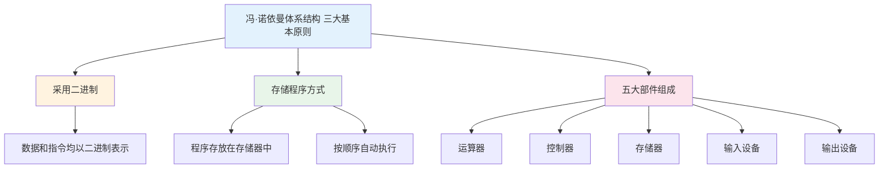
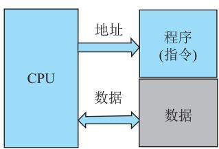
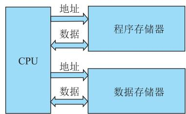
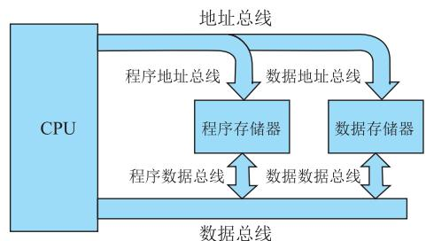
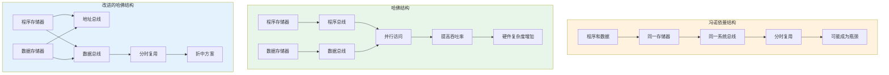
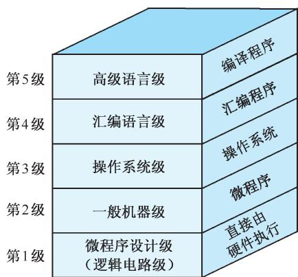
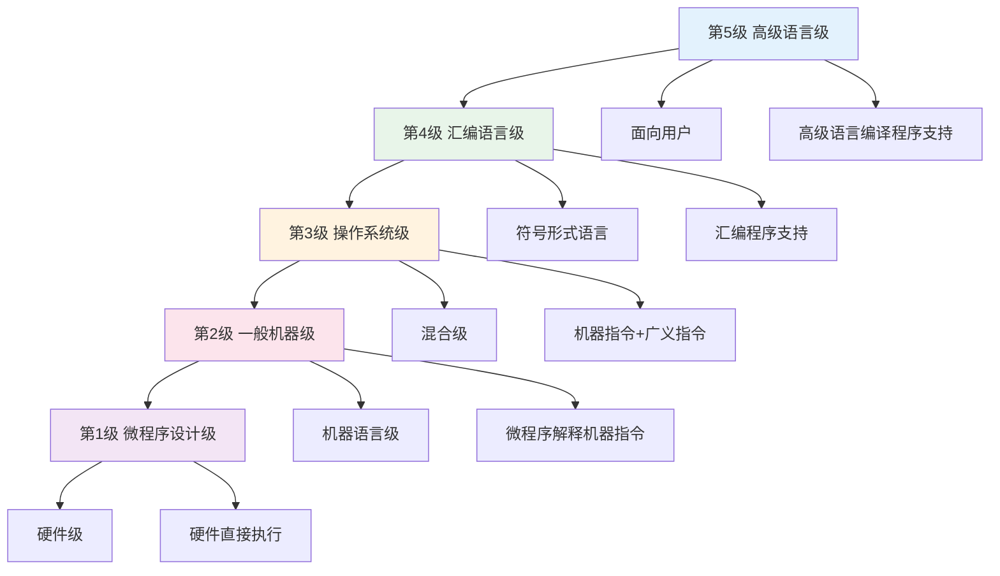
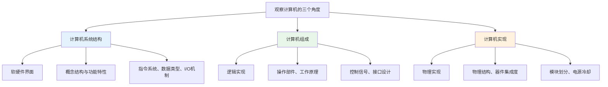

# 第1章-1.6 计算机系统的层次结构

## 基本信息

- **课程**：计算机组成原理
- **章节**：第1章 1.6节 计算机系统的层次结构
- **日期**：2026-04-20
- **标签**：#层次结构 #冯诺依曼结构 #哈佛结构 #多级层次 #软硬件等价

***

## 重点内容

### ⭐⭐⭐ 核心重点

1. **冯·诺依曼体系结构**的三大基本原则和五大特点
2. **哈佛结构**与冯·诺依曼结构的区别
3. **计算机系统的五级层次结构**
4. **软件与硬件的逻辑等价性**

### ⭐⭐ 重要概念

1. 改进的哈佛结构
2. 非诺依曼化研究方向
3. 计算机系统结构、组成、实现三者的区别

### ⭐ 了解内容

1. 数据流驱动的计算机
2. 新型计算机发展方向（光计算机、量子计算机、生物计算机）

***

## 详细笔记

### 一、1.6.1 冯·诺依曼体系结构 ⭐⭐⭐

#### 1. 历史背景

- **1945年6月**：美籍匈牙利人约翰·冯·诺依曼（John Von Neumann）
- **论文**：《EDVAC报告书的第一份草案》
- **核心贡献**：提出**存储程序**的概念
- **别称**：冯·诺依曼模型、普林斯顿结构（Princeton architecture）

#### 2. 三大基本原则

#### 3. 五大基本特点

| 特点          | 说明                    |
| ----------- | --------------------- |
| **① 二进制表示** | 指令和数据均以二进制码表示         |
| **② 五大部件**  | 运算器、控制器、存储器、输入设备、输出设备 |
| **③ 指令组成**  | 指令由操作码和地址码组成          |
| **④ 存储程序**  | 指令序列按执行顺序存放，由PC指明地址   |
| **⑤ 自动执行**  | 计算机能自动完成逐条取出和执行指令     |

#### 4. 各部件功能

| 部件          | 功能                        |
| ----------- | ------------------------- |
| **运算器**     | 进行算术和逻辑运算以及附加操作           |
| **控制器**     | 自动执行指令                    |
| **存储器**     | 存放数据和指令（二者无区别，都是0和1组成的代码） |
| **输入/输出设备** | 保证人与计算机的相互通信              |

#### 5. 核心意义

> 🔥 **存储程序是冯·诺依曼体系结构的核心**

- 存储设备与中央处理器分离
- 可以通过**修改存储器中的指令**改变计算机功能
- **不需要**更改机器线路、结构或重新设计
- 计算机真正成为**可编程机器**

> 💡 **冯·诺依曼体系结构奠定了现代计算机的基础**，目前大部分计算机仍保持或基本保持这一结构。

***

### 二、1.6.2 哈佛结构和改进的哈佛结构 ⭐⭐⭐

#### 📷 图1.8 冯·诺依曼体系结构、哈佛结构和改进的哈佛结构

> 📚 **课本出处**：图1.8 展示了三种体系结构的对比：(a)冯·诺依曼结构共享存储器和总线；(b)哈佛结构分离程序和数据存储器，使用4套总线；(c)改进的哈佛结构使用2套总线分时复用

#### 1. 三种结构对比

| 结构类型        | 存储器           | 总线                    | 特点        | 优缺点      |
| ----------- | ------------- | --------------------- | --------- | -------- |
| **冯·诺依曼**   | 程序和数据共享同一存储器  | 1套系统总线（分时复用）          | 简单、成本低    | 可能成为性能瓶颈 |
| **哈佛结构**    | 程序存储器和数据存储器分离 | 4套总线（程序地址/数据、数据地址/数据） | 并行访问、吞吐率高 | 硬件复杂度高   |
| **改进的哈佛结构** | 程序存储器和数据存储器分离 | 2套总线（地址总线、数据总线）分时复用   | 折中方案      | 平衡性能和复杂度 |

#### 2. 实际应用

> 💡 **现代计算机的混合使用**：

- **Cache**：采用哈佛结构（分离指令Cache和数据Cache）
- **主存**：采用冯·诺依曼结构

***

### 三、1.6.3 非诺依曼化 ⭐⭐

#### 1. 冯·诺依曼机的局限性

- **串行顺序处理**：控制流（指令流）驱动方式
- **逐条执行指令**：即使数据已准备好，也必须按顺序执行
- **数据流被动**：数据被动地被调用处理

#### 2. 非诺依曼化研究方向

**方向1：冯·诺依曼体系结构内的改造**

- 采用多个处理部件形成**流水线**
- 依靠**时间上的重叠**提高处理效率
- 多个处理器构成系统（SIMD、MIMD架构）

**方向2：根本改变控制流驱动方式**

- 设计**数据流驱动**的计算机
- 数据准备好后，相关指令可**并行执行**

**方向3：跳出电子范畴**

- **光计算机**：以光子作为信息载体
- **量子计算机**：利用量子力学原理
- **生物计算机**：利用生物分子进行计算

***

### 四、1.6.4 多级组成的计算机系统 ⭐⭐⭐

#### 📷 图1.9 计算机系统的层次结构图

> 📚 **课本出处**：图1.9 展示了计算机系统的五级层次结构，从微程序级到高级语言级，每一级都能进行程序设计

#### 1. 五级层次结构

| 层级      | 名称     | 特点             | 支持程序     |
| ------- | ------ | -------------- | -------- |
| **第5级** | 高级语言级  | 面向用户，方便编写应用程序  | 高级语言编译程序 |
| **第4级** | 汇编语言级  | 符号形式语言，减少编写复杂性 | 汇编程序     |
| **第3级** | 操作系统级  | 混合级（机器指令+广义指令） | 操作系统     |
| **第2级** | 一般机器级  | 机器语言级，微程序解释    | 微程序      |
| **第1级** | 微程序设计级 | 实在的硬件级，硬件直接执行  | 硬件       |

#### 2. 层次间的关系

- **除第1级外**，其他各级都得到下级的支持
- **第1-3级**：采用二进制数字化语言，机器执行和解释容易
- **第4-5级**：采用符号语言（英文字母和符号），便于不了解硬件的人使用

***

### 五、1.6.5 软件与硬件的逻辑等价性 ⭐⭐⭐

#### 1. 软硬件界限的模糊

随着大规模集成电路技术的发展：

- 任何操作可以由**软件实现**，也可以由**硬件实现**
- 任何指令执行可以由**硬件完成**，也可以由**软件完成**

#### 2. 选择软硬件方案的因素

| 因素       | 说明             |
| -------- | -------------- |
| **器件价格** | 硬件成本 vs 软件开发成本 |
| **速度**   | 硬件速度快，适合并行处理   |
| **可靠性**  | 硬件可靠性通常更高      |
| **存储容量** | 软件需要存储空间       |
| **变更周期** | 软件易于修改，硬件修改困难  |

#### 3. 软件硬化趋势

**早期**：一般机器级通过编制程序实现

- 整数乘除法指令
- 浮点运算指令
- 处理字符串指令

**现在**：大多已改为**直接由硬件完成**

#### 4. 固件（Firmware）

**定义**：

- **功能上**：是软件
- **形态上**：是硬件

**实现方式**：

- 将复杂、常用的程序制作成固件
- 使用\*\*只读存储器（ROM）\*\*存储

#### 5. 硬件加速技术

**华为鲲鹏920处理器**示例：

- 加密算法加速引擎
- SSL加速引擎
- 压缩/解压缩加速引擎

**优势**：

- 高速实现特定计算处理功能
- 释放CPU执行其他任务

***

### 六、1.6.6 计算机系统结构、组成与实现 ⭐⭐

#### 三个概念的区别

| 概念          | 英文                      | 关注点         | 观察者         |
| ----------- | ----------------------- | ----------- | ----------- |
| **计算机系统结构** | Computer Architecture   | 软硬件界面上的功能特性 | 系统程序员、汇编程序员 |
| **计算机组成**   | Computer Organization   | 硬件系统的逻辑实现   | 硬件设计者       |
| **计算机实现**   | Computer Implementation | 计算机组成的物理实现  | 物理实现工程师     |

#### 三者关系

> **计算机系统结构** → **计算机组成** → **计算机实现**
>
> （功能特性）→（逻辑实现）→（物理实现）

***

## 疑问与思考

### ❓ 待解决问题

1.  
2.  

### 💡 个人理解/技巧

- **冯·诺依曼结构的核心是存储程序**，这使得计算机成为通用可编程机器
- **哈佛结构的优势在于并行性**，但代价是硬件复杂度
- **现代计算机是混合结构**：Cache用哈佛结构，主存用冯·诺依曼结构
- **层次结构的意义**：让不同层次的用户都能方便地使用计算机
- **软硬件等价性**：为计算机设计提供了灵活性，可以根据需求选择实现方式

***

## 相关链接

- **课本出处**：第1章 1.6节"计算机系统的层次结构"
- **上一节**：[第1章-1.5-计算机系统性能评价](./第1章-1.5-计算机系统性能评价.md)
- **章节总结**：[第1章-计算机系统概述](./第1章-计算机系统概述.md)
- **重点图示**：
  - 图1.8 冯·诺依曼体系结构、哈佛结构和改进的哈佛结构
  - 图1.9 计算机系统的层次结构图

***

## 📌 本节重点总结

| 重点内容                | 掌握程度     |
| ------------------- | -------- |
| 冯·诺依曼体系结构的三大原则和五大特点 | ⭐⭐⭐ 必须掌握 |
| 冯·诺依曼结构与哈佛结构的区别     | ⭐⭐⭐ 必须掌握 |
| 改进的哈佛结构的特点          | ⭐⭐⭐ 必须掌握 |
| 计算机系统的五级层次结构        | ⭐⭐⭐ 必须掌握 |
| 软件与硬件的逻辑等价性         | ⭐⭐⭐ 必须掌握 |
| 计算机系统结构、组成、实现的区别    | ⭐⭐ 重要    |
| 非诺依曼化的研究方向          | ⭐ 了解     |

***

## 习题练习

### 思考题

1. 冯·诺依曼体系结构的核心是什么？为什么称为"存储程序"？
2. 哈佛结构和冯·诺依曼结构的主要区别是什么？各有什么优缺点？
3. 为什么现代计算机系统会混合使用冯·诺依曼结构和哈佛结构？
4. 计算机系统的五级层次结构中，每一级有什么特点？它们之间是什么关系？
5. 什么是软件与硬件的逻辑等价性？这对计算机设计有什么意义？

### 判断题

1. 冯·诺依曼体系结构采用十进制表示数据和指令。（ ）
2. 哈佛结构将程序存储器和数据存储器分开，使用独立的总线。（ ）
3. 改进的哈佛结构使用4套总线连接程序存储器和数据存储器。（ ）
4. 计算机系统的第1级是微程序设计级，是实在的硬件级。（ ）
5. 固件在功能上是软件，在形态上是硬件。（ ）

### 选择题

1. 冯·诺依曼体系结构的核心是（ ）
   - A. 采用二进制
   - B. 存储程序
   - C. 五大部件组成
   - D. 指令由操作码和地址码组成
2. 下列关于哈佛结构的描述，错误的是（ ）
   - A. 程序和数据存储在不同的存储空间中
   - B. 使用独立的程序总线和数据总线
   - C. 不能并行访问程序和数据
   - D. 提高了数据吞吐率
3. 计算机系统层次结构中，面向用户的最高层是（ ）
   - A. 微程序设计级
   - B. 一般机器级
   - C. 汇编语言级
   - D. 高级语言级
4. 下列关于计算机系统结构的描述，正确的是（ ）
   - A. 关注硬件的物理实现
   - B. 关注软硬件界面的功能特性
   - C. 关注操作部件的逻辑实现
   - D. 关注控制信号的设计
5. 现代计算机系统中，通常采用哈佛结构的是（ ）
   - A. 主存储器
   - B. Cache
   - C. 硬盘
   - D. 光盘

### 简答题

1. 简述冯·诺依曼体系结构的三大基本原则和五大基本特点。
2. 比较冯·诺依曼结构、哈佛结构和改进的哈佛结构的异同。
3. 画出计算机系统的五级层次结构图，说明每一级的特点和功能。
4. 什么是固件？它有什么特点？
5. 简述计算机系统结构、计算机组成和计算机实现三者的区别和联系。

***

*笔记创建时间：2026-04-20*
