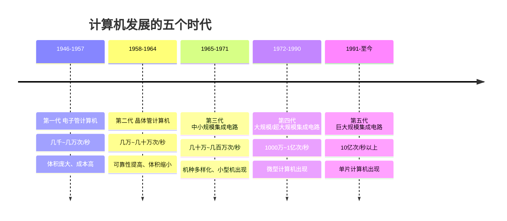
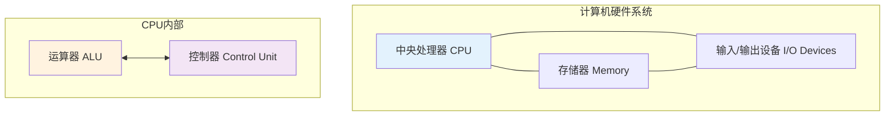
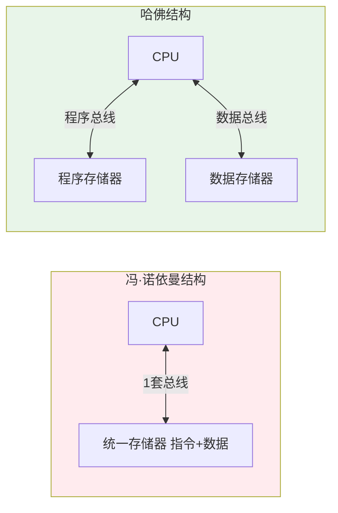
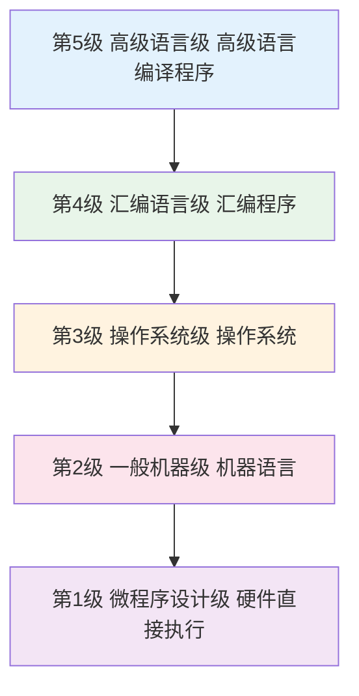

# 第1章 计算机系统概述

## 基本信息
- **课程**：计算机组成原理
- **章节**：第1章 计算机系统概述
- **日期**：2026-04-20
- **标签**：#计算机组成原理 #冯诺依曼体系结构 #计算机硬件 #计算机层次结构

---

## 重点内容

### ⭐⭐⭐ 核心重点
1. **冯·诺依曼体系结构**：三大基本原则、五大部件、存储程序概念
2. **计算机五大部件**：运算器、控制器、存储器、输入设备、输出设备
3. **性能指标计算**：CPU执行时间、CPI、MIPS

### ⭐⭐ 重要概念
1. 哈佛结构与冯·诺依曼结构的区别
2. 计算机系统的五级层次结构
3. 摩尔定律及其发展趋势

### ⭐ 了解内容
1. 计算机发展的五个时代
2. 国产处理器技术（龙芯、飞腾、鲲鹏）
3. 软件与硬件的逻辑等价性

---

## 详细笔记

### 1.1 计算机的分类

#### 电子计算机的两大类型

| 比较内容 | 电子数字计算机 | 电子模拟计算机 |
|---------|---------------|---------------|
| 数据表示方式 | 数字0和1 | 电压 |
| 计算方式 | 数字计数 | 电压组合和测量值 |
| 控制方式 | 程序控制 | 盘上连线 |
| 精度 | 高 | 低 |
| 数据存储量 | 大 | 小 |
| 逻辑判断能力 | 强 | 无 |

#### 现代分类方法
- **通用计算机**：PC、工作站、服务器等，适应性强但效率不是最优
- **专用计算机**：嵌入式系统，针对特定任务设计，效率高但适应性差

---

### 1.2 计算机的发展简史

#### 1.2.1 计算机的五代变化

#### 🔥 摩尔定律
> 芯片上的晶体管数量大约每18个月翻一番

⚠️ **注意**：随着半导体工艺接近物理极限，摩尔定律正逐渐走向终结。单核处理器性能提升已从每年22%降至约3%。

#### 1.2.4 国产处理器技术

| 厂商 | 架构 | 特点 |
|-----|------|------|
| **龙芯** | 自主LoongArch架构 | 面向高端嵌入式、PC、服务器 |
| **飞腾** | Arm指令集 | 国防科技大学研发 |
| **鲲鹏920** | 兼容ARMv8-A | 华为自主设计，64核，能效比超过主流处理器30% |

---

### 1.3 计算机的硬件 ⭐⭐⭐

#### 1.3.1 五大基本组成

| 部件 | 功能 | 类比 |
|-----|------|------|
| **运算器** | 进行算术运算和逻辑运算 | 算盘 |
| **存储器** | 存放程序和数据 | 带横格的纸 |
| **控制器** | 控制整个计算过程 | 人的大脑 |
| **输入设备** | 将信息送入计算机 | 笔（写入） |
| **输出设备** | 将结果展示给人 | 笔（写出） |

#### 1.3.2 运算器 (ALU)
- **功能**：算术运算 + 逻辑运算
- **核心**：采用**二进制**（0和1）
- **原因**：电压高低、脉冲有无容易实现，设备最省

---

### 1.5 计算机系统性能评价

#### 1.5.1 关键性能指标

| 指标 | 符号 | 含义 |
|-----|------|------|
| 吞吐量 | - | 单位时间处理的信息量 |
| 响应时间 | - | 输入到系统响应的时间 |
| 利用率 | - | 系统被实际使用的时间比率 |
| 字长 | - | 一次能完成的二进制运算位数 |
| 主频 | $f$ | 单位时间内的时钟脉冲数 |
| CPI | Cycles Per Instruction | 每条指令的平均时钟周期数 |
| MIPS | Million Instructions Per Second | 每秒百万条指令 |
| FLOPS | Floating-point Operations Per Second | 每秒浮点运算次数 |

#### 🔥 核心公式

$$CPU执行时间 = CPU时钟周期数 \times CPU时钟周期长 = \frac{指令数 \times CPI}{时钟频率}$$

$$\text{MIPS} = \frac{时钟频率}{CPI \times 10^6}$$

---

### 1.6 计算机系统的层次结构 ⭐⭐⭐

#### 1.6.1 冯·诺依曼体系结构 ⭐⭐⭐

**1945年**由冯·诺依曼提出，三大基本原则：

1. **二进制表示**：指令和数据都用二进制
2. **存储程序**：程序存放在存储器中，自动执行
3. **五大部件**：运算器、控制器、存储器、输入设备、输出设备

**核心特点**：
- 指令 = 操作码 + 地址码
- 指令按执行顺序存放
- 程序计数器(PC)指明当前指令地址
- 💡 **存储程序**是冯·诺依曼体系结构的核心！

#### 1.6.2 哈佛结构 vs 冯·诺依曼结构

| 特性 | 冯·诺依曼结构 | 哈佛结构 |
|-----|--------------|---------|
| 存储器 | 统一存储 | 分离存储 |
| 总线 | 1套总线 | 2套总线（4条） |
| 并行性 | 不能并行取指令和数据 | 可以并行 |
| 复杂度 | 较低 | 较高 |
| 应用 | 通用计算机 | 嵌入式系统、DSP |

**改进的哈佛结构**：2套总线（地址总线+数据总线），分时复用

#### 1.6.4 计算机系统的五级层次

| 层级 | 名称 | 执行方式 |
|-----|------|---------|
| 第5级 | 高级语言级 | 编译程序支持 |
| 第4级 | 汇编语言级 | 汇编程序支持 |
| 第3级 | 操作系统级 | 混合级（机器指令+广义指令）|
| 第2级 | 一般机器级 | 微程序解释执行 |
| 第1级 | 微程序设计级 | 硬件直接执行 |

#### 1.6.5 软件与硬件的逻辑等价性

> **重要概念**：任何操作可以由软件实现，也可以由硬件实现！

- **软件实现**：灵活、易修改、成本低，但速度慢
- **硬件实现**：速度快、适合并行处理，但灵活性差

**趋势**：软件硬化、固件化（firmware）

---

## 疑问与思考

### ❓ 待解决问题
1. 
2. 

### 💡 个人理解/技巧
- 冯·诺依曼结构的核心是"存储程序"，这使得计算机成为可编程机器
- 哈佛结构通过分离存储提高并行性，但增加了硬件复杂度
- 现代计算机往往混合使用两种结构：Cache用哈佛结构，主存用冯·诺依曼结构

---

## 相关链接

- **课本出处**：第1章 计算机系统概述
- **下一章**：第2章-运算方法和运算器（待学习）
- **重点图示**：
  - 图1.2 数字计算机的主要组成结构
  - 图1.8 冯·诺依曼体系结构、哈佛结构和改进的哈佛结构
  - 图1.9 计算机系统的层次结构图

---

## 📌 本章重点总结

| 重点内容 | 掌握程度 |
|---------|---------|
| 冯·诺依曼体系结构的三大原则 | ⭐⭐⭐ 必须掌握 |
| 计算机五大部件及其功能 | ⭐⭐⭐ 必须掌握 |
| 性能指标计算公式 | ⭐⭐ 重要 |
| 哈佛结构与冯·诺依曼结构的区别 | ⭐⭐ 重要 |
| 计算机系统的五级层次 | ⭐⭐ 重要 |
| 摩尔定律 | ⭐ 了解 |

---

## 习题练习

### 思考题
1. 为什么计算机采用二进制而不是十进制？
2. 冯·诺依曼体系结构的核心是什么？
3. 哈佛结构相比冯·诺依曼结构的优势是什么？
4. CPI、MIPS、CPU执行时间三者之间的关系是什么？

### 计算题
1. 某计算机主频为2GHz，执行某程序需要10^9条指令，平均CPI为2，求程序执行时间和MIPS。

---

*笔记创建时间：2026-04-20*
