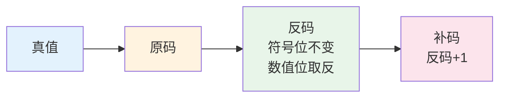
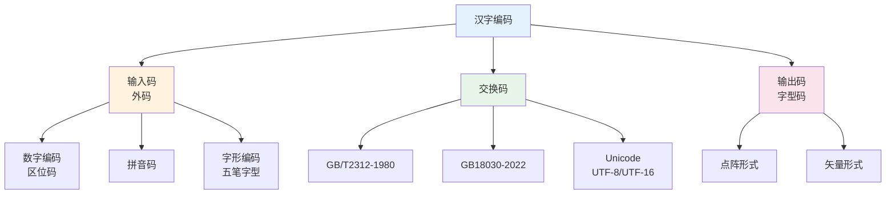

# 第2章-2.1 数据与文字的表示方法

## 基本信息
- **课程**：计算机组成原理
- **章节**：第2章 2.1节 数据与文字的表示方法
- **日期**：2026-04-20
- **标签**：#数据表示 #定点数 #浮点数 #原码 #补码 #反码 #移码 #IEEE754

---

## 重点内容

### ⭐⭐⭐ 核心重点
1. **定点数表示**：纯小数、纯整数的表示范围
2. **浮点数表示**：阶码、尾数的组成，IEEE754标准
3. **机器码表示**：原码、补码、反码、移码的定义和转换
4. **补码运算**：减法变加法的原理

### ⭐⭐ 重要概念
1. 规格化浮点数的概念
2. ASCII码的编码规则
3. 汉字编码（输入码、交换码、输出码）
4. 奇偶校验码

### ⭐ 了解内容
1. 十进制数串的表示方法
2. BCD码
3. UTF-8和UTF-16编码

---

## 详细笔记

### 一、2.1.1 数据格式 ⭐⭐⭐

#### 1. 定点数的数据格式

**定义**：约定机器中所有数据的小数点位置固定不变。

```mermaid
flowchart TB
    A[定点数] --> B[纯小数]
    A --> C[纯整数]
    
    B --> B1[小数点在符号位后]
    B --> B2[范围: 0 ≤ |x| ≤ 1-2^(-n)]
    
    C --> C1[小数点在最低位后]
    C --> C2[范围: 0 ≤ |x| ≤ 2^n - 1]
    
    style A fill:#e3f2fd
    style B fill:#fff3e0
    style C fill:#e8f5e9
```

**表示形式**（n+1位字，1位符号位）：

| 类型 | 格式 | 表示范围 |
|-----|------|---------|
| **纯小数** | $x_n . x_{n-1}x_{n-2}...x_1x_0$ | $0 \leqslant |x| \leqslant 1 - 2^{-n}$ |
| **纯整数** | $x_n x_{n-1}x_{n-2}...x_1x_0.$ | $0 \leqslant |x| \leqslant 2^n - 1$ |

> 💡 **注意**：目前计算机中多采用**定点纯整数**表示。

---

#### 2. 浮点数的表示方法 ⭐⭐⭐

**为什么需要浮点数？**
- 定点数表示范围有限
- 科学计算需要表示很大或很小的数（如电子质量 $9 \times 10^{-28}$g，太阳质量 $2 \times 10^{33}$g）

**浮点数的一般形式**：
$$
N = 2^e \cdot M
$$

| 组成部分 | 符号 | 说明 |
|---------|------|------|
| **阶码 e** | $E_s$ | 指数，指明小数点位置，决定表示范围 |
| **尾数 M** | $M_s$ | 纯小数，给出有效数字位数，决定精度 |

**浮点数格式**：
```
┌─────┬─────────────┬─────┬─────────────┐
│ 阶符 │    阶码      │ 数符 │    尾数      │
│ Es  │  Em-1...E0  │ Ms  │  Mn-1...M0  │
└─────┴─────────────┴─────┴─────────────┘
```

---

#### 3. IEEE754标准 ⭐⭐⭐

**32位短浮点数格式**：
```
┌───┬──────────┬──────────────────────────────┐
│ S │    E     │              M               │
│1位│   8位    │             23位              │
└───┴──────────┴──────────────────────────────┘
```

**64位长浮点数格式**：
```
┌───┬──────────┬────────────────────────────────────────────────────┐
│ S │    E     │                        M                          │
│1位│   11位   │                       52位                         │
└───┴──────────┴────────────────────────────────────────────────────┘
```

**规格化浮点数的真值**：
$$
x = (-1)^S \times (1.M) \times 2^{E-127}
$$

> 🔥 **关键点**：
> - 32位浮点数阶码偏移值 = **127**（不是128）
> - 64位浮点数阶码偏移值 = **1023**
> - 尾数采用**隐含最高位1**的方式，实际精度24位（1+23）

**IEEE754特殊值**：

| 阶码 E | 尾数 M | 含义 |
|--------|--------|------|
| 全0 (0) | 全0 | 机器零 (+0 或 -0) |
| 全0 (0) | 非0 | 非规格化数 |
| 1~254 | 任意 | 规格化数 |
| 全1 (255) | 全0 | 无穷大 ($\pm\infty$) |
| 全1 (255) | 非0 | NaN (无定义数据) |

---

### 二、2.1.2 数的机器码表示 ⭐⭐⭐

#### 概念对比

| 概念 | 定义 |
|-----|------|
| **真值** | 一般书写表示的数（带正负号） |
| **机器数/机器码** | 计算机中编码表示的数 |

#### 1. 原码表示法

**定义**：
$$
[x]_{原} = \begin{cases} x, & 2^n > x \geqslant 0 \\ 2^n - x = 2^n + |x|, & 0 \geqslant x > -2^n \end{cases}
$$

**特点**：
- 正数：符号位为0，数值位不变
- 负数：符号位为1，数值位不变
- **0有两种表示**：$[+0]_{原} = 000...0$，$[-0]_{原} = 100...0$

**缺点**：加法运算复杂，需要判断符号

---

#### 2. 补码表示法 ⭐⭐⭐

**核心思想**：把减法转化为加法（模运算）

**类比理解**：钟表对时
- 7点退3格 = 7点进9格（模12）
- $-3 = +9 \pmod{12}$

**定义**：
$$
[x]_{补} = \begin{cases} x, & 2^n > x \geqslant 0 \\ 2^{n+1} + x = 2^{n+1} - |x|, & 0 > x \geqslant -2^n \end{cases} \pmod{2^{n+1}}
$$

**特点**：
- **0只有一种表示**：$[+0]_{补} = [-0]_{补} = 000...0$
- **负数范围**：可到 $-2^n$（比原码多一个）
- **符号位参与运算**：减法变加法

**补码求真值公式**：
$$
x = -2^n \cdot x_n + \sum_{i=0}^{n-1} 2^i \cdot x_i
$$

---

#### 3. 原码、反码、补码转换关系



**正数**：原码 = 反码 = 补码

**负数**：
1. 原码 → 反码：符号位不变，数值位按位取反
2. 反码 → 补码：最低位加1

**【例】** $x = -122$，求 $[x]_{原}$、$[x]_{反}$、$[x]_{补}$

解：
- 真值：$x = (-1111010)_2$
- 原码：$[x]_{原} = 11111010$
- 反码：$[x]_{反} = 10000101$（符号位不变，数值位取反）
- 补码：$[x]_{补} = 10000110$（反码+1）

---

#### 4. 移码表示法

**用途**：表示浮点数的阶码

**定义**：
$$
[x]_{移} = 2^n + x, \quad -2^n \leqslant x < 2^n
$$

**特点**：
- 符号位与补码相反
- 便于比较大小（阶码域值大者指数值也大）
- 补码与移码关系：符号位取反

---

#### 5. 四种机器码对比

| 真值x | $[x]_{原}$ | $[x]_{反}$ | $[x]_{补}$ | $[x]_{移}$ |
|-------|-----------|-----------|-----------|-----------|
| -127 | 11111111 | 10000000 | 10000001 | 00000001 |
| -1 | 10000001 | 11111110 | 11111111 | 01111111 |
| +0 | 00000000 | 00000000 | 00000000 | 10000000 |
| -0 | 10000000 | 11111111 | 00000000 | 10000000 |
| +1 | 00000001 | 00000001 | 00000001 | 10000001 |
| +127 | 01111111 | 01111111 | 01111111 | 11111111 |

> 💡 **规律**：补码与移码仅符号位不同

---

### 三、2.1.3 字符与字符串的表示方法

#### 1. ASCII码

**全称**：美国信息交换标准字符码

**特点**：
- 7位编码 + 1位校验位 = 8位（1字节）
- 共128个字符（$2^7 = 128$）
- 最高位 $b_7 = 0$

**字符分类**：
- **95个可打印字符**：数字、字母、运算符、标点符号
- **33个控制字符**：编码0~31和127，用于控制设备

**数字字符特点**：
- '0'~'9'的ASCII码去掉高3位(011)即得8421码
- '0' = 0x30, '9' = 0x39

---

#### 2. 字符串的存放

**存放方式**：
- 占用主存连续多字节
- 每字节存放一个字符的ASCII码
- 可**从低到高**或**从高到低**存放

---

### 四、2.1.4 汉字的表示和编码



#### 1. 汉字输入码

| 类型 | 代表 | 特点 |
|-----|------|------|
| **数字编码** | 国标区位码 | 无重码，难记忆 |
| **拼音码** | 全拼、双拼 | 易学，重码率高 |
| **字形编码** | 五笔字型 | 按笔画编码，速度快 |

#### 2. 汉字交换码

| 标准 | 收录汉字 | 编码方式 |
|-----|---------|---------|
| **GB/T2312-1980** | 6763个 | 2字节，每字节最高位为1 |
| **GB18030-2022** | 88115个 | 单/双/四字节不等长编码 |
| **Unicode** | 全球文字 | UTF-8（变长1-4字节）、UTF-16 |

#### 3. 汉字输出码

| 形式 | 特点 | 存储 |
|-----|------|------|
| **点阵形式** | 简单直观，放大失真 | $n \times n$ 点阵需 $n^2/8$ 字节 |
| **矢量形式** | 放大不失真，质量高 | 存储轮廓特征 |

---

### 五、2.1.5 校验码 ⭐⭐

#### 奇偶校验

**原理**：在数据位外增加1位校验位，使1的个数保持奇数或偶数。

**奇校验位**：
$$
\bar{C} = x_0 \oplus x_1 \oplus ... \oplus x_{n-1}
$$
（数据中1的个数为奇数时，$\bar{C} = 1$）

**偶校验位**：
$$
C = x_0 \oplus x_1 \oplus ... \oplus x_{n-1}
$$
（数据中1的个数为偶数时，$C = 0$）

**校验方法**：
$$
F = x_0' \oplus x_1' \oplus ... \oplus x_{n-1}' \oplus C'
$$
- $F = 1$：有错（奇数个位出错）
- $F = 0$：正确或偶数个位出错

**特点**：
- ✅ 能检测**奇数个**错误
- ❌ 不能检测**偶数个**错误
- ❌ 不能定位错误位置（不能纠错）

---

## 疑问与思考

### ❓ 待解决问题
1. 
2. 

### 💡 个人理解/技巧
- **补码的本质**：模运算，把负数映射到正数范围，使减法变加法
- **IEEE754的偏移值**：32位选127而非128，是为了让指数范围对称（-126~+127）
- **隐含位1**：规格化浮点数尾数最高位必为1，可省略存储，提高精度
- **移码的作用**：便于浮点数阶码的比较大小

---

## 相关链接

- **课本出处**：第2章 2.1节"数据与文字的表示方法"
- **上一节**：[第2章-运算方法和运算器](./第2章-运算方法和运算器.md)
- **下一节**：[第2章-2.2-定点加法减法运算](./第2章-2.2-定点加法减法运算.md)
- **重点图示**：
  - 图2.1 字符串在主存中的存放

---

## 📌 本节重点总结

| 重点内容 | 掌握程度 |
|---------|---------|
| 定点数表示范围 | ⭐⭐⭐ 必须掌握 |
| 浮点数组成（阶码、尾数） | ⭐⭐⭐ 必须掌握 |
| IEEE754标准格式 | ⭐⭐⭐ 必须掌握 |
| 原码、补码、反码、移码定义 | ⭐⭐⭐ 必须掌握 |
| 原码与补码的转换 | ⭐⭐⭐ 必须掌握 |
| 补码求真值公式 | ⭐⭐⭐ 必须掌握 |
| ASCII码特点 | ⭐⭐ 重要 |
| 汉字三种编码 | ⭐⭐ 重要 |
| 奇偶校验原理 | ⭐⭐ 重要 |

---

## 习题练习

### 思考题
1. 为什么计算机中采用补码而不是原码进行运算？
2. IEEE754标准中，32位浮点数的阶码偏移值为什么是127而不是128？
3. 规格化浮点数为什么要隐含最高位1？
4. 移码和补码有什么关系？为什么浮点数阶码使用移码？

### 计算题
1. 将十进制数 -25 表示成8位二进制的原码、反码、补码和移码。

2. 已知 $[x]_{补} = 10110100$，求真值 $x$。

3. 将十进制数 25.625 转换成IEEE754标准的32位浮点数格式。

4. 若浮点数的IEEE754标准存储格式为 (41A4C000)₁₆，求其十进制数值。

5. 对数据 10101100 分别用偶校验和奇校验进行编码。

---

*笔记创建时间：2026-04-20*
