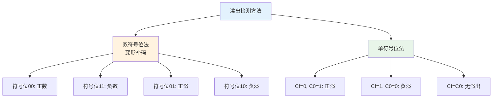

# 第2章-2.2 定点加法、减法运算

## 基本信息
- **课程**：计算机组成原理
- **章节**：第2章 2.2节 定点加法、减法运算
- **日期**：2026-04-20
- **标签**：#定点运算 #补码加法 #补码减法 #溢出检测 #加法器

---

## 重点内容

### ⭐⭐⭐ 核心重点
1. **补码加法公式**及证明
2. **补码减法公式**：$[x-y]_{补} = [x]_{补} + [-y]_{补}$
3. **求$[-y]_{补}$的方法**：各位取反，末位加1
4. **溢出检测方法**：双符号位法、单符号位法

### ⭐⭐ 重要概念
1. 变形补码（双符号位）
2. 正溢和负溢
3. 全加器的逻辑表达式
4. 先行进位（CLA）原理

### ⭐ 了解内容
1. 行波进位加法器的延迟计算
2. 单级分组先行进位加法器
3. 多级分组先行进位加法器

---

## 详细笔记

### 一、2.2.1 补码加法 ⭐⭐⭐

#### 核心公式

$$
[x + y]_{补} = [x]_{补} + [y]_{补} \pmod{2^{n+1}}
$$

#### 公式特点

1. **符号位参与运算**：符号位作为数的一部分一起参加运算
2. **模$2^{n+1}$相加**：超过$2^{n+1}$的进位要丢掉
3. **统一运算**：正数和负数使用相同的加法算法

#### 示例

**【例】** $x = +1011$，$y = -0101$，求 $x + y$

解：
- $[x]_{补} = 01011$
- $[y]_{补} = 11011$

```
    [x]补   0 1 0 1 1
  + [y]补   1 1 0 1 1
  ─────────────────
  [x+y]补 1 0 0 1 1 0
```

丢掉最高位进位，得 $[x+y]_{补} = 00110$，所以 $x + y = +0110$

---

### 二、2.2.2 补码减法 ⭐⭐⭐

#### 核心公式

$$
[x - y]_{补} = [x + (-y)]_{补} = [x]_{补} + [-y]_{补}
$$

#### 求$[-y]_{补}$的方法

> 🔥 **法则**：对$[y]_{补}$（**包括符号位**）"**各位取反，末位加1**"

$$
[-y]_{补} = \overline{[y]_{补}} + 1 = \overline{y_0}\overline{y_1}...\overline{y_n} + 1
$$

#### 示例

**【例】** $x = +1101$，$y = +0110$，求 $x - y$

解：
- $[x]_{补} = 01101$
- $[y]_{补} = 00110$
- $[-y]_{补} = 11001 + 1 = 11010$（各位取反：11001，末位加1）

```
    [x]补     0 1 1 0 1
  + [-y]补    1 1 0 1 0
  ───────────────────
  [x-y]补   1 0 0 1 1 1
```

丢掉最高位进位，得 $[x-y]_{补} = 00111$，所以 $x - y = +0111$

---

### 三、2.2.3 溢出概念与检测方法 ⭐⭐⭐

#### 什么是溢出？

> **定义**：运算结果超出了计算机能表示的数据范围。

| 类型 | 说明 |
|-----|------|
| **正溢** | 两个正数相加，结果大于最大正数 |
| **负溢** | 两个负数相加，结果小于最小负数 |

#### 溢出示例

**正溢示例**：$x = +1011$，$y = +1001$
```
    [x]补   0 1 0 1 1
  + [y]补   0 1 0 0 1
  ─────────────────
            1 0 1 0 0  ← 两个正数相加得负数（错误！）
```

**负溢示例**：$x = -1101$，$y = -1011$
```
    [x]补   1 0 0 1 1
  + [y]补   1 0 1 0 1
  ─────────────────
            0 1 0 0 0  ← 两个负数相加得正数（错误！）
```

#### 溢出检测方法



**方法1：双符号位法（变形补码）**

| 结果符号位 | 含义 |
|-----------|------|
| **00** | 结果为正，无溢出 |
| **11** | 结果为负，无溢出 |
| **01** | **正溢**（结果>0，但超出范围） |
| **10** | **负溢**（结果<0，但超出范围） |

**溢出判断逻辑**：
$$
V = S_{f1} \oplus S_{f2}
$$

**方法2：单符号位法**

| 符号位进位$C_f$ | 最高有效位进位$C_0$ | 溢出情况 |
|---------------|------------------|---------|
| 0 | 1 | **正溢** |
| 1 | 0 | **负溢** |
| 0 | 0 | 无溢出 |
| 1 | 1 | 无溢出 |

**溢出判断逻辑**：
$$
V = C_f \oplus C_0
$$

---

### 四、2.2.4 行波进位二进制加/减法器 ⭐⭐

#### 全加器（FA）

**输入**：$A_i$、$B_i$、$C_i$（被加数、加数、进位输入）

**输出**：$S_i$、$C_{i+1}$（和、进位输出）

**逻辑表达式**：
$$
S_i = A_i \oplus B_i \oplus C_i
$$

$$
C_{i+1} = A_i B_i + (A_i \oplus B_i) C_i = G_i + P_i C_i
$$

其中：
- **$G_i = A_i B_i$**：进位产生函数（本地进位）
- **$P_i = A_i \oplus B_i$**：进位传递函数

#### 行波进位加法器特点

- **结构**：n个全加器级联
- **进位方式**：串行进位（低位的进位输出作为高位的进位输入）
- **延迟时间**：$t_a = (2n + 9)T$（n位加法器）
- **优点**：电路简单
- **缺点**：速度慢，进位像波浪一样逐级传播

#### 加减法统一实现

```
┌─────────────────────────────────────────┐
│         补码加/减法器结构               │
├─────────────────────────────────────────┤
│  A ──┬──► FA0 ──► FA1 ──► ... ──► FAn  │
│      │    ▲       ▲              ▲     │
│  B ──┼──► XOR0 ──► XOR1 ──► ... ─► XORn │
│      │    │       │              │     │
│  M ──┴────┴───────┴──────────────┘     │
│      ▲                                  │
│      └── 方式控制（M=0加法，M=1减法）    │
└─────────────────────────────────────────┘
```

- **M=0**：做加法 $A + B$
- **M=1**：做减法 $A - B = A + \overline{B} + 1$

---

### 五、2.2.5 单级分组先行进位加法器 ⭐

#### 先行进位（CLA）原理

**核心思想**：使各二进制位的进位运算能**同时进行**，高有效位不需等待低有效位的进位输出。

**进位公式展开**：
$$
C_1 = G_0 + P_0 C_0
$$

$$
C_2 = G_1 + P_1 G_0 + P_1 P_0 C_0
$$

$$
C_3 = G_2 + P_2 G_1 + P_2 P_1 G_0 + P_2 P_1 P_0 C_0
$$

$$
C_4 = G_3 + P_3 G_2 + P_3 P_2 G_1 + P_3 P_2 P_1 G_0 + P_3 P_2 P_1 P_0 C_0
$$

#### 16位单级分组先行进位加法器

- **分组方式**：16位分为4个小组，每组4位
- **组内**：先行进位
- **组间**：串行进位
- **延迟时间**：$14T$（vs 行波进位$41T$）

---

### 六、2.2.6 多级分组先行进位加法器 ⭐

#### 两级分组结构

- **小组内**：先行进位（CLA）
- **大组内（小组间）**：先行进位（BCLA）
- **大组间**：串行进位或并行进位

#### 组间进位信号

$$
C_4 = G_3^* + P_3^* C_0
$$

$$
C_8 = G_7^* + P_7^* G_3^* + P_7^* P_3^* C_0
$$

其中：
- **$G_3^*$**：小组进位产生函数
- **$P_3^*$**：小组进位传递函数

---

## 疑问与思考

### ❓ 待解决问题
1. 
2. 

### 💡 个人理解/技巧
- **补码减法的本质**：$A - B = A + (-B)$，把减法转化为加法
- **求$[-y]_{补}$的技巧**：连同符号位一起取反加1
- **溢出的本质**：运算结果超出表示范围
- **双符号位的原理**：用符号位是否一致判断是否溢出
- **先行进位的代价**：以硬件复杂度换取速度提升

---

## 相关链接

- **课本出处**：第2章 2.2节"定点加法、减法运算"
- **上一节**：[第2章-2.1-数据与文字的表示方法](./第2章-2.1-数据与文字的表示方法.md)
- **下一节**：[第2章-2.3-定点乘法运算](./第2章-2.3-定点乘法运算.md)
- **重点图示**：
  - 图2.2 定点整数表示范围
  - 图2.3 行波进位的补码加法/减法器
  - 图2.4 16位单级分组先行进位并行加法器结构
  - 图2.5 两级分组16位先行进位加法器结构

---

## 📌 本节重点总结

| 重点内容 | 掌握程度 |
|---------|---------|
| 补码加法公式 | ⭐⭐⭐ 必须掌握 |
| 补码减法公式 | ⭐⭐⭐ 必须掌握 |
| 求$[-y]_{补}$的方法 | ⭐⭐⭐ 必须掌握 |
| 双符号位溢出检测 | ⭐⭐⭐ 必须掌握 |
| 单符号位溢出检测 | ⭐⭐⭐ 必须掌握 |
| 全加器逻辑表达式 | ⭐⭐ 重要 |
| 先行进位原理 | ⭐⭐ 重要 |

---

## 习题练习

### 思考题
1. 为什么计算机中采用补码而不是原码进行加减法运算？
2. 求$[-y]_{补}$时为什么要"包括符号位"取反？
3. 双符号位法和单符号位法检测溢出的原理分别是什么？
4. 行波进位加法器的主要缺点是什么？先行进位如何改进？

### 计算题
1. 已知 $x = +1010$，$y = -0110$，用补码运算求 $x + y$ 和 $x - y$。

2. 已知 $[x]_{补} = 01101$，$[y]_{补} = 11011$，求 $[x+y]_{补}$，并判断是否溢出。

3. 用变形补码计算 $x + y$，并判断溢出：
   - (1) $x = +1100$，$y = +1000$
   - (2) $x = -1100$，$y = -1000$

4. 已知 $[y]_{补} = 10110100$，求 $[-y]_{补}$。

### 简答题
1. 简述补码加法的两个特点。
2. 什么是正溢？什么是负溢？各举一个例子。
3. 简述双符号位法判断溢出的规则。
4. 简述先行进位加法器的基本原理。

---

*笔记创建时间：2026-04-20*
