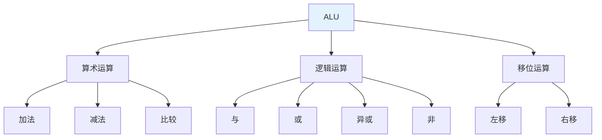
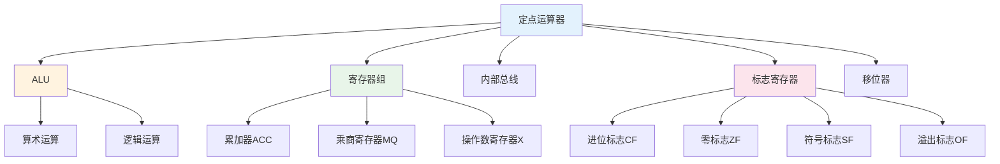

# 第2章-2.5 定点运算器的组成

## 基本信息
- **课程**：计算机组成原理
- **章节**：第2章 2.5节 定点运算器的组成
- **日期**：2026-04-20
- **标签**：#运算器 #ALU #逻辑运算 #内部总线

---

## 重点内容

### ⭐⭐⭐ 核心重点
1. **算术逻辑运算单元（ALU）**
2. **逻辑运算**：与、或、非、异或
3. **定点运算器的基本结构**

### ⭐⭐ 重要概念
1. 多功能算术/逻辑运算单元
2. 内部总线
3. 标志寄存器

---

## 详细笔记

### 一、2.5.1 逻辑运算 ⭐⭐⭐

#### 基本逻辑运算

| 运算 | 符号 | 功能 | 应用 |
|-----|------|------|------|
| **与（AND）** | $\land$ | 按位与 | 掩码、清零 |
| **或（OR）** | $\lor$ | 按位或 | 置位、合并 |
| **非（NOT）** | $\overline{A}$ | 按位取反 | 求反 |
| **异或（XOR）** | $\oplus$ | 按位异或 | 比较、取反 |

#### 真值表

| A | B | A∧B | A∨B | A⊕B | $\overline{A}$ |
|---|---|-----|-----|-----|---------------|
| 0 | 0 | 0 | 0 | 0 | 1 |
| 0 | 1 | 0 | 1 | 1 | 1 |
| 1 | 0 | 0 | 1 | 1 | 0 |
| 1 | 1 | 1 | 1 | 0 | 0 |

---

### 二、2.5.2 多功能算术/逻辑运算单元 ⭐⭐⭐

#### ALU功能



#### 74181 ALU芯片

- **4位ALU**
- **功能选择**：S3S2S1S0选择16种运算
- **模式控制**：M=0算术运算，M=1逻辑运算

---

### 三、2.5.3 内部总线 ⭐⭐

#### 总线类型

| 类型 | 特点 |
|-----|------|
| **单总线** | 所有部件连接一条总线，简单但速度慢 |
| **双总线** | 两条总线，可同时传送两个操作数 |
| **三总线** | 三条总线，速度最快，硬件复杂 |

#### 总线结构

```
┌─────────┐     ┌─────────┐     ┌─────────┐
│  寄存器A │◄───►│  内部总线 │◄───►│  寄存器B │
└─────────┘     └────┬────┘     └─────────┘
                     │
                ┌────┴────┐
                │   ALU   │
                └────┬────┘
                     │
                ┌────┴────┐
                │  标志寄存器│
                └─────────┘
```

---

### 四、2.5.4 定点运算器的基本结构 ⭐⭐⭐

#### 运算器组成



#### 标志寄存器

| 标志 | 符号 | 含义 |
|-----|------|------|
| **进位标志** | CF | 运算产生进位/借位 |
| **零标志** | ZF | 运算结果为零 |
| **符号标志** | SF | 运算结果为负 |
| **溢出标志** | OF | 运算结果溢出 |

---

## 疑问与思考

### 💡 个人理解
- **ALU是运算器的核心**：执行所有算术和逻辑运算
- **标志寄存器的作用**：保存运算状态，用于条件判断
- **内部总线的重要性**：连接各部件，传输数据

---

## 相关链接

- **课本出处**：第2章 2.5节"定点运算器的组成"
- **上一节**：[第2章-2.4-定点除法运算](./第2章-2.4-定点除法运算.md)
- **下一节**：[第2章-2.6-浮点运算方法和浮点运算器](./第2章-2.6-浮点运算方法和浮点运算器.md)

---

*笔记创建时间：2026-04-20*
