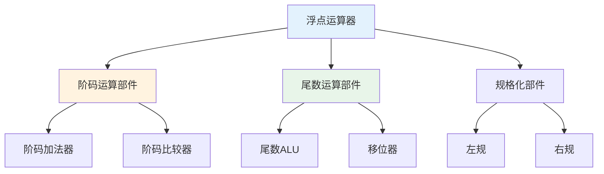

# 第2章-2.6 浮点运算方法和浮点运算器

## 基本信息
- **课程**：计算机组成原理
- **章节**：第2章 2.6节 浮点运算方法和浮点运算器
- **日期**：2026-04-20
- **标签**：#浮点运算 #对阶 #规格化 #舍入 #浮点运算器

---

## 重点内容

### ⭐⭐⭐ 核心重点
1. **浮点加减法运算步骤**：对阶 → 尾数运算 → 规格化 → 舍入 → 溢出判断
2. **对阶**：小阶向大阶看齐
3. **规格化**：尾数最高位为1
4. **舍入方法**：0舍1入、恒置1、截断

### ⭐⭐ 重要概念
1. 浮点乘除法运算
2. 浮点运算器结构
3. 流水线浮点运算器

---

## 详细笔记

### 一、2.6.1 浮点加法、减法运算 ⭐⭐⭐

#### 运算步骤


#### 1. 对阶 ⭐⭐⭐

**原则**：**小阶向大阶看齐**

**操作**：
- 比较两个数的阶码
- 阶码小的数的尾数右移
- 每右移1位，阶码加1

**示例**：
```
A = 1.101 × 2^3
B = 1.010 × 2^1

对阶后：
A = 1.101 × 2^3
B = 0.0101 × 2^3  (尾数右移2位，阶码加2)
```

#### 2. 尾数运算 ⭐⭐⭐

**方法**：按定点加减法规则运算

```
  1.1010
+ 0.0101
────────
  1.1111
```

#### 3. 规格化 ⭐⭐⭐

**定义**：尾数的最高有效位为1

**规格化形式**：
- **原码**：$0.1xxx...$ 或 $1.1xxx...$
- **补码**：$0.1xxx...$ 或 $1.0xxx...$

**规格化操作**：

| 情况 | 操作 |
|-----|------|
| 尾数溢出（>1） | 右规：尾数右移1位，阶码加1 |
| 尾数太小（<0.5） | 左规：尾数左移，阶码减 |

**示例**：
```
结果 = 10.111 × 2^3 （非规格化）
右规后 = 1.0111 × 2^4 （规格化）
```

#### 4. 舍入 ⭐⭐

**方法**：

| 方法 | 规则 |
|-----|------|
| **0舍1入** | 移出位最高位为0则舍去，为1则尾数加1 |
| **恒置1** | 不论移出位是什么，尾数最低位置1 |
| **截断** | 直接舍去移出位 |

#### 5. 溢出判断 ⭐⭐⭐

| 情况 | 结果 |
|-----|------|
| 阶码下溢 | 结果置为机器零 |
| 阶码上溢 | 置溢出标志 |
| 尾数溢出 | 右规处理 |

---

### 二、2.6.2 浮点乘法、除法运算 ⭐⭐

#### 浮点乘法

**步骤**：
1. **阶码相加**：$e_x + e_y$
2. **尾数相乘**：$M_x × M_y$
3. **规格化**
4. **舍入**

$$
(x × y) = (M_x × M_y) × 2^{e_x + e_y}
$$

#### 浮点除法

**步骤**：
1. **阶码相减**：$e_x - e_y$
2. **尾数相除**：$M_x ÷ M_y$
3. **规格化**
4. **舍入**

$$
(x ÷ y) = (M_x ÷ M_y) × 2^{e_x - e_y}
$$

---

### 三、浮点运算器结构 ⭐⭐

#### 基本组成



#### 流水线浮点运算器

- **分段执行**：对阶、运算、规格化等阶段并行
- **提高吞吐率**

---

## 🔥 浮点加减法总结

```
┌─────────────────────────────────────────┐
│         浮点加减法运算流程              │
├─────────────────────────────────────────┤
│  1. 对阶：小阶向大阶看齐                │
│     - 尾数右移，阶码增加                │
│                                         │
│  2. 尾数加减：按定点运算规则            │
│                                         │
│  3. 规格化：                            │
│     - 右规：尾数>1时，右移，阶码+1      │
│     - 左规：尾数<0.5时，左移，阶码-     │
│                                         │
│  4. 舍入：0舍1入/恒置1/截断             │
│                                         │
│  5. 溢出判断：阶码是否上溢/下溢         │
└─────────────────────────────────────────┘
```

---

## 疑问与思考

### 💡 个人理解
- **对阶的本质**：使两个数的阶码相同，才能进行尾数运算
- **规格化的目的**：保证精度，使尾数最高位为有效位
- **舍入的必要性**：对阶和规格化时可能丢失低位，需要舍入处理

---

## 相关链接

- **课本出处**：第2章 2.6节"浮点运算方法和浮点运算器"
- **上一节**：[第2章-2.5-定点运算器的组成](./第2章-2.5-定点运算器的组成.md)
- **章节总结**：[第2章-运算方法和运算器](./第2章-运算方法和运算器.md)

---

*笔记创建时间：2026-04-20*
