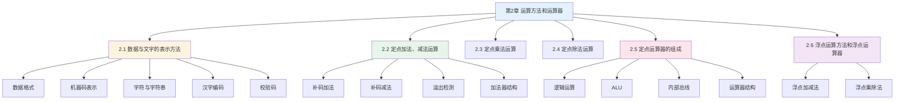

# 第2章 运算方法和运算器

## 基本信息
- **课程**：计算机组成原理
- **章节**：第2章 运算方法和运算器
- **日期**：2026-04-20
- **标签**：#运算方法 #运算器 #定点数 #浮点数 #补码 #原码

---

## 本章概述

本章是计算机组成原理的**重点章节**，主要讲述：
1. 计算机中数值数据与文字数据的表示方法
2. 定点数运算方法及定点运算器的组成
3. 浮点运算方法及浮点运算器的组成

---

## 知识结构图

---

## 各节内容导航

| 节号 | 标题 | 重点内容 | 掌握程度 |
|-----|------|---------|---------|
| **2.1** | [数据与文字的表示方法](./第2章-2.1-数据与文字的表示方法.md) | 定点数、浮点数、原码、补码、反码、移码 | ⭐⭐⭐ |
| **2.2** | [定点加法、减法运算](./第2章-2.2-定点加法减法运算.md) | 补码加减法、溢出检测、加法器结构 | ⭐⭐⭐ |
| **2.3** | [定点乘法运算](./第2章-2.3-定点乘法运算.md) | 原码乘法、补码乘法、阵列乘法器 | ⭐⭐ |
| **2.4** | [定点除法运算](./第2章-2.4-定点除法运算.md) | 原码除法、恢复余数法、加减交替法 | ⭐⭐ |
| **2.5** | [定点运算器的组成](./第2章-2.5-定点运算器的组成.md) | ALU、逻辑运算、内部总线、运算器结构 | ⭐⭐⭐ |
| **2.6** | [浮点运算方法和浮点运算器](./第2章-2.6-浮点运算方法和浮点运算器.md) | 浮点加减法、浮点乘除法、对阶、规格化 | ⭐⭐⭐ |

---

## 核心概念速查

### 1. 数据表示

| 概念 | 定义 |
|-----|------|
| **定点数** | 小数点位置固定不变的数 |
| **浮点数** | 小数点位置可以浮动的数 |
| **原码** | 符号位 + 绝对值 |
| **补码** | 模运算表示，减法变加法 |
| **反码** | 原码除符号位外取反 |
| **移码** | 补码符号位取反 |

### 2. 运算方法

| 运算 | 关键方法 |
|-----|---------|
| **定点加减法** | 补码运算，符号位参与运算 |
| **定点乘法** | 原码乘法（符号位单独处理）、补码乘法（Booth算法） |
| **定点除法** | 恢复余数法、加减交替法 |
| **浮点运算** | 对阶 → 尾数运算 → 规格化 → 舍入 → 溢出判断 |

### 3. 运算器组成

| 部件 | 功能 |
|-----|------|
| **ALU** | 算术逻辑运算单元 |
| **寄存器组** | 暂存操作数和结果 |
| **内部总线** | 数据传输通道 |
| **标志寄存器** | 保存运算状态（进位、溢出、零标志等） |

---

## 重点公式汇总

### 数据表示范围

**定点纯小数**：
$$0 \leqslant |x| \leqslant 1 - 2^{-n}$$

**定点纯整数**：
$$0 \leqslant |x| \leqslant 2^n - 1$$

**浮点数**：
$$N = 2^e \cdot M$$

### 机器码转换

**原码**：
$$[x]_{原} = \begin{cases} x, & 2^n > x \geqslant 0 \\ 2^n + |x|, & 0 \geqslant x > -2^n \end{cases}$$

**补码**：
$$[x]_{补} = \begin{cases} x, & 2^n > x \geqslant 0 \\ 2^{n+1} + x, & 0 > x \geqslant -2^n \end{cases} \pmod{2^{n+1}}$$

**反码**：
$$[x]_{反} = \begin{cases} x, & 2^n > x \geqslant 0 \\ (2^{n+1}-1) + x, & 0 \geqslant x > -2^n \end{cases}$$

**移码**：
$$[x]_{移} = 2^n + x, \quad -2^n \leqslant x < 2^n$$

### 补码运算

**补码加法**：
$$[x + y]_{补} = [x]_{补} + [y]_{补} \pmod{2^{n+1}}$$

**补码减法**：
$$[x - y]_{补} = [x]_{补} + [-y]_{补} \pmod{2^{n+1}}$$

---

## 学习建议

### 1. 学习顺序
1. 先掌握**数据表示**（原码、补码、反码、移码）
2. 再学习**定点运算**（加减乘除）
3. 最后学习**浮点运算**和**运算器结构**

### 2. 重点掌握
- ⭐⭐⭐ **补码运算**：这是计算机中最常用的运算方式
- ⭐⭐⭐ **溢出检测**：判断运算结果是否正确
- ⭐⭐⭐ **浮点运算步骤**：对阶、尾数运算、规格化、舍入

### 3. 常见难点
- 补码的求法（负数）
- 溢出判断的三种方法
- Booth算法（补码乘法）
- 浮点数的规格化

---

## 疑问与思考

### ❓ 待解决问题
1. 
2. 

### 💡 学习技巧
- **补码的本质**：模运算，把负数映射到正数范围
- **溢出的本质**：运算结果超出表示范围
- **浮点运算的核心**：对阶使阶码相同，然后尾数运算

---

## 相关链接

- **上一章**：[第1章-计算机系统概述](./第1章-计算机系统概述.md)
- **下一章**：[第3章-存储系统](./第3章-存储系统.md)
- **课本出处**：第2章"运算方法和运算器"

---

*笔记创建时间：2026-04-20*
