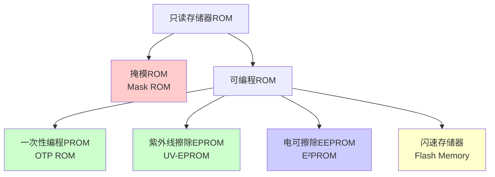
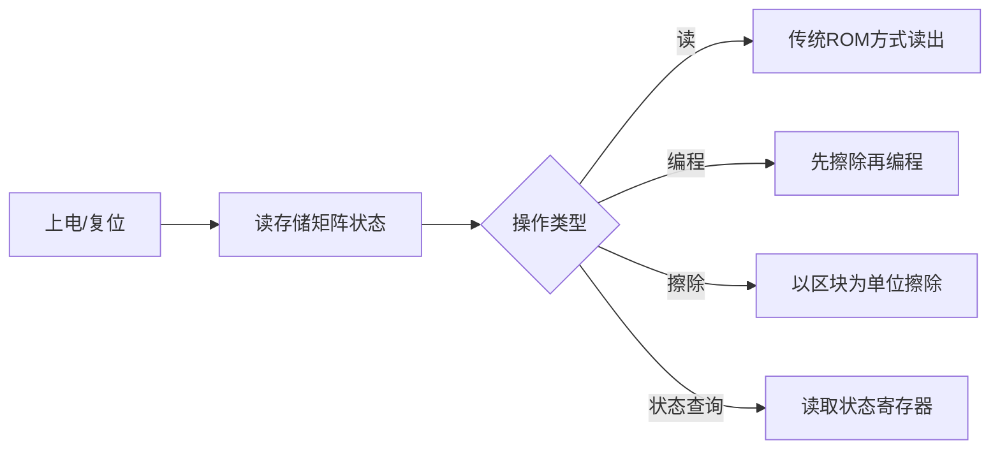

# 第3章-3.4 只读存储器(ROM)

## 基本信息
- **课程**：计算机组成原理
- **章节**：第3章 3.4节 只读存储器
- **日期**：2026-04-03
- **标签**：#ROM #只读存储器 #Flash #NOR #NAND

---

## 重点内容

### ⭐⭐ 重要概念
1. **ROM的分类** - 掩模ROM、PROM、EPROM、EEPROM、Flash
2. **NOR闪存 vs NAND闪存** - 特点、应用场景
3. **存储器特性比较** - 各类存储器的优缺点

---

## 详细笔记

### 3.4.1 只读存储器概述

#### ROM的基本特点

| 特点 | 说明 |
|------|------|
| **非易失性** | 断电后信息不丢失 |
| **只读** | 工作时只能读出，不能写入 |
| **访问速度** | 比RAM稍低 |
| **随机访问** | 可以按地址随机访问并在线执行程序 |
| **应用** | 存储固件、引导加载程序、监控程序 |

> 💡 "只读"的含义：工作时只能读出，但现代ROM支持**编程**（更新内容），只是编程操作复杂、耗时长、次数有限。

#### ROM的分类

#### 1. 掩模ROM (Mask ROM)

| 项目 | 内容 |
|------|------|
| **特点** | 存储内容固定，由厂家在生产时写入 |
| **优点** | 成本极低 |
| **缺点** | 内容不可更改 |
| **应用** | 标准功能程序、用户定制程序、大批量应用 |

#### 2. 一次性编程PROM (OTP ROM)

- **特点**：用户可编程，但**只能编程一次**
- **应用**：不需要更新的固定程序

#### 3. 紫外线擦除EPROM (UV-EPROM)

| 项目 | 内容 |
|------|------|
| **擦除方式** | 紫外线照射（通过石英窗口） |
| **擦除时间** | 数分钟至十余分钟 |
| **特点** | 可多次编程和验证 |
| **缺点** | 需要离线擦除，操作不便 |

#### 4. 电可擦除PROM (EEPROM/E²PROM)

| 项目 | 内容 |
|------|------|
| **擦除方式** | 电擦除，无需离线操作 |
| **擦除速度** | 快，可单字节编程和擦除 |
| **擦除块尺寸** | 很小（字节级） |
| **容量** | 较小 |
| **成本** | 单位成本高 |
| **擦除次数** | 约100万次 |
| **应用** | 系统配置信息、加密数据、历史信息 |

#### 5. 闪速存储器 (Flash Memory)

| 项目 | 内容 |
|------|------|
| **特点** | 电可擦、在线编程、非易失性 |
| **擦除速度** | 远高于传统UV-EPROM和E²PROM |
| **存储密度** | 高 |
| **工作速度** | 快 |
| **擦除块尺寸** | 较大（通常512字节以上） |
| **擦除次数** | NOR闪存1万-10万次 |
| **技术分类** | NOR技术、NAND技术、DINOR技术、AND技术 |

---

### 存储器特性比较

| 存储器类型 | 非易失性 | 高密度 | 低功耗 | 可在线更新 | 快速读出 |
|-----------|---------|-------|--------|-----------|---------|
| **Flash闪存** | ✓ | ✓ | ✓ | ✓ | ✓ |
| **SRAM** | - | - | - | ✓ | ✓ |
| **DRAM** | - | ✓ | - | ✓ | ✓ |
| **EEPROM** | ✓ | - | ✓ | ✓ | ✓ |
| **OTP ROM** | ✓ | ✓ | ✓ | - | ✓ |
| **UV-EPROM** | ✓ | ✓ | ✓ | - | ✓ |
| **掩模ROM** | ✓ | ✓ | ✓ | - | ✓ |
| **硬盘** | ✓ | ✓ | - | ✓ | - |
| **CD-ROM光盘** | ✓ | ✓ | - | - | - |

---

### 3.4.2 NOR闪存

#### NOR闪存的特点

| 特点 | 说明 |
|------|------|
| **别称** | 线性闪存 |
| **访问方式** | 可以像SRAM那样**随机读出**任意地址 |
| **代码执行** | 存储的指令代码可以**直接在线执行** |
| **编程** | 可以对**单字节或单字**进行编程 |
| **擦除** | 以**区块(sector)**或芯片为单位 |
| **接口** | 独立的数据线和地址线，类似SRAM |
| **可靠性** | 信息存储可靠性高 |

#### NOR闪存 vs NAND闪存

| 特性 | NOR闪存 | NAND闪存 |
|------|---------|----------|
| **访问方式** | **随机访问** | 以页(page)为单位访问 |
| **代码执行** | **可直接执行** | 不能直接执行 |
| **编程单位** | 单字节/单字 | 页为单位 |
| **擦除单位** | 区块(sector) | 块(block，数十页) |
| **接口方式** | 类似SRAM | 总线复用 |
| **存储密度** | 较低 | **较高** |
| **成本** | 较高 | **较低** |
| **擦除次数** | 1万-10万次 | 10倍于NOR |
| **可靠性** | **较高** | 有较高比特错误率 |
| **典型应用** | 代码存储 | 大容量存储设备 |

#### 应用场景

**NOR闪存适合**：
- 擦除和编程操作较少
- 需要直接执行代码的场合
- 纯代码存储应用

**NAND闪存适合**：
- 大容量存储设备
- 存储卡、U盘、固态硬盘
- 需要频繁擦写的场景

#### NOR闪存的工作方式

**主要操作**：
1. **读操作**：与传统ROM完全兼容，只需片选和地址
2. **编程操作**：需要先擦除再编程
3. **擦除操作**：以区块为单位
4. **状态控制**：通过内部状态机管理

---

## 疑问与思考

1. ❓ 为什么Flash存储器被称为"闪速"存储器？
   - 💡 因为其擦除速度远高于传统的UV-EPROM和E²PROM

2. ❓ 为什么NOR闪存适合存储代码，而NAND闪存适合存储数据？
   - 💡 NOR可以随机访问和直接执行代码；NAND密度高、成本低，适合大容量数据存储

3. ❓ EEPROM和Flash的主要区别是什么？
   - 💡 EEPROM可单字节擦写，擦写次数多；Flash以块为单位擦除，擦写次数相对较少，但密度高、成本低

---

## 相关链接

- 课本内容：[full.md](../../full.md)
- 上一节：3.3 动态随机存取存储器(DRAM)
- 下一节：3.5 主存储器

---

## 快速参考

### ROM分类速记

| 类型 | 可编程 | 可擦除 | 擦除方式 | 擦除单位 |
|------|-------|--------|---------|---------|
| 掩模ROM | ✗ | ✗ | - | - |
| OTP ROM | 一次 | ✗ | - | - |
| UV-EPROM | ✓ | ✓ | 紫外线 | 整片 |
| EEPROM | ✓ | ✓ | 电擦除 | 字节 |
| Flash | ✓ | ✓ | 电擦除 | 块/扇区 |

### 考试重点

1. ⭐⭐ 各类ROM的特点和应用场景
2. ⭐⭐ NOR闪存与NAND闪存的区别
3. ⭐ 存储器特性比较表
