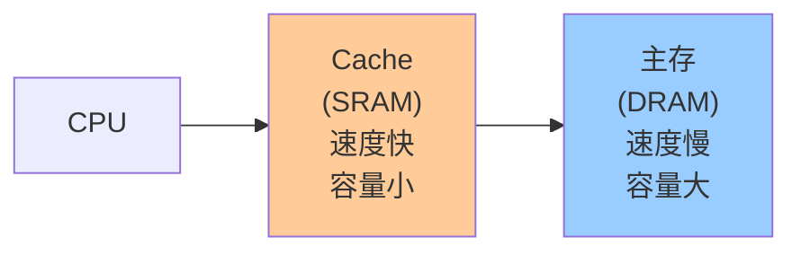
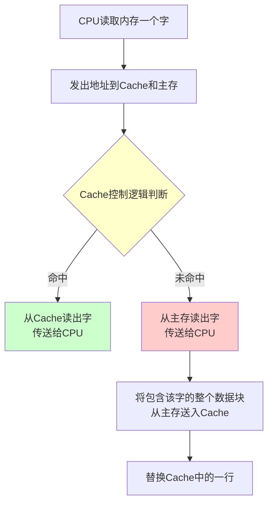
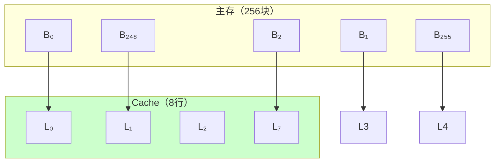
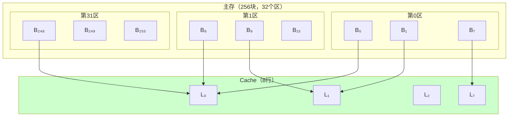
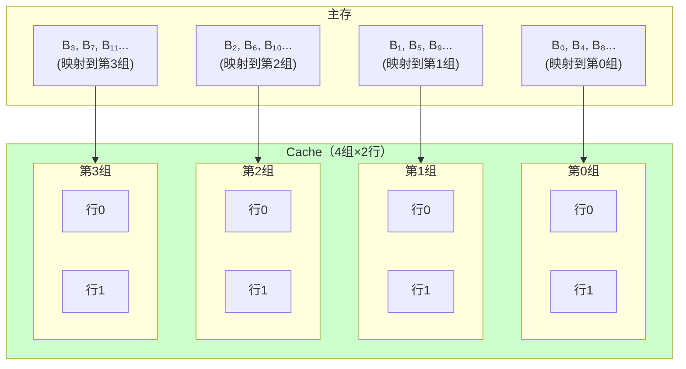
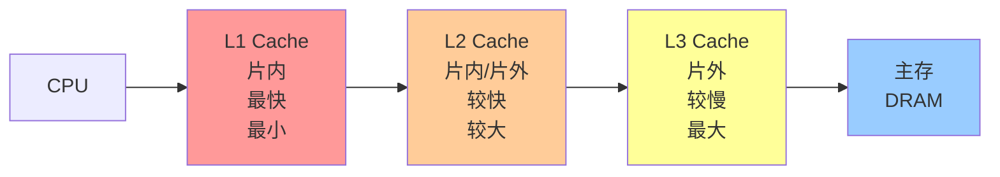

# 第3章-3.6 高速缓冲存储器(Cache)

## 基本信息
- **课程**：计算机组成原理
- **章节**：第3章 3.6节 高速缓冲存储器
- **日期**：2026-04-03
- **标签**：#Cache #高速缓冲存储器 #地址映射 #命中率 #LRU #写回法

---

## 重点内容

### ⭐⭐⭐ 核心考点
1. **Cache命中率计算** - 命中率、平均访问时间、访问效率
2. **三种地址映射方式** - 全相联、直接映射、组相联
3. **替换策略** - LRU算法
4. **写操作策略** - 写回法、全写法、写一次法

### ⭐⭐ 重要概念
- Cache的基本原理和工作过程
- 多级Cache结构
- Cache对程序员透明

---

## 详细笔记

### 3.6.1 Cache基本原理

#### 1. Cache的功能



**Cache的特点**：

| 特点 | 说明 |
|------|------|
| **位置** | 介于CPU和主存之间 |
| **组成** | 高速SRAM |
| **速度** | 接近CPU速度 |
| **容量** | 远小于主存 |
| **实现** | 全部由硬件实现 |
| **透明性** | 对程序员透明 |

> 💡 **透明性**：不论是否有Cache，CPU访存方法相同，软件不需增加指令

#### 2. Cache的基本原理

**数据交换单位**：

| 交换路径 | 单位 | 说明 |
|---------|------|------|
| CPU ↔ Cache | **字** (word) | CPU每次访问的最小单位 |
| Cache ↔ 主存 | **块** (block) | 若干字组成，定长 |

**工作过程**：



#### 3. Cache的命中率（⭐⭐⭐ 考试重点）

**基本公式**：

| 公式 | 表达式 | 说明 |
|------|--------|------|
| **命中率** | $h = \frac{N_c}{N_c + N_m}$ | $N_c$=Cache存取次数，$N_m$=主存存取次数 |
| **缺失率** | $1-h$ | 未命中的比例 |
| **平均访问时间** | $t_a = h \cdot t_c + (1-h) \cdot t_m$ | $t_c$=Cache访问时间，$t_m$=主存访问时间 |
| **访问效率** | $e = \frac{t_c}{t_a} = \frac{1}{r+(1-r)h}$ | $r = t_m/t_c$=速度比 |

> 📌 **考点**：命中率、平均访问时间、访问效率的计算

**【例3.4】** CPU执行一段程序时，Cache完成存取的次数为1900次，主存完成存取的次数为100次，已知Cache存取周期为50ns，主存存取周期为250ns，求Cache/主存系统的效率和平均访问时间。

**解**：

**第一步：计算命中率**
$$
h = \frac{N_c}{N_c + N_m} = \frac{1900}{1900 + 100} = \frac{1900}{2000} = 0.95
$$

**第二步：计算速度比**
$$
r = \frac{t_m}{t_c} = \frac{250\text{ns}}{50\text{ns}} = 5
$$

**第三步：计算访问效率**
$$
e = \frac{1}{r + (1-r)h} = \frac{1}{5 + (1-5) \times 0.95} = \frac{1}{5 - 3.8} = \frac{1}{1.2} = 83.3\%
$$

**第四步：计算平均访问时间**
$$
t_a = \frac{t_c}{e} = \frac{50\text{ns}}{0.833} = 60\text{ns}
$$

**结论**：
- 命中率：95%
- 访问效率：83.3%
- 平均访问时间：60ns（接近Cache的50ns，远小于主存的250ns）

#### 4. Cache结构设计必须解决的问题

| 序号 | 问题 | 解决方案 |
|------|------|---------|
| ① | 主存内容如何放入Cache？ | **地址映射** |
| ② | 如何找到Cache中的信息？ | **地址变换** |
| ③ | Cache空间不足如何替换？ | **替换算法** |
| ④ | 写操作如何保持一致性？ | **写操作策略** |

---

### 3.6.2 主存与Cache的地址映射（⭐⭐⭐ 考试重点）

#### 基本概念

| 术语 | 符号 | 含义 |
|------|------|------|
| Cache行 | $L_i$ | Cache的数据块，共$m=2^r$行 |
| 主存块 | $B_j$ | 主存的数据块，共$n=2^s$块 |
| 块（行）大小 | $k=2^w$ | 每个块由$2^w$个字组成 |

#### 1. 全相联映射方式

**原理**：主存块可以映射到Cache的**任意一行**



**地址结构**：
```
┌─────────────────┬─────────┐
│    标记(s位)     │ 字地址(w位)│
│   (主存块号)      │         │
└─────────────────┴─────────┘
```

**检索过程**：
1. 将主存地址的块号与Cache中**所有行的标记**同时比较
2. 命中：从Cache读取
3. 未命中：从主存读取

**特点**：
- ✅ 优点：灵活，命中率高
- ❌ 缺点：比较器电路复杂，只适合小容量Cache

#### 2. 直接映射方式（⭐⭐ 常考）

**原理**：一个主存块只能映射到Cache的**特定行**

**映射公式**：
$$
i = j \mod m
$$

其中：$i$=Cache行号，$j$=主存块号，$m$=Cache总行数



**地址结构**：
```
┌─────────────┬─────────────┬─────────┐
│  标记(s-r位) │   行号(r位)  │ 字地址(w位)│
│   (区号)     │  (区内块号)  │         │
└─────────────┴─────────────┴─────────┘
```

**检索过程**：
1. 用$r$位行号找到Cache的特定行
2. 用$s-r$位标记与此行标记比较
3. 相符→命中；不符→未命中

**特点**：
- ✅ 优点：硬件简单，成本低，地址变换快
- ❌ 缺点：容易产生冲突（块号相距$m$整数倍的块映射到同一行）

**【例3.5】** 直接映射方式的内存地址格式如下：

| 标记s-r | 行r | 字地址w |
|---------|-----|---------|
| 8位 | 14位 | 2位 |

若主存地址用十六进制表示为BBBBBB，请用十六进制格式表示直接映射方法Cache的标记、行、字地址的值。

**解**：
- $(BBBBBB)_{16} = (101110111011101110111011)_2$
- 标记：$(10111011)_2 = (BB)_{16}$
- 行：$(10111011101110)_2 = (2EEE)_{16}$
- 字地址：$(11)_2 = (3)_{16}$

#### 3. 组相联映射方式（⭐⭐⭐ 最常用）

**原理**：折中方案，Cache分成$u$组，每组$v$行

**映射关系**：
- 主存块映射到**固定组**，组内**任意行**
- $m = u \times v$（总行数=组数×每组行数）
- 组号：$q = j \mod u$



**地址结构**：
```
┌─────────────┬─────────────┬─────────┐
│  标记(s-d位) │   组号(d位)  │ 字地址(w位)│
│             │  (区内块号)  │         │
└─────────────┴─────────────┴─────────┘
```

**检索过程**：
1. 用$d$位组号找到Cache的相应组
2. 将标记与该组$v$行中的所有标记**同时比较**
3. 哪行标记相符，哪行命中

**特点**：
- 每组行数$v$一般较小（2、4、8、16）
- 称为**$v$路组相联**
- 兼顾灵活性和硬件复杂度

**【例3.6】** 一个组相联Cache由64个行组成，每组4行。主存储器包含4K个块，每块128字。请表示内存地址的格式。

**解**：
- 块大小 = 行大小 = $2^w = 128 = 2^7$，所以$w = 7$
- 每组行数$v = 4$
- Cache行数 = $u \times v = 2^d \times 4 = 64$，所以$d = 4$
- 组数$u = 2^d = 16$
- 主存块数 = $2^s = 4K = 2^{12}$，所以$s = 12$
- 标记大小 = $s - d = 12 - 4 = 8$位
- 主存地址长度 = $s + w = 12 + 7 = 19$位

**地址格式**：

| 标记s-d | 组号d | 字地址w |
|---------|-------|---------|
| 8位 | 4位 | 7位 |

#### 三种映射方式对比

| 映射方式 | 灵活性 | 命中率 | 硬件复杂度 | 应用 |
|---------|-------|-------|-----------|------|
| **全相联** | 最高 | 最高 | 最复杂（需比较所有行） | 小容量Cache |
| **直接映射** | 最低 | 较低 | 最简单（只需比较一行） | 大容量Cache |
| **组相联** | 中等 | 较高 | 中等（只需比较组内行） | **普遍采用** |

---

### 3.6.3 Cache的替换策略

当Cache满时，需要选择替换哪一行：

| 策略 | 英文 | 原理 | 特点 |
|------|------|------|------|
| **LFU** | Least Frequently Used | 替换访问次数最少的行 | 计数器定期清零，不能严格反映近期访问 |
| **LRU** | Least Recently Used | 替换最久未被访问的行 | 保护新数据，命中率较高，**最常用** |
| **随机** | Random | 随机选择一行替换 | 硬件简单，速度快，性能稍逊 |

**2路组相联的LRU简化实现**：
- 只需1个二进制位
- A行写入→置1，B行写入→置0
- 置换时：为0换出A行，为1换出B行

---

### 3.6.4 Cache的写操作策略

保持Cache与主存一致性的三种策略：

| 策略 | 写命中时 | 写未命中时 | 特点 |
|------|---------|-----------|------|
| **写回法**（Write Back） | 只修改Cache，替换时才写回主存 | 将要修改的块调入Cache后修改 | 减少写主存次数，存在不一致隐患，需修改位 |
| **全写法**（Write Through） | Cache与主存同时修改 | 直接写入主存（WTWA调入Cache/WTNWA不调入） | 一致性好，无修改位，降低Cache性能 |
| **写一次法**（Write Once） | 第一次写命中同时写入主存，之后写回 | 同写回法 | 维护多Cache一致性，奔腾CPU采用 |

**对比**：

| 特性 | 写回法 | 全写法 | 写一次法 |
|------|-------|-------|---------|
| 写主存次数 | 少 | 多 | 中等 |
| 一致性 | 可能有隐患 | 好 | 好 |
| 需要修改位 | 是 | 否 | 是 |
| 应用 | 单处理器 | 多处理器 | 奔腾CPU |

---

### 3.6.5 使用多级Cache减少缺失损失

现代处理器使用两级以上Cache：



**【例3.8】** 二级Cache性能计算

**题目**：处理器基本CPI为1.0，时钟频率5GHz，主存访问时间100ns，一级Cache缺失率2%。增加二级Cache，访问时间5ns，使主存缺失率降为0.5%。问处理器速率提高多少？

**解**：

**只有一级Cache**：
- 缺失损失 = $100\text{ns} / 0.2\text{ns} = 500$个时钟周期
- 总CPI = $1.0 + 2\% \times 500 = 11.0$

**有二级Cache**：
- 二级Cache缺失损失 = $5\text{ns} / 0.2\text{ns} = 25$个时钟周期
- 总CPI = $1 + 2\% \times 25 + 0.5\% \times 500 = 1 + 0.5 + 2.5 = 4.0$

**性能提升**：$11.0 / 4.0 \approx 2.8$倍

---

## 疑问与思考

1. ❓ 为什么Cache对程序员是透明的？
   - 💡 因为Cache全部由硬件实现，CPU访存时自动处理Cache的命中/未命中，软件不需要任何特殊指令

2. ❓ 为什么组相联映射方式最常用？
   - 💡 因为它兼顾了全相联的灵活性（组内任意行）和直接映射的硬件简单性（只需比较组内行）

3. ❓ 写回法和全写法的主要区别是什么？
   - 💡 写回法异步写主存（替换时才写），全写法同步写主存（每次都写）

4. ❓ 为什么LRU算法比LFU算法更优？
   - 💡 LRU保护刚复制到Cache的新数据行，符合程序局部性原理，使Cache有较高命中率

---

## 相关链接

- 课本内容：[full.md](../../full.md)
- 上一节：3.5 并行存储器
- 下一节：3.7 虚拟存储器

---

## 公式汇总

| 公式 | 说明 |
|------|------|
| $h = \frac{N_c}{N_c+N_m}$ | 命中率 |
| $t_a = h \cdot t_c + (1-h) \cdot t_m$ | 平均访问时间 |
| $e = \frac{1}{r+(1-r)h}$ | 访问效率 |
| $i = j \mod m$ | 直接映射行号计算 |
| $m = u \times v$ | 组相联：总行数=组数×每组行数 |
| $q = j \mod u$ | 组相联组号计算 |

---

## 考试重点

1. ⭐⭐⭐ **命中率、平均访问时间、访问效率计算**
   - 公式记忆和代入计算
   - 例3.4类型的题目

2. ⭐⭐⭐ **三种地址映射方式**
   - 全相联：任意行，比较所有行
   - 直接映射：特定行，$i = j \mod m$
   - 组相联：固定组，组内任意行
   - 地址格式和例题（例3.5、3.6、3.7）

3. ⭐⭐ **替换策略**
   - LRU最常用
   - 2路组相联LRU的简化实现

4. ⭐⭐ **写操作策略**
   - 写回法、全写法、写一次法的区别
   - 各自的优缺点和应用场景

5. ⭐ **多级Cache**
   - 减少缺失损失的原理
   - 性能计算（例3.8）
