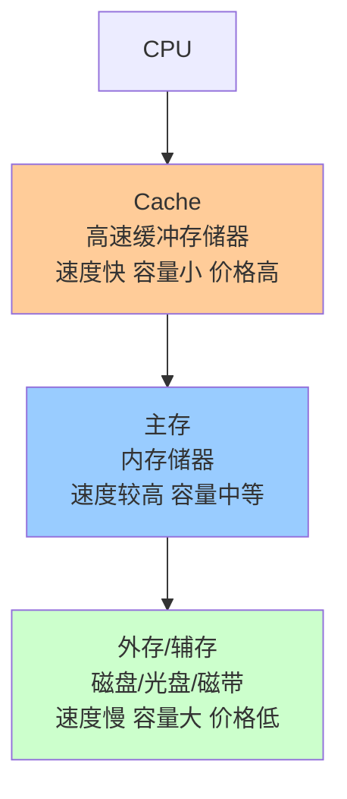
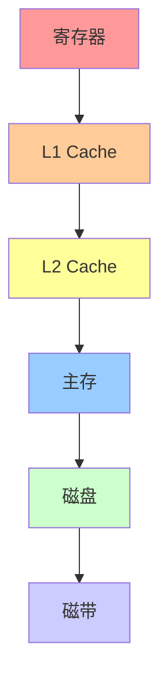
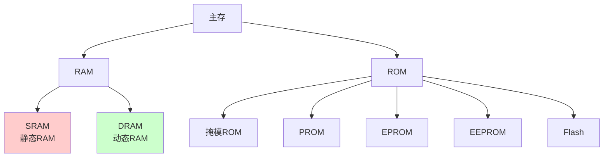

# 第3章-3.1 存储系统概述

## 基本信息
- **课程**：计算机组成原理
- **章节**：第3章 3.1节 存储系统概述
- **日期**：2026-06-16
- **标签**：#存储系统 #局部性原理 #多级存储 #大端小端 #存储器指标

---

## 重点内容

### ⭐⭐⭐ 核心概念
1. **程序的局部性原理** - 时间局部性、空间局部性
2. **多级存储系统** - cache、主存、外存三级结构
3. **大端模式 vs 小端模式** - 字节排列顺序
4. **存储器技术指标** - 存储容量、存取时间、存储周期、存储器带宽

### ⭐⭐ 重要分类
- 按存储介质：半导体存储器、磁表面存储器、光存储器
- 按存取方式：随机存取、顺序存取、半顺序存取
- 按读写功能：RAM、ROM
- 按信息易失性：易失性、非易失性

---

## 详细笔记

### 3.1.1 存储系统的层次结构

#### 1. 程序的局部性原理

统计表明，在一个较短的时间间隔内，程序所访问的存储器地址在很大比例上集中在存储器地址空间的很小范围内。

| 局部性类型 | 说明 |
|-----------|------|
| **时间局部性** | 最近被访问的信息很可能还要被访问 |
| **空间局部性** | 最近被访问的信息邻近地址的信息也可能被访问 |

> 💡 局部性原理是多级存储系统的理论依据

#### 2. 多级存储系统的组成

| 层次 | 作用 | 特点 |
|------|------|------|
| **Cache** | 提升访问速度 | 速度接近CPU，容量小，价格高 |
| **主存** | 存放当前运行程序 | 速度较高，容量适中 |
| **外存** | 扩大存储容量 | 速度慢，容量大，价格低 |

**目标**：让整个存储系统在速度上接近cache，在容量和价格上接近外存。

#### 3. 金字塔式存储结构

- 越往上：速度越快、容量越小、价格越高
- 越往下：速度越慢、容量越大、价格越低

---

### 3.1.2 存储器的分类

#### 1. 按存储介质

| 介质类型 | 代表 | 特点 |
|---------|------|------|
| **半导体器件** | SRAM、DRAM、ROM | 速度快，易集成 |
| **磁性材料** | 磁盘、磁带 | 容量大，信息不易丢失 |
| **光存储器** | CD-ROM、DVD | 容量大，只读或读写 |

#### 2. 按存取方式

| 存取方式 | 说明 | 代表 |
|---------|------|------|
| **随机存取** | 任何单元可被随机存取，时间与物理位置无关 | RAM |
| **顺序存取** | 按顺序存取，时间与物理位置有关 | 磁带 |
| **半顺序存取** | 沿磁道方向顺序，垂直半径方向随机 | 磁盘 |

#### 3. 按读写功能

- **RAM** (Random Access Memory)：既能读出又能写入
- **ROM** (Read Only Memory)：只能读出不能写入

#### 4. 按信息易失性

- **易失性存储器**：断电后信息消失（如RAM）
- **非易失性存储器**：断电后仍保存信息（如ROM、磁盘）

#### 5. 主存的分类

---

### 3.1.3 存储器的编址和端模式

#### 1. 编址方式

| 编址方式 | 最小单位 | 说明 |
|---------|---------|------|
| **按字编址** | 字存储单元 | 每个地址对应一个字 |
| **按字节编址** | 字节存储单元 | 每个地址对应一个字节 |

> 💡 现代计算机普遍采用**按字节编址**

#### 2. 端模式（字节序）

当一个存储字的字长高于8位时，存在多字节的排列顺序问题。

| 端模式 | 存放方式 | 特点 |
|-------|---------|------|
| **大端模式(big-endian)** | 高有效字节放在低地址端 | 符合人类阅读习惯 |
| **小端模式(little-endian)** | 低有效字节放在低地址端 | 符合处理器运算习惯 |

**示例**：32位数 $(0A0B0C0D)_{16}$ 的存放

| 地址 | 大端模式 | 小端模式 |
|------|---------|---------|
| 低地址 | 0A | 0D |
| | 0B | 0C |
| | 0C | 0B |
| 高地址 | 0D | 0A |

> 📌 **常见处理器**：英特尔64系列采用小端模式；ARM系列默认小端，但可切换。

---

### 3.1.4 存储器的技术指标

| 指标 | 符号 | 定义 | 说明 |
|------|------|------|------|
| **存储容量** | - | 可存储的信息比特数 | 常用B、KB、MB、GB、TB表示 |
| **存取时间** | $t_{AQ}$ | 从接收读/写命令到信息读出或写入完成的时间 | 取决于物理特性和寻址结构 |
| **存储周期** | $t_{RC}/t_{WC}$ | 连续两次访问存储器的最小间隔时间 | 通常略大于存取时间 |
| **存储器带宽** | - | 单位时间内存储器存取的信息量 | bit/s 或 B/s |

**存储容量表示**：
- 比特数(bit)或字节数(B)
- 也可表示为：存储字数 $\times$ 存储字长
- 示例：1Mbit可组织为 $1M \times 1$bit、$128K \times 8$bit、$512K \times 4$bit

**存储器带宽计算**：
$$
带宽 = W / 存取周期
$$
其中 $W$ 为系统总线宽度（位）

---

## 疑问与思考

1. ❓ 为什么需要多级存储系统，而不是直接用超大容量的高速存储器？
   - 💡 因为高速存储器价格昂贵，多级结构可以在性能、容量、成本之间取得平衡

2. ❓ 大端模式和小端模式各有什么优缺点？
   - 💡 大端符合人类阅读顺序，适合网络传输；小端符合处理器低位在前的运算习惯

3. ❓ 存储周期为什么略大于存取时间？
   - 💡 因为存储器需要一定的恢复时间才能进行下一次访问

---

## 相关链接

- 课本内容：[full.md](../../full.md)
- 上一节：第2章 运算方法和运算器
- 下一节：3.2 静态随机存取存储器(SRAM)

---

## 考试重点

1. ⭐⭐⭐ **程序的局部性原理**（时间局部性、空间局部性）
2. ⭐⭐⭐ **多级存储系统的组成和作用**
3. ⭐⭐ **大端模式与小端模式的区别**
4. ⭐⭐ **存储器的技术指标**（容量、存取时间、存储周期、带宽）
5. ⭐ **存储器的分类**（按介质、按存取方式、按读写功能）
