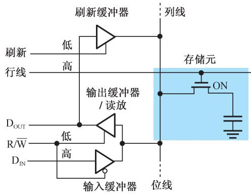
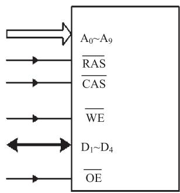
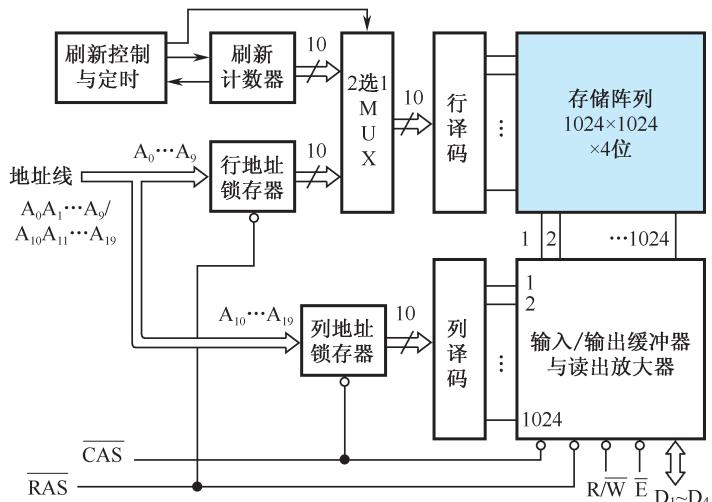
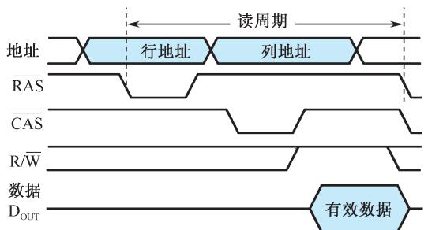
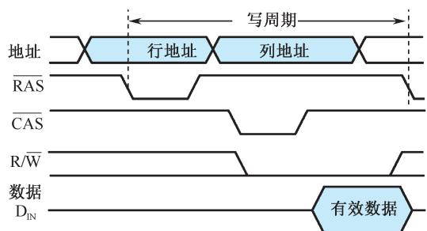
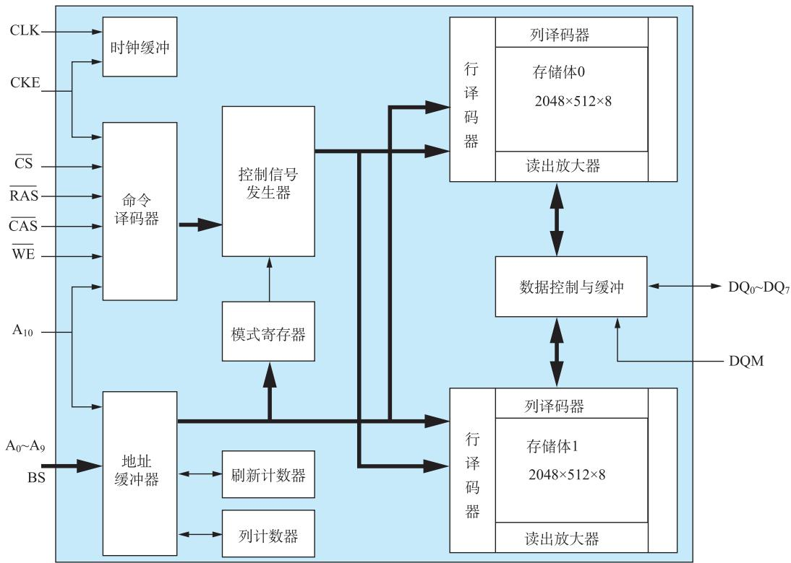
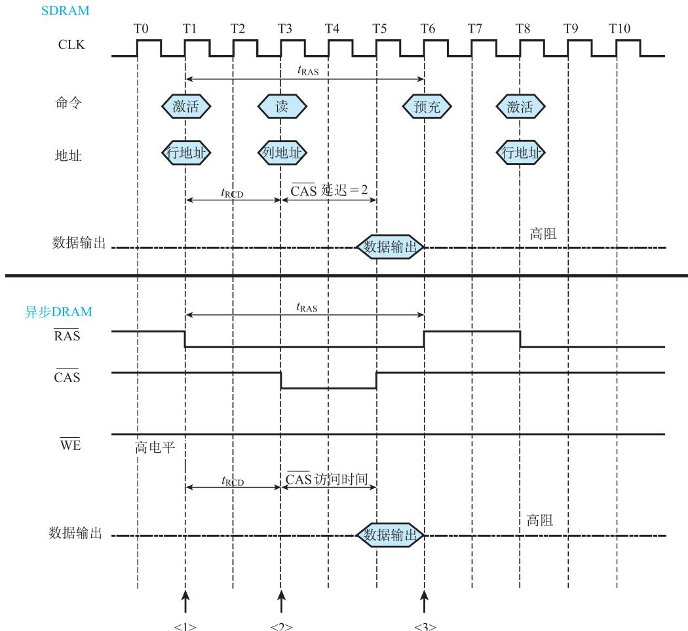
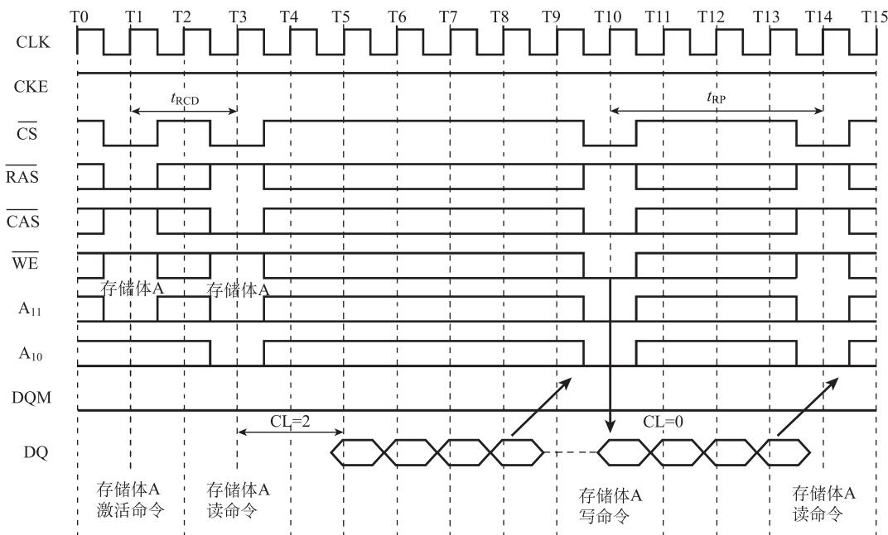
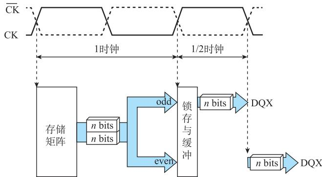
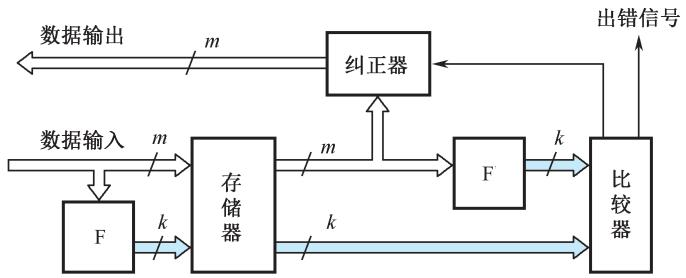

# 第3章-3.3 动态随机存取存储器(DRAM)

## 基本信息
- **课程**：计算机组成原理
- **章节**：第3章 3.3节 动态随机存取存储器
- **日期**：2026-06-16
- **标签**：#DRAM #动态存储器 #刷新 #SDRAM #存储元

---

## 重点内容

### ⭐⭐⭐ 核心考点
1. **DRAM存储元工作原理** - 单管MOS+电容器
2. **DRAM与SRAM的对比**
3. **DRAM刷新操作** - 集中式刷新、分散式刷新
4. **DRAM读/写时序** - RAS、CAS信号

### ⭐⭐ 重要概念
- 破坏性读出与刷新
- 行地址锁存器、列地址锁存器
- 突发传输模式
- 同步DRAM(SDRAM)

---

## 详细笔记

### 3.3.1 DRAM存储元的工作原理

DRAM简化了每个存储元的结构，因而**存储密度很高**，通常用作计算机的主存储器。

**单管DRAM记忆电路**：

| 状态 | 电容器 | 表示 |
|------|--------|------|
| 充满电荷 | 有电荷 | 存储1 |
| 放电 | 无电荷 | 存储0 |

**读写过程**：

| 操作 | 过程 |
|------|------|
| **写1** | 输入缓冲器打开，$D_{IN}=1$送到位线，行选线为高打开MOS管，高电平给电容充电 |
| **写0** | 输入缓冲器打开，$D_{IN}=0$送到位线，电容通过MOS管和位线放电 |
| **读出** | 输出缓冲器打开，行选线为高打开MOS管，电容上存储的信息送到位线 |

> ⚠️ **破坏性读出**：读出过程会破坏电容上存储的信息，所以读出后必须**刷新**（重新写入）。

**与SRAM对比**：

| 特性 | SRAM | DRAM |
|------|------|------|
| **存储元** | 触发器（6管） | 单管MOS+电容 |
| **存储密度** | 较低 | **很高** |
| **速度** | **快** | 较慢 |
| **刷新** | 不需要 | **需要周期性刷新** |
| **功耗** | 较高 | 较低 |
| **成本** | 较高 | **较低** |
| **应用**| 应用 | Cache | 主存 |

#### 📷 图3.9 单管DRAM存储元的工作原理

> 📚 **课本出处**：图3.9 单管DRAM由一个MOS晶体管和电容器组成，MOS管作为开关，信息由电容器上的电荷量体现

---

### 3.3.2 DRAM芯片的逻辑结构

与SRAM不同，DRAM增加了**行地址锁存器**和**列地址锁存器**。

**地址分时传送**：
- 为减少芯片引脚数量，地址分为行、列两部分分时传送
- 示例：$1M \times 4$ 位DRAM，存储容量1M字需20位地址
  - 地址引脚：10位（而非20位）
  - 先传送行地址 $A_0 \sim A_9$，由$\overline{RAS}$打入行地址锁存器
  - 再传送列地址 $A_{10} \sim A_{19}$，由$\overline{CAS}$打入列地址锁存器

**关键信号**：

| 信号 | 名称 | 功能 |
|------|------|------|
| $\overline{RAS}$ | 行选通信号 | 低电平有效，将行地址打入行地址锁存器 |
| $\overline{CAS}$ | 列选通信号 | 低电平有效，将列地址打入列地址锁存器 |
| R/$\overline{W}$ | 读/写命令 | 高电平读，低电平写 |

> 💡 片选信号的功能由$\overline{RAS}$和$\overline{CAS}$信号实现

#### 📷 图3.10 $1\mathrm{M}\times 4$ 位DRAM芯片

**(a) 外部引脚图**

**(b) 逻辑结构图**

> 📚 **课本出处**：图3.10 地址引脚10位，行地址和列地址分时传送，增加行/列地址锁存器

---

### 3.3.3 DRAM读/写时序

#### 读周期

1. 地址线上**行地址**有效
2. $\overline{RAS}$ 有效，打入行地址锁存器
3. 地址线上传送**列地址**
4. $\overline{CAS}$ 有效，打入列地址锁存器
5. R/$\overline{W} = 1$（高电平表示读）
6. 数据线上输出数据

#### 写周期

1. 地址线上**行地址**有效，$\overline{RAS}$ 打入
2. 地址线上**列地址**有效，$\overline{CAS}$ 打入
3. R/$\overline{W} = 0$（低电平表示写）
4. 数据线上送入欲写入的数据 $D_{IN}$

**存取周期**：
- 从$\overline{RAS}$下降沿开始，到下一个$\overline{RAS}$下降沿为止
- 通常为控制方便，读周期和写周期时间相等

#### 📷 图3.11 DRAM的读/写周期时序图

**(a) 读周期**

**(b) 写周期**

> 📚 **课本出处**：图3.11 行地址先由$\overline{RAS}$打入，列地址再由$\overline{CAS}$打入，$\mathrm{R}/\overline{\mathrm{W}}$控制读写

---

### 3.3.4 DRAM的刷新操作

DRAM存储位元基于电容器上的电荷量存储信息，电荷会逐渐泄漏，因此必须**定期刷新**。

**刷新特点**：
- 读出是破坏性的，读出后必须刷新
- 未读写的存储元也要定期刷新（电荷泄漏）
- 刷新操作与读操作类似，但**无须送出数据**
- 可以将一行的所有存储元**同时刷新**
- 现代DRAM芯片通常在一次读操作后**自动刷新**选中行

**刷新周期**：当前主流DRAM器件的刷新间隔时间为**64ms**。

**常用刷新策略**：

| 刷新策略 | 说明 | 特点 |
|---------|------|------|
| **集中式刷新** | 每个刷新周期中集中一段时间对所有行进行刷新 | 存在"死时间"，刷新时暂停读写 |
| **分散式刷新** | 每一行的刷新操作均匀分配到刷新周期时间内 | 无死时间，但控制较复杂 |

**示例**：8192行、刷新周期64ms的DRAM
- 分散式刷新：每隔 $64ms / 8192 \approx 7.8\mu s$ 刷新一行

> 💡 刷新操作的优先级高于读写操作。

---

### 3.3.5 突发传输模式

**突发(Burst)访问**：在存储器同一行中对相邻的存储单元进行连续访问的方式。

**特点**：
- 突发长度从几字节到数千字节不等
- 只需向存储器**发送一次访问地址**
- 先激活一行，然后依次发出列选择信号
- 可消除地址建立时间及行、列线的预充电时间

**其他加速技术**：
- 快速页模式
- 扩展数据输出(EDO)
- 允许重复存取行缓冲区而无须增加另外的行存取时间

---

### 3.3.6 同步DRAM(SDRAM)

**传统DRAM**：异步工作，处理器送地址和控制信号后需等待存储器内部操作完成。

**SDRAM改进**：
- 在DRAM接口上增加**时钟信号**
- 降低存储器芯片与控制器同步的开销
- 优化DRAM与CPU之间的接口
- 这是SDRAM最主要的改进

#### 📷 图3.12 SDRAM逻辑结构图

> 📚 **课本出处**：图3.12 SDRAM在DRAM接口上增加时钟信号，优化DRAM与CPU之间的接口

#### 📷 图3.13 SDRAM和异步DRAM的读操作时序

> 📚 **课本出处**：图3.13 对比SDRAM和异步DRAM的读操作时序，SDRAM通过时钟同步降低开销

#### 📷 图3.14 SDRAM读和写命令操作的时序

> 📚 **课本出处**：图3.14 SDRAM读和写命令操作的时序，命令发送方式

#### 📷 DDR SDRAM

> 📚 **课本出处**：DDR SDRAM在时钟上升沿和下降沿都能传输数据，提供更快的操作速度

#### 📷 DRAM校验

> 📚 **课本出处**：DRAM增加附加位用于读/写操作正确性校验，附加位同数据位一起写入保存

---

## 疑问与思考

1. ❓ 为什么DRAM需要刷新而SRAM不需要？
   - 💡 DRAM用电容存储电荷，电荷会泄漏；SRAM用触发器，只要不断电就能保持状态

2. ❓ DRAM的破坏性读出是什么意思？
   - 💡 读出时电容上的电荷会流失，所以读出后必须重新写入（刷新）

3. ❓ 为什么DRAM地址要分时传送？
   - 💡 为了减少芯片引脚数量，降低成本和封装尺寸

4. ❓ 集中式刷新和分散式刷新各有什么适用场景？
   - 💡 集中式控制简单但有死时间；分散式无死时间但控制复杂，适合实时系统

---

## 相关链接

- 课本内容：[full.md](../../full.md)
- 上一节：3.2 静态随机存取存储器(SRAM)
- 下一节：3.4 只读存储器(ROM)

---

## 对比总结

### SRAM vs DRAM

| 对比项 | SRAM | DRAM |
|:-------|:-----|:-----|
| 存储元 | 触发器 | 单管MOS+电容 |
| 密度 | 低 | 高 |
| 速度 | 快 | 较慢 |
| 刷新 | 不需要 | 需要 |
| 功耗 | 较高 | 较低 |
| 成本 | 高 | 低 |
| 应用 | Cache | 主存 |
| 地址传送 | 并行 | 分时（RAS/CAS） |
| 读出特性 | 非破坏性 | 破坏性 |

---

## 考试重点

1. ⭐⭐⭐ **DRAM存储元工作原理**（单管MOS+电容、破坏性读出）
2. ⭐⭐⭐ **DRAM刷新操作**（集中式、分散式、刷新周期）
3. ⭐⭐⭐ **SRAM与DRAM的对比**
4. ⭐⭐ **DRAM地址分时传送**（$\overline{RAS}$、$\overline{CAS}$）
5. ⭐⭐ **突发传输模式**
6. ⭐ **SDRAM的改进**
