# 第3章-3.5 并行存储器

## 基本信息

- **课程**：计算机组成原理
- **章节**：第3章 3.5节 并行存储器
- **日期**：2026-04-03
- **标签**：#并行存储器 #双端口存储器 #多模块交叉存储器 #流水线

***

## 重点内容

### ⭐⭐ 重要概念

1. **双端口存储器** - 空间并行技术，两个独立端口同时访问
2. **多模块交叉存储器** - 时间并行技术，流水式并行存取
3. **交叉存取度计算** - $m\_{\min} = T/\tau$

### ⭐⭐⭐ 核心公式

- 交叉方式读取时间：$t\_1 = T + (m-1)\tau$
- 顺序方式读取时间：$t\_2 = mT$

***

## 详细笔记

### 3.5 并行存储器概述

#### 解决CPU与主存速度不匹配的技术层次

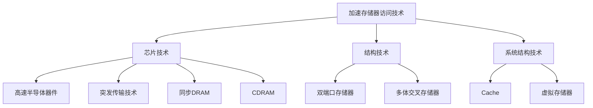

| 技术层次       | 具体技术                   | 作用            |
| ---------- | ---------------------- | ------------- |
| **芯片技术**   | 高速半导体、突发传输、SDRAM、CDRAM | 提高单个芯片访问速度    |
| **结构技术**   | 双端口存储器、多体交叉存储器         | 改进CPU与存储器连接方式 |
| **系统结构技术** | Cache、虚拟存储器            | 分层存储结构        |

本节重点讲授**双端口存储器**（空间并行）和**多体交叉存储器**（时间并行）。

***

### 3.5.1 双端口存储器

#### 1. 产生背景

**以CPU为中心的结构** → **以内存为中心的结构**

- 多个部件（CPU、I/O设备）都需要访问主存
- 传统存储器任一时刻只能进行一个读写操作
- 需要**多口存储器**扩展主存的信息交换能力

#### 2. 双端口存储器的逻辑结构

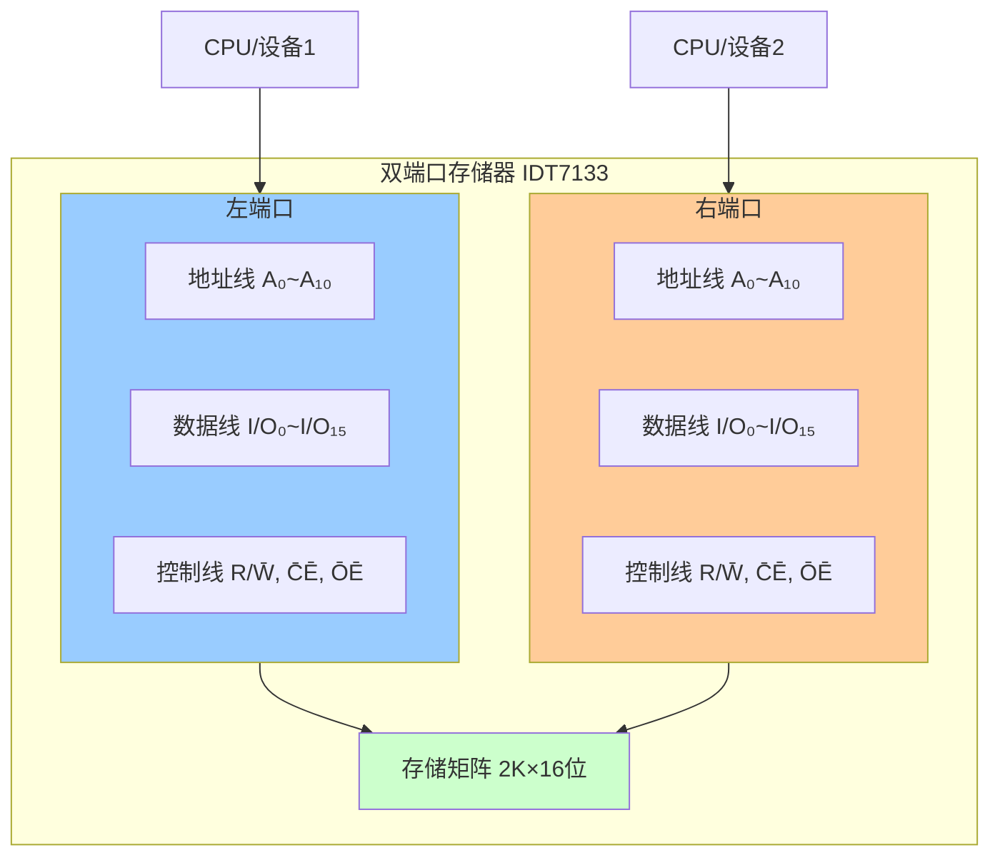

#### 📷 图3.22 双端口存储器IDT7133逻辑框图

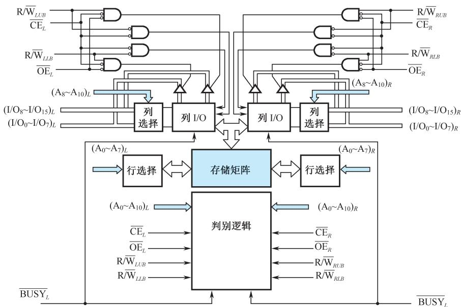

> 📚 **课本出处**：图3.22 IDT7133为2K字×16位SRAM，提供左、右两个完全独立的端口，各有地址线(A₀~A₁₀)、数据线(I/O₀~I/O₁₅)和控制线(R/W̄、C̄Ē、ŌĒ、B̄ŪS̄Ȳ)

**IDT7133特性**：

- 存储容量：2K字×16位
- 两个完全独立的端口（左端口、右端口）
- 每组端口有自己的地址线、数据线和控制线
- 可以对存储器任何位置进行独立的存取操作

#### 3. 无冲突读写控制

**条件**：两个端口的**地址不相同**

| R/W̄LB | R/W̄UB | C̄Ē | ŌĒ | I/O₀\~I/O₇ | I/O₈\~I/O₁₅ | 功能        |
| ------ | ------ | ---- | ---- | ---------- | ----------- | --------- |
| ×      | ×      | 1    | 1    | Z          | Z           | 端口不用      |
| 0      | 0      | 0    | ×    | 数据入        | 数据入         | 低位和高位字节写入 |
| 0      | 1      | 0    | 0    | 数据入        | 数据出         | 低位写入，高位读出 |
| 1      | 0      | 0    | 0    | 数据出        | 数据入         | 低位读出，高位写入 |
| 0      | 1      | 0    | 1    | 数据入        | Z           | 仅低位字节写入   |
| 1      | 0      | 0    | 1    | Z          | 数据入         | 仅高位字节写入   |
| 1      | 1      | 0    | 0    | 数据出        | 数据出         | 低位和高位字节读出 |
| 1      | 1      | 0    | 1    | Z          | Z           | 高阻抗输出     |

> 💡 **符号说明**：1=高电平，0=低电平，×=任意，Z=高阻态

#### 4. 有冲突的读写控制

**冲突条件**：

- 两个端口同时存取**同一存储单元**
- 且**至少有一个端口为写操作**

**解决方法**：设置**BUSY标志**

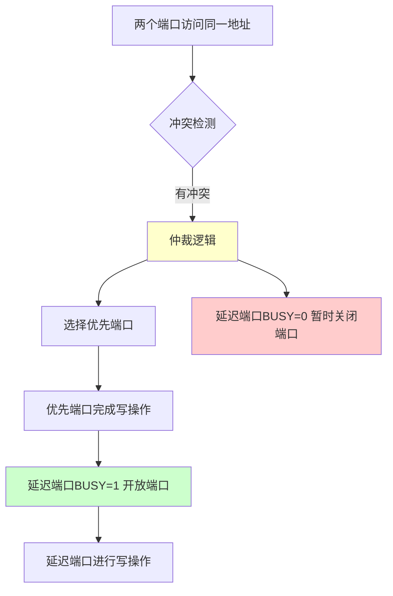

**仲裁判断方式**：

| 判断方式       | 条件           | 仲裁依据                 |
| ---------- | ------------ | -------------------- |
| **CĒ判断**  | 地址匹配在CĒ之前有效 | 比较C̄Ē\_L和C̄Ē\_R的先后 |
| **地址有效判断** | CĒ在地址匹配之前变低 | 比较左右地址有效的先后          |

**仲裁结果**：

- 优先端口：正常进行存取操作
- 延迟端口：BUSY置低（BUSY=0），暂时关闭
- 优先端口完成后：延迟端口BUSY复位（BUSY=1），开放端口

***

### 3.5.2 多模块交叉存储器

#### 1. 存储器的模块化组织

**假设**：存储器容量32字，分成M₀、M₁、M₂、M₃四个模块，每模块8个字

##### 顺序方式

```C
地址分配：
┌─────────────────────────────────────┐
│ M₀: 0-7      (8个字，连续地址)       │
│ M₁: 8-15     (8个字，连续地址)       │
│ M₂: 16-23    (8个字，连续地址)       │
│ M₃: 24-31    (8个字，连续地址)       │
└─────────────────────────────────────┘

地址格式：
┌──────────┬─────────┐
│ 模块号   │ 模块内地址│
│ (2位)    │ (3位)   │
└──────────┴─────────┘
```

**特点**：

- 高2位选择模块，低3位选择模块内字
- 连续地址在同一个模块内
- 各模块**串行工作**

**优点**：

- 某模块故障时，其他模块可正常工作
- 扩充容量方便

**缺点**：存储器带宽受限（串行访问）

#### 📷 图3.23(a) 顺序方式

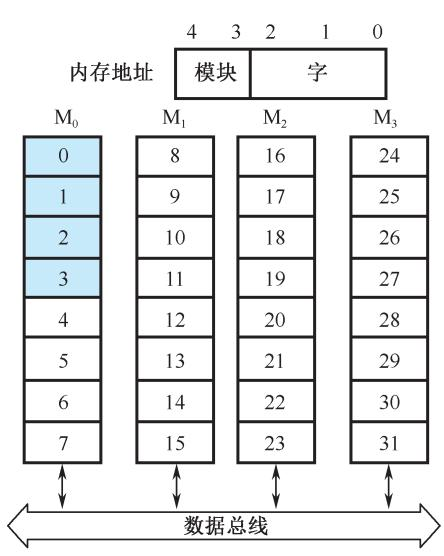

> 📚 **课本出处**：图3.23(a) 顺序方式寻址，高2位选模块，低3位选模块内字，连续地址在同一模块内

##### 交叉方式（⭐⭐⭐ 重点）

```
地址分配：
┌─────────────────────────────────────┐
│ M₀: 0, 4, 8, 12, 16, 20, 24, 28     │
│ M₁: 1, 5, 9, 13, 17, 21, 25, 29     │
│ M₂: 2, 6, 10, 14, 18, 22, 26, 30    │
│ M₃: 3, 7, 11, 15, 19, 23, 27, 31    │
└─────────────────────────────────────┘

地址格式：
┌──────────┬─────────┐
│ 模块内地址│ 模块号  │
│ (3位)    │ (2位)   │
└──────────┴─────────┘
```

**特点**：

- 低2位选择模块，高3位指向模块内字
- **连续地址分布在相邻的不同模块内**
- 同一模块内地址不连续

**优点**：

- 可实现多模块**流水式并行存取**
- 大大提高存储器带宽

#### 📷 图3.23(b) 交叉方式

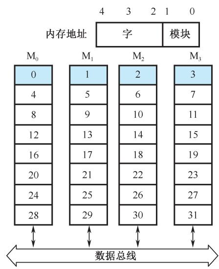

> 📚 **课本出处**：图3.23(b) 交叉方式寻址，低2位选模块，高3位指向模块内字，连续地址分布在相邻不同模块

#### 2. 多模块交叉存储器的基本结构

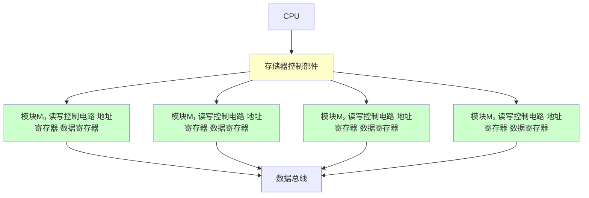

**工作方式**：

- CPU同时访问四个模块
- 存储器控制部件控制它们**分时使用数据总线**
- 各模块读写过程**重叠进行**
- 一个存取周期内可连续访问四个模块

#### 📷 图3.24 四模块交叉存储器结构框图

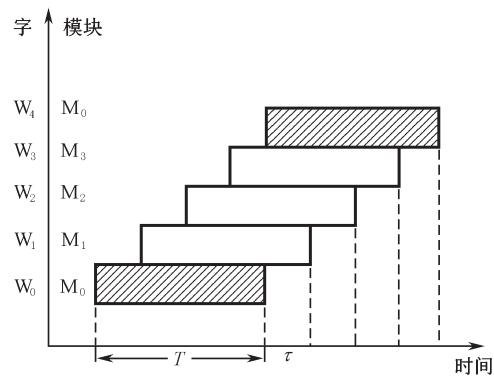

> 📚 **课本出处**：图3.24 主存分成4个相互独立、容量相同的模块M₀~M₃，各有读写控制电路、地址寄存器和数据寄存器，CPU同时访问四个模块，控制部件控制它们分时使用数据总线

#### 3. 定量分析（⭐⭐⭐ 考试重点）

**基本参数**：

| 参数     | 符号 | 含义          |
| ------ | -- | ----------- |
| 存储周期   | T  | 模块存取一个字的时间  |
| 总线传送周期 | τ  | 数据在总线上传输的时间 |
| 交叉模块数  | m  | 存储模块的数量     |

**流水线条件**：

$$
T \leqslant m\tau
$$

> 💡 含义：启动某模块后，经过mτ时间再次启动该模块时，上次存取操作已完成

**交叉存取度**：

$$
m\_{\min} = \frac{T}{\tau}
$$

> 💡 模块数必须大于或等于m\_min，才能保证流水线正常工作

**连续读取m个字的时间对比**：

| 方式       | 公式                     | 说明                 |
| -------- | ---------------------- | ------------------ |
| **交叉方式** | $t\_1 = T + (m-1)\tau$ | 流水线方式，每隔τ启动一个模块    |
| **顺序方式** | $t\_2 = mT$            | 串行方式，一个模块完成后再启动下一个 |

**结论**：由于 $t_1 < t_2$，交叉存储器带宽大大提高

#### 📷 图3.25 流水线方式存取示意图

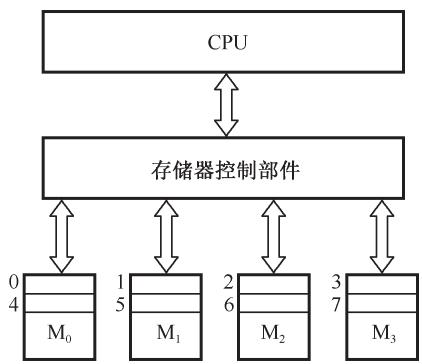

> 📚 **课本出处**：图3.25 m=4的流水线方式存取示意图，成块传送按τ间隔流水进行，每隔τ时间延迟后启动下一个模块

#### 4. 例题解析（⭐⭐⭐ 考试必考题型）

**【例3.3】** 设存储器容量为32字，字长64位，模块数m=4，分别用顺序方式和交叉方式进行组织。存储周期T=200ns，数据总线宽度为64位，总线传送周期τ=50ns。若连续读出4个字，问顺序存储器和交叉存储器的数据传输率各是多少？

**解**：

**第一步：计算信息总量**
$$
q = 64 \text{ bit} \times 4 = 256 \text{ bit}
$$

**第二步：计算顺序存储器**

- 读取时间：
  $$
  t\_2 = mT = 4 \times 200\text{ns} = 800\text{ns} = 8 \times 10^{-7}\text{s}
  $$
- 数据传输率：
  $$
  W\_2 = \frac{q}{t\_2} = \frac{256}{8 \times 10^{-7}} = 320 \times 10^6 \text{ bit/s} = 320 \text{ Mbit/s}
  $$

**第三步：计算交叉存储器**

- 读取时间：
  $$
  t\_1 = T + (m-1)\tau = 200\text{ns} + 3 \times 50\text{ns} = 350\text{ns} = 3.5 \times 10^{-7}\text{s}
  $$
- 数据传输率：
  $$
  W\_1 = \frac{q}{t\_1} = \frac{256}{3.5 \times 10^{-7}} \approx 731 \times 10^6 \text{ bit/s} = 731 \text{ Mbit/s}
  $$

**结论**：

- 交叉存储器带宽是顺序存储器的 **2.28倍**
- 交叉存储器大大提高了数据传输率

#### 📷 图3.26 二模块交叉存储器方框图

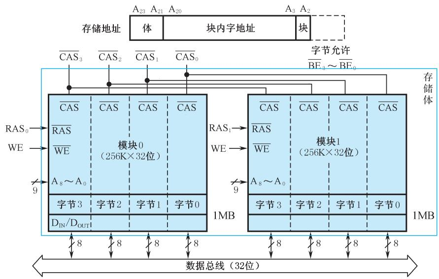

> 📚 **课本出处**：图3.26 每个模块容量1MB(256K×32位)，由8片256K×4位DRAM芯片组成，A₂用于模块选择，偶字地址在模块0，奇字地址在模块1

#### 📷 图3.27 无等待状态成块存取示意图

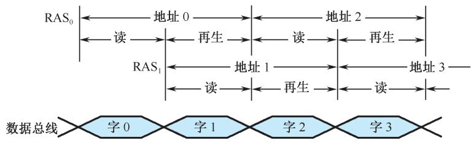

> 📚 **课本出处**：图3.27 m=2交叉存取度的成块传送，两个连续地址字读取之间不必插入等待状态（零等待存取）

***

## 对比总结

### 双端口存储器 vs 多模块交叉存储器

| 特性        | 双端口存储器     | 多模块交叉存储器    |
| --------- | ---------- | ----------- |
| **并行方式**  | 空间并行       | 时间并行        |
| **核心思想**  | 两个独立端口同时访问 | 多模块流水式并行存取  |
| **冲突处理**  | BUSY标志仲裁   | 地址错位避免冲突    |
| **地址特点**  | 两个端口独立编址   | 连续地址分布在不同模块 |
| **速度提升**  | 两个设备同时访问   | 连续地址快速传输    |
| **应用场景**  | 多处理器共享内存   | 高速数据传输、指令流水 |
| **硬件复杂度** | 较高（两套读写电路） | 中等（控制逻辑复杂）  |

### 顺序方式 vs 交叉方式

| 特性       | 顺序方式      | 交叉方式      |
| -------- | --------- | --------- |
| **地址分配** | 连续地址在同一模块 | 连续地址在不同模块 |
| **工作方式** | 串行        | 并行（流水）    |
| **可靠性**  | 高（模块独立）   | 较高        |
| **扩展性**  | 好         | 好         |
| **带宽**   | 低         | **高**     |
| **适用场景** | 一般存储      | 高速连续数据传输  |

***

## 疑问与思考

1. ❓ 为什么双端口存储器能解决多部件同时访问的问题？
   - 💡 因为它有两套完全独立的读写控制电路，两个端口可以同时进行独立的存取操作
2. ❓ 交叉存储器为什么能提高带宽？
   - 💡 因为连续地址分布在不同模块，可以实现流水式并行存取，多个模块重叠工作
3. ❓ 交叉存取度m\_min的物理意义是什么？
   - 💡 保证流水线正常工作的最小模块数，确保再次启动某模块时，上次操作已完成
4. ❓ 双端口存储器的冲突仲裁有哪些判断方式？
   - 💡 CĒ判断（片选信号先后）和地址有效判断（地址有效先后）

***

## 相关链接

- 课本内容：[full.md](../../full.md)
- 上一节：3.4 只读存储器(ROM)
- 下一节：3.6 高速缓冲存储器(Cache)

***

## 公式汇总

| 公式                     | 说明           |
| ---------------------- | ------------ |
| $T \leqslant m\tau$    | 流水线工作条件      |
| $m\_{\min} = T/\tau$   | 交叉存取度（最小模块数） |
| $t\_1 = T + (m-1)\tau$ | 交叉方式读取m个字的时间 |
| $t\_2 = mT$            | 顺序方式读取m个字的时间 |
| $W = q/t$              | 数据传输率        |

***

## 考试重点

1. ⭐⭐⭐ **交叉存储器时间计算**（必考计算题）
   - 交叉方式读取时间：$t\_1 = T + (m-1)\tau$
   - 顺序方式读取时间：$t\_2 = mT$
   - 数据传输率计算
2. ⭐⭐ **双端口存储器冲突处理**
   - 冲突条件：同一地址 + 至少一个写操作
   - BUSY标志的作用
   - 仲裁判断方式
3. ⭐⭐ **两种并行技术的区别**
   - 空间并行 vs 时间并行
   - 应用场景对比
4. ⭐ **顺序方式与交叉方式的地址分配**
   - 地址格式区别
   - 连续地址的分布特点

