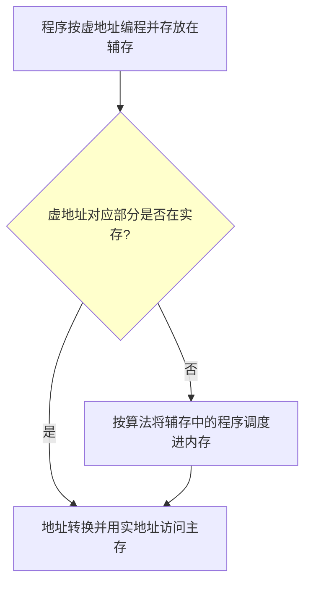
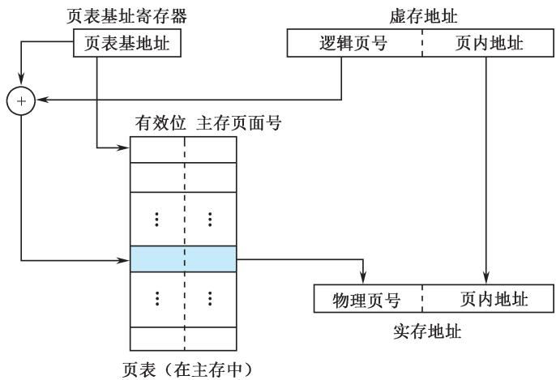
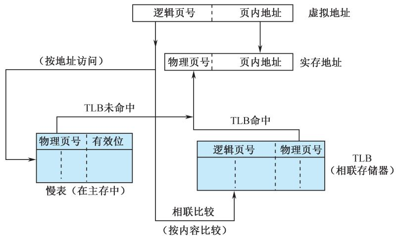
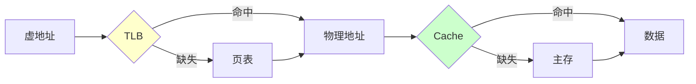
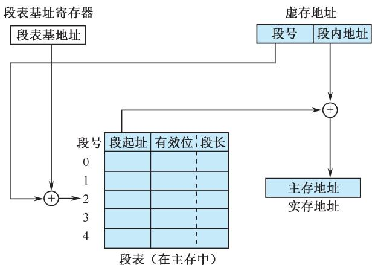
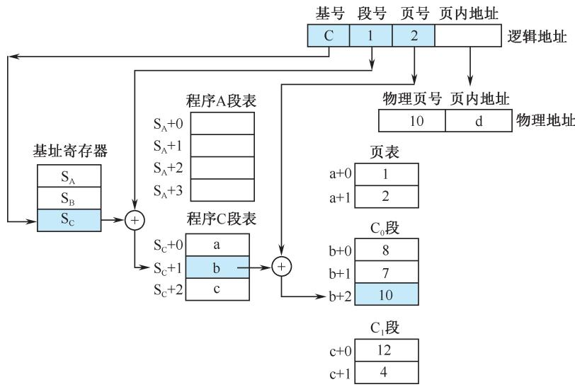

# 第3章-3.7 虚拟存储器

## 基本信息
- **课程**：计算机组成原理
- **章节**：第3章 3.7节 虚拟存储器
- **日期**：2026-06-16
- **标签**：#虚拟存储器 #页式 #段式 #段页式 #TLB #地址映射

---

## 重点内容

### ⭐⭐⭐ 核心考点
1. **虚拟存储器的基本概念** - 虚地址、实地址、再定位
2. **页式虚拟存储器** - 页表、地址映射、二级页表、反向页表
3. **TLB（转换后援缓冲器）** - 快表的作用和工作原理
4. **段式和段页式虚拟存储器** - 段表、地址变换
5. **Cache与虚存的异同**

### ⭐⭐ 重要概念
- 页式、段式、段页式的优缺点
- 虚拟存储器、TLB和cache的协同操作
- 虚存的替换算法

---

## 详细笔记

### 3.7.1 虚拟存储器的基本概念

#### 1. 实地址与虚地址

| 地址类型 | 名称 | 说明 |
|---------|------|------|
| **虚地址/逻辑地址** | 编程时使用的地址 | 独立编址，不考虑物理存储器限制 |
| **实地址/物理地址** | 物理内存的实际地址 | 由地址转换部件将虚地址转换而来 |

**程序的再定位**：虚地址到实地址的转换过程。

#### 2. 虚存的访问过程

**虚存空间特点**：
- 可以远大于实地址空间（提高存储容量）
- 也可以远小于实地址空间（缩短地址字段长度）

**透明性**：
- 对**应用程序员**透明
- 对**系统程序员**不透明（因软件介入管理）

#### 3. Cache与虚存的异同

**相同点**：
1. **出发点相同**：提高存储系统的性能价格比
2. **原理相同**：利用程序局部性原理

**不同点**：

| 对比项 | Cache-主存 | 主存-辅存（虚存） |
|-------|-----------|-----------------|
| **侧重点** | 解决速度差异 | 解决存储容量问题 |
| **数据通路** | CPU可直接访问主存 | CPU不能直接访问辅存 |
| **透明性** | 对系统/应用程序员均透明 | 对系统程序员不透明 |
| **未命中损失** | 较小（主存比cache快5~10倍） | 很大（主存比辅存快上千倍） |

#### 4. 虚存机制要解决的关键问题

1. **调度问题**：哪些程序和数据应被调入主存
2. **地址映射问题**：虚地址变换为物理地址（内地址变换、外地址变换）
3. **替换问题**：哪些程序和数据应被调出主存
4. **更新问题**：确保主存与辅存的一致性

---

### 3.7.2 页式虚拟存储器

#### 1. 页式虚存地址映射

**基本思想**：
- 虚地址空间分成等长的页 → **逻辑页**
- 主存空间分成同样大小的页 → **物理页**

**地址结构**：

| 虚地址 | 逻辑页号 | 页内地址（偏移量） |
|-------|---------|------------------|
| 实地址 | 物理页号 | 页内地址（偏移量） |

**页表**：
- 每个进程对应一个页表
- 每个虚存页面对应一个表项
- 表项内容：物理页号 + 有效位（指示是否已调入主存）

**地址变换过程**：
1. 用逻辑页号索引页表
2. 找到物理页号
3. 物理页号与页内偏移量拼接 → 完整物理地址

#### 📷 图3.33 页式虚拟存储器的地址映射过程

> 📚 **课本出处**：图3.33 页式虚拟存储器的地址映射过程

**页表存储优化**：

| 技术 | 说明 |
|------|------|
| **页表分页** | 把页表存储在虚存空间，页表本身也要分页 |
| **二级页表** | 页目录表 + 页表，最多 $m \times n$ 个页 |
| **反向页表** | 按物理页号索引，表项包含逻辑页号，空间小但检索时间长 |

#### 2. 内页表和外页表

| 页表类型 | 功能 | 存放位置 |
|---------|------|---------|
| **内页表** | 虚地址 → 主存物理地址 | 主存 |
| **外页表** | 虚地址 → 辅存地址 | 辅存（需要时调入主存） |

#### 3. 转换后援缓冲器(TLB)

**问题**：页表通常在主存中，即使逻辑页已在主存，也至少要访问两次物理存储器。

**TLB（快表）**：
- 专用于页表缓存的高速存储部件
- 存放页表中最活跃的部分
- 由**相联存储器**实现，可硬件高速检索
- 保存在主存中的完整页表称为**慢表**

**地址变换过程**：
1. 用虚页号同时查**快表**和**慢表**
2. 快表命中 → 快速找到物理页号
3. 快表未命中 → 查询主存中的页表

#### 📷 图3.34 TLB工作原理

> 📚 **课本出处**：图3.34 快表(TLB)是专用于页表缓存的高速存储部件，由相联存储器实现，存放页表中最活跃的部分，慢表保存在主存中

> 💡 根据程序局部性原理，多数虚存访问将通过TLB进行。

#### 4. 虚拟存储器、TLB和Cache的协同操作

**三种缺失的组合**（7种可能性）：

| TLB | 页表 | Cache | 可能发生？ | 说明 |
|:---:|:---:|:-----:|:---------:|:------|
| 命中 | 命中 | 缺失 | 可能 | TLB命中就无须检查页表 |
| 缺失 | 命中 | 命中 | 可能 | TLB缺失，页表命中，Cache命中 |
| 缺失 | 命中 | 缺失 | 可能 | TLB缺失，页表命中，Cache缺失 |
| 缺失 | 缺失 | 缺失 | 可能 | TLB缺失并缺页，Cache一定缺失 |
| 命中 | 缺失 | 缺失 | **不可能** | 页不在内存，TLB不可能命中 |
| 命中 | 缺失 | 命中 | **不可能** | 页不在内存，TLB不可能命中 |
| 缺失 | 缺失 | 命中 | **不可能** | 页不在内存，数据不可能在Cache中 |

---

### 3.7.3 段式虚拟存储器和段页式虚拟存储器

#### 1. 段式虚拟存储器

**分页的缺点**：页长固定，与程序逻辑大小不相关。

**分段的特点**：
- 按程序的自然分界划分
- 段长可以动态改变
- 虚地址 = 段号 + 段内地址（偏移量）

**段表表项**：

| 字段 | 说明 |
|------|------|
| **有效位** | 该段是否已调入实存 |
| **段起址** | 该段在实存中的首地址 |
| **段长** | 该段的实际长度（防止地址越界） |

**段式地址变换**：
1. 以段号$s$索引段表
2. 检查有效位和段长
3. 段起址 + 段内偏移量 → 主存实地址

#### 📷 图3.35 段式虚地址向实存地址的变换过程

> 📚 **课本出处**：图3.35 段式虚地址向实存地址的变换过程，段表包含有效位、段起址、段长等字段

**段式的优缺点**：

| 优点 | 缺点 |
|------|------|
| 逻辑独立，易于编译、管理、修改、保护 | 主存空间分配麻烦 |
| 便于多道程序共享 | 容易产生外碎片 |
| 段长可动态改变 | 需要加法操作求物理地址，硬件支持更多 |

#### 2. 段页式虚拟存储器

**结合方案**：
- 实存被等分成页
- 每个程序先按逻辑结构**分段**
- 每段再按实存的页大小**分页**
- 程序按页调入/调出
- 可按段编程、保护和共享

**两级再定位**：
1. **段表**：每个程序一张，表项指向页表
2. **页表**：指明该段各页在主存中的位置

**虚地址结构**：

| 基号N | 段号S | 段内逻辑页号P | 页内地址偏移量D |
|-------|-------|--------------|----------------|

**地址变换过程**：
1. 由基号找到段表基址
2. 由段号找到页表起始地址
3. 由段内页号检索页表，得到物理页号
4. 物理页号与页内偏移量拼接 → 物理地址

#### 📷 图3.36 段页式虚拟存储器的地址变换过程

> 📚 **课本出处**：图3.36 段页式虚拟存储器的地址变换过程，包含基址寄存器、段表、页表等结构

> ⚠️ 段页式需要多次查表，实现复杂度较高。

---

### 3.7.4 虚存的替换算法

当从辅存调页至主存而主存已满时，需要进行页面替换。

| 算法 | 说明 |
|------|------|
| **FIFO** | 先进先出 |
| **LRU** | 近期最少使用 |
| **LFU** | 最不经常使用 |

**与Cache替换算法的区别**：

| 对比项 | Cache替换 | 虚存替换 |
|-------|----------|---------|
| **实现方式** | 全部硬件实现 | 有操作系统支持 |
| **性能影响** | 较小 | 很大（需访问辅存、任务切换） |
| **选择余地** | 有限 | 属于一个进程的页面都可替换 |

---

## 疑问与思考

1. ❓ 为什么虚存对应用程序员透明，但对系统程序员不透明？
   - 💡 虚存管理由软件和硬件共同完成，系统程序员需要参与存储管理

2. ❓ TLB和Cache有什么相似之处？
   - 💡 都是利用局部性原理的高速缓冲，TLB缓冲页表项，Cache缓冲主存数据

3. ❓ 段式和页式各适用于什么场景？
   - 💡 页式管理简单、无内碎片，适合通用系统；段式逻辑独立、便于共享保护，适合模块化程序

4. ❓ 为什么段页式虚存地址变换需要多次查表？
   - 💡 需要先查段表找到页表，再查页表找到物理页号，复杂度较高

---

## 相关链接

- 课本内容：[full.md](../../full.md)
- 上一节：3.6 高速缓冲存储器(Cache)
- 下一节：3.8 鲲鹏920处理器的存储系统

---

## 考试重点

1. ⭐⭐⭐ **虚拟存储器基本概念**（虚地址、实地址、再定位）
2. ⭐⭐⭐ **页式虚拟存储器地址映射**（页表、有效位、地址变换）
3. ⭐⭐⭐ **TLB的作用和工作原理**
4. ⭐⭐⭐ **Cache与虚存的异同**（出发点、数据通路、透明性、未命中损失）
5. ⭐⭐ **段式虚拟存储器**（段表、段起址、段长、地址越界检查）
6. ⭐⭐ **段页式虚拟存储器**（两级再定位、虚实地址变换过程）
7. ⭐⭐ **虚拟存储器/TLB/Cache协同操作**（7种组合、哪些不可能）
8. ⭐ **虚存替换算法**（与Cache替换的区别）
