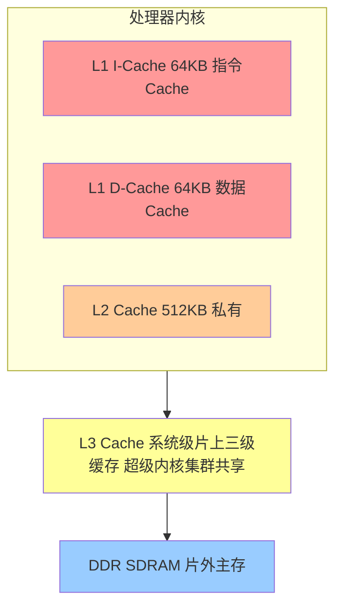
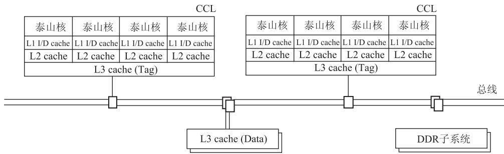
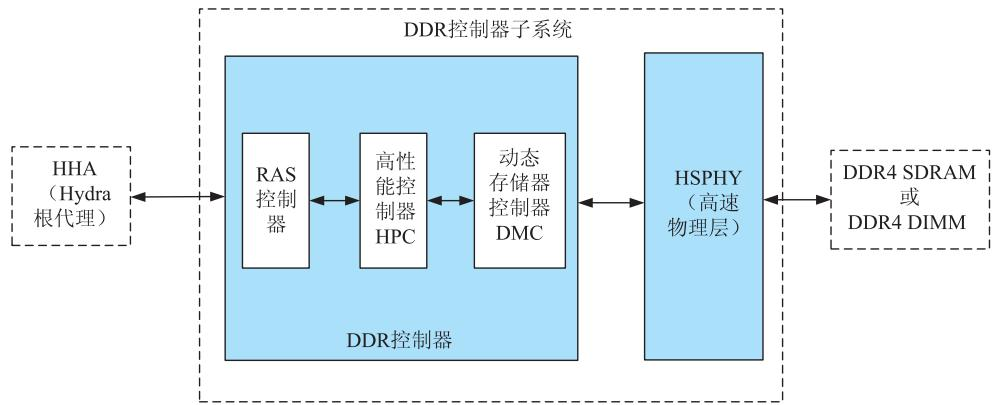

# 第3章-3.8 鲲鹏920处理器的存储系统

## 基本信息
- **课程**：计算机组成原理
- **章节**：第3章 3.8节 鲲鹏920处理器的存储系统
- **日期**：2026-06-16
- **标签**：#鲲鹏920 #ARM #存储层次 #DDR #地址映射 #虚拟化

---

## 重点内容

### ⭐⭐ 重要概念
1. **鲲鹏920存储系统层次结构** - L1/L2/L3 Cache、主存
2. **主存系统组成** - HHA、DDRC、DDR SDRAM
3. **地址映射与变换** - 48位虚拟地址、单级/两级变换
4. **ARMv8-A虚拟化扩展** - 系统存储管理单元

---

## 详细笔记

### 3.8.1 鲲鹏存储系统的层次结构

华为海思鲲鹏920处理器片上系统的内存储系统由**多级高速缓冲存储器cache和主存**构成。

**系统架构**：

**关键组件**：

| 组件 | 容量 | 说明 |
|------|------|------|
| **L1 I-Cache** | 64KB | 指令Cache，每个内核私有 |
| **L1 D-Cache** | 64KB | 数据Cache，每个内核私有 |
| **L2 Cache** | 512KB | 每个内核私有 |
| **L3 Cache** | 系统级 | 由超级内核集群(SCCL)共享 |

**L3 Cache特点**：
- 采用**组相联结构**
- 固定使用**写回(write-back)策略**
- 支持三种替换算法：随机替换、DRRIP、PLRU
- Cache行(line)大小固定为**128字节(32字)**
- 数据块在内核集群之外，标记块集成在每个内核集群中（降低监听延迟）

**访问流程**：
1. 读写请求首先到达 **L3_TAG**
2. L3命中 → 向L3_DATA发读请求，获取数据
3. L3缺失 → 向DDR存储器发读请求，从DDR读回数据
4. 数据返回处理器内核/加速器，同时在L3_cache中分配空间并写入

#### 📷 图3.37 鲲鹏920处理器片上系统的内存储系统组成示意

> 📚 **课本出处**：图3.37 鲲鹏920处理器片上系统的内存储系统组成示意，展示L1/L2/L3 Cache和主存的层次结构

---

### 3.8.2 鲲鹏920处理器片上系统的主存系统

**主存组成部件**：

| 部件 | 英文全称 | 功能 |
|------|---------|------|
| **HHA** | Hydra根代理(Hydra Home Agent) | 位于DDR控制器与片上总线之间，提供DDR访问通路 |
| **DDRC** | DDR SDRAM控制器 | 实现对DDR SDRAM的存取控制，完成时序转换和流量管理 |
| **DDR** | 片外DDR存储器 | 数据存储中心 |

**DDR控制器子系统**：

| 参数 | 规格 |
|------|------|
| DDR控制器数量 | 8个 |
| 独立DDR通道 | 8个 |
| 每通道数据位宽 | 72位（有效数据64位 + 校验数据8位） |
| 支持标准 | DDR3 SDRAM、DDR4 SDRAM |
| 每控制器DIMM插槽 | 最多2个 |
| 每DIMM插槽物理存储体 | 最多4个 |

**DDR控制器子系统内部模块**：

| 模块 | 全称 | 功能 |
|------|------|------|
| **RASC** | RAS控制器 | 实现DDR控制器的RAS特性（可靠性、可用性、可服务性） |
| **HPC** | 高性能控制器 | 对系统访问进行高效率、高服务质量的调度 |
| **DMC** | 动态存储器控制器 | 完成系统地址到DDR SDRAM物理地址的转换 |
| **HSPHY** | 高速物理层 | 通过I/O与片外DDR4连接，实现协议转换和时序校准 |

#### 📷 图3.38 DDR控制器子系统结构

> 📚 **课本出处**：图3.38 DDR控制器子系统结构，包含HHA、RAS控制器、高性能控制器HPC、动态存储器控制器DMC、HSPHY高速物理层等模块

**通信协议**：
- 符合 **JEDEC JESD79-4B** 标准（DDR4协议）
- 通过 **DFI 4.0** 协议将访问请求送到高速物理层

---

### 3.8.3 鲲鹏920处理器片上系统的地址映射与变换

**地址宽度**：

| 地址类型 | 位数 |
|---------|------|
| 虚拟地址(VA) | 48位 |
| 物理地址(PA) | 48位 |

**地址变换遵循ARMv8-A体系结构规范**：

**内核集群访问**：
- 根据存储管理单元(MMU)中的**页表（地址变换表）**确定物理地址

**I/O集群访问**：
- 根据系统存储管理单元(SMMU)中的页表或数据源确定
- SMMU页表可自动同步于内核MMU，也可独立配置

**系统存储管理单元(SMMU)**：
- ARMv8-A架构下为实现**虚拟化扩展(virtualization extensions)** 提供的重要组件
- 可应用于设备（I/O及加速引擎）的虚拟化

**AArch64模式下的地址变换**：

| 变换级别 | 说明 |
|---------|------|
| **单级变换** | 不使用虚拟化时，VA直接映射到PA |
| **两级变换** | 支持虚拟化时，VA → IPA(中间物理地址) → PA |

**两级变换过程**：
1. 第一级：虚拟地址VA → **40位中间物理地址(IPA)**
2. 第二级：中间物理地址IPA → **物理地址PA**

> 💡 IPA是第一级变换的输出地址，也是第二级变换的输入地址。

---

## 疑问与思考

1. ❓ 为什么鲲鹏920的L3 Cache标记块集成在内核集群中？
   - 💡 为了降低监听延迟，提高访问速度

2. ❓ 鲲鹏920的DDR控制器为什么使用72位数据位宽？
   - 💡 64位有效数据 + 8位校验数据，用于实现RAS特性（可靠性、可用性、可服务性）

3. ❓ 什么是虚拟化扩展中的两级地址变换？
   - 💡 第一级将客户机虚拟地址转换为中间物理地址（客户机认为的物理地址），第二级将中间物理地址转换为真实的物理地址

4. ❓ SMMU和普通MMU有什么区别？
   - 💡 SMMU专门用于I/O设备的地址转换，实现设备的虚拟化，可以独立于内核MMU配置

---

## 相关链接

- 课本内容：[full.md](../../full.md)
- 上一节：3.7 虚拟存储器
- 下一节：第4章（待学习）

---

## 考试重点

1. ⭐⭐ **鲲鹏920存储系统层次结构**（L1/L2/L3 Cache的容量和归属）
2. ⭐⭐ **L3 Cache特点**（组相联、写回策略、替换算法、128字节行大小）
3. ⭐⭐ **主存系统组成**（HHA、DDRC、DDR SDRAM）
4. ⭐⭐ **DDR控制器规格**（8通道、72位位宽、支持DDR3/DDR4）
5. ⭐ **地址映射与变换**（48位VA/PA、单级/两级变换、SMMU）
6. ⭐ **虚拟化扩展**（IPA中间物理地址、AArch64模式）
