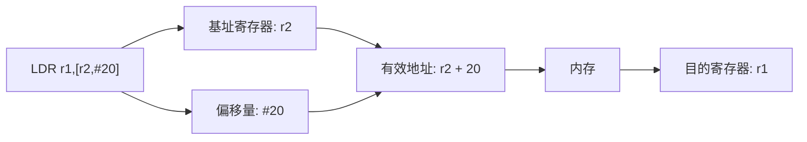
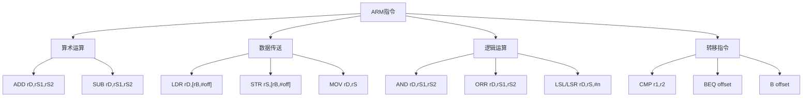
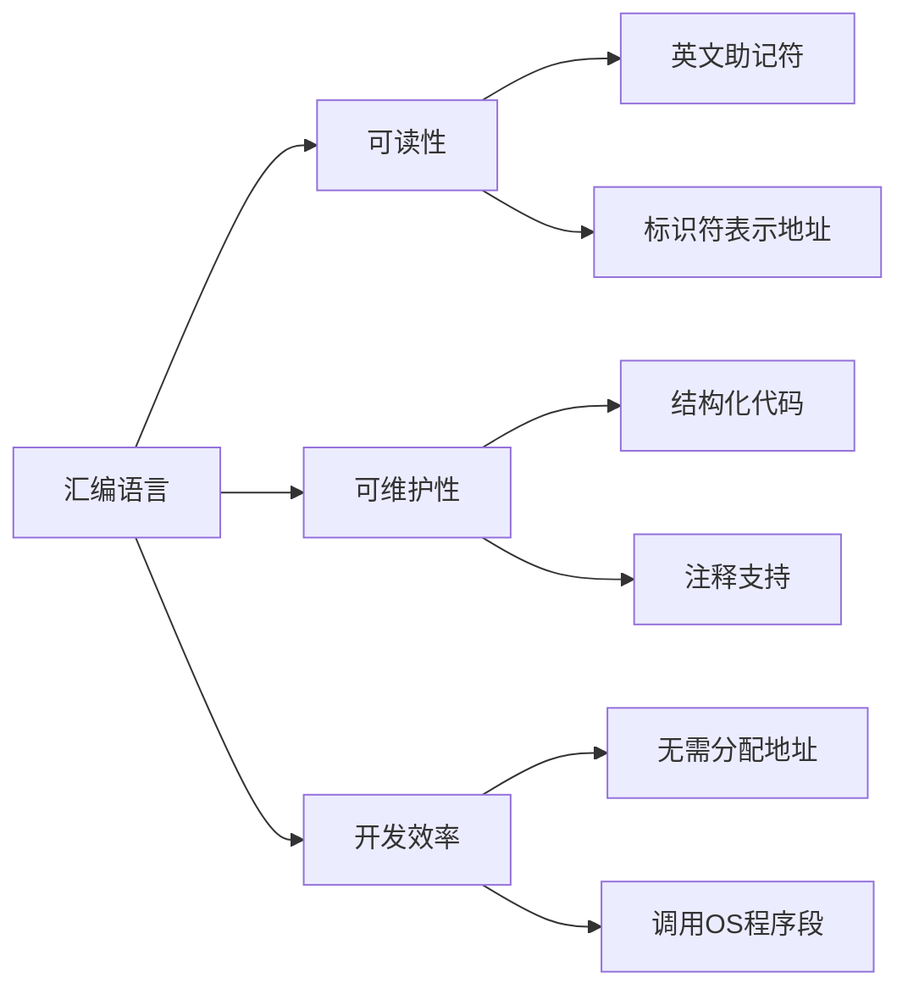

# 第4章-4.5 ARM汇编语言

## 基本信息
- **课程**：计算机组成原理
- **章节**：第4章 4.5节 ARM汇编语言
- **日期**：2026-04-17
- **标签**：#ARM #汇编语言 #指令格式 #机器语言 #计算机组成原理

---

## 重点内容

### ⭐⭐⭐ 核心概念
1. **ARM汇编语言特点**：机器语言的符号化表示，每条汇编语句对应一条机器指令
2. **16个寄存器**：r0~r12, SP, LR, PC
3. **ARM指令格式**：表4.11的17条常用指令
4. **汇编到机器语言的翻译过程**

---

## 详细笔记

### 一、ARM汇编语言概述

**定义**：汇编语言是计算机机器语言（二进制指令代码）进行**符号化**的一种表示方式。

**特点**：
- 每一个基本汇编语句**对应一条机器指令**
- 使用英文单词或其缩写表示指令
- 使用标识符表示数据或地址
- 避免记忆二进制指令代码
- 由汇编器翻译为机器语言后执行

---

### 二、ARM处理器资源

#### 寄存器

ARM处理器使用 **16个寄存器**：

| 寄存器 | 名称 | 用途 |
|--------|------|------|
| r0 ~ r12 | 通用寄存器 | 一般数据操作 |
| SP | 堆栈指针 | 指向堆栈顶部 |
| LR | 链接寄存器 | 保存返回地址 |
| PC | 程序计数器 | 指向下一条指令 |

#### 存储器

- **存储字数量**：$2^{30}$ 个
- **编址方式**：字节编址
- **连续字的地址差**：4（32位 = 4字节）

---

### 三、ARM指令格式详解 ⭐⭐⭐

表4.11列出了32位嵌入式ARM处理器汇编语言的主要指令格式。

#### 1. 算术运算指令

| 指令 | 示例 | 含义 | 说明 |
|------|------|------|------|
| **ADD**（加） | `ADD r1,r2,r3` | r1 = r2 + r3 | 三寄存器操作数 |
| **SUB**（减） | `SUB r1,r2,r3` | r1 = r2 - r3 | 三寄存器操作数 |

**特点**：
- 三操作数格式：`操作码 目的寄存器, 源寄存器1, 源寄存器2`
- 源操作数不被修改
- 结果存入目的寄存器

---

#### 2. 数据传送指令

| 指令 | 示例 | 含义 | 说明 |
|------|------|------|------|
| **LDR**（取字） | `LDR r1,[r2,#20]` | r1 = 存储单元[r2+20] | 内存→寄存器（字） |
| **STR**（存字） | `STR r1,[r2,#20]` | 存储单元[r2+20] = r1 | 寄存器→内存（字） |
| **LDRH**（取半字） | `LDRH r1,[r2,#20]` | r1 = 存储单元[r2+20] | 内存→寄存器（半字） |
| **LDRHS**（取半字带符号） | `LDRHS r1,[r2,#20]` | r1 = 存储单元[r2+20] | 带符号扩展 |
| **STRH**（存半字） | `STRH r1,[r2,#20]` | 存储单元[r2+20] = r1 | 寄存器→内存（半字） |
| **LDRB**（取字节） | `LDRB r1,[r2,#20]` | r1 = 存储单元[r2+20] | 内存→寄存器（字节） |
| **LDRBS**（取字节带符号） | `LDRBS r1,[r2,#20]` | r1 = 存储单元[r2+20] | 带符号扩展 |
| **STRB**（存字节） | `STRB r1,[r2,#20]` | 存储单元[r2+20] = r1 | 寄存器→内存（字节） |
| **SWP**（交换） | `SWP r1,[r2,#20]` | r1↔存储单元[r2+20] | 原子交换操作 |
| **MOV**（传送） | `MOV r1,r2` | r1 = r2 | 寄存器间复制 |

**寻址方式分析**：



**语法格式**：`[寄存器, #立即数]` 表示**基址+偏移**寻址

---

#### 3. 逻辑运算指令

| 指令 | 示例 | 含义 | 说明 |
|------|------|------|------|
| **AND**（与） | `AND r1,r2,r3` | r1 = r2 & r3 | 按位与 |
| **ORR**（或） | `ORR r1,r2,r3` | r1 = r2 \| r3 | 按位或 |
| **MVN**（非） | `MVN r1,r2` | r1 = ~r2 | 按位取反 |
| **LSL**（逻辑左移） | `LSL r1,r2,#10` | r1 = r2 << 10 | 左移10位 |
| **LSR**（逻辑右移） | `LSR r1,r2,#10` | r1 = r2 >> 10 | 右移10位 |

**特点**：
- AND、ORR：三寄存器操作
- MVN：双寄存器操作（源和目的）
- LSL、LSR：移位操作，移位位数为常数

---

#### 4. 条件转移指令

| 指令 | 示例 | 含义 | 说明 |
|------|------|------|------|
| **CMP**（比较） | `CMP r1,r2` | 条件标志 = r1 - r2 | 设置条件标志 |
| **BEQ**（等于转移） | `BEQ 25` | 若相等则转移 | PC相对转移 |

**条件码**：

| 条件码 | 含义 | 说明 |
|--------|------|------|
| EQ | 等于 | Equal |
| NE | 不等于 | Not Equal |
| LT | 小于 | Less Than |
| LE | 小于等于 | Less or Equal |
| GT | 大于 | Greater Than |
| GE | 大于等于 | Greater or Equal |
| LO | 低于 | Lower |
| LS | 低于或相同 | Lower or Same |
| HI | 高于 | Higher |
| HS | 高于或相同 | Higher or Same |
| VS | 溢出 | Overflow Set |
| VC | 无溢出 | Overflow Clear |
| MI | 负 | Minus |
| PL | 正或零 | Plus |

**转移地址计算**：
- `BEQ 25`：转移至 PC + 8 + 100（25 × 4 = 100）
- ARM采用**PC相对寻址**

---

#### 5. 无条件转移指令

| 指令 | 示例 | 含义 | 说明 |
|------|------|------|------|
| **B**（无条件转移） | `B 2500` | 转移至PC+8+10000 | 无条件跳转 |

---

### 四、ARM指令格式汇总表



---

### 五、汇编到机器语言的翻译 ⭐⭐⭐

#### 【例4.5】ARM汇编翻译成机器语言

**C语言语句**：
```c
A[30] = h + A[30];
```

**已知条件**：
- r3：数组A的基地址
- r2：变量h

**汇编代码**：
```assembly
LDR r5,[r3,#120]    ; r5 = A[30]  (120 = 30 × 4)
ADD r5,r2,r5        ; r5 = h + A[30]
STR r5,[r3,#120]    ; A[30] = r5
```

#### 表4.12 指令译码格式

| 指令 | cond | F | I | opcode | S | Rn | Rd | operand 2 |
|------|------|---|---|--------|---|----|----|-----------|
| ADD | 14 | 0 | 0 | 4 | 0 | reg | reg | reg |
| SUB | 14 | 0 | 0 | 2 | 0 | reg | reg | reg |
| ADD(立即数) | 14 | 0 | 1 | 4 | 0 | reg | reg | address(12位) |
| LDR | 14 | 1 | — | 24 | — | reg | reg | address(12位) |
| STR | 14 | 1 | — | 25 | — | reg | reg | constant(12位) |

**字段说明**：
- **cond** (4位)：条件码，14表示无条件执行
- **F** (1位)：指令类型标志
- **I** (1位)：立即数标志
- **opcode** (4-5位)：操作码
- **S** (1位)：设置状态标志
- **Rn** (4位)：第一个源寄存器/基址寄存器
- **Rd** (4位)：目的寄存器
- **operand 2** (12位)：第二个操作数/偏移量

#### 机器语言翻译结果

| 指令 | cond | F | I | opcode | S | Rn | Rd | operand | 说明 |
|------|------|---|---|--------|---|---|----|---------|------|
| LDR | 14 | 1 | — | 24 | — | 3 | 5 | 120 | 从[r3+120]取数到r5 |
| ADD | 14 | 0 | 0 | 4 | 0 | 2 | 5 | 5 | r5 = r2 + r5 |
| STR | 14 | 1 | — | 25 | — | 3 | 5 | 120 | 将r5存到[r3+120] |

#### 二进制机器码

| 指令 | 二进制编码（32位） |
|------|-------------------|
| LDR | `1110 1 11000 0011 0101 0000 0111 1000` |
| ADD | `1110 0 0 100 0 0010 0101 0000 0000 0101` |
| STR | `1110 1 11001 0011 0101 0000 1111 0000` |

**翻译过程解析**：

1. **LDR指令**：
   - cond=1110(14), F=1, opcode=11000(24)
   - Rn=0011(r3), Rd=0101(r5)
   - offset=0000 0111 1000(120)

2. **ADD指令**：
   - cond=1110(14), F=0, I=0, opcode=100(4), S=0
   - Rn=0010(r2), Rd=0101(r5)
   - Rm=0101(r5)作为operand 2

3. **STR指令**：
   - cond=1110(14), F=1, opcode=11001(25)
   - Rn=0011(r3), Rd=0101(r5)
   - offset=0000 1111 0000(120)

---

### 六、汇编语言编程优势



**相比机器语言的优势**：
1. **可读性**：使用英文单词/缩写，而非二进制代码
2. **地址管理**：使用标识符表示数据/地址，自动分配
3. **开发效率**：直接调用操作系统程序段完成I/O
4. **可维护性**：结构化代码，便于修改和调试

**执行流程**：
```
汇编语言源程序 → [汇编器] → 机器语言程序 → [CPU执行]
```

---

### 七、ARM指令特点总结

| 特点 | 说明 |
|------|------|
| **RISC架构** | 精简指令集，指令条数少 |
| **固定长度** | 所有指令32位 |
| **三操作数** | 算术/逻辑指令支持三寄存器操作 |
| **条件执行** | 大多数指令可条件执行 |
| **Load/Store架构** | 只有LDR/STR访问内存 |
| **桶形移位器** | 支持指令内移位操作 |
| **多种数据类型** | 支持字(32b)、半字(16b)、字节(8b) |

---

## 疑问与思考

1. ❓ 为什么ARM采用Load/Store架构？这种设计有什么优势？
2. ❓ ARM的三操作数格式与x86的二操作数格式相比有什么优缺点？
3. ❓ 条件执行指令如何减少分支预测失败的代价？
4. ❓ 汇编器在翻译过程中具体做了哪些工作？
5. ❓ 为什么ARM的转移地址计算是PC+8+偏移量，而不是PC+4？

---

## 相关链接

- 📚 出处：第4章 4.5节"ARM汇编语言"
- 📖 前置章节：4.2 指令格式、4.3 寻址方式、4.4 典型指令
- 📖 后续章节：第5章 中央处理器（指令执行过程）
- 🌐 拓展：ARM官方文档、ARMv7/v8架构参考手册

---

## 考试重点标记

| 知识点 | 重要程度 | 考试频率 |
|--------|----------|----------|
| ARM寄存器结构（16个） | ⭐⭐ | 中 |
| 常用指令格式（ADD/SUB/LDR/STR/MOV） | ⭐⭐⭐ | 高 |
| 基址+偏移寻址方式 | ⭐⭐⭐ | 高 |
| 汇编到机器语言的翻译 | ⭐⭐⭐ | 高 |
| 条件码含义（EQ/NE/LT等） | ⭐⭐ | 中 |
| 指令字段解析（cond/opcode/Rn/Rd） | ⭐⭐⭐ | 高 |
| 数据类型（字/半字/字节） | ⭐ | 低 |

---

## 实战练习

### 练习1：翻译C语句到ARM汇编

**C代码**：
```c
f = (g + h) - (i + j);
```

**寄存器分配**：
- f → r0
- g → r1
- h → r2
- i → r3
- j → r4

**ARM汇编**：
```assembly
ADD r5, r1, r2      ; r5 = g + h
ADD r6, r3, r4      ; r6 = i + j
SUB r0, r5, r6      ; f = r5 - r6
```

### 练习2：翻译ARM汇编到机器语言

**指令**：`ADD r5, r1, r2`

**翻译步骤**：
1. 查表4.12：ADD指令的opcode=4
2. cond=14(无条件), F=0, I=0, S=0
3. Rn=r1=1, Rd=r5=5, Rm=r2=2
4. 机器码：`1110 0 0 100 0 0001 0101 0000 0000 0010`

**二进制**：`11100010000001010100000000000010`

**十六进制**：`0xE0855002`
