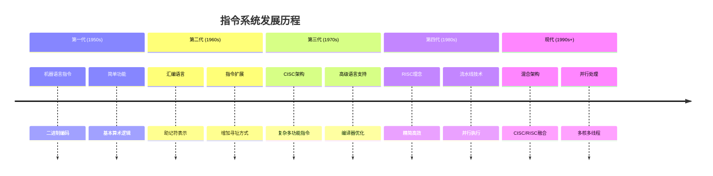
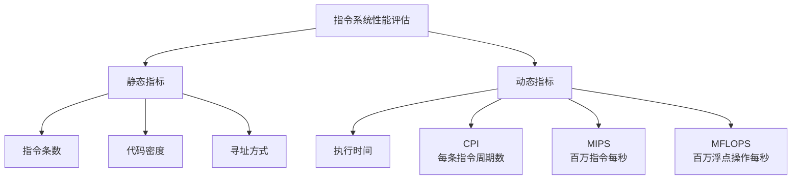
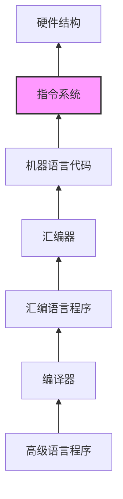

# 第4章-4.1-指令系统的发展与性能要求

## 基本信息
- **课程**：计算机组成原理
- **章节**：第4章 指令系统 - 4.1 指令系统的发展与性能要求
- **日期**：2026-04-08
- **标签**：#指令系统 #计算机体系结构 #性能要求 #硬件软件接口

## 重点内容

### ⭐ 指令系统的基本概念
- **指令系统**：计算机硬件能够识别和执行的全部指令的集合
- **作用**：硬件与软件之间的接口和桥梁
- **重要性**：决定计算机的基本功能和性能

### ⭐⭐⭐ 指令系统的发展历程
- **第一代**：简单指令集，面向机器语言
- **第二代**：引入汇编语言，指令数量增加
- **第三代**：高级语言支持，复杂指令集(CISC)
- **第四代**：精简指令集(RISC)理念
- **现代**：混合指令集，支持并行处理

### ⭐⭐ 指令系统的性能要求
- **完备性**：能够完成所有需要的运算和操作
- **规整性**：指令格式和寻址方式的一致性
- **高效性**：指令执行速度快，程序长度短
- **兼容性**：向上兼容，保护软件投资

## 详细笔记

### 4.1.1 指令系统的发展

#### 指令系统发展的主要阶段

#### 主要技术路线对比

| 技术路线 | 特点 | 代表架构 | 优势 | 劣势 |
|---------|------|----------|------|------|
| **CISC** | 指令复杂多样 | x86 | 代码密度高 | 硬件复杂 |
| **RISC** | 指令精简规整 | ARM, MIPS | 执行效率高 | 代码较长 |
| **VLIW** | 超长指令字 | Itanium | 并行性好 | 编译器复杂 |

### 4.1.2 指令系统的性能要求

#### 核心性能指标

**1. 完备性要求**
- 能够完成所有基本运算（算术、逻辑、移位等）
- 支持数据传送和控制转移操作
- 具备输入输出指令

**2. 规整性要求** ⭐
- 指令格式统一，便于译码
- 寻址方式一致，减少复杂度
- 操作码长度合理分配

**3. 高效性要求** ⭐⭐
- **执行速度**：单条指令执行时间短
- **程序长度**：完成相同功能的指令条数少
- **访存效率**：减少内存访问次数

**4. 兼容性要求**
- **向上兼容**：新处理器支持旧指令集
- **软件保护**：确保已有软件正常运行
- **扩展性**：支持未来功能扩展

#### 性能评估方法

### 4.1.3 低级语言与硬件结构的关系

#### 硬件软件接口层次

#### 关键关系要点
- **指令系统是桥梁**：连接软件编程和硬件实现
- **硬件决定指令**：CPU结构影响指令设计
- **软件驱动发展**：应用需求推动指令系统演进

## 疑问与思考

### ❓ 思考问题
1. CISC和RISC架构在现代处理器中如何融合？
2. 指令系统的兼容性要求如何平衡性能优化？
3. 新兴技术（如AI、量子计算）对指令系统有何影响？

### 💡 学习建议
- 理解指令系统在计算机层次结构中的位置
- 掌握CISC与RISC的核心区别和适用场景
- 关注现代处理器指令系统的发展趋势

## 相关链接
- [第4章完整内容](../../full.md)
- [第4章-4.2节笔记](./第4章-4.2-指令格式.md)
- [第4章-4.3节笔记](./第4章-4.3-指令和数据的寻址方式.md)
