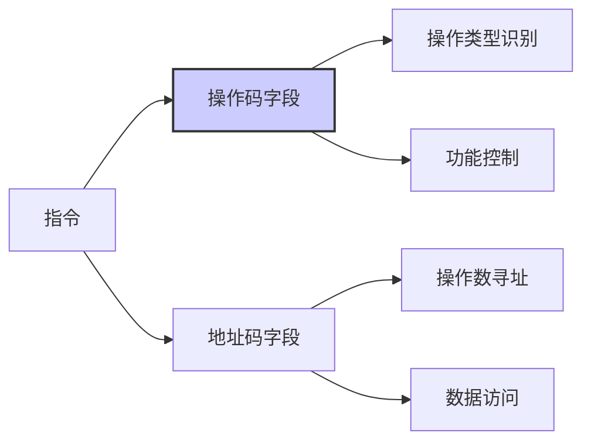
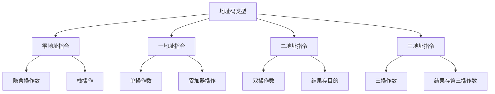
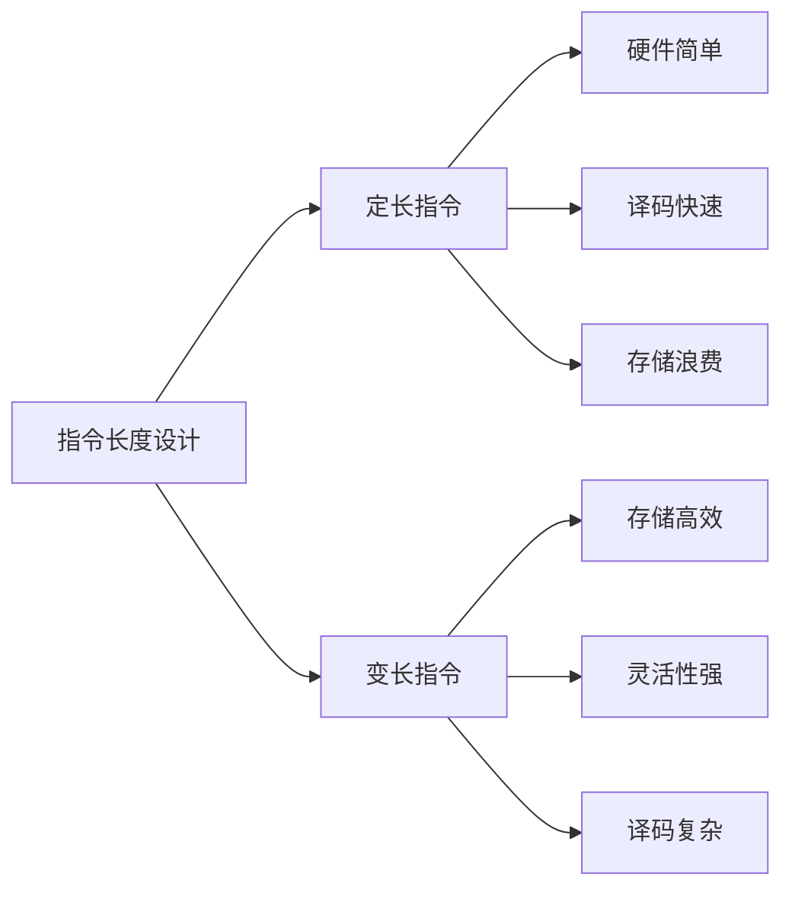
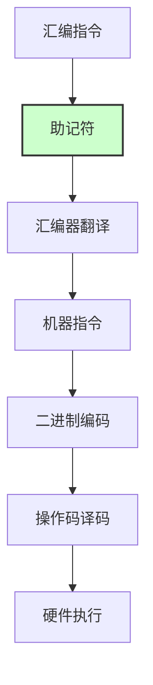
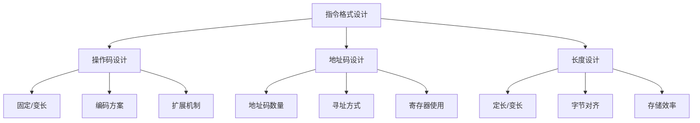

# 第4章-4.2-指令格式

## 基本信息
- **课程**：计算机组成原理
- **章节**：第4章 指令系统 - 4.2 指令格式
- **日期**：2026-04-08
- **标签**：#指令格式 #操作码 #地址码 #指令字长度 #指令助记符

## 重点内容

### ⭐⭐⭐ 指令的基本组成
- **操作码**：指定操作类型的字段
- **地址码**：指定操作数地址的字段
- **指令字长度**：指令占用的二进制位数

### ⭐⭐ 操作码设计原则
- **长度固定**：便于硬件译码
- **编码合理**：常用指令短编码
- **扩展性**：支持新指令添加

### ⭐⭐ 地址码类型
- **零地址指令**：隐含操作数
- **一地址指令**：单操作数
- **二地址指令**：双操作数
- **三地址指令**：三操作数

### ⭐ 指令格式设计考虑
- **规整性**：格式统一便于处理
- **效率性**：平衡指令长度和执行速度
- **兼容性**：考虑软件兼容需求

## 详细笔记

### 4.2.1 操作码

#### 操作码的基本概念

**操作码（Opcode）**是指令中用于指定操作类型的字段，是CPU识别指令功能的关键部分。



#### 操作码设计原则

| 设计原则 | 说明 | 示例 |
|---------|------|------|
| **固定长度** | 操作码位数固定 | 4位操作码支持16种操作 |
| **扩展编码** | 预留扩展位 | 使用特定编码表示扩展操作 |
| **优先级编码** | 常用指令短编码 | 加法操作码比除法短 |
| **规整编码** | 相关操作编码相近 | 算术操作编码连续 |

#### 操作码扩展技术

**扩展操作码**：通过特定编码模式实现操作码的动态扩展

```
基本格式：
操作码(4位) + 地址码(12位) = 16位指令

扩展格式：
操作码(8位) + 地址码(8位) = 16位指令
（当操作码前4位为特定模式时）
```

### 4.2.2 地址码

#### 地址码的类型和功能

**地址码**是指令中用于指定操作数地址的字段，决定指令的操作数数量和寻址方式。



#### 不同地址码指令对比

| 指令类型 | 格式 | 示例 | 特点 | 适用场景 |
|---------|------|------|------|----------|
| **零地址** | OP | PUSH, POP | 操作数隐含 | 栈操作 |
| **一地址** | OP A | INC AX | 单操作数 | 累加器操作 |
| **二地址** | OP A,B | ADD AX,BX | 结果存目的 | 通用操作 |
| **三地址** | OP A,B,C | ADD A,B,C | 结果存第三 | 复杂运算 |

### 4.2.3 指令字长度

#### 指令长度的设计考虑

**指令字长度**是指令占用的二进制位数，影响指令系统的性能和复杂度。



#### 指令长度选择因素

**定长指令的优点**：
- ⭐ 硬件设计简单，译码电路规整
- ⭐ 指令预取和流水线执行效率高
- ⭐ 适合RISC架构

**变长指令的优点**：
- ⭐ 代码密度高，存储效率好
- ⭐ 复杂操作单条指令完成
- ⭐ 适合CISC架构

#### 常见指令长度

| 架构类型 | 典型长度 | 特点 |
|---------|---------|------|
| **RISC** | 32位固定 | 规整高效 |
| **CISC** | 变长(1-15字节) | 灵活密集 |
| **VLIW** | 超长(64-256位) | 并行执行 |

### 4.2.4 指令助记符

#### 助记符的作用和设计

**指令助记符**是用符号表示操作码的助记符号，便于程序员编写和理解汇编程序。



#### 助记符设计原则

| 原则 | 说明 | 示例 |
|------|------|------|
| **直观性** | 反映操作功能 | ADD表示加法 |
| **简洁性** | 长度适中 | MOV比MOVE简洁 |
| **一致性** | 同类操作前缀一致 | LOAD, STORE |
| **可读性** | 易于理解记忆 | JUMP比JMP更直观 |

### 4.2.5 指令格式举例

#### 典型指令格式示例

**MIPS指令格式**（RISC架构代表）：

```
R型指令格式（寄存器操作）：
31-26    25-21    20-16    15-11    10-6     5-0
opcode    rs       rt       rd       shamt    funct
6位      5位      5位      5位      5位      6位

示例：ADD $s1, $s2, $s3
opcode=0, rs=$s2, rt=$s3, rd=$s1, shamt=0, funct=32
```

**x86指令格式**（CISC架构代表）：

```
变长指令格式：
[前缀] [操作码] [ModR/M] [SIB] [位移] [立即数]

示例：MOV AX, 1234H
操作码=B8H, 立即数=3412H（小端存储）
```

#### 指令格式设计实例分析



## 疑问与思考

### ❓ 思考问题
1. RISC架构为什么倾向于使用定长指令格式？
2. 变长指令格式在什么场景下比定长格式更有优势？
3. 现代处理器如何平衡指令格式的规整性和灵活性？

### 💡 学习建议
- 理解不同指令格式对硬件设计的影响
- 掌握操作码和地址码的设计原则
- 分析典型架构的指令格式特点
- 关注指令格式与性能优化的关系

## 相关链接
- [第4章完整内容](../../full.md)
- [第4章-4.1节笔记](./第4章-4.1-指令系统的发展与性能要求.md)
- [第4章-4.3节笔记](./第4章-4.3-指令和数据的寻址方式.md)
