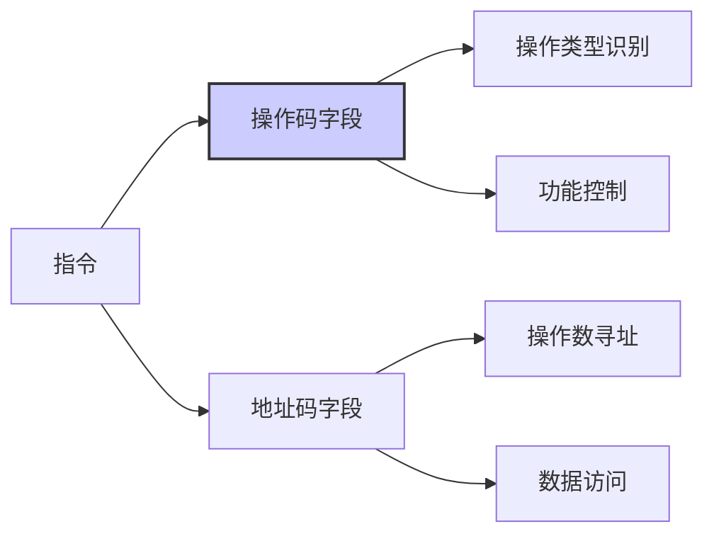
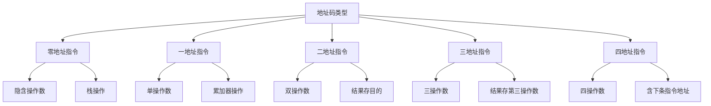
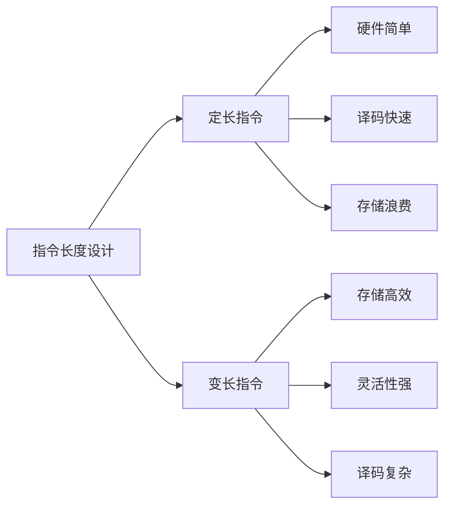
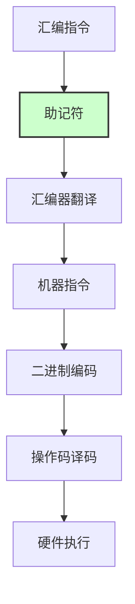
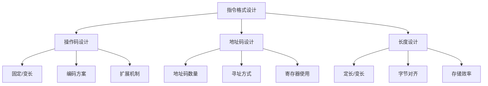

# 第4章-4.2-指令格式

## 基本信息
- **课程**：计算机组成原理
- **章节**：第4章 指令系统 - 4.2 指令格式
- **日期**：2026-04-08
- **标签**：#指令格式 #操作码 #地址码 #指令字长度 #指令助记符

## 重点内容

### ⭐⭐⭐ 指令的基本组成
- **操作码**：指定操作类型的字段
- **地址码**：指定操作数地址的字段
- **指令字长度**：指令占用的二进制位数

### ⭐⭐ 操作码设计原则
- **长度固定**：便于硬件译码
- **编码合理**：常用指令短编码
- **扩展性**：支持新指令添加

### ⭐⭐ 地址码类型
- **零地址指令**：隐含操作数
- **一地址指令**：单操作数
- **二地址指令**：双操作数
- **三地址指令**：三操作数

### ⭐ 指令格式设计考虑
- **规整性**：格式统一便于处理
- **效率性**：平衡指令长度和执行速度
- **兼容性**：考虑软件兼容需求

## 详细笔记

### 4.2.1 操作码

#### 操作码的基本概念

**操作码（Opcode）**是指令中用于指定操作类型的字段，是CPU识别指令功能的关键部分。



#### 操作码设计原则

| 设计原则 | 说明 | 示例 |
|---------|------|------|
| **固定长度** | 操作码位数固定 | 4位操作码支持16种操作 |
| **扩展编码** | 预留扩展位 | 使用特定编码表示扩展操作 |
| **优先级编码** | 常用指令短编码 | 加法操作码比除法短 |
| **规整编码** | 相关操作编码相近 | 算术操作编码连续 |

#### 操作码扩展技术

**扩展操作码**：在指令字长度固定的情况下，通过向地址码字段"借位"来扩展操作码位数，从而表示更多指令。

**【例4.1】** 设某等长指令字结构机器的指令长度为16位，包括4位基本操作码字段和三个4位地址字段。

基本格式：
```
| OP(4位) | A₁(4位) | A₂(4位) | A₃(4位) |
```

若4位操作码全部用于三地址指令，只能表示 $2^4 = 16$ 种。采用扩展操作码技术后：

| 指令类型 | 操作码编码 | 数量 | 说明 |
|:---|:---|:---:|:---|
| **三地址指令** | `0000` ~ `1110` | 15条 | 4位OP，`1111`用于扩展 |
| **二地址指令** | `1111 0000` ~ `1111 1101` | 14条 | 8位OP，向A₁借4位；`1111 1110`/`1111 1111`用于扩展 |
| **一地址指令** | `1111 1110 0000` ~ `1111 1110 1111`（16条）<br>`1111 1111 0000` ~ `1111 1111 1110`（15条） | 31条 | 12位OP，向A₂借4位；`1111 1111 1111`用于扩展 |
| **零地址指令** | `1111 1111 1111 0000` ~ `1111 1111 1111 1111` | 16条 | 16位OP，向A₃借4位 |

**编码规则**：
- **三地址**：OP = `0000`~`1110`（15种），`1111` → 扩展到A₁
- **二地址**：OP = `1111 0000`~`1111 1101`（14种），`1111 1110`和`1111 1111` → 继续扩展
- **一地址**：使用两个前缀
  - `1111 1110` + `0000`~`1111` = 16种
  - `1111 1111` + `0000`~`1110` = 15种（`1111` → 继续扩展）
  - 合计31种
- **零地址**：OP = `1111 1111 1111` + `0000`~`1111`（16种）

> 扩展操作码的本质：**用短操作码的"溢出处"作为长操作码的入口**，保证所有编码唯一可译。

### 4.2.2 地址码

#### 地址码的类型和功能

**地址码**是指令中用于指定操作数地址的字段，决定指令的操作数数量和寻址方式。



#### 不同地址码指令对比

| 指令类型 | 格式 | 数学含义 | 特点 | 适用场景 |
|---------|------|---------|------|----------|
| **四地址** | OP A₁,A₂,A₃,A₄ | A₃ ← (A₁) OP (A₂)，A₄指明下条指令地址 | 含下条指令地址 | 早期计算机 |
| **三地址** | OP A₁,A₂,A₃ | A₃ ← (A₁) OP (A₂) | 结果存第三地址 | 复杂运算 |
| **二地址** | OP A₁,A₂ | A₁ ← (A₁) OP (A₂) | 结果覆盖目的 | 通用操作 |
| **一地址** | OP A | AC ← (AC) OP (A) | 隐含累加器 | 累加器操作 |
| **零地址** | OP | — | 操作数隐含 | 栈操作 |

> 地址码字段A指明的是操作数的**地址**，而不是操作数本身。

#### 二地址指令的三种物理位置类型

从操作数的物理位置来说，二地址指令可分为三种类型：

| 类型 | 名称 | 操作数位置 | 特点 | 速度 |
|:---|:---|:---|:---|:---|
| **SS型** | 存储器-存储器 | 两个操作数都在内存 | 需多次访存 | 慢 |
| **RR型** | 寄存器-寄存器 | 两个操作数都在寄存器 | 不访存 | **快** |
| **RS型** | 寄存器-存储器 | 一个在寄存器，一个在内存 | 访存一次 | 中等 |

- **SS型**：参与操作的数都放在内存里，操作结果也存回内存，需要多次访问内存
- **RR型**：从寄存器取操作数，结果放回寄存器，执行速度最快（RISC常用）
- **RS型**：既要访问内存又要访问寄存器，执行速度介于两者之间

### 4.2.3 指令字长度

#### 指令长度的设计考虑

**指令字长度**是指令占用的二进制位数，影响指令系统的性能和复杂度。



#### 指令长度选择因素

**定长指令的优点**：
- ⭐ 硬件设计简单，译码电路规整
- ⭐ 指令预取和流水线执行效率高
- ⭐ 适合RISC架构

**变长指令的优点**：
- ⭐ 代码密度高，存储效率好
- ⭐ 复杂操作单条指令完成
- ⭐ 适合CISC架构

#### 常见指令长度

| 架构类型 | 典型长度 | 特点 |
|---------|---------|------|
| **RISC** | 32位固定 | 规整高效 |
| **CISC** | 变长(1-15字节) | 灵活密集 |
| **VLIW** | 超长(64-256位) | 并行执行 |

### 4.2.4 指令助记符

#### 助记符的作用和设计

**指令助记符**是用符号表示操作码的助记符号，便于程序员编写和理解汇编程序。



#### 助记符设计原则

| 原则 | 说明 | 示例 |
|------|------|------|
| **直观性** | 反映操作功能 | ADD表示加法 |
| **简洁性** | 长度适中 | MOV比MOVE简洁 |
| **一致性** | 同类操作前缀一致 | LOAD, STORE |
| **可读性** | 易于理解记忆 | JUMP比JMP更直观 |

### 4.2.5 指令格式举例

#### 典型指令格式示例

**MIPS指令格式**（RISC架构代表）：

```
R型指令格式（寄存器操作）：
31-26    25-21    20-16    15-11    10-6     5-0
opcode    rs       rt       rd       shamt    funct
6位      5位      5位      5位      5位      6位

示例：ADD $s1, $s2, $s3
opcode=0, rs=$s2, rt=$s3, rd=$s1, shamt=0, funct=32
```

**IA-32指令格式**（CISC架构代表）：

IA-32机的指令字长度可变（1B ~ 12B），是典型的CISC结构。指令格式如下：

```
| 操作码 | Mod | Reg/OP | R/M | S | I | B | 位移量 | 立即数 |
|        | 2位 |  3位   | 3位 |2位|3位|3位|        |        |
```

| 字段 | 名称 | 功能 |
|:---|:---|:---|
| **操作码** | Opcode | 指定操作类型 |
| **ModR/M** | Mod + Reg + R/M | 规定存储器操作数寻址方式，给出寄存器编号 |
| **SIB** | 比例S + 变址I + 基址B | 与ModR/M一起完整说明操作数来源 |
| **位移量** | Displacement | 地址偏移 |
| **立即数** | Immediate | 常数操作数 |

> 除操作码外，其他四个字段都是**可选**的（不选时取0字节）。
> Pentium采用**RS型**指令，指令格式中只有一个存储器操作数。

**【例4.2】** 某16位机的指令格式如下，试分析指令格式的特点。

```
| 15  9 | 8  7 | 6  4 | 3  0 |
|  OP   |  —   | 源寄存器 | 目标寄存器 |
|  7位  |  2位  |  3位   |  4位    |
```

**解**：
1. **单字长二地址指令**
2. 操作码OP为7位，可指定 $2^7 = 128$ 条指令
3. 源寄存器和目标寄存器都是通用寄存器（可分别指定16个），所以是**RR型指令**
4. 这种结构常用于算术逻辑运算类指令

**【例4.3】** 某16位机的指令格式如下，试分析指令格式的特点。

```
| 15  10 | 9  8 | 7  4 | 3  0 |
|   OP   |  —   | 源寄存器 | 变址寄存器 |
|  6位   |  2位  |  4位   |  4位    |

|          位移量（16位）          |
```

**解**：
1. **双字长二地址指令**，用于访问存储器
2. 操作码OP为6位，可指定 $2^6 = 64$ 种操作
3. 一个操作数在源寄存器（共16个），另一个在存储器中（由变址寄存器和位移量决定），所以是**RS型指令**

#### 指令格式设计实例分析



## 疑问与思考

### ❓ 思考问题
1. RISC架构为什么倾向于使用定长指令格式？
2. 变长指令格式在什么场景下比定长格式更有优势？
3. 现代处理器如何平衡指令格式的规整性和灵活性？

### 💡 解答

#### 1. RISC架构为什么倾向于使用定长指令格式？

| 原因 | 说明 |
|:---|:---|
| **取指简单** | 每条指令固定32位，PC每次+4，无需判断指令边界 |
| **译码快速** | 操作码位置固定，硬件并行译码，适合流水线 |
| **实现简单** | 控制单元设计规整，降低硬件复杂度 |

#### 2. 变长指令格式在什么场景下比定长格式更有优势？

- **代码密度要求高**时：嵌入式系统存储空间有限，变长指令（如x86、ARM Thumb）用更少的字节表示常用操作
- **指令功能差异大**时：简单操作只需1字节，复杂操作需要多字节，避免浪费
- **内存受限环境**：如微控制器、IoT设备

#### 3. 现代处理器如何平衡指令格式的规整性和灵活性？

采用**压缩指令集扩展**：
- **RISC-V**：标准32位指令 + 可选16位压缩指令（RVC），混合使用
- **ARM**：32位ARM指令 + 16位Thumb指令，支持切换
- **策略**：热代码用压缩指令节省空间，关键路径用定长指令保证速度

### 💡 学习建议
- 理解不同指令格式对硬件设计的影响
- 掌握操作码和地址码的设计原则
- 分析典型架构的指令格式特点
- 关注指令格式与性能优化的关系

## 相关链接
- [第4章完整内容](../../full.md)
- [第4章-4.1节笔记](./第4章-4.1-指令系统的发展与性能要求.md)
- [第4章-4.3节笔记](./第4章-4.3-指令和数据的寻址方式.md)
