# 第4章-4.3 指令和数据的寻址方式

## 基本信息

- **课程**：计算机组成原理
- **章节**：第4章 4.3节 指令和数据的寻址方式
- **日期**：2026-04-17
- **标签**：#寻址方式 #指令系统 #计算机组成原理

***

## 重点内容

### ⭐⭐⭐ 核心概念

1. **寻址方式分类**：指令寻址方式 vs 数据寻址方式
2. **9种基本寻址方式**及其特点
3. **偏移寻址的三种形式**：相对寻址、基址寻址、变址寻址

***

## 详细笔记

### 一、寻址方式概述

存储器既可存放数据，又可存放指令。形成操作数或指令地址的方式称为**寻址方式**。

寻址方式分为两类：

- **指令寻址方式**：形成指令地址的方式（较简单）
- **数据寻址方式**：形成操作数地址的方式（较复杂）

> 💡 **冯·诺依曼型计算机**：内存中指令寻址与数据寻址是**交替进行**的
>
> 💡 **哈佛型计算机**：指令寻址和数据寻址是**独立进行**的

***

### 二、指令的寻址方式 ⭐

指令的寻址方式有两种：

#### 1. 顺序寻址方式

指令地址在内存中按顺序安排，程序按一条接一条的顺序执行。

**关键部件**：程序计数器（PC，又称指令指针寄存器）

**工作原理**：

- PC 计数指令的顺序号（即指令在内存中的地址）
- 每执行一条指令，PC 自动 +1（或加指令长度）

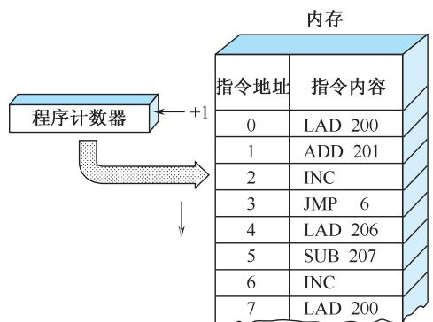

**流程示意**：

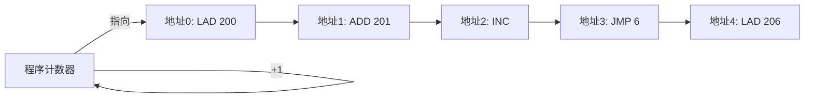

#### 2. 跳跃寻址方式

当程序需要转移执行顺序时，采用跳跃寻址方式。

**特点**：

- 下条指令的地址码**不是由 PC 给出**，而是由**本条指令给出**
- 程序跳跃后，按新的指令地址开始顺序执行
- PC 的内容必须相应改变，跟踪新的指令地址

**用途**：

- 实现程序转移
- 构成循环程序
- 缩短程序长度
- 公共程序引用

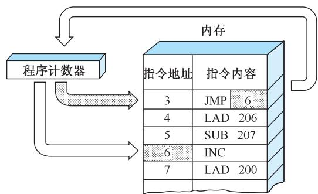

**流程示意**：

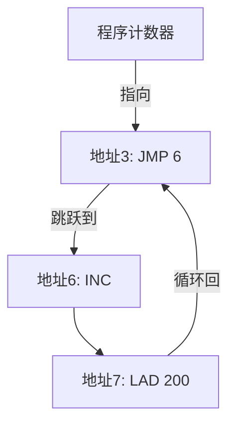

***

### 三、操作数基本寻址方式 ⭐⭐⭐

#### 操作数的三个来源

| 来源        | 特点    | 优缺点     |
| --------- | ----- | ------- |
| 指令直接给出    | 简便快捷  | 操作数固定不变 |
| CPU 通用寄存器 | 获取速度快 | 数量有限    |
| 内存数据区     | 容量大   | 需要访存    |

#### 形式地址与有效地址

- **形式地址 A**（偏移量）：指令字结构中给定的地址量
- **有效地址 EA**：操作数的实际访存地址
- **寻址过程**：把形式地址变换为有效地址的过程

***

#### 9 种基本寻址方式

##### 1. 隐含寻址

**定义**：指令中**不显式给出**操作数地址，而是**隐含**在指令中。

**算法**：操作数在专用寄存器中

**优点**：无存储器访问

**缺点**：数据范围有限

**示例**：英特尔 IA-32 的乘法指令 `MUL opr`

- 只给出乘数地址
- 被乘数**隐含使用 AX 或 AL 寄存器**（由乘数位数决定）

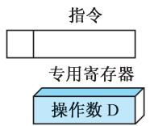

***

##### 2. 立即寻址

**定义**：指令的地址字段指出的**不是操作数的地址，而是操作数本身**。

**算法**：操作数 = A

**优点**：无存储器访问，立即可用

**缺点**：操作数幅值有限，灵活性差

**示例**：`MOV AL, 7` — 将立即数 7 送入寄存器 AL

**二进制编码**：`1011-0-000-00000111`

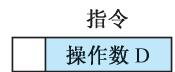

***

##### 3. 直接寻址 ⭐

**定义**：指令格式的地址字段中**直接指出**操作数在内存的地址 A。

**算法**：EA = A

**优点**：简单直观

**缺点**：地址范围有限

**表达式**：D = (A)

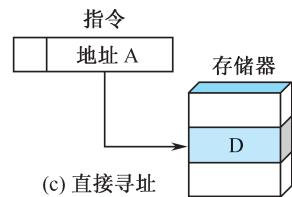

***

##### 4. 间接寻址

**定义**：指令地址字段中的形式地址 A **不是操作数的真正地址**，而是操作数地址的指示器。

**算法**：EA = (A)

**优点**：大的地址范围

**缺点**：多重存储器访问（两次访存）

**指令格式**：

| 操作码 | I   | A    |
| --- | --- | ---- |
| OP  | 间址位 | 形式地址 |

- I = 0：直接寻址，EA = A
- I = 1：间接寻址，EA = (A)

> ⚠️ 间接寻址是早期计算机常用方式，但因两次访存影响速度，现在较少使用

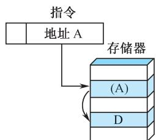

***

##### 5. 寄存器寻址

**定义**：操作数放在 CPU 的**通用寄存器**中。

**算法**：EA = R

**优点**：无存储器访问，访问速度快

**缺点**：地址范围有限（寄存器数量有限）

**示例**：RR 型指令采用寄存器寻址

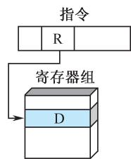

***

##### 6. 寄存器间接寻址

**定义**：指令格式中的寄存器内容**不是操作数**，而是**操作数的地址**（在内存中）。

**算法**：EA = (R)

**优点**：大的地址范围

**缺点**：额外存储器访问

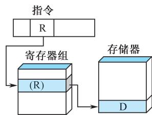

***

##### 7. 偏移寻址 ⭐⭐⭐

**定义**：直接寻址和寄存器间接寻址的结合。

**算法**：EA = A + (R)

**优点**：灵活

**缺点**：复杂

**三种常用形式**：

###### (1) 相对寻址

- **专用寄存器**：程序计数器 (PC)
- **公式**：EA = A + (PC)
- **特点**：
  - 地址字段值看作 2 的补码
  - 有效地址是对当前指令地址的上下偏移
  - 基于程序的**局部性原理**
  - 节省指令中的地址位数
  - 便于程序在内存中成块搬动

###### (2) 基址寻址

- **专用寄存器**：含有一个存储器地址（基地址）
- **地址字段**：相对于该地址的偏移量（通常是无符号整数）
- **特点**：利用存储器访问的局部性原理

###### (3) 变址寻址

- **地址域**：引用一个主存地址
- **专用寄存器**：含有对那个地址的正偏移量
- **用途**：为重复操作提供高效机制

**示例**：为表中每个元素加 1

- 有效地址序列：A, A+1, A+2, ...
- 变址寄存器初始化为 0，每次操作后增 1
- EA = A + (R)，R ← (R + 1)

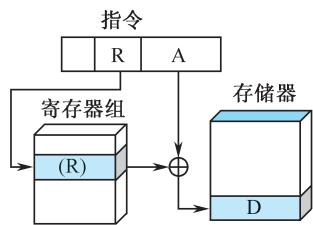

***

##### 8. 段寻址

**定义**：英特尔 IA-32 采用的寻址方式。

**原理**：

- 将整个 1MB 空间按最大长度 64KB 划分成若干段
- 基地址（段寄存器）+ 16 位偏移量 = 20 位物理地址
- 段寄存器中的 16 位数**自动左移 4 位**，再与偏移量相加

**公式**：物理地址 = (段寄存器 << 4) + 偏移量

**实质**：还是基址寻址

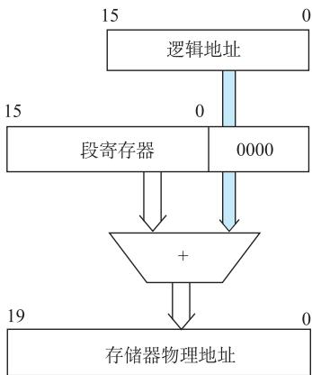

> ❓ **思考题**：段寻址方式的创新点是什么？
>
> 💡 **个人理解**：段寻址的创新在于将程序按逻辑功能分段（代码段、数据段、堆栈段等），每段独立管理，便于程序模块化、保护和共享。

***

##### 9. 堆栈寻址

**定义**：以**先进后出**（FILO）原理存储数据。

**两种形式**：

- 寄存器堆栈
- 存储器堆栈

**操作**：

- **PUSH**：数据压入栈顶，堆栈指示器减 1
- **POP**：数据从栈顶弹出，堆栈指示器加 1

**特点**：无须给出存储器地址，需要堆栈指示器

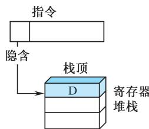

***

### 四、寻址方式汇总表

| 方式      | 算法           | 主要优点      | 主要缺点    |
| ------- | ------------ | --------- | ------- |
| 隐含寻址    | 操作数在专用寄存器    | 无存储器访问    | 数据范围有限  |
| 立即寻址    | 操作数 = A      | 无存储器访问    | 操作数幅值有限 |
| 直接寻址    | EA = A       | 简单        | 地址范围有限  |
| 间接寻址    | EA = (A)     | 大的地址范围    | 多重存储器访问 |
| 寄存器寻址   | EA = R       | 无存储器访问    | 地址范围有限  |
| 寄存器间接寻址 | EA = (R)     | 大的地址范围    | 额外存储器访问 |
| 偏移寻址    | EA = A + (R) | 灵活        | 复杂      |
| 段寻址     | EA = A + (R) | 灵活        | 复杂      |
| 堆栈寻址    | EA = 栈顶      | 无须给出存储器地址 | 需要堆栈指示器 |

***

### 五、寻址方式举例

#### 1. 英特尔 IA-32 的寻址方式

**地址总线**：36 位外部地址总线，支持 32 位物理地址空间

**两种模式**：

| 模式    | 地址计算                                 |
| ----- | ------------------------------------ |
| 实地址模式 | 段寄存器内容左移 4 位 + 段内偏移 = 20 位物理地址       |
| 保护模式  | 32 位段基地址 + 段内偏移 = 32 位线性地址 LA → 物理地址 |

**9 种寻址方式**：

| 序号  | 寻址方式            | 有效地址 EA 算法             | 说明                    |
| --- | --------------- | ---------------------- | --------------------- |
| (1) | 立即寻址            | 操作数 = A                | 操作数 A 在指令中            |
| (2) | 寄存器寻址           | EA = R                 | 操作数在某寄存器内             |
| (3) | 偏移量寻址           | EA = A                 | 偏移量 A 在指令中（8/16/32 位） |
| (4) | 基址寻址            | EA = (B)               | B 为基址寄存器              |
| (5) | 基址 + 偏移量        | EA = (B) + A           | —                     |
| (6) | 比例变址 + 偏移量      | EA = (I) × S + A       | S 为比例因子 (1,2,4,8)     |
| (7) | 基址 + 变址 + 偏移    | EA = (B) + (I) + A     | —                     |
| (8) | 基址 + 比例变址 + 偏移量 | EA = (B) + (I) × S + A | —                     |
| (9) | 相对寻址            | 指令地址 = (PC) + A        | PC 为程序计数器             |

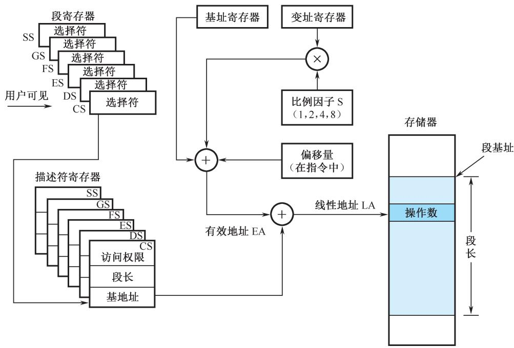

***

#### 2. Power PC 寻址方式

Power PC 是 RISC 机器，采用简单的一组寻址方式：

| 指令类型  | 方式     | 算法               |
| ----- | ------ | ---------------- |
| 取数/存数 | 间接寻址   | EA = (BR) + D    |
| 取数/存数 | 间接变址寻址 | EA = (BR) + (IR) |
| 转移    | 绝对寻址   | EA = I           |
| 转移    | 相对寻址   | EA = (PC) + I    |
| 转移    | 间接寻址   | EA = (L/CR)      |
| 定点计算  | 寄存器寻址  | EA = GPR         |
| 定点计算  | 立即寻址   | 操作数 = I          |
| 浮点计算  | 寄存器寻址  | EA = FPR         |

**注**：BR = 基址寄存器，IR = 变址寄存器，L/CR = 链接或计数寄存器，GPR = 通用寄存器，FPR = 浮点寄存器

***

### 六、例题分析

#### 【例 4.4】二地址 RS 型指令寻址方式分析

**指令结构**：

| 6 位 | 4 位 | 1 位 | 2 位 | 16 位 |
|-----|------|------|------|-------|
| OP  | 通用寄存器 | I | X | 偏移量 D |

**6 种寻址方式**：

| 寻址方式 | I | X  | 有效地址 E 算法    | 名称      |
| ---- | - | -- | ------------ | ------- |
| (1)  | 0 | 00 | E = D        | 直接寻址    |
| (2)  | 0 | 01 | E = (PC) ± D | 相对寻址    |
| (3)  | 0 | 10 | E = (R2) ± D | 变址寻址    |
| (4)  | 1 | 11 | E = (R3)     | 寄存器间接寻址 |
| (5)  | 1 | 00 | E = (D)      | 间接寻址    |
| (6)  | 0 | 11 | E = (R1) ± D | 基址寻址    |

***

## 疑问与思考

1. ❓ 段寻址方式的创新点是什么？
2. ❓ 为什么间接寻址现在较少使用？（两次访存影响速度）
3. ❓ 偏移寻址的三种形式（相对、基址、变址）在实际编程中如何区分使用？
4. ❓ 现代处理器（如 ARM、RISC-V）采用哪些寻址方式？

### 💡 解答

#### 1. 段寻址方式的创新点是什么？

- **创新点**：引入**段基址 + 偏移量**的两维地址，支持程序模块化（代码段、数据段、堆栈段分离）
- **优势**：方便多道程序共享/保护，简化链接和重定位
- **问题**：段大小不固定，易产生碎片；后来发展为**段页式**结合固定分页管理

#### 2. 为什么间接寻址现在较少使用？

- **核心原因：速度太慢**
- 间接寻址需要**两次访存**：先读地址单元，再读数据单元
- 现代CPU主频极高，访存延迟是最大瓶颈，两次访存不可接受
- **替代方案**：用寄存器间接寻址（地址在寄存器中，无需访存取地址）

#### 3. 偏移寻址的三种形式如何区分使用？

| 寻址方式 | 公式 | 典型用途 |
|:---|:---|:---|
| **相对寻址** | EA = PC + 偏移 | 转移指令、位置无关代码（PIC） |
| **基址寻址** | EA = 基址寄存器 + 偏移 | 多道程序/进程切换，基址指向程序起始 |
| **变址寻址** | EA = 变址寄存器 + 偏移 | 数组/循环访问，变址寄存器自动递增 |

#### 4. 现代处理器（如 ARM、RISC-V）采用哪些寻址方式？

| 处理器 | 主要寻址方式 |
|:---|:---|
| **ARM** | 寄存器寻址、立即寻址、寄存器间接、基址+偏移（支持自动变址）、PC相对寻址 |
| **RISC-V** | 寄存器寻址、立即寻址、基址+偏移（仅一种偏移寻址，极简设计） |
| **共同点** | 取消复杂间接寻址，简化硬件；Load/Store架构下只有Load/Store能访存 |

***

## 相关链接

- 📚 出处：第 4 章 4.3 节"指令和数据的寻址方式"
- 📖 相关章节：4.2 指令格式、4.4 典型指令
- 📖 后续章节：第 5 章 中央处理器（指令执行）

***

## 考试重点标记

| 知识点              | 重要程度 | 考试频率 |
| ---------------- | ---- | ---- |
| 指令寻址方式（顺序/跳跃）    | ⭐⭐   | 中    |
| 9 种基本寻址方式        | ⭐⭐⭐  | 高    |
| 偏移寻址三种形式         | ⭐⭐⭐  | 高    |
| 直接寻址 vs 间接寻址     | ⭐⭐   | 中    |
| 寄存器寻址 vs 寄存器间接寻址 | ⭐⭐   | 中    |
| IA-32 寻址方式       | ⭐    | 低    |
| 寻址方式优缺点比较        | ⭐⭐⭐  | 高    |

