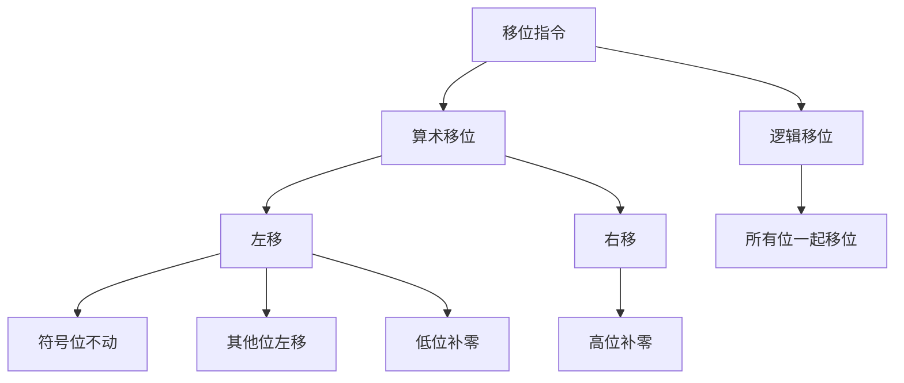
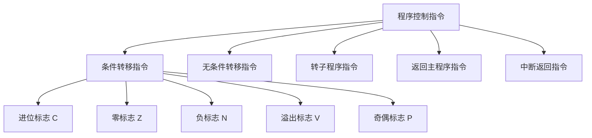
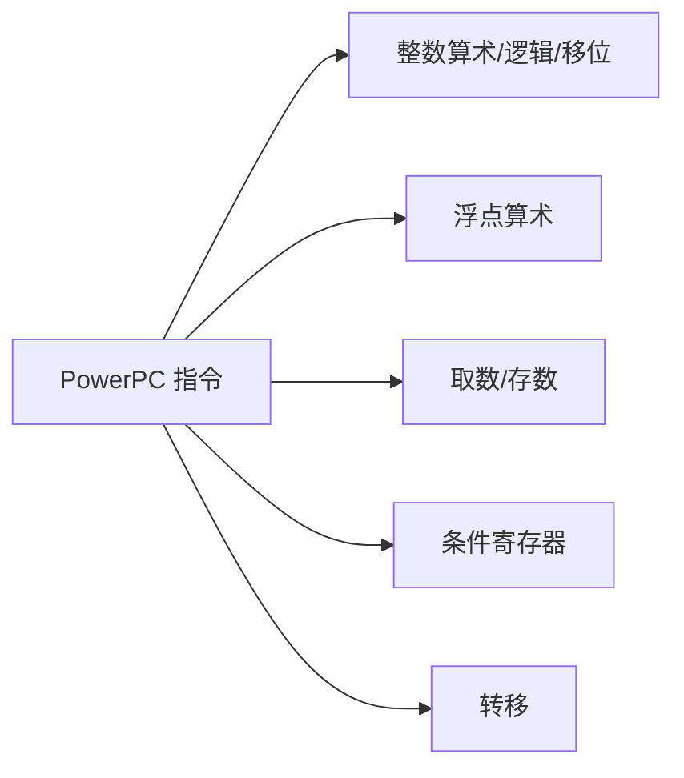
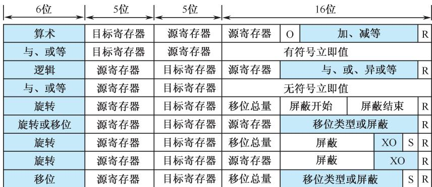
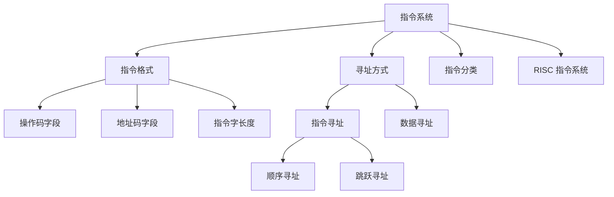
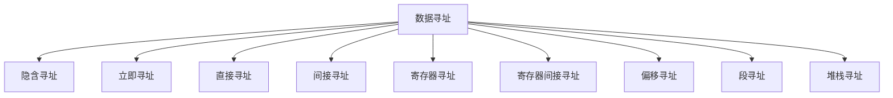
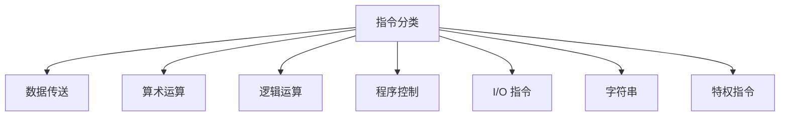
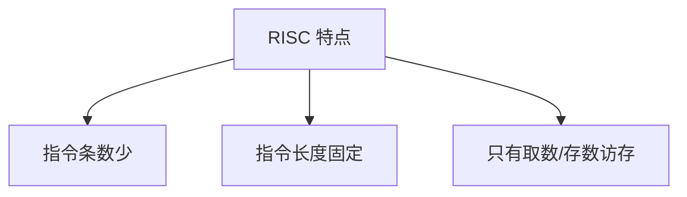

# 第4章-4.4 典型指令

## 基本信息
- **课程**：计算机组成原理
- **章节**：第4章 4.4节 典型指令
- **日期**：2026-04-17
- **标签**：#指令分类 #RISC #CISC #指令系统 #计算机组成原理

---

## 重点内容

### ⭐⭐⭐ 核心概念
1. **8 类指令分类**：数据传送、算术运算、逻辑运算、程序控制、I/O、字符串、特权、其他
2. **RISC 指令系统三大特点**
3. **RISC vs CISC 性能比较公式**：P = I × C × T
4. **PowerPC 五种指令类型**

---

## 详细笔记

### 一、指令的分类 ⭐⭐⭐

一个较完善的指令系统应当有四大类指令：**数据处理、数据存储、数据传送、程序控制**，具体分为以下 8 类：

---

#### 1. 数据传送指令

**功能**：实现主存和寄存器之间，或寄存器和寄存器之间的数据传送。

**包含指令**：

| 指令类型 | 说明 |
|----------|------|
| 取数指令 | 从主存取数至寄存器 |
| 存数指令 | 从寄存器存数至主存 |
| 传送指令 | 寄存器之间传送 |
| 成组传送指令 | 批量数据传送 |
| 字节交换指令 | 字节序交换 |
| 清寄存器指令 | 寄存器清零 |
| 堆栈操作指令 | PUSH/POP |

**示例**：
- 通用寄存器 Ri 中的数存入主存
- 通用寄存器 Ri 中的数送到另一通用寄存器 Rj
- 从主存中取数至通用寄存器 Rj
- 寄存器清零或主存单元清零

---

#### 2. 算术运算指令

**功能**：定点或浮点的算术运算。

**包含指令**：

| 指令类型 | 说明 |
|----------|------|
| 二进制定点加、减、乘、除 | 整数运算 |
| 浮点加、减、乘、除 | 浮点运算 |
| 求反、求补 | 符号变换 |
| 算术移位 | 带符号移位 |
| 算术比较 | 大小比较 |
| 十进制加、减 | BCD 运算 |

> 💡 大型机中有**向量运算指令**，直接对整个向量或矩阵进行求和、求积运算

---

#### 3. 逻辑运算指令

**功能**：无符号数的位操作、代码的转换、判断及运算。

**包含指令**：

| 指令类型 | 说明 |
|----------|------|
| 逻辑加（OR） | 按位或 |
| 逻辑乘（AND） | 按位与 |
| 按位加（XOR） | 按位异或 |
| 逻辑移位 | 无符号移位 |

**移位指令详解**：



| 移位类型 | 左移 | 右移 |
|----------|------|------|
| **算术移位** | 符号位不动，其他位左移，低位补零 | 高位补零 |
| **逻辑移位** | 所有位一起移位 | 所有位一起移位 |

---

#### 4. 程序控制指令 ⭐

**定义**：也称**转移指令**，用于改变程序执行顺序。

**分类**：



**转移地址确定方式**：

| 方式 | 名称 | 转移地址计算 |
|------|------|--------------|
| 直接寻址 | 绝对转移 | 由指令地址码直接给出 |
| 相对寻址 | 相对转移 | 当前 PC 值 + 指令地址部分给出的偏移量 |

---

#### 5. 输入输出指令

**功能**：启动外围设备，检查测试外围设备工作状态，实现外部设备和 CPU 之间信息传送。

**两种实现方式**：

| 方式 | 说明 |
|------|------|
| 独立 I/O 编址 | 有专门的 I/O 指令 |
| 统一编址 | 外部设备寄存器和存储器单元统一编址，用取数/存数指令代替 I/O 指令 |

---

#### 6. 字符串处理指令

**定义**：非数值处理指令。

**包含操作**：

| 操作 | 说明 |
|------|------|
| 字符串传送 | 复制字符串 |
| 字符串转换 | 编码转换 |
| 字符串比较 | 比较两个字符串 |
| 字符串查找 | 查找子串 |
| 字符串抽取 | 提取子串 |
| 字符串替换 | 替换字符串 |

> 💡 这类指令在文字编辑中对大量字符串进行处理

---

#### 7. 特权指令 ⭐

**定义**：具有特殊权限的指令，权限最大，使用不当会破坏系统和其他用户信息。

**使用范围**：只用于操作系统或其他系统软件，不直接提供给用户使用。

**主要用途**：

| 用途 | 说明 |
|------|------|
| 系统资源分配和管理 | 改变系统工作方式 |
| 权限检测 | 检测用户的访问权限 |
| 虚拟存储管理 | 修改段表、页表 |
| 任务管理 | 完成任务的创建和切换 |

> 📌 在多用户、多任务的计算机系统中特权指令**必不可少**

---

#### 8. 其他指令

| 指令类型 | 说明 |
|----------|------|
| 状态寄存器置位/复位 | 设置状态标志 |
| 测试指令 | 测试条件 |
| 暂停指令 | 暂停执行 |
| 空操作指令（NOP） | 不执行任何操作 |
| 系统控制特殊指令 | 其他系统控制 |

---

### 二、RISC 指令系统 ⭐⭐⭐

#### RISC 三大特点

1. **选取使用频率最高的简单指令**，指令条数少
2. **指令长度固定**，指令格式种类少，寻址方式种类少
3. **只有取数/存数指令访问存储器**，其余指令的操作都在寄存器之间进行

---

#### 典型 RISC 指令系统特征

| 型号 | 指令数 | 寻址方式 | 指令格式 | 通用寄存器数 | 主频/MHz |
|------|--------|----------|----------|--------------|----------|
| RISC-I | 31 | 2 | 2 | 78 | 8 |
| RISC-II | 39 | 2 | 2 | 138 | 12 |
| MIPS | 55 | 3 | 4 | 16 | 4 |
| SPARC | 75 | 4 | 3 | 120~136 | 25~33 |
| MIPSR3000 | 91 | 3 | 3 | 32 | 25 |
| i860 | 65 | 3 | 4 | 32 | 50 |
| Power PC | 64 | 6 | 5 | 32 | — |

---

#### RISC vs CISC 性能比较 ⭐⭐⭐

**性能公式**：

$$P = I \times C \times T$$

其中：
- **I**：高级语言程序编译后在机器上运行的机器指令数
- **C**：每条机器指令执行时所需要的平均机器周期数
- **T**：每个机器周期的执行时间

| 指标 | RISC | CISC |
|------|------|------|
| I（指令数比值） | 1.2~1.4 | 1 |
| C（平均周期数） | 1.3~1.7 | 4~6 |
| T（周期时间比值） | <1 | 1 |

**分析**：
- RISC 的指令数稍多（I 较大），但每条指令执行周期少（C 小），且周期时间短（T 小）
- CISC 的指令数少（I 小），但每条指令执行周期多（C 大），周期时间长（T 大）
- 综合来看，RISC 的执行效率更高

---

#### PowerPC 指令系统实例

PowerPC 是 32 位字长的 RISC 计算机，共有 64 条指令。

**五种指令类型**：



**指令格式特点**：

| 特点 | 说明 |
|------|------|
| 指令长度 | 所有指令都是 32 位长 |
| 操作码 | 前 6 位指定操作码 |
| 寄存器字段 | 操作码后是两个 5 位寄存器字段（32 个通用寄存器） |
| 链接位（L） | 指示转移后指令地址是否放入链接寄存器 |
| 绝对/相对位（A） | 指示寻址方式是绝对寻址还是 PC 相对寻址 |
| 条件位（R） | 指示运算结果是否记录在条件寄存器中 |

**浮点指令特点**：
- 有三个源寄存器字段
- 多数情况使用两个源寄存器
- 少数指令涉及"乘-加"复合运算（两个源寄存器相乘，再加/减第三个源寄存器）
- 常用于矩阵运算



---

### 三、ARM 汇编语言

#### ARM 汇编指令格式

**寄存器**：16 个寄存器（r0~r12, SP, LR, PC）

**存储**：2^30 个存储字（字节编址，连续字地址相差 4）

**主要指令类别**：

| 类别 | 指令 | 示例 | 含义 |
|------|------|------|------|
| **算术运算** | ADD | `ADD r1,r2,r3` | r1 = r2 + r3 |
| **算术运算** | SUB | `SUB r1,r2,r3` | r1 = r2 - r3 |
| **数据传送** | LDR | `LDR r1,[r2,#20]` | r1 = 存储单元[r2+20] |
| **数据传送** | STR | `STR r1,[r2,#20]` | 存储单元[r2+20] = r1 |
| **数据传送** | MOV | `MOV r1,r2` | r1 = r2 |
| **逻辑运算** | AND | `AND r1,r2,r3` | r1 = r2 & r3 |
| **逻辑运算** | ORR | `ORR r1,r2,r3` | r1 = r2 \| r3 |
| **逻辑运算** | MVN | `MVN r1,r2` | r1 = ~r2 |
| **条件转移** | CMP | `CMP r1,r2` | 条件标志 = r1 - r2 |
| **条件转移** | BEQ | `BEQ 25` | 若相等则转移 |
| **无条件转移** | B | `B 2500` | 无条件转移 |

---

#### 【例 4.5】ARM 汇编翻译成机器语言

**C 语言语句**：
```c
A[30] = h + A[30]
```

**已知条件**：
- r3 寄存器保存数组 A 的基地址
- h 放在寄存器 r2 中

**编译成 3 条汇编指令**：

```assembly
LDR r5,[r3,#120]    ; 寄存器 r5 中获得 A[30]
ADD r5,r2,r5        ; 寄存器 r5 中获得 h + A[30]
STR r5,[r3,#120]    ; 将 h + A[30] 存入 A[30]
```

**机器语言翻译**：

| 指令 | cond | F | I | opcode | S | Rn | Rd | operand |
|------|------|---|---|--------|---|----|----|---------|
| LDR | 14 | 1 | — | 24 | — | 3 | 5 | 120 |
| ADD | 14 | 0 | 0 | 4 | 0 | 2 | 5 | 5 |
| STR | 14 | 1 | — | 25 | — | 3 | 5 | 120 |

**二进制机器码**：

| 指令 | 二进制编码 |
|------|-----------|
| LDR | `1110 1 11000 0011 0101 0000 0111 1000` |
| ADD | `1110 0 0 100 0 0010 0101 0000 0000 0101` |
| STR | `1110 1 11001 0011 0101 0000 1111 0000` |

---

### 四、本章小结









---

## 疑问与思考

1. ❓ RISC 和 CISC 哪个更好？为什么现代处理器多采用 RISC 架构？
2. ❓ 特权指令如果被恶意使用会造成什么后果？
3. ❓ 算术移位和逻辑移位的区别在实际编程中有什么意义？
4. ❓ PowerPC 的"乘-加"复合指令如何提高矩阵运算效率？
5. ❓ 统一编址和独立 I/O 编址各有什么优缺点？

---

## 相关链接

- 📚 出处：第 4 章 4.4 节"典型指令"、4.5 节"ARM 汇编语言"
- 📖 前置章节：4.2 指令格式、4.3 指令和数据的寻址方式
- 📖 后续章节：第 5 章 中央处理器（指令执行）

---

## 考试重点标记

| 知识点 | 重要程度 | 考试频率 |
|--------|----------|----------|
| 8 类指令分类及功能 | ⭐⭐ | 中 |
| RISC 三大特点 | ⭐⭐⭐ | 高 |
| RISC vs CISC 性能公式 P = I × C × T | ⭐⭐⭐ | 高 |
| 算术移位 vs 逻辑移位 | ⭐⭐ | 中 |
| 条件转移指令的转移条件 | ⭐⭐ | 中 |
| 特权指令的用途 | ⭐ | 低 |
| PowerPC 五种指令类型 | ⭐ | 低 |
| ARM 汇编指令翻译 | ⭐⭐ | 中 |
