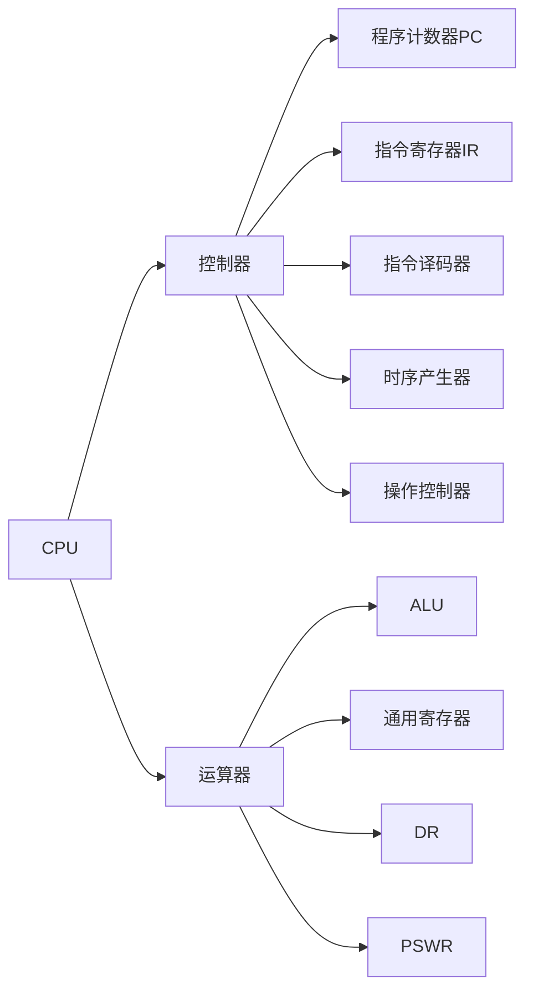
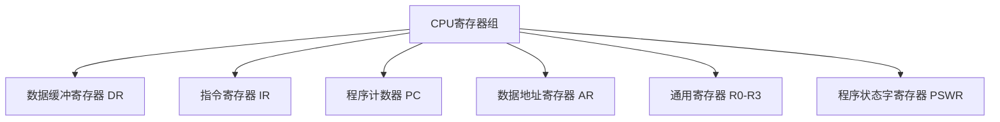
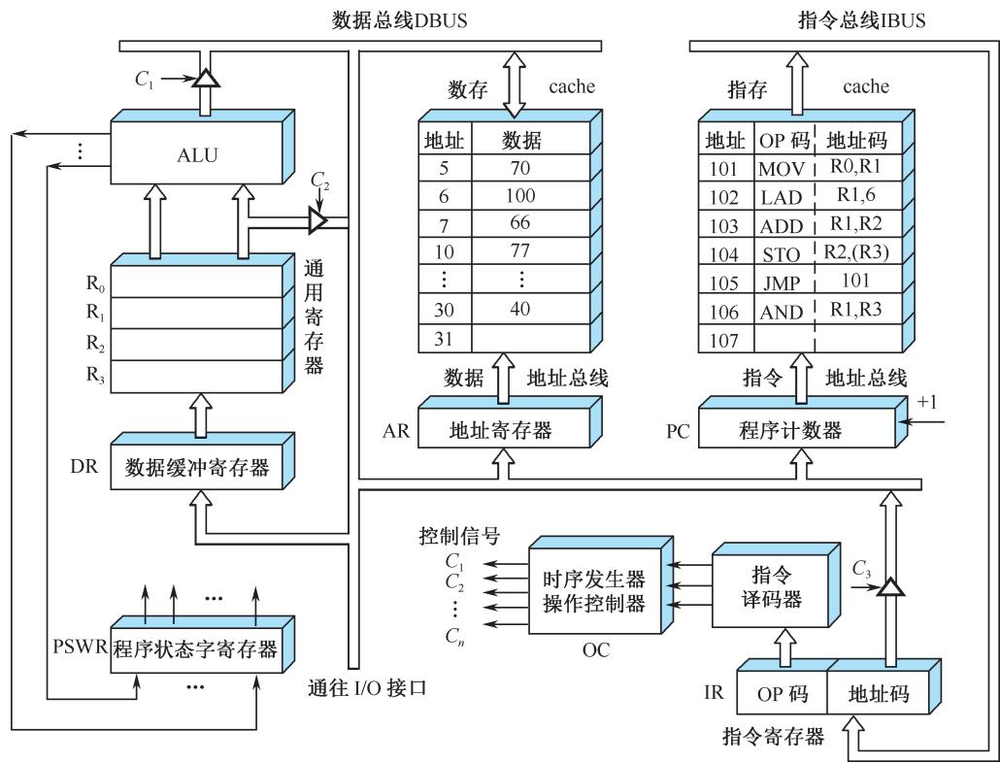

# 第5章 5.1节 CPU的功能和组成

## 基本信息
- **课程**：计算机组成原理
- **章节**：第5章 5.1节 CPU的功能和组成
- **日期**：2026-04-24
- **标签**：#CPU #中央处理器 #控制器 #运算器 #寄存器 #指令控制

---

## 重点内容

⭐⭐⭐ **核心考点**：
1. CPU的四大基本功能
2. CPU的基本组成（控制器 + 运算器）
3. 六类主要寄存器的名称和功能
4. PSWR中的状态标志位（C、V、Z、N）

---

## 一、CPU的功能 ⭐⭐⭐

CPU（Central Processing Unit，中央处理器）是计算机的核心部件，专门负责**取指令和执行指令**。

> 💡 **定义**：随着技术发展，一个物理CPU芯片内部往往集成多个处理器核。本章所说的CPU是指**处理器核(core)**，即由运算器和控制器组成的最核心部分。

### CPU的四大基本功能

| 功能 | 说明 |
|------|------|
| **指令控制** | 程序的顺序控制，保证机器按顺序执行程序 |
| **操作控制** | 管理并产生每条指令的操作信号，送往相应部件 |
| **时间控制** | 对各种操作实施时间上的定时 |
| **数据加工** | 对数据进行算术运算和逻辑运算处理 |

💡 **记忆口诀**："指操时数"——指令、操作、时间、数据

---

## 二、CPU的基本组成 ⭐⭐⭐

CPU由两大部分组成：**控制器** + **运算器**

### 1. 控制器（决策机构）

**组成**：程序计数器(PC)、指令寄存器(IR)、指令译码器、时序产生器、操作控制器

**主要功能**：
1. 从指令cache中取出指令，并指出下一条指令的位置
2. 对指令进行译码，产生操作控制信号
3. 指挥CPU、数据cache和I/O设备之间的数据流动

### 2. 运算器（执行部件）

**组成**：算术逻辑运算单元(ALU)、通用寄存器、数据缓冲寄存器(DR)、程序状态字寄存器(PSWR)

**主要功能**：
1. 执行所有算术运算
2. 执行所有逻辑运算，并进行逻辑测试

⚠️ **注意**：运算器所进行的全部操作都是由控制器发出的控制信号来指挥的！

---

## 三、CPU中的六类主要寄存器 ⭐⭐⭐

| 寄存器 | 英文全称 | 功能说明 |
|--------|----------|----------|
| **DR** | Data Register | 暂存ALU运算结果或从存储器读出的数据 |
| **IR** | Instruction Register | 保存当前正在执行的指令 |
| **PC** | Program Counter | 存放下一条指令的地址（指令计数器） |
| **AR** | Address Register | 保存当前访问的数据存储器单元地址 |
| **R0-R3** | General Register | 为ALU提供工作区，存放操作数和结果 |
| **PSWR** | Program Status Word Register | 保存运算结果的状态标志 |

### 各寄存器详细说明

#### (1) 数据缓冲寄存器(DR)
- 暂时存放ALU的运算结果
- 存放从数据存储器读出的数据字
- 存放来自外部接口的数据字
- **作用**：
  - 作为ALU运算结果和通用寄存器之间信息传送的时间缓冲
  - 补偿CPU和内存、外围设备之间在操作速度上的差别

#### (2) 指令寄存器(IR)
- 保存当前正在执行的一条指令
- 指令划分为**操作码**和**地址码**字段
- 操作码字段(OP)的输出是**指令译码器**的输入
- 译码后向操作控制器发出具体操作的特定信号

#### (3) 程序计数器(PC) ⭐⭐⭐
- 又称为**指令计数器**
- 存放下一条指令在指令cache中的地址
- **关键特性**：
  - 程序开始执行前，将起始地址送入PC
  - 大多数指令顺序执行：PC + 1
  - 遇到转移指令（如JMP）：PC从指令寄存器的地址字段取得新地址
- **结构特点**：具有寄存器和计数两种功能

#### (4) 数据地址寄存器(AR)
- 保存当前CPU所访问的数据存储器单元的地址
- 对存储器阵列进行地址译码时必须使用
- 保持地址信息直到一次读/写操作完成

#### (5) 通用寄存器(R0~R3)
- 为ALU提供一个工作区
- 存放源操作数和结果操作数
- 现代CPU中通用寄存器可多达64个甚至更多
- 还可用作地址指示器、变址寄存器、堆栈指示器等

#### (6) 程序状态字寄存器(PSWR) ⭐⭐⭐
- 又称为**状态条件寄存器**
- 保存各种**条件代码**（状态标志位）：

| 标志位 | 名称 | 含义 |
|--------|------|------|
| **C** | Carry | 运算结果进位标志 |
| **V** | Overflow | 运算结果溢出标志 |
| **Z** | Zero | 运算结果为零标志 |
| **N** | Negative | 运算结果为负标志 |

- 还保存中断和系统工作状态等信息

---

## 四、操作控制器与时序发生器

### 数据通路
- 寄存器之间传送信息的通路称为**数据通路**
- 操作控制器负责在各寄存器之间建立数据通路

### 操作控制器的两种类型

| 类型 | 实现方式 | 特点 |
|------|----------|------|
| **硬布线控制器** | 组合逻辑技术 | 速度快，硬件复杂 |
| **微程序控制器** | 存储逻辑 | 灵活，易于修改 |

### 时序发生器
- 对各种操作信号实施**时间上的控制**
- 保证计算机有条不紊地自动工作
- 每一个动作的时间必须严格控制（不能太早也不能太迟）

---

## CPU模型结构图

**图5.1 CPU模型**

从图中可以看出：
- **左侧**：运算器部分（ALU、通用寄存器、DR、PSWR）
- **右侧**：控制器部分（PC、IR、指令译码器、时序发生器、操作控制器）
- **中间**：存储器（数存和指存）
- **数据流向**：通过数据总线(DBUS)和指令总线(IBUS)连接

---

## 疑问与思考

1. **Q**：为什么PC既能寄存又能计数？
   - **A**：因为大多数指令顺序执行（PC+1），但转移指令需要直接修改PC的值，所以PC需要具备两种功能。

2. **Q**：DR和AR的区别是什么？
   - **A**：DR存放**数据**，AR存放**地址**，这是两者最本质的区别。

3. **Q**：控制器和运算器的关系是什么？
   - **A**：控制器是"决策机构"，运算器是"执行部件"。运算器的所有操作都由控制器发出的控制信号指挥。

4. **Q**：为什么需要指令译码器？
   - **A**：指令寄存器中的操作码需要被译码，才能识别出需要进行什么操作，进而产生相应的控制信号。

---

## 考试重点 📌

### 必考知识点
1. **CPU的四大功能**（指令控制、操作控制、时间控制、数据加工）
2. **六类寄存器的名称和英文缩写**
3. **PC的工作原理**（顺序执行+转移指令的特殊处理）
4. **PSWR的四个状态标志位**（C、V、Z、N）
5. **控制器 vs 运算器** 的职责区分

### 常见题型
- 选择题：寄存器功能辨析
- 填空题：CPU四大功能、PSWR标志位
- 简答题：简述CPU的基本组成和各部分功能

---

## 相关链接

- 上一章：[第4章-4.5-ARM汇编语言](第4章-4.5-ARM汇编语言.md)
- 下一节：[第5章-5.2-指令周期](第5章-5.2-指令周期.md)
- 课本插图：图5.1 CPU模型

---

📚 **出处**：第5章 5.1节"CPU的功能和组成"，见插图（图5.1 CPU模型）
