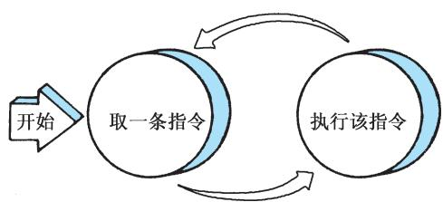

# 5.2 指令周期

## 基本信息
- **课程**：计算机组成原理
- **章节**：第5章 中央处理器
- **日期**：2026-06-16
- **标签**：#指令周期 #CPU周期 #时钟周期 #取指周期 #执行周期

## 重点内容

⭐⭐⭐ **指令周期**：取出一条指令并执行这条指令的时间

⭐⭐⭐ **CPU周期（机器周期）**：通常用内存中读取一个指令字的最短时间规定

⭐⭐⭐ **时钟周期（T周期）**：处理操作的最基本单位

⭐⭐⭐ **五种典型指令的指令周期**：NOT（2个CPU周期）、LAD（3个）、ADD（2个）、STO（3个）、JMP（2个）

## 详细笔记

### 一、指令周期的基本概念

#### 📷 图5.2 取指令-执行指令序列

> 📚 **课本出处**：图5.2 展示了CPU取指令、执行指令周而复始的封闭循环过程

**指令周期**：CPU每取出一条指令并执行这条指令，都要完成一系列的操作，这一系列操作所需的时间称为一个指令周期。

**CPU周期（机器周期）**：指令周期常常用若干个CPU周期数来表示。通常用内存中读取一个指令字的最短时间来规定CPU周期。

**时钟周期（T周期/节拍脉冲）**：一个CPU周期时间又包含有若干个时钟周期，它是处理操作的最基本单位。

#### 📷 图5.3 指令周期示意图

> 📚 **课本出处**：图5.3 采用定长CPU周期的指令周期示意图，取指和执行各需一个CPU周期

**单周期CPU vs 多周期CPU**：
- **单周期CPU**：在一个时钟周期内完成从指令取出到得到结果的所有工作，效率低，较少采用
- **多周期CPU**：把指令执行分成多个阶段，每个阶段在一个时钟周期内完成，时钟周期短，不同指令所用周期数可以不同

#### 典型程序示例

表5.1列出了一个由6条指令组成的简单程序：

| 地址 | 指令 | 类型 | 说明 |
|:----:|:-----|:-----|:-----|
| 101 | NOT | RR型 | 执行 NOT R1 -> R0 |
| 102 | LAD | RS型 | 从数存6号单元取数据100 -> R1 |
| 103 | ADD | RR型 | 执行 R1 + R2 -> R2，结果为120 |
| 104 | STO | RS型 | 用(R3)间接寻址，R2=120写入数存30号单元 |
| 105 | JMP | 转移型 | 转移至101号单元 |
| 106 | AND | RR型 | 执行 R1 AND R3 -> R3 |

### 二、NOT指令的指令周期

#### 📷 图5.4 NOT指令的指令周期

> 📚 **课本出处**：图5.4 NOT指令需要2个CPU周期（取指1个+执行1个）

NOT是RR型指令，需要**两个CPU周期**：
- 取指周期：1个CPU周期
- 执行周期：1个CPU周期

**取指周期**（图5.5）：
1. PC中装入指令地址101
2. PC内容放到指令地址总线ABUS(I)，启动读命令
3. 从101号地址读出的指令通过IBUS装入IR
4. PC内容加1，变成102
5. IR中的操作码被译码
6. CPU识别出是NOT指令

#### 📷 图5.5 NOT指令取指周期

**执行周期**（图5.6）：
1. OC选中R1为源寄存器
2. OC指定ALU做取反操作
3. OC打开ALU输出三态门，将结果送到DBUS
4. OC将DBUS数据打入DR（245）
5. OC选中R0为目标寄存器，将DR数据打入R0

#### 📷 图5.6 NOT指令执行周期

### 三、LAD指令的指令周期

#### 📷 图5.7 LAD指令的指令周期

> 📚 **课本出处**：图5.7 LAD指令需要3个CPU周期（取指1个+执行2个）

LAD是RS型指令，需要**三个CPU周期**：
- 取指周期：1个CPU周期
- 执行周期：2个CPU周期

**取指周期**：与NOT指令取指周期相同，只是PC提供地址102，取出"LAD R1, 6"指令，PC+1变为103。

**执行周期**（图5.8）：
1. OC打开IR输出三态门，将地址码6放到DBUS
2. OC将地址码6装入AR
3. OC发出读命令，将数存6号单元的数100读出到DBUS
4. OC将DBUS数据100装入DR
5. OC选中R1为目标寄存器，将DR中的100装入R1

### 四、ADD指令的指令周期

ADD是RR型指令，需要**两个CPU周期**（取指1个+执行1个）。

执行周期：完成R1 + R2 -> R2的操作。

### 五、STO指令的指令周期

#### 📷 图5.10 STO指令的指令周期

STO是RS型指令，需要**三个CPU周期**（取指1个+执行2个）。

执行周期（图5.11）：
1. OC选中R3=30为数存地址单元
2. OC打开R3输出三态门，将地址30放到DBUS
3. OC将地址30打入AR，进行数存地址译码
4. OC选中R2=120作为写入数据
5. OC打开R2输出三态门，将数据120放到DBUS
6. OC将数据120写入数存30号单元

> ⚠️ DBUS是单总线结构，先送地址(30)，后送数据(120)，必须分时传送。

#### 📷 图5.11 STO指令执行周期

### 六、JMP指令的指令周期

#### 📷 图5.12 JMP指令的指令周期

JMP是无条件转移指令，需要**两个CPU周期**（取指1个+执行1个）。

执行周期（图5.13）：
1. OC打开IR输出三态门，将IR中的地址码101发送到DBUS
2. OC将DBUS上的地址码101打入PC，PC中原内容106被更换

#### 📷 图5.13 JMP指令执行周期

### 七、用方框图语言表示指令周期

#### 📷 图5.15 用方框图语言表示指令周期

> 📚 **课本出处**：图5.15 用方框图语言归纳五条典型指令的指令周期

**方框图语言约定**：
- 一个方框代表一个CPU周期
- 方框中的内容表示数据通路的操作或控制操作
- 菱形符号表示判别或测试，时间上依附于前面一个方框，不单独占用CPU周期
- "~"符号为公操作符号，表示一条指令执行完毕后的公共操作

**各指令周期汇总**：

| 指令 | 指令周期数 | 取指周期 | 执行周期 |
|:----:|:----------:|:--------:|:--------:|
| NOT | 2 | 1 | 1 |
| LAD | 3 | 1 | 2 |
| ADD | 2 | 1 | 1 |
| STO | 3 | 1 | 2 |
| JMP | 2 | 1 | 1 |

> 💡 **公操作**：一条指令执行完毕后，CPU开始进行的操作（如中断处理、通道处理等），如果没有外设请求，CPU转向取下一条指令。

### 八、例题分析

#### 📷 图5.16 双总线结构机器的数据通路

> 📚 **课本出处**：图5.16 双总线结构机器的数据通路，用于指令周期流程设计

#### 📷 图5.17 加法和减法指令周期流程图

> 📚 **课本出处**：图5.17 ADD和SUB指令的指令周期流程图

## 疑问与思考

1. 为什么LAD和STO指令的执行周期需要2个CPU周期，而NOT和ADD只需要1个？
2. 单总线结构和双总线结构对指令周期有什么影响？

## 相关链接

- [第5章-5.1-CPU的功能和组成](第5章-5.1-CPU的功能和组成.md)
- [第5章-5.3-时序发生器和控制方式](第5章-5.3-时序发生器和控制方式.md)
