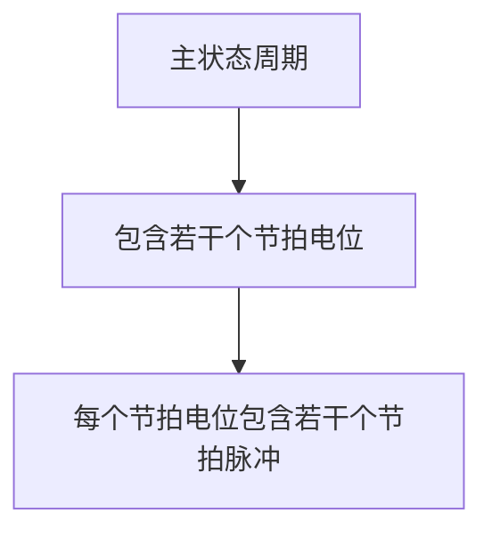

# 5.3 时序发生器和控制方式

## 基本信息
- **课程**：计算机组成原理
- **章节**：第5章 中央处理器
- **日期**：2026-06-16
- **标签**：#时序发生器 #时序信号 #控制方式 #同步控制 #异步控制

## 重点内容

⭐⭐⭐ **时序信号体制**：
- 三级体制（硬布线控制器）：主状态周期 - 节拍电位 - 节拍脉冲
- 二级体制（微程序控制器）：节拍电位 - 节拍脉冲

⭐⭐⭐ **三种控制方式**：同步控制、异步控制、联合控制

⭐⭐⭐ **时序信号发生器组成**：时钟源、环形脉冲发生器、节拍脉冲和读写时序译码、启停控制逻辑

## 详细笔记

### 一、时序信号的作用和体制

**时序信号的作用**：
计算机能够准确、迅速、有条不紊地工作，正是因为在CPU中有一个时序信号产生器。操作控制器利用定时脉冲的顺序和不同的脉冲间隔，有条理、有节奏地指挥机器的动作。

**CPU如何识别指令和数据？**
- **从时间上说**：取指令发生在指令周期的第一个CPU周期（取指令阶段），取数据发生在执行指令阶段
- **从空间上说**：取出的代码送往指令寄存器（IR）是指令，送往运算器是数据

**时序信号最基本的体制**：电位-脉冲制
- 数据加在触发器的电位输入端
- 打入数据的控制信号加在触发器的时钟输入端
- 电位信号必须先稳定，控制信号才能到来

#### 时序信号体制

**1. 三级时序体制（硬布线控制器）**

| 级别 | 名称 | 含义 |
|:-----|:-----|:-----|
| 第一级 | 主状态周期 | 最大的时间单位，可用触发器状态持续时间来表示 |
| 第二级 | 节拍电位 | 表示一个CPU周期的时间，较大的时间单位 |
| 第三级 | 节拍脉冲 | 表示较小的时间单位，一个节拍电位中包含若干个 |

**2. 二级时序体制（微程序控制器）**

| 级别 | 名称 | 含义 |
|:-----|:-----|:-----|
| 第一级 | 节拍电位 | 表示一个CPU周期的时间 |
| 第二级 | 节拍脉冲 | 把一个CPU周期划分成几个较小的时间间隔（T周期） |

### 二、时序信号发生器

#### 📷 图5.18 时序信号发生器框图

> 📚 **课本出处**：图5.18 微程序控制器中使用的时序信号发生器结构图

时序信号发生器由四部分组成：

**（1）时钟源**
- 为环形脉冲发生器提供频率稳定且电平匹配的方波时钟脉冲信号
- 通常由石英晶体振荡器和与非门组成的正反馈振荡电路组成

**（2）环形脉冲发生器**
- 产生一组有序的间隔相等或不等的脉冲序列
- 通过译码电路产生最后所需的节拍脉冲

**（3）节拍脉冲和存储器读/写时序**
- 假设一个CPU周期中产生四个等间隔的节拍脉冲 T1° ~ T4°
- 每个节拍脉冲宽度200ns，一个CPU周期为800ns

#### 📷 图5.19 节拍电位与节拍脉冲时序关系图

> 📚 **课本出处**：图5.19 展示了节拍脉冲信号T1~T4的时序关系

#### 📷 图5.20 启停控制逻辑

> 📚 **课本出处**：图5.20 启停控制逻辑，保证在T1前沿开启、T4后沿关闭时序发生器

**（4）启停控制逻辑**
- 核心：运行标志触发器 Cr
- 当 Cr=1 时，原始节拍脉冲通过门电路发送出去
- 当 Cr=0 时，关闭时序发生器
- 保证：启动时从第1个节拍脉冲前沿开始，停机时在T4结束后关闭

### 三、控制方式

控制不同操作序列时序信号的方法，称为控制器的控制方式。

#### 1. 同步控制方式

已定的指令在执行时所需的机器周期数和时钟周期数都是固定不变的。

**三种方案**：

| 方案 | 说明 | 特点 |
|:-----|:-----|:-----|
| 完全统一的机器周期 | 所有指令周期具有相同的节拍电位数和节拍脉冲数 | 简单指令造成时间浪费 |
| 不定长机器周期 | 大多数操作安排在较短机器周期，紧张操作延长机器周期 | 较灵活 |
| 中央控制与局部控制结合 | 大部分指令用固定机器周期（中央控制），复杂指令用另外时序（局部控制） | 兼顾效率和灵活性 |

#### 2. 异步控制方式

每条指令、每个操作控制信号需要多少时间就占用多少时间。

- 指令周期可由多少不等的机器周期数组成
- 或控制器发出操作控制信号后，等待执行部件完成操作后发回"回答"信号，再开始新的操作
- 没有固定的CPU周期数或严格的时钟周期与之同步

#### 3. 联合控制方式

同步控制和异步控制相结合的方式。

| 情况 | 说明 |
|:-----|:-----|
| 情况一 | 大部分操作安排在固定机器周期中，对时间难以确定的操作以"回答"信号作为结束标志（半同步方式） |
| 情况二 | 机器周期的节拍脉冲数固定，但各条指令周期的机器周期数不固定（微程序控制） |

**三种控制方式对比**：

| 控制方式 | 定时特点 | 优点 | 缺点 |
|:---------|:---------|:-----|:-----|
| 同步控制 | 固定机器周期数和时钟周期数 | 控制简单 | 时间利用率低 |
| 异步控制 | 按需占用时间 | 时间利用率高 | 控制复杂 |
| 联合控制 | 两者结合 | 兼顾效率和实现复杂度 | 设计较复杂 |

## 疑问与思考

1. 为什么硬布线控制器采用三级时序，而微程序控制器采用二级时序？
2. 启停控制逻辑中为什么要在T1前沿开启、T4后沿关闭？

## 相关链接

- [第5章-5.2-指令周期](第5章-5.2-指令周期.md)
- [第5章-5.4-微程序控制器](第5章-5.4-微程序控制器.md)
- [第5章-5.5-硬布线控制器](第5章-5.5-硬布线控制器.md)
