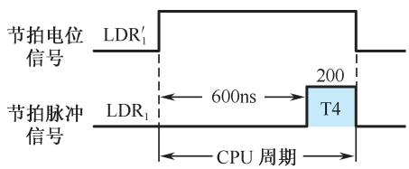
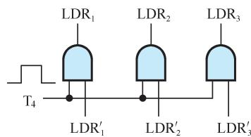

# 5.4 微程序控制器

## 基本信息
- **课程**：计算机组成原理
- **章节**：第5章 中央处理器
- **日期**：2026-06-16
- **标签**：#微程序控制器 #微指令 #微命令 #控制存储器 #微操作

## 重点内容

⭐⭐⭐ **微程序控制基本思想**：将机器指令的操作流程分解成基本微操作序列，用二进制代码表示并编成微指令，一条机器指令对应一段微程序

⭐⭐⭐ **微指令格式**：操作控制字段 + 顺序控制字段

⭐⭐⭐ **微程序控制器组成**：控制存储器、微指令寄存器（微地址寄存器+微命令寄存器）、地址转移逻辑

⭐⭐⭐ **微命令编码方法**：直接表示法、编码表示法（字段译码）、混合表示法

⭐⭐⭐ **微地址形成方法**：计数器方式、多路转移方式

## 详细笔记

### 一、微程序控制原理

**发展历史**：1951年，英国剑桥大学威尔克斯(M.V.Wilkes)教授提出微程序设计思想。

**基本思想**：
1. 将机器指令的操作流程分解成基本的微操作序列
2. 用二进制代码表示这些微操作并编成一条条微指令
3. 一条机器指令对应一段由微指令序列构成的微程序
4. 所有机器指令对应的微程序存放到控制器内的只读存储器（控制存储器）中
5. 执行机器指令时，依次读出微指令并产生微命令

**与硬布线控制器相比的优点**：
- 不需要线路庞杂的组合逻辑控制单元
- 具有规整性、灵活性、可维护性
- 尤其适合设计复杂的控制器

### 二、微命令和微操作

**控制部件与执行部件的联系**：

| 联系方式 | 说明 |
|:---------|:-----|
| 控制线 | 控制部件发出微命令，执行部件进行微操作 |
| 反馈线 | 执行部件反馈操作情况，控制部件根据"状态"下达新微命令（状态测试） |

**微操作分类**：

| 类型 | 定义 |
|:-----|:-----|
| **相容性微操作** | 在同时或同一个CPU周期内可以并行执行的微操作 |
| **相斥性微操作** | 不能在同时或不能在同一个CPU周期内并行执行的微操作 |

#### 📷 图5.21 简单运算器数据通路图

> 📚 **课本出处**：图5.21 展示了ALU、通用寄存器R1/R2/R3、多路开关和数据缓冲器DR组成的数据通路

**相斥性微操作示例**（图5.21）：
- ALU的操作：+、-、M（传送）——三者相斥
- X输入端：4、6、8三个微操作相斥
- Y输入端：5、7、9三个微操作相斥

**相容性微操作示例**：
- X输入的4/6/8与Y输入的5/7/9中，任意两个都是相容的

### 三、微指令和微程序

**微指令**：在机器的一个CPU周期中，一组实现一定操作功能的微命令的组合。

#### 📷 图5.22 微指令基本格式

> 📚 **课本出处**：图5.22 微指令字长23位，由操作控制字段（17位）和顺序控制字段（6位）组成

**微指令结构**（以23位为例）：

| 字段 | 位数 | 功能 |
|:-----|:-----|:-----|
| 操作控制字段 | 17位（1~17） | 发出管理和指挥全机工作的控制信号，每一位代表一个微命令 |
| 判别测试字段 | 2位（18~19） | P1、P2判别测试标志 |
| 下地址字段 | 4位（20~23） | 直接给出下一条微指令的地址 |

**操作控制字段**：
- 某一位为"1"表示发出微命令
- 某一位为"0"表示不发出微命令
- 例如：第1位为1表示发出LDR1'微命令（ALU -> R1）

**顺序控制字段**：
- 决定产生下一条微指令的地址
- 18、19位为判别测试标志：
  - 为"0"：不测试，直接按20~23位取下一条微指令
  - 为"1"：进行P1或P2判别测试，根据结果修改20~23位的某一位或几位

#### 📷 图5.23 运算器操作时序与产生逻辑

> 📚 **课本出处**：图5.23 微命令信号与节拍脉冲T4相与得到LDR1~LDR3信号，保证运算结果稳定后打入寄存器

### 四、微程序控制器原理框图

#### 📷 图5.24 微程序控制器组成原理框图

> 📚 **课本出处**：图5.24 微程序控制器由控制存储器、微指令寄存器和地址转移逻辑三大部分组成

**三大部分组成**：

**（1）控制存储器**
- 存放实现全部指令系统的微程序
- 只读型存储器，机器运行时只读不写
- 微指令周期 = 读出微指令时间 + 执行微指令时间
- 在串行方式中，微指令周期通常等于CPU周期

**（2）微指令寄存器**
- 微地址寄存器：决定将要访问的下一条微指令的地址
- 微命令寄存器：保存微指令的操作控制字段和判别测试字段信息

**（3）地址转移逻辑**
- 微程序不出现分支：下一条微指令地址直接由微地址寄存器给出
- 微程序出现分支（条件转移）：通过判别测试字段P和执行部件的"状态条件"反馈信息修改微地址寄存器内容

### 五、微程序举例

#### 📷 图5.25 十进制加法微程序

> 📚 **课本出处**：图5.25 十进制加法微程序流程图，由4条微指令组成

**十进制加法指令功能**：用BCD码完成十进制数的加法运算。当和数大于9时，必须对和数进行加6修正。

**微程序流程**（4条微指令）：

| 微指令 | 地址 | 功能 |
|:-------|:----:|:-----|
| 取指微指令 | 0000 | 从内存取出机器指令放到IR，PC+1，对操作码进行P1测试 |
| 第二条 | 1010 | 完成 6 + a 运算，结果保存在R2 |
| 第三条 | 1001 | 完成 (6+a) + b 运算，进行P2测试（测试进位标志Cy） |
| 第四条 | 0001 | 当Cy=0时执行，完成 R2 - 6 -> R2（减去多余的6） |

**微指令执行过程**：
1. 给出第一条微指令地址0000，读出"取指"微指令
2. P1测试：用OP字段修改微地址 -> 1010，读出第二条微指令
3. 直接给出下地址1001，读出第三条微指令
4. P2测试：根据Cy修改微地址（Cy=0->0001，Cy=1->0000）

### 六、CPU周期与微指令周期的关系

#### 📷 图5.26 CPU周期与微指令周期的关系

> 📚 **课本出处**：图5.26 一个CPU周期0.8μs，包含T1~T4四个节拍脉冲，T4读微指令，T1+T2+T3执行微指令

在串行方式的微程序控制器中：
- 微指令周期 = 读出微指令时间 + 执行微指令时间
- 通常设计为微指令周期恰好等于CPU周期时间
- 例：CPU周期0.8μs，T4(200ns)读取微指令，T1+T2+T3(600ns)执行微指令

### 七、机器指令与微指令的关系

#### 📷 图5.27 机器指令与微指令的关系

> 📚 **课本出处**：图5.27 机器指令与微指令、程序与微程序、地址与微地址的对应关系

**三者关系**：

| 对比项 | 机器指令/程序 | 微指令/微程序 |
|:-------|:-------------|:-------------|
| 存储位置 | 内存储器 | 控制存储器 |
| 一一对应 | 一条机器指令对应一个微程序 | 若干条微指令组成 |
| 软件可见性 | 可见 | 不可见 |
| 类比 | 子程序调用 | 子程序定义 |

**总结**：
1. 一条机器指令对应一个微程序，由若干条微指令序列组成
2. 前者与内存储器有关，后者与控制存储器有关
3. 控存中的微程序类比成软件设计中的子程序定义
4. 微程序完全属于硬件范畴，对软件不可见

### 八、微程序设计技术

#### 1. 微命令编码

**（1）直接表示法**
- 操作控制字段中每一位代表一个微命令
- 优点：简单直观，输出直接用于控制
- 缺点：微指令字较长，控制存储器容量较大

**（2）编码表示法（字段直接译码法）**

#### 📷 图5.28 字段直接译码法

> 📚 **课本出处**：图5.28 把一组相斥性微命令组成字段，通过译码器译码输出

- 把一组相斥性微命令信号组成一个小组（字段）
- 通过字段译码器对每个微命令译码
- 3位二进制可表示7个微命令，4位可表示15个微命令
- 优点：微指令字大大缩短
- 缺点：增加译码电路，执行速度稍稍减慢

**（3）混合表示法**
- 直接表示法与字段编码法混合使用
- 综合考虑微指令字长、灵活性、执行速度

#### 2. 微地址的形成方法

**（1）计数器方式**
- 类似程序计数器PC产生机器指令地址
- 顺序执行：后继微地址 = 现行微地址 + 增量
- 非顺序执行：通过转移方式转去指定后继微地址
- 特点：顺序控制字段较短，微地址产生机构简单；但多路并行转移功能弱，灵活性差

**（2）多路转移方式**
- 一条微指令具有多个转移分支的能力
- 不产生分支：后继微地址直接由顺序控制字段给出
- 产生分支：按判别测试标志和状态条件信息选择其中一个微地址
- 特点：能以较短的顺序控制字段实现多路并行转移，灵活性好，速度较快

**多路转移原理**：
- 1位状态条件标志：可实现2路转移
- 2位状态条件标志：可实现4路转移
- n位状态条件标志：可实现2^n路转移

## 疑问与思考

1. 为什么说微程序控制器比硬布线控制器更适合复杂指令系统？
2. 直接表示法和编码表示法各适用于什么场景？

## 相关链接

- [第5章-5.3-时序发生器和控制方式](第5章-5.3-时序发生器和控制方式.md)
- [第5章-5.5-硬布线控制器](第5章-5.5-硬布线控制器.md)
