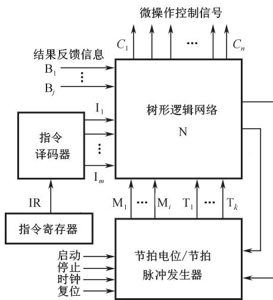
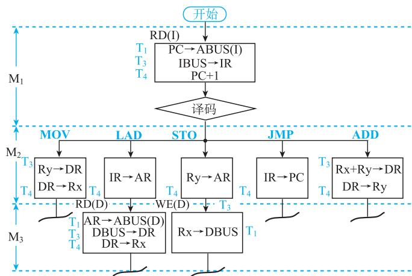

# 5.5 硬布线控制器

## 基本信息
- **课程**：计算机组成原理
- **章节**：第5章 中央处理器
- **日期**：2026-06-16
- **标签**：#硬布线控制器 #组合逻辑 #微操作控制信号 #有限状态机

## 重点内容

⭐⭐⭐ **硬布线控制器基本思想**：采用组合逻辑技术实现，用门电路和触发器构成复杂树形逻辑网络

⭐⭐⭐ **微操作控制信号**：$C = f(I_m, M_i, T_k, B_j)$，是指令译码输出、时序信号和状态条件的逻辑函数

⭐⭐⭐ **硬布线控制器 vs 微程序控制器**：速度快但设计复杂，适合RISC；微程序控制器规整灵活，适合CISC

⭐⭐⭐ **基于FSM的硬布线控制器**：状态寄存器 + 状态转移逻辑 + 微命令发生器

## 详细笔记

### 一、基本思想

硬布线控制器是最早出现的计算机操作控制器设计方法。

**设计目标**：使用最少元件和取得最高操作速度。

**特点**：
- 把控制部件看作产生专门固定时序控制信号的逻辑电路
- 由门电路和触发器构成的复杂树形逻辑网络
- 一旦构成后，除非重新设计和物理上重新布线，否则无法增加新功能

**历史演变**：
- 硬布线控制器设计调试复杂，曾一度被微程序控制器取代
- 但硬布线控制器速度更快（微命令产生速度仅取决于电路延迟）
- 随着VLSI技术、EDA工具成熟和RISC流行，硬布线控制器重新广泛应用

#### 📷 图5.29 硬布线控制器结构方框图

> 📚 **课本出处**：图5.29 硬布线控制器由逻辑网络N产生微操作控制信号

**逻辑网络的输入信号来源**：

| 来源 | 信号 | 说明 |
|:-----|:-----|:-----|
| ① | 指令操作码译码器输出 $I_m$ | 指令译码结果 |
| ② | 执行部件反馈信息 $B_j$ | 状态条件信号 |
| ③ | 时序产生器的时序信号 | 节拍电位信号M + 节拍脉冲信号T |

**逻辑网络N的输出**：微操作控制信号，用来对执行部件进行控制。

**基本原理公式**：

某一微操作控制信号C是指令译码输出、时序信号和状态条件的逻辑函数：

$$C = f(I_m, M_i, T_k, B_j)$$

通用布尔代数表达式：

$$C_n = \sum_i \left(M_i \cdot T_k \cdot B_j \sum_m I_m\right)$$

### 二、指令执行流程

#### 📷 图5.30 硬布线控制器的指令周期流程图

> 📚 **课本出处**：图5.30 五条指令的指令周期流程，所有指令取指周期在M1节拍

**节拍安排**：

| 节拍 | 功能 |
|:-----|:-----|
| M1 | 所有指令的取指周期 |
| M2 | 指令执行周期（NOT/ADD/JMP只需M2） |
| M3 | LAD和STO指令需要两个执行节拍（M2+M3） |

**同步工作方式**：
- 各条指令的执行阶段均用最长节拍数M3来考虑
- 对MOV、ADD、JMP三条指令，在M3节拍中无操作（时间浪费）
- 可优化：短指令跳过某些节拍（如M2后跳过M3返回M1）

### 三、微操作控制信号的产生

**设计方法**：
1. 根据所有机器指令流程图，寻找产生同一个微操作信号的所有条件
2. 与适当的节拍电位和节拍脉冲组合
3. 写出布尔代数表达式并简化
4. 用门电路或可编程器件实现

**注意事项**：
- 按信号出现在指令流程图中的先后次序书写
- 特别注意控制信号是**电位有效**还是**脉冲有效**
- 脉冲有效时必须加入节拍脉冲信号相"与"

**例题**（例5.3）：根据图5.29，写出以下操作控制信号的逻辑表达式：

| 信号 | 含义 | 逻辑表达式 |
|:-----|:-----|:-----------|
| RD(I) | 指存读命令 | $M_1$（电位） |
| RD(D) | 数存读命令 | $M_3 \cdot LAD$（电位） |
| WE(D) | 数存写命令 | $M_3 \cdot T_3 \cdot STO$（脉冲） |
| LDPC | 打入PC | $M_1 T_4 + M_2 T_4 \cdot JMP$ |
| LDIR | 打入IR | $M_1 T_3$ |
| LDAR | 打入AR | $M_2 T_4 (LAD + STO)$ |
| LDDR | 打入DR | $M_2 T_3 (MOV + ADD) + M_3 T_3 \cdot LAD$ |
| PC+1 | PC加1 | $M_1 T_4$ |
| $LDR_x$ | 打入Rx | $M_2 T_4 \cdot MOV + M_3 T_4 \cdot LAD$ |
| $LDR_y$ | 打入Ry | $M_2 T_4 \cdot ADD$ |

### 四、基于有限状态机的硬布线控制器

#### 📷 图5.31 基于有限状态机的硬布线控制器结构方框图

> 📚 **课本出处**：图5.31 基于FSM的硬布线控制器由状态寄存器、状态转移逻辑和微命令发生器组成

**组成**：

| 部件 | 功能 |
|:-----|:-----|
| 状态寄存器 | 保存有限状态机的当前状态 |
| 状态转移逻辑 | 根据当前状态、指令译码输出和反馈信号确定下一状态 |
| 微命令发生器 | 根据当前状态生成微操作控制信号（有效时间为一个时钟周期） |

**特点**：
- 时序系统不再设置节拍脉冲，仅通过时钟周期定时
- 一条指令需要多少个时钟周期就分配多少个
- 指令执行过程通过有限状态机（FSM）描述
- 每个时钟周期对应一个状态，每个状态输出特定微操作控制信号

**硬布线控制器 vs 微程序控制器对比**：

| 比较项 | 硬布线控制器 | 微程序控制器 |
|:-------|:-------------|:-------------|
| 实现技术 | 组合逻辑 | 存储逻辑 |
| 执行速度 | 快（仅取决于电路延迟） | 较慢（需多次读控存） |
| 设计复杂度 | 高 | 低 |
| 规整性 | 差 | 好 |
| 调试维护 | 困难 | 方便 |
| 指令扩充 | 困难（需重新布线） | 容易（修改微程序） |
| 适用场景 | RISC、超高速计算机 | CISC、复杂控制器 |

## 疑问与思考

1. 为什么RISC设计思想的流行使得硬布线控制器重新得到广泛应用？
2. 基于FSM的硬布线控制器与传统硬布线控制器相比有什么优势？

## 相关链接

- [第5章-5.4-微程序控制器](第5章-5.4-微程序控制器.md)
- [第5章-5.6-流水线技术与流水处理器](第5章-5.6-流水线技术与流水处理器.md)
